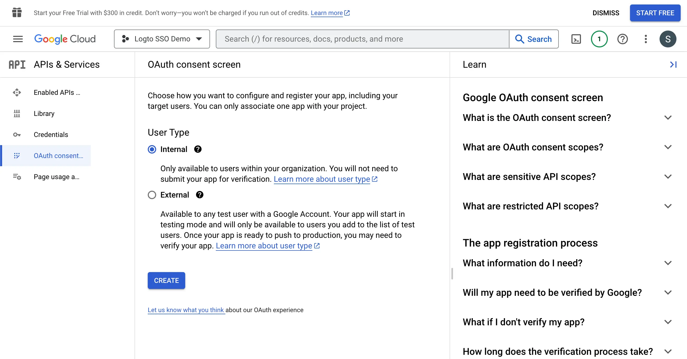

为了创建新的 OIDC 凭证，你需要为你的应用程序配置用户授权页面 (Consent screen)。

1. 导航到 [OAuth 用户授权页面 (Consent screen)](https://console.cloud.google.com/apis/credentials/consent) 页面并选择 `Internal` 用户类型。这将使 OAuth 应用程序仅对你的组织内的用户可用。

2. 按照页面上的说明填写 `用户授权页面 (Consent Screen)` 设置。你需要提供以下最少信息：

- **应用程序名称**：你的应用程序的名称。它将在用户授权页面上显示。
- **支持邮箱**：你的应用程序的支持邮箱。它将在用户授权页面上显示。

3. 为你的应用程序设置 `权限 (Scopes)`。为了正确从身份提供商 (IdP) 检索用户的身份信息和电子邮件地址，Logto SSO 连接器需要从 IdP 授予以下权限 (Scopes)：

- **openid**：此权限是 OIDC 认证 (Authentication) 所需的。它用于检索 ID 令牌 (ID token) 并访问 IdP 的 userInfo 端点。
- **profile**：此权限用于访问用户的基本个人信息。
- **email**：此权限用于访问用户的电子邮件地址。

点击 `Save` 按钮以保存用户授权页面设置。
