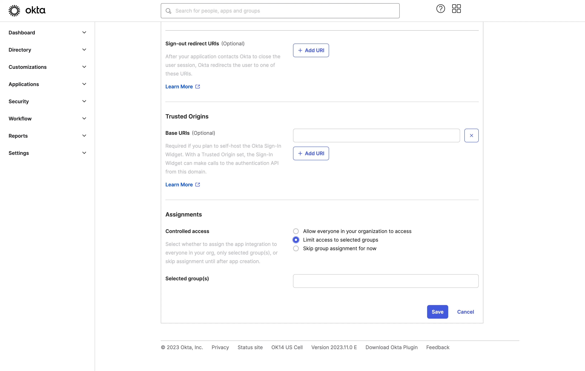

import GuideTip from '../../fragments/_sso_guide_tip.mdx';

# 使用 Okta 设置单点登录

通过最少的配置工作，此连接器允许与 Okta 集成以实现企业单点登录 (SSO)。

<GuideTip />

## 步骤 1：在 Okta 管理门户上创建一个 OIDC 应用程序 \{#step-1-create-an-oidc-application-on-okta-admin-portal}

- 访问 Okta 管理门户并以管理员身份登录。
- 使用侧边菜单导航到 `Applications`/`Applications` 页面。
- 点击 `Create App Integration` 按钮以创建一个新的 OIDC 应用程序。
- 选择 `OIDC - OpenID Connect` 选项作为 `Sign-in method`。
- 选择 `Web Application` 选项作为 `Application type`。

点击 `Next` 按钮继续。

## 步骤 2：配置应用程序设置 \{#step-2-configure-the-application-settings}

1. 提供一个 `App integration name`。它将用作你的 OIDC 应用程序的标识符。
2. 使用 Logto SSO 连接器的回调 URL 添加一个新的 `Sign-in redirect URIs`。

这是 Okta 在成功认证后将用户浏览器重定向到的 URI。当用户成功通过身份提供商 (IdP) 认证后，IdP 会将用户的浏览器重定向回此指定的 URI，并附带授权码。Logto 将根据从此 URI 接收到的授权码完成认证过程。

3. 将用户分配给应用程序。

根据 `Assignments` 设置，你可以选择将应用程序分配给所有用户或特定用户/组。

点击 `Save` 按钮保存应用程序设置。

## 步骤 3：使用客户端凭据设置 Logto 连接器 \{#step-3-set-up-logto-connector-with-the-client-credentials}

成功创建 OIDC 应用程序后，你将被重定向到应用程序详情页面。

复制 `client ID` 和 `client secret` 并填写到 Logto SSO 连接器 `Connection` 选项卡中的相应字段。

使用你的 Okta 域作为 `issuer`。示例：`https://dev-12345678.okta.com`。填写所有字段后，点击 `Save` 按钮保存连接器设置。

如果你提供的 `issuer` 链接有效，你将看到在 `issuer` 字段下方显示的 Okta IdP 配置的完整解析列表。

## 步骤 4：附加权限（可选） \{#step-4-additional-scopes-optional}

使用 `Scope` 字段向你的 OAuth 请求添加附加权限。这将允许你从 Okta OAuth 服务器请求更多信息。有关可用权限的更多详细信息，请参阅 [Okta 文档](https://developer.okta.com/docs/reference/api/oidc/#scopes)。

无论自定义权限设置如何，Logto 将始终向 IdP 发送 `openid`、`profile` 和 `email` 权限。这是为了确保 Logto 能够正确检索用户的身份信息和电子邮件地址。

## 步骤 5：设置电子邮件域并启用 SSO 连接器 \{#step-5-set-email-domains-and-enable-the-sso-connector}

在 Logto 的连接器 `SSO experience` 选项卡上提供你的组织的 `email domains`。这将启用 SSO 连接器作为这些用户的认证方法。

具有指定域电子邮件地址的用户将被重定向以使用你的 SSO 连接器作为他们唯一的认证方法。

有关使用 Okta 创建 OIDC 集成的更多详细信息，请查看 [Create OIDC App Integrations](https://help.okta.com/oie/en-us/content/topics/apps/apps_app_integration_wizard_oidc.htm)。
