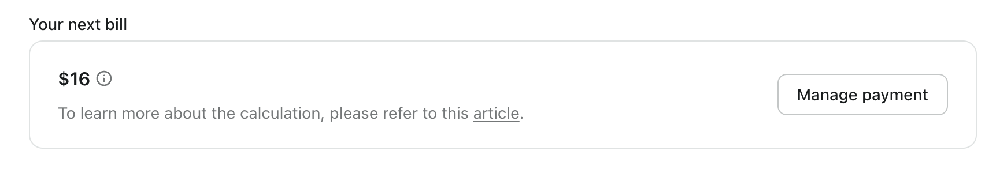

# 计费和定价

在 Logto，我们的 [Pro 计划](https://logto.io/pricing) 是完全自助的，旨在提供透明度，以便你可以轻松理解和管理你的账单。

## 理解结构 \{#understand-the-structure}

基本结构如下所示：

```math
\begin{align*}
\text{你的下一个账单} &= \$16 \text{（基础价格）} \\
&+ \text{附加费用（未计费使用）} \\
&+ \text{附加费用（下一个周期费用）}
\end{align*}
```

在控制台中，你会在租户设置部分找到“你的下一个账单”部分，可以在这里监控和控制即将到来的费用。



## 项目分解 \{#item-breakdown}

请记住，只有少数功能属于附加结构。

同时，Logto 还提供按需付费和按比例定价模型，以确保你能够方便地充分利用我们的服务。

|                         | 包含配额 | 附加费用                |
| ----------------------- | -------- | ----------------------- |
| **令牌**                | 100K     | 每增加 100 个每月 $0.08 |
| **机器对机器应用程序**  | 1        | 每个每月 $8             |
| **API 资源**            | 3        | 每个每月 $4             |
| **企业单点登录 (SSO)**  | 0        | 每个每月 $48            |
| **多因素认证 (MFA)**    | _N/A_    | 每月 $48                |
| **组织 (Organization)** | 无限     | 每月 $48                |
| **租户成员**            | 3        | 每个每月 $8             |

如果我们考虑这些因素，算法是

```math
\begin{align*}
\text{你的下一个账单} &= \$16 \\
&+ \text{附加单价} \times \\
\quad & (\text{增加的数量} \times \text{创建时剩余的按比例时间} \\
\quad &- \text{移除的数量} \times \text{删除时剩余的按比例时间}) \\
\quad &+ \text{附加单价} \times \text{剩余数量}
\end{align*}
```

1. **附加单价**：此附加项的单价
2. **增加的数量**：用户在**当前**计费周期中增加的附加项数量
3. **移除的数量**：用户在**当前**计费周期中移除的附加项数量
4. **创建时剩余的按比例时间**：在**当前**周期中创建资源时剩余的按比例时间
5. **删除时剩余的按比例时间**：在**当前**周期中删除资源时剩余的按比例时间
6. **剩余数量**：在**下一个**周期中保持一致计费所需的数量

让我们通过两个例子来看看它是如何工作的。

### 示例 1：没有变化的持续计费 \{#example-1-consistent-billing-with-no-changes}

如果你不做任何更改，比如添加或移除项目，你的账单将保持一致。

例如，如果你使用的是 Pro 计划并使用了 2 个 SSO 服务，只要你不做任何更改，账单将保持一致。

```math
\text{你的下一个账单} = \$ 16 + \$ 48 \times 2 = \$ 112
```

### 示例 2：添加附加项或进行更改将影响你的即将到来的账单 \{#example-2-adding-add-ons-or-making-changes-will-affect-your-upcoming-bills}

这将使你的即将到来的账单根据不同情况略有不同。算法仍然有效。

**案例 1：你订阅了没有任何附加项的 Pro 计划，只测试了 10 天的企业单点登录 (SSO)。**

如果你的订阅在每月 5 日续订，并且你在 20 日添加了企业单点登录 (SSO)，那么你将在当月使用 15 天。如果你在 30 日删除了企业单点登录 (SSO)，这意味着你只使用了 10 天。

```math
\$16 + \$48 \times (1 \times 15 / 30) - \$48 \times (1 \times 5 / 30) = \$32
```

**案例 2：你订阅了没有任何附加项的 Pro 计划。在添加和移除 API 资源后，你最终使用了 5 个 API 资源**

在这种情况下，你在此计费周期内更新了附加功能，因此更改将显示在你的下一个账单中。更改后的第一个月可能会略高。你的账单将包括 $16 的基础价格、未计费使用的附加费用以及下一个周期的全额费用。

你的计费周期从每月的 1 日开始，你已经使用了前 3 个免费的 API 资源。本月，你进行了两个操作：

1. 在 5 日，你添加了 4 个资源。
2. 在 15 日，你删除了其中的 2 个资源。

因此，你将在即将到来的周期中持续拥有 2 个 API 资源。

```math
\$16 + \$8 \times (4 \times 25 - 2 \times 15) / 30 + 2 \times \$8 = \$50.67
```

### 如何确定附加项的使用时间？ \{#how-is-the-add-on-usage-time-determined}

我们使用按需付费模型，你可能会想知道如果你频繁添加或移除资源会发生什么。附加项被认为在其激活的确切持续时间内使用。别担心，我们的系统由 Stripe 提供支持，精确计算你的使用时间，确保根据每个资源的实际使用时间进行准确计费。

如果你取消订阅 Pro 计划，我们将退还未使用的附加费用，并从你的最终账单中扣除该金额。

## 升级或降级 \{#upgrade-or-downgrade}

### 免费计划升级到 Pro \{#free-plan-upgrade-to-pro}

升级和降级仅适用于生产租户。以下是你可能需要考虑从免费计划升级的情况：

1. 如果你的 MAU 或令牌使用量超过配额，我们会在适当的时候发送电子邮件提醒你需要升级。
2. 如果你想访问仅在高级计划中可用的功能。

### Pro 计划升级到企业计划 \{#pro-plan-upgrade-to-enterprise}

如果 Pro 计划不能满足你的需求，并且你正在寻找全面的企业级支持，请 [联系我们](https://logto.io/contact) 讨论定制的企业计划。

### Pro 计划降级到免费计划 \{#pro-plan-downgrade-to-free-plan}

如果你选择停止使用 Pro 计划，你可以切换到免费计划，但你需要调整你的使用量以适应免费计划的配额。

## 未来定价计划变更 \{#future-pricing-plan-change}

为了为你提供稳定和可预测的计费体验，每当定价发生变化时，我们将保留你当前的计划。

## 常见问题解答 \{#faqs}

<details>

<summary>

### 令牌消耗与 MAU 之间有什么关系？ \{#what-is-the-connection-between-token-consumption-and-mau}

</summary>

Logto 使用基于令牌的认证 (Authentication)。单个用户登录一次可能涉及消耗两个或三个令牌：ID 令牌、访问令牌和刷新令牌。如果你使用诸如 M2M 或组织 (Organization) 之类的功能，可能还会涉及其他令牌，例如 M2M 令牌或组织令牌。令牌消耗取决于用户如何与你的系统交互。为了帮助你跟踪这一点，我们在 <CloudLink to="/dashboard">控制台 > 仪表板</CloudLink> 中提供了实时令牌使用监控。以下是一个示例：我们的免费计划提供 100k 个免费令牌，可以支持大约 30k-50k 的 MAU（每月活跃用户）。

</details>
