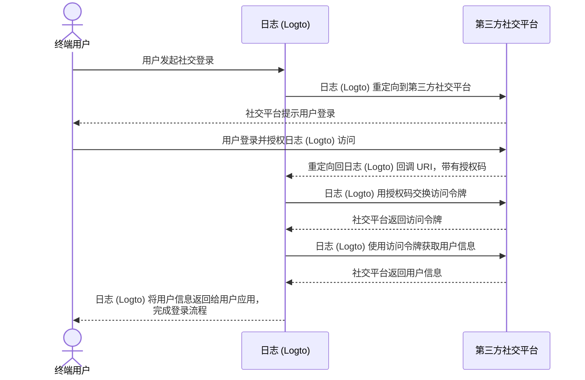

# 实现连接器

在查看了连接器的文件结构后，让我们讨论一下开发连接器的实现和主要思路。

我们将通过一个简单的社交和无密码连接器示例，以便你可以用几乎相同的思路构建你的连接器。

在这一部分，我们不会深入探讨具体参数（例如 `config`）的细节，因为这不是本指南的重点。实现新连接器的开发者应该阅读第三方服务供应商提供的文档，这些文档应该详细说明参数。

## 构建社交连接器

让我们以 GitHub 连接器为例。

大多数社交连接器的授权流程遵循 [OAuth 授权码流程](https://openid.net/specs/openid-connect-basic-1_0.html)。

:::note
大多数 _社交连接器_，通过终端用户的认证获取用户资料遵循一个两步方案（假设所有步骤都成功）：

1. 发起认证请求并获得用户的认证。
2. 使用连接器供应商授予的 `authCode` 获取 `访问令牌 (accessToken)`。
3. 使用 `访问令牌 (accessToken)` 请求公开可访问的用户资料。

:::



为了完成这个流程，我们需要以下三个方法：

### getAuthorizationUri

`getAuthorizationUri` 生成一个重定向 URL，可以将终端用户引导到需要用户认证的页面。

该接口在 [`@logto/connector-kit`](https://github.com/logto-io/logto/blob/master/packages/toolkit/connector-kit/src/types.ts) 中定义为 `GetAuthorizationUri`。

你可以使用 `setSession`（`GetAuthorizationUri` 的第二个输入参数）存储与登录相关的基本信息，以便 `getUserInfo` 方法使用。

列出的参数是必需的：

- `authorizationEndpoint` 可以在 GitHub OAuth 文档网站中找到，这是终端用户应该去进行认证的页面
- `config`，在 GitHub 场景中包括 `clientId` 和 `clientSecret`
- `state`，一个随机字符串，用于防止 CSRF
- 终端用户成功认证后的登录页面的 `redirectUri`

```typescript
const getAuthorizationUri = async ({ state, redirectUri }) => {
  const queryParameters = new URLSearchParams({
    client_id: config.clientId, // `config` 包含你的 GitHub 应用凭证
    redirect_uri: redirectUri,
    state,
  });

  return `${authorizationEndpoint}?${queryParameters.toString()}`;
};
```

### getAccessToken

`getAccessToken` 使用终端用户成功认证后颁发的授权码获取访问令牌。

除了我们在前面的 `getAuthorizationUri` 方法中提到的 `config`，我们还需要获取：

- 重定向登录页面带来的参数中的授权 `code`
- `accessTokenEndpoint`，这是使用授权码获取访问令牌的端点

```typescript
const getAccessToken = async (config: GithubConfig, code: string) => {
  const { clientId: client_id, clientSecret: client_secret } = config;

  const httpResponse = await got.post({
    url: accessTokenEndpoint,
    json: {
      client_id,
      client_secret,
      code,
    },
    timeout: defaultTimeout,
  });

  const result = accessTokenResponseGuard.safeParse(qs.parse(httpResponse.body));

  if (!result.success) {
    throw new ConnectorError(ConnectorErrorCodes.InvalidResponse, result.error);
  }

  const { access_token: accessToken } = result.data;

  assert(accessToken, new ConnectorError(ConnectorErrorCodes.SocialAuthCodeInvalid));

  return { accessToken };
};
```

### getUserInfo

`getUserInfo` 使用在上一步中获得的访问令牌获取用户信息。

该接口在 [`@logto/connector-kit`](https://github.com/logto-io/logto/blob/master/packages/toolkit/connector-kit/src/types.ts) 中定义为 `GetUserInfo`。

出于登录目的，你可以使用 `getSession` 函数检索必要的信息。

`userInfoEndpoint` 是用于获取用户信息的端点。

你可以查看官方文档以找到可以在用户信息端点访问的特定用户信息和相应的权限。

连接器的身份提供商（在本例中为 GitHub）分配的 `id` 是必需的；其他信息是可选的。如果你可以从用户资料中获取 `email` 或 `phone`，请确保它们是“已验证”的。你还需要将返回的键与 [Logto 用户资料](/user-management/user-data/#basic-data) 中的字段名称对齐。

```typescript
const getUserInfo = async (
  data: { code: string; config: GithubConfig },
  getSession: GetSession,
  { set: SetStorageValue, get: GetStorageValue }
) => {
  const { code, config } = data;
  const { accessToken } = await getAccessToken(config, code);

  try {
    const httpResponse = await got.get(userInfoEndpoint, {
      headers: {
        authorization: `token ${accessToken}`,
      },
      timeout: defaultTimeout,
    });

    const result = userInfoResponseGuard.safeParse(parseJson(httpResponse.body));

    if (!result.success) {
      throw new ConnectorError(ConnectorErrorCodes.InvalidResponse, result.error);
    }

    const { id, avatar_url: avatar, email, name } = result.data;

    return {
      id: String(id),
      avatar: conditional(avatar),
      email: conditional(email),
      name: conditional(name),
    };
  } catch (error: unknown) {
    if (error instanceof HTTPError) {
      const { statusCode, body: rawBody } = error.response;

      if (statusCode === 401) {
        throw new ConnectorError(ConnectorErrorCodes.SocialAccessTokenInvalid);
      }

      throw new ConnectorError(ConnectorErrorCodes.General, JSON.stringify(rawBody));
    }

    throw error;
  }
};
```

你可以在 [这里](https://github.com/logto-io/connectors/blob/master/packages/connector-github/src/index.ts) 找到完整的实现。

有关可配置参数的更多详细信息，请参阅 GitHub 连接器 README 或 GitHub 官方文档。

:::note
我们讨论的示例基于 OAuth 协议的授权码授权类型，它在 Logto 的 GitHub 连接器中使用。然而，值得强调的是，另一种授权类型，即隐式授权类型，也可以用于检索用户的资料，并且实际上在认证响应中直接提供了 access_token。尽管如此，授权码授权类型通常由于其更强的安全性而被推荐使用。

你也可以基于 OIDC 或其他一些开放协议构建连接器，这取决于你的用例以及你想要连接的社交供应商的兼容性。
:::

## 构建无密码连接器

让我们通过实现阿里云直邮连接器来了解构建无密码连接器的过程。

无密码连接器用于向终端用户的电子邮件或电话发送随机代码。因此，需要一个 `sendMessage` 方法。

### sendMessage

为了发送消息，我们需要正确设置 `config` 和 `endpoint`。

- `endpoint` 是你的 API 调用连接到的端点
- `config` 包含 `templates`（在不同用户流程中发送验证码的内容模板）、`clientId` 和 `clientSecret`（用于访问 API 请求）

```typescript
const sendMessage = async (data, inputConfig) => {
  const { to, type, payload } = data;
  const config = inputConfig ?? (await getConfig(defaultMetadata.id));
  validateConfig<AliyunDmConfig>(config, aliyunDmConfigGuard);
  const { accessKeyId, accessKeySecret, accountName, fromAlias, templates } = config;
  const template = templates.find((template) => template.usageType === type);

  assert(
    template,
    new ConnectorError(
      ConnectorErrorCodes.TemplateNotFound,
      `Cannot find template for type: ${type}`
    )
  );

  const parameters = {
    AccessKeyId: accessKeyId,
    AccountName: accountName,
    ReplyToAddress: 'false',
    AddressType: '1',
    ToAddress: to,
    FromAlias: fromAlias,
    Subject: template.subject,
    HtmlBody:
      typeof payload.code === 'string'
        ? template.content.replace(/{{code}}/g, payload.code)
        : template.content,
  };

  try {
    const httpResponse = await request(
      endpoint,
      { Action: 'SingleSendMail', ...staticConfigs, ...parameters },
      accessKeySecret
    );

    const result = sendEmailResponseGuard.safeParse(parseJson(httpResponse.body));

    if (!result.success) {
      throw new ConnectorError(ConnectorErrorCodes.InvalidResponse, result.error);
    }

    return result.data;
  } catch (error: unknown) {
    if (error instanceof HTTPError) {
      const {
        response: { body: rawBody },
      } = error;

      assert(typeof rawBody === 'string', new ConnectorError(ConnectorErrorCodes.InvalidResponse));

      errorHandler(rawBody);
    }

    throw error;
  }
};

const request = async (
  url: string,
  parameters: PublicParameters & Record<string, string>,
  accessKeySecret: string
) => {
  const finalParameters: Record<string, string> = {
    ...parameters,
    SignatureNonce: String(Math.random()),
    Timestamp: new Date().toISOString(),
  };
  const signature = getSignature(finalParameters, accessKeySecret, 'POST');

  const payload = new URLSearchParams();

  for (const [key, value] of Object.entries(finalParameters)) {
    payload.append(key, value);
  }
  payload.append('Signature', signature);

  return got.post({
    url,
    headers: {
      'Content-Type': 'application/x-www-form-urlencoded',
    },
    form: payload,
  });
};
```

你可以在 [这里](https://github.com/logto-io/connectors/blob/master/packages/connector-aliyun-dm/src/index.ts) 找到完整的实现。

有关可配置参数的更多详细信息，请参阅阿里云直邮连接器 README 或阿里云直邮官方文档。

## 还有什么？

要查看连接器方法的定义并构建连接器接口设计的图景，请参阅 [`@logto/connector-kit`](https://github.com/logto-io/logto/tree/master/packages/toolkit/connector-kit)。你还可以在 "[Connectors - ConnectorMetadata](/connectors/connector-data-structure/#connectors-local-storage-connectormetadata)" 和 "[Connector file structure](/logto-oss/develop-your-connector/connector-file-structure/)" 中找到 _ConnectorMetadata_ 参考，这可以帮助你弄清楚如何组织你的实现。

- 所有连接器的配置 [_Zod_](https://github.com/colinhacks/zod) 模式是必需的。这非常重要，因为我们在将 `config` 保存到数据库和调用需要 `config` 信息的 API 之前进行类型检查。
- 所有 _SMS 连接器_ 和 _电子邮件连接器_ 需要一个 `sendMessage` 方法来调用服务提供商的消息发送 API，使用来自数据库的配置。开发者还可以在管理控制台中设置连接器时，使用未保存的配置发送测试消息。
- 授权 URL 生成器 `getAuthorizationUri` 和用户资料检索器 `getUserInfo` 是所有 _社交连接器_ 所需的（`getAccessToken` 被视为 `getUserInfo` 中的可选步骤）。
- 所有连接器的方法都通过 API 调用工作，因此连接器开发者需要检查文档并处理可能不成功的 API 调用响应。

## 安装你自己的连接器

我们假设你已经完成了自己的连接器构建。请按照以下步骤手动安装它：

1. 将你实现的连接器文件夹复制到 [`logto-io/logto`](https://github.com/logto-io/logto) 的 `/packages/connectors` 目录。
2. 在 logto 文件夹的根路径下输入 `pnpm pnpm:devPreinstall && pnpm i` 来安装连接器仓库的依赖。
3. 使用 `pnpm connectors build` 构建连接器。
4. 使用 `pnpm cli connector link` 链接本地连接器。
5. 在 `logto-io/logto` 的根目录下使用 `pnpm dev` 重启 Logto 实例，你可以发现连接器已成功安装。

你现在可以测试并尝试你的连接器，看看它是否按预期工作。

如果你想添加已经发布到 NPM 或 Logto 官方连接器的连接器，你可以查看 [使用 Logto CLI - 管理连接器](/logto-oss/using-cli/manage-connectors/#add-connectors)。
