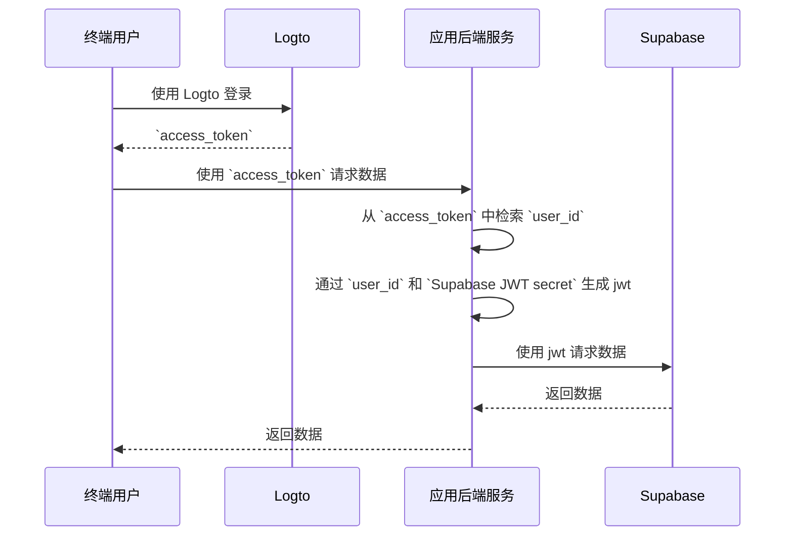

# 为你的 Supabase 应用添加认证 (Authentication)

## Supabase 基础知识 \{#supabase-basics}

Supabase 利用 [Postgres 的行级安全性](https://www.postgresql.org/docs/current/ddl-rowsecurity.html)来控制数据访问权限。简单来说，通过为数据库中的表创建行级安全策略，我们可以限制和管理谁可以读取、写入和更新表中的数据。

假设你的数据库中有一个名为 "posts" 的表，内容如下：


表中的 `user_id` 字段表示每条帖子数据所属的用户。你可以根据 `user_id` 字段限制每个用户只能访问自己的帖子数据。

然而，在实现这一点之前，Supabase 需要能够识别当前访问数据库的用户。

### 将用户数据添加到 Supabase 请求中 \{#add-user-data-to-the-supabase-requests}

由于 Supabase 支持 JWT，当我们的应用与 Supabase 交互时，我们可以使用 Supabase 提供的 JWT secret 生成包含用户数据的 JWT。然后，我们在请求时将此 JWT 作为认证 (Authentication) 头使用。在接收到请求后，Supabase 会自动验证 JWT 的有效性，并在后续过程中允许访问其中包含的数据。

首先，我们可以从 Supabase 仪表板的“项目设置”中获取 Supabase 提供的 JWT secret：


然后，当我们使用 Supabase SDK 向 Supabase 发出请求时，我们利用此 secret 生成我们的 JWT，并将其作为认证 (Authentication) 头附加到请求中。（请注意，此过程发生在你的应用的后端服务中，JWT secret 不应暴露给第三方）。

```jsx
import { createClient } from '@supabase/supabase-js';
import { sign } from 'jsonwebtoken';

/*
 * 注意：
 * 你可以在找到 JWT Secret 的同一位置找到 SUPABASE_URL 和 SUPABASE_ANON_KEY。
 */
const SUPABASE_URL = process.env.SUPABASE_URL;
const SUPABASE_ANON_KEY = process.env.SUPABASE_ANON_KEY;

const SUPABASE_JWT_SECRET = process.env.SUPABASE_JWT_SECRET;

export const getSupabaseClient = (userId) => {
  const jwtPayload = {
    userId,
  };

  const jwt = sign(jwtPayload, SUPABASE_JWT_SECRET, {
    expiresIn: '1h', // 仅用于演示
  });

  const client = createClient(SUPABASE_URL, SUPABASE_ANON_KEY, {
    global: {
      headers: {
        Authorization: `Bearer ${jwt}`,
      },
    },
  });

  return client;
};
```

接下来，导航到 Supabase 仪表板中的 SQL 编辑器，并创建一个函数以检索请求中携带的 userId：


图中使用的代码如下：

```sql
create or replace function auth.user_id() returns text as $$
  select nullif(current_setting('request.jwt.claims', true)::json->>'userId', '')::text;
$$ language sql stable;
```

如代码所示，在 Supabase 中，你可以通过调用 `request.jwt.claims` 来检索我们生成的 JWT 的负载。负载中的 `userId` 字段是我们设置的值。

有了这个函数，Supabase 可以确定当前访问数据库的用户。

### 创建行级安全策略 \{#create-row-level-security-policy}

接下来，我们可以创建一个行级安全策略，以限制每个用户只能根据 posts 表中的 `user_id` 字段访问自己的帖子数据。

1. 导航到 Supabase 仪表板中的表编辑器页面，并选择 posts 表。
2. 点击表顶部的“添加 RLS 策略”。
3. 在提示窗口中，点击“创建策略”。
4. 输入策略名称并选择 SELECT 策略命令。
5. 在下面代码的 `using` 块中输入：

```sql
auth.user_id() = user_id
```


通过利用这样的策略，可以在 Supabase 中实现数据访问控制。

在实际应用中，你会创建各种策略来限制用户的操作，如数据插入和修改。然而，这超出了本文的范围。有关行级安全性 (RLS) 的更多信息，请参阅 [使用 Postgres 行级安全性保护你的数据](https://supabase.com/docs/guides/database/postgres/row-level-security)。

### 与 Logto 的基本集成过程 \{#basic-integration-process-with-logto}

如前所述，由于 Supabase 使用 RLS 进行访问控制，与 Logto（或任何其他认证 (Authentication) 服务）的集成关键在于获取授权用户的用户 ID 并将其发送到 Supabase。整个过程在下图中展示：



接下来，我们将根据此过程图解释如何将 Logto 与 Supabase 集成。

## Logto 集成 \{#logto-integration}

Logto 提供了针对各种框架和编程语言的集成指南。

通常，使用这些框架和语言构建的应用程序分为原生应用、SPA（单页应用）、传统 Web 应用和 M2M（机器对机器）应用等类别。你可以访问 [Logto 快速入门](/quick-starts) 页面，根据你使用的技术栈将 Logto 集成到你的应用中。然后，根据你的应用类型，按照以下说明将 Logto 集成到你的项目中。

### 原生应用或 SPA \{#native-app-or-spa}

原生应用和 SPA 都在你的设备上运行，登录后获得的凭证（访问令牌）存储在你的设备上。

因此，当将你的应用与 Supabase 集成时，你需要通过后端服务与 Supabase 交互，因为你不能在每个用户的设备上暴露敏感信息（如 Supabase JWT secret）。

假设你使用 React 和 Express 构建你的 SPA。你已经通过 [Logto React SDK 指南](/quick-starts/react) 成功将 Logto 集成到你的应用中（你可以参考我们的 [react 示例](https://github.com/logto-io/js/tree/master/packages/react-sample) 中的代码）。此外，你已经根据 [在 Node (Express) 上保护你的 API](/authorization/api-resources/node-express) 文档在你的后端服务器上添加了 Logto 访问令牌验证。

接下来，你将使用从 Logto 获得的访问令牌从你的后端服务器请求用户数据：

```jsx
import { useLogto } from '@logto/react';
import { useState, useEffect } from 'react';
import PostList from './PostList';

const endpoint = '<https://www.mysite.com/api/posts>';
const resource = '<https://www.mysite.com/api>';

function PostPage() {
  const { isAuthenticated, getAccessToken } = useLogto();
  const [posts, setPosts] = useState();

  useEffect(() => {
    const fetchPosts = async () => {
      const response = await fetch(endpoint, {
        headers: {
          Authorization: `Bearer ${await getAccessToken(resource)}`,
        },
      });
      setPosts(response.json());
    };

    if (isAuthenticated) {
      void fetchPosts();
    }
  }, [isAuthenticated, getAccessToken]);

  return <PostList posts={posts} />;
}

export default PostPage;
```

在你的后端服务器上，你已经使用中间件从访问令牌中提取了登录用户的 ID：

```jsx
// auth-middleware.ts
import { createRemoteJWKSet, jwtVerify } from 'jose';

//...

export const verifyAuthFromRequest = async (ctx, next) => {
  // 提取令牌
  const token = extractBearerTokenFromHeaders(ctx.request.headers);

  const { payload } = await jwtVerify(
    token, // 从请求头中提取的原始 Bearer Token
    createRemoteJWKSet(new URL('https://<your-logto-domain>/oidc/jwks')), // 使用从 Logto 服务器查询的 jwks_uri 生成 jwks
    {
      // 令牌的预期发行者，应由 Logto 服务器发行
      issuer: 'https://<your-logto-domain>/oidc',
      // 预期的受众令牌，应为当前 API 的资源指示器
      audience: '<your request listener resource indicator>',
    }
  );

  // 如果你使用 RBAC
  assert(payload.scope.includes('some_scope'));

  // 自定义负载逻辑
  ctx.auth = {
    userId: payload.sub,
  };

  return next();
};
```

现在，你可以使用上面描述的 `getSupabaseClient` 将 `userId` 附加到后续请求 Supabase 时使用的 JWT 中。或者，你可以创建一个中间件，为需要与 Supabase 交互的请求创建一个 Supabase 客户端：

```jsx
export const withSupabaseClient = async (ctx, next) => {
  ctx.supabase = getSupabaseClient(ctx.auth.userId);

  return next();
};
```

在后续的处理流程中，你可以直接调用 `ctx.supabase` 与 Supabase 交互：

```jsx
const fetchPosts = async (ctx) => {
  const { data } = await ctx.supabase.from('posts').select('*');

  return data;
};
```

在这段代码中，Supabase 将根据之前设置的策略仅返回属于当前用户的帖子数据。

### 传统 Web 应用 \{#traditional-web-app}

传统 Web 应用与原生应用或 SPA 的主要区别在于，传统 Web 应用仅在 Web 服务器上渲染和更新页面。因此，用户凭证由 Web 服务器直接管理，而在原生应用和 SPA 中，它们驻留在用户设备上。

在 Supabase 中将 Logto 与传统 Web 应用集成时，你可以直接从后端检索登录用户的 ID。

以 Next.js 项目为例，在你按照 [Next.js SDK 指南](/quick-starts/next-app-router) 将 Logto 集成到你的项目后，你可以使用 Logto SDK 检索用户信息并构建相应的 JWT 以与 Supabase 交互。

```jsx
import { getLogtoContext } from '@logto/next-server-actions';
import { logtoConfig } from '@/logto';
import { getSupabaseClient } from '@/utils';
import PostList from './PostList';

export default async function PostPage() {
  const { claims } = await getLogtoContext(logtoConfig);

  // `claims` 中的 `sub` 值是用户 ID。
  const supabase = getSupabaseClient(claims.sub);

  const { data: posts } = await supabase.from('posts').select('*');

  return <PostList posts={posts} />;
}
```

### 机器对机器应用 \{#machine-to-machine-app}

机器对机器 (M2M) 通常用于你的应用需要直接与资源服务器通信的情况，例如一个拉取每日帖子等的静态服务。

你可以使用 [机器对机器：使用 Logto 认证 (Authentication)](/quick-starts/m2m) 指南进行机器对机器应用的认证 (Authentication)。Supabase 与机器对机器应用的集成类似于原生应用和 SPA（如 "[原生应用或 SPA](#native-app-or-spa)" 部分所述）。它涉及从 Logto 获取访问令牌，然后通过受保护的后端 API 验证它。

然而，需要注意的是，原生应用和 SPA 通常是为终端用户设计的，因此获得的用户 ID 代表用户本身。然而，机器对机器应用的访问令牌代表应用本身，访问令牌负载中的 `sub` 字段是 M2M 应用的客户端 ID，而不是特定用户。因此，在开发过程中，区分哪些数据是为 M2M 应用准备的至关重要。

此外，如果你希望特定的 M2M 应用代表整个服务访问 Supabase 以绕过 RLS 限制，你可以使用 Supabase 的 `service_role` secret 创建一个 Supabase 客户端。当你希望执行一些需要访问所有数据的管理或自动化任务而不受为单个用户设置的行级安全策略限制时，这很有用。

`service_role` secret 可以在与 JWT secret 相同的页面上找到：


在创建 Supabase 客户端时，使用 `service_role` secret，这样该客户端可以访问数据库中的所有数据：

```jsx
import { createClient } from '@supabase/supabase-js';

// ...
const SUPABASE_SERVICE_ROLE_SECRET = process.env.SUPABASE_SERVICE_ROLE_SECRET;

const client = createClient(SUPABASE_URL, SUPABASE_SERVICE_ROLE_SECRET, {
  // ...options
});
```
