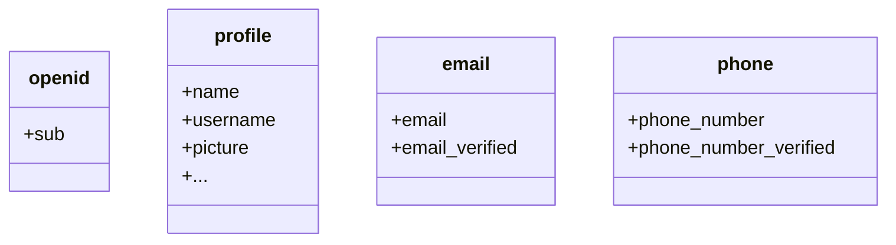

默认情况下，返回的声明（Claim）是有限的。如果你需要更多信息，可以请求额外的权限（Scope）以访问更多的声明（Claim）。

:::info
“声明（Claim）”是关于主体的断言；“权限（Scope）”是一组声明。在当前情况下，声明是关于用户的一条信息。
:::

以下是权限（Scope）与声明（Claim）关系的非规范性示例：

:::tip
“sub” 声明（Claim）表示“主体（Subject）”，即用户的唯一标识符（例如用户 ID）。
:::

日志 (Logto) SDK 将始终请求三个权限（Scope）：`openid`、`profile` 和 `offline_access`。
