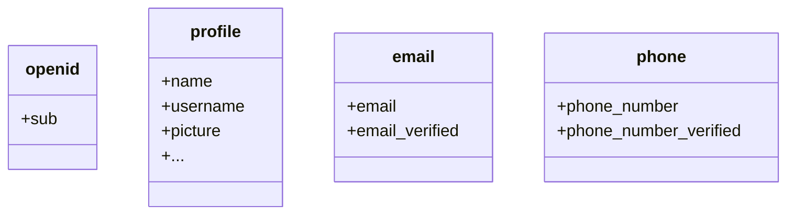

默认情况下，返回的声明 (Claims) 是有限的。如果你需要更多信息，可以请求额外的权限 (Scopes) 以访问更多的声明 (Claims)。

:::info
“声明 (Claim)”是关于主体的断言；“权限 (Scope)”是一组声明 (Claims)。在当前情况下，声明 (Claim) 是关于用户的一条信息。
:::

以下是权限 (Scope) - 声明 (Claim) 关系的一个非规范性示例：

:::tip
“sub”声明 (Claim) 意味着“主体”，即用户的唯一标识符（即用户 ID）。
:::

Logto SDK 将始终请求三个权限 (Scopes)：`openid`、`profile` 和 `offline_access`。
