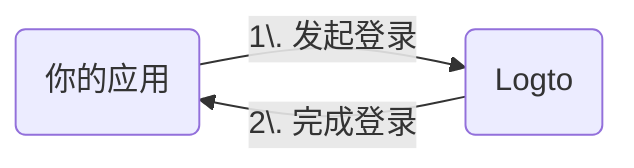

import RegardingRedirectBasedSignIn from './_regarding-redirect-based-sign-in.mdx';

在我们深入细节之前，下面是终端用户体验的快速概览。登录流程可以简化为如下：

1. 你的应用调用登录方法。
2. 用户被重定向到 Logto 登录页面。对于原生应用，会打开系统浏览器。
3. 用户完成登录后被重定向回你的应用（配置为重定向 URI）。

<RegardingRedirectBasedSignIn />

---
