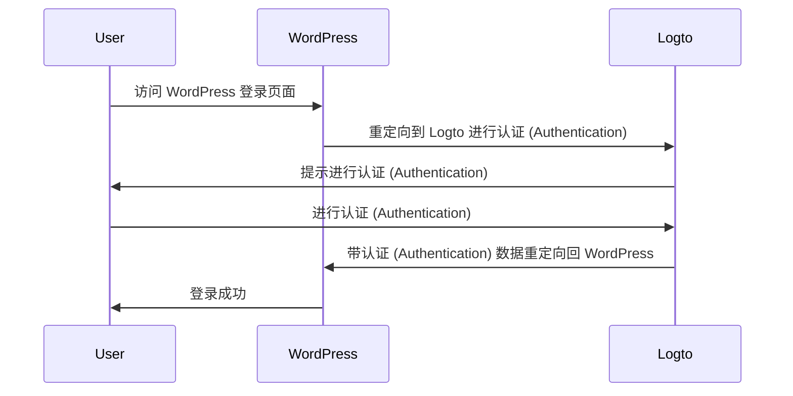
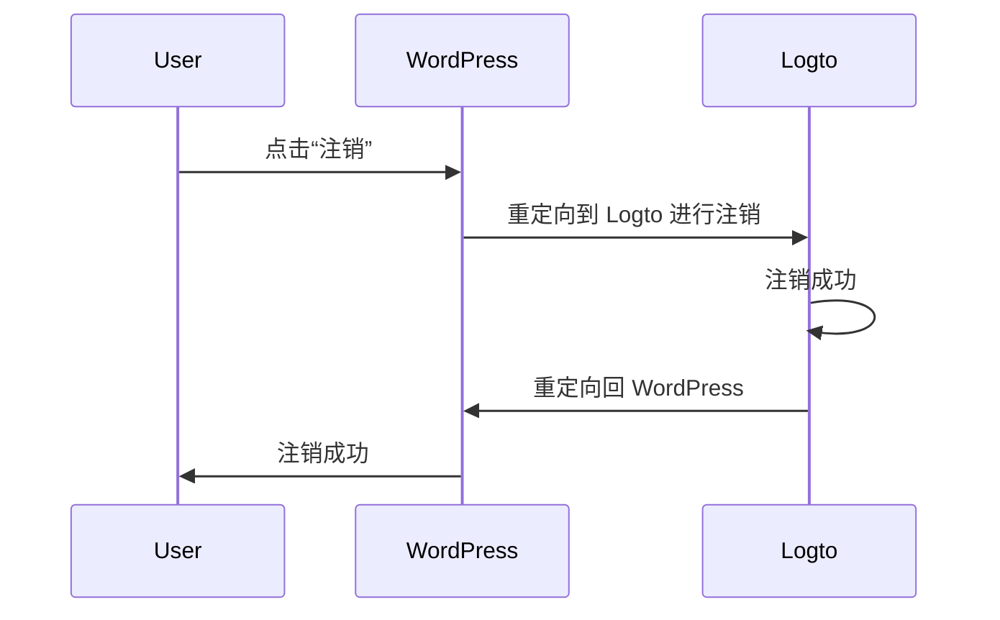

import TabItem from '@theme/TabItem';
import Tabs from '@theme/Tabs';

import FurtherReadings from '../../fragments/_further-readings.md';

# 使用 Logto 插件为你的 WordPress 网站添加认证 (Authentication)

本教程将向你展示如何使用我们的官方 WordPress 插件将 Logto 集成到你的 [WordPress](https://wordpress.org) 网站中。

## 先决条件 \{#prerequisites}

- 一个 [Logto Cloud](https://cloud.logto.io) 账户或一个 [自托管 Logto](/introduction/set-up-logto-oss)。
- 一个已创建的 Logto 传统应用程序。
- 一个 WordPress 项目：在继续之前，请按照官方 [WordPress 安装指南](https://wordpress.org/support/article/how-to-install-wordpress/) 设置你的 WordPress 网站。

## 集成 \{#integration}

### 安装插件 \{#authentication-settings}

:::info
目前，我们的插件仍在审核中，尚未在 WordPress 插件目录中提供。一旦可用，我们将更新此页面。
:::

<Tabs>

{/* Uncomment the following block when plugin is available in the WordPress plugin directory */}
{/* <TabItem value="admin-panel" label="从 WordPress 管理面板"> */}

{/* 1. 转到 **插件** > **添加新插件**。 */}
{/* 2. 搜索 "Logto"。 */}
{/* 3. 点击 **立即安装**。 */}
{/* 4. 点击 **激活**。 */}

{/* </TabItem> */}

<TabItem value="upload" label="从上传">

1. 从以下链接之一下载 Logto WordPress 插件：
   - [最新发布](https://github.com/logto-io/wordpress/releases)：下载名称格式为 `logto-plugin-<version>.zip` 的文件。
     {/* Uncomment the following line when plugin is available in the WordPress plugin directory */}
     {/* - [WordPress 插件目录](https://wordpress.org/plugins) 并搜索 "Logto"。 */}
2. 下载插件 ZIP 文件。
3. 在你的 WordPress 管理面板中转到 **插件** > **添加新插件**。
4. 点击 **上传插件**。
5. 选择下载的 ZIP 文件并点击 **立即安装**。
6. 点击 **激活**。

</TabItem>

</Tabs>

### 配置插件 \{#scopes}

现在你应该可以在 WordPress 管理面板侧边栏中看到 Logto 菜单。点击 **Logto** > **设置** 来配置插件。

:::note
在配置插件之前，你应该在 Logto 控制台中创建一个 **传统 Web** 应用程序。如果你还没有创建，请参考 [将 Logto 集成到你的应用程序中](/integrate-logto/integrate-logto-into-your-application) 以获取更多信息。
:::

插件的最小配置如下：

- Logto endpoint：你的 Logto 租户的端点。
- App ID：你的 Logto 应用程序的 App ID。
- App secret：你的 Logto 应用程序的一个有效 App secret。

所有值都可以在 Logto 控制台的应用程序详情页面找到。

填写完这些值后，点击 **保存更改**（如果找不到按钮，请向下滚动到页面底部）。

### 配置重定向 URI \{#extra-params}

重定向 URI 是 Logto 在用户认证 (Authentication) 后将用户重定向到的 URL；而注销后的重定向 URI 是 Logto 在用户注销后将用户重定向到的 URL。

以下是一个非规范的序列图，用于说明登录流程：

以下是注销流程在非规范序列图中的样子：

要了解更多关于为什么需要重定向的信息，请参阅 [登录体验详解](/concepts/sign-in-experience)。

在我们的案例中，我们需要在 Logto 控制台中配置两个重定向 URI。要找到重定向 URI，请转到 WordPress 管理面板中的 **Logto** > **设置** 页面。你将看到 **重定向 URI** 和 **注销后重定向 URI** 字段。

1. 复制 **重定向 URI** 和 **注销后重定向 URI** 的值，并将它们粘贴到 Logto 控制台中的 **重定向 URI** 和 **注销后重定向 URI** 字段中。
2. 在 Logto 控制台中点击 **保存更改**。

### 检查点：测试你的 WordPress 网站 \{#require-verified-email}

现在你可以在你的 WordPress 网站中测试 Logto 集成：

1. 如果需要，打开一个隐身浏览器窗口。
2. 访问你的 WordPress 网站并点击 **登录** 链接（如果适用）；或直接访问登录页面（例如，`https://example.com/wp-login.php`）。
3. 页面应重定向到 Logto 登录页面。
4. 完成登录或注册过程。
5. 认证 (Authentication) 成功后，你应被自动重定向回你的 WordPress 网站并自动登录。
6. 点击 **注销** 链接以注销你的 WordPress 网站。
7. 你应被重定向到 Logto 注销页面，然后返回到你的 WordPress 网站。
8. 你应已从你的 WordPress 网站注销。

## 认证 (Authentication) 设置 \{#require-organization-id}

虽然插件开箱即用，但你可以在 Logto 插件设置页面上自定义认证 (Authentication) 设置，以更好地满足你的需求。

### 权限 (Scopes) \{#authorization-settings}

Logto 使用权限 (Scopes) 来控制与你的应用程序共享哪些信息。Logto WordPress 插件使用 [Logto PHP SDK](https://github.com/logto-io/php) 来处理认证 (Authentication) 过程，默认包括以下权限 (Scopes)：

- `openid`：OpenID Connect 所需的基本权限 (Scope)。
- `profile`：获取用户的基本个人资料信息。
- `offline_access`：获取用于离线访问的刷新令牌。

有关权限 (Scopes) 的更多信息，请参阅 [权限 (Scopes) 和声明 (Claims)](/quick-starts/php#scopes-and-claims)。

插件还默认添加了两个额外的权限 (Scopes)：

- `email`：获取用户的电子邮件地址。
- `roles`：获取用户在 Logto 中的角色 (Roles)。

这两个权限 (Scopes) 用于将 Logto 的电子邮件和角色 (Roles) 映射到 WordPress 的电子邮件和角色 (Roles)。你可以通过编辑插件设置中的 **权限 (Scopes)** 字段来自定义权限 (Scopes)。

:::warning
如果你移除了 `email` 或 `roles` 权限 (Scope)，插件的某些功能将无法正常工作。
:::

### 额外参数 \{#role-mapping}

你可能希望在认证 (Authentication) 请求中添加一些额外的参数，以自定义认证 (Authentication) 过程。例如，你可以添加 `first_screen` 参数来决定在认证 (Authentication) 过程中首先显示哪个屏幕。

有关额外参数的更多信息，请参阅 [认证 (Authentication) 参数](/end-user-flows/authentication-parameters)。

### 要求验证过的电子邮件 \{#advanced-settings}

默认情况下，插件要求用户在 Logto 中拥有经过验证的电子邮件地址才能登录到你的 WordPress 网站。如果用户尝试在没有经过验证的电子邮件地址的情况下登录，插件将抛出错误。

你可以通过取消选中插件设置中的 **要求验证过的电子邮件** 选项来禁用此功能。

### 要求组织 ID \{#remember-session}

你可以要求用户在 Logto 中拥有特定的组织 (Organization) 成员资格才能登录到你的 WordPress 网站。当指定了组织 (Organization) ID 时，插件将检查用户的 ID 令牌中是否包含指定的组织 (Organization) ID。如果没有，将抛出错误。

要了解更多关于组织 (Organizations) 的信息，请参阅 [组织 (Organizations)](/organizations)。

## 授权 (Authorization) 设置 \{#sync-profile}

除了认证 (Authentication)，Logto 还提供授权 (Authorization) 功能，如 [基于角色的访问控制 (RBAC)](/authorization/role-based-access-control)。虽然如果你正在开发自己的应用程序，实施 RBAC 需要一些自定义代码，但 Logto WordPress 插件提供了一种内置方式，将 Logto 角色 (Roles) 映射到 [WordPress 角色 (Roles)](https://wordpress.org/documentation/article/roles-and-capabilities/)。

### 角色映射 \{#wordpress-form-login}

Logto WordPress 插件允许你将 Logto 角色 (Roles) 映射到 WordPress 角色 (Roles)。这意味着你可以在 Logto 中为用户分配不同的角色 (Roles)，插件将在用户登录时自动为这些用户分配相应的 WordPress 角色 (Roles)。

要映射角色 (Roles)，在 **角色映射** 部分点击 **添加** 以添加新的角色映射。例如，如果你想将 Logto 中的 `group:editors` 角色映射到 WordPress 中的 `Editor` 角色，你可以通过添加一个具有以下值的新角色映射来实现：

- Logto 角色：`group:editors`
- WordPress 角色：`editor`（WordPress 中 `Editor` 角色的角色 slug）

你可以在 [角色和能力](https://wordpress.org/documentation/article/roles-and-capabilities/) 文档中找到所有 WordPress 角色的角色 slug。

:::note
角色 slug 是区分大小写的。如果你输入角色名称如 `Editor` 而不是 `editor`，角色映射将不起作用。
:::

现在，前往 Logto 控制台并在左侧边栏中点击 **角色**。创建一个名为 `group:editors` 的新角色并将其分配给一个用户。然后使用该用户登录到你的 WordPress 网站。你应该会看到该用户已被分配为 WordPress 中的 `Editor` 角色。

:::note
如果用户已登录到你的 WordPress 网站，角色映射将在用户注销并重新登录后才会生效。
:::

你还可以添加多个角色映射，将多个 Logto 角色映射到 WordPress 角色。目前，插件将尝试按优先顺序映射角色。例如，如果你有以下角色映射：

- Logto 角色：`group:editors`，WordPress 角色：`editor`
- Logto 角色：`group:authors`，WordPress 角色：`author`
- Logto 角色：`group:subscribers`，WordPress 角色：`subscriber`

而一个用户在 Logto 中同时拥有 `group:editors` 和 `group:authors` 角色，该用户将在 WordPress 中被分配为 `Editor` 角色。

## 高级设置 \{#username-strategy}

### 记住会话 \{#troubleshooting}

默认情况下，插件会记住用户的会话 2 周。这意味着如果用户登录到你的 WordPress 网站，他们在 2 周内不会被提示再次登录。你可以通过取消选中插件设置中的 **记住会话** 选项将此时间减少到 2 天。

### 同步个人资料 \{#callback-url-shows-404}

默认情况下，插件将在每次登录时同步用户的个人资料。这意味着如果用户登录到你的 WordPress 网站，他们的个人资料将使用 Logto 的最新信息进行更新。你可以通过取消选中插件设置中的 **同步个人资料** 选项来禁用此功能。

:::warning
如果你禁用此功能，角色映射仅在用户首次登录时生效。
:::

### WordPress 表单登录 \{#frequently-asked-questions}

默认情况下，你可以在 WordPress 登录 URL 后附加 `?form=1` 来使用 WordPress 表单登录。这对于测试目的很有用，但如果你不想允许用户使用 WordPress 表单登录，可以禁用此功能。

### 用户名策略 \{#how-can-i-trigger-the-forgot-password-flow}

在 WordPress 中生成用户名有多种方式。当你依赖电子邮件作为用户的唯一标识符时，使用默认策略是安全的。

## 故障排除 \{#how-can-i-use-the-wordpress-form-login}

### 回调 URL 显示 404 \{#further-readings}

如果回调 URL 显示 404 错误，可能是你的 WordPress 重写规则已过时，需要手动刷新。为此，请转到 WordPress 管理面板中的 **设置** > **固定链接**（或直接访问 `/wp-admin/options-permalink.php`）并点击 **保存更改**。

## 常见问题解答 \{#frequently-asked-questions}

### 我如何触发忘记密码流程？ \{#how-can-i-trigger-the-forgot-password-flow}

有两种方法可以触发忘记密码流程：

1. 点击 Logto 登录页面上的忘记密码链接。
2. 在 WordPress 登录 URL 后附加 `?action=lostpassword`。例如，`https://example.com/wp-login.php?action=lostpassword`。
   这将重定向你到 Logto 忘记密码页面。

### 我如何使用 WordPress 表单登录？ \{#how-can-i-use-the-wordpress-form-login}

默认情况下，你可以在 WordPress 登录 URL 后附加 `?form=1` 来使用 WordPress 表单登录。例如，`https://example.com/wp-login.php?form=1`。

如果你想禁用此功能，可以在插件设置中取消选中 **WordPress 表单登录** 选项。

## 进一步阅读 \{#further-readings}

<FurtherReadings />
