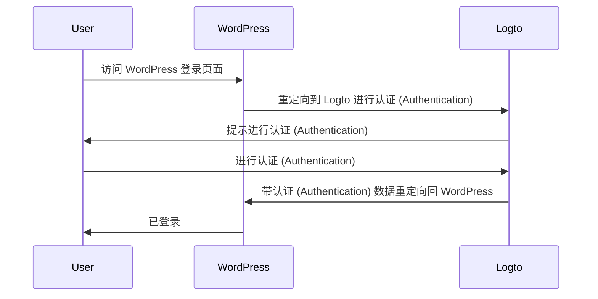
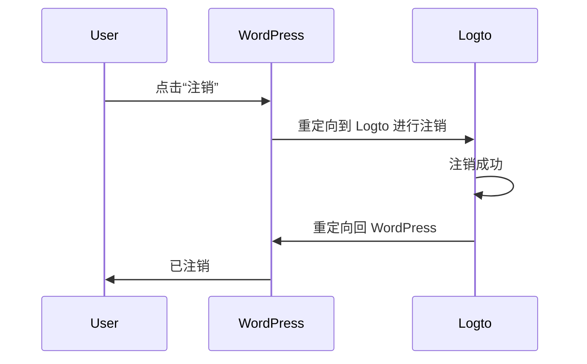

import TabItem from '@theme/TabItem';
import Tabs from '@theme/Tabs';

### 安装插件 \{#install-the-plugin}

<Tabs>

<TabItem value="admin-panel" label="从 WordPress 管理面板">

1. 前往 **Plugins** > **Add New**。
2. 搜索“Logto”，或在搜索框中输入 https://wordpress.org/plugins/logto/。
3. 点击 **Install Now**。
4. 点击 **Activate**。

</TabItem>

<TabItem value="upload" label="从上传">

1. 从以下链接之一下载 Logto WordPress 插件：
   - [最新发布](https://github.com/logto-io/wordpress/releases)：下载文件名格式为 `logto-plugin-<version>.zip` 的文件。
   - [WordPress 插件目录](https://wordpress.org/plugins/logto/)：点击 **Download** 按钮下载文件。
2. 下载插件 ZIP 文件。
3. 在你的 WordPress 管理面板中，前往 **Plugins** > **Add New**。
4. 点击 **Upload Plugin**。
5. 选择下载的 ZIP 文件并点击 **Install Now**。
6. 点击 **Activate**。

</TabItem>

</Tabs>

### 配置插件 \{#configure-the-plugin}

现在你应该可以在 WordPress 管理面板侧边栏中看到 Logto 菜单。点击 **Logto** > **Settings** 来配置插件。

:::note
在配置插件之前，你应该在 Logto Console 中创建一个 **传统 Web** 应用。如果你还没有创建，请参考 [将 Logto 集成到你的应用中](/integrate-logto/integrate-logto-into-your-application) 以获取更多信息。
:::

插件的最小配置如下：

- Logto endpoint：你的 Logto 租户的端点。
- App ID：你的 Logto 应用的 App ID。
- App secret：你的 Logto 应用的一个有效 App secret。

所有值都可以在 Logto Console 的应用详情页面找到。

填写完这些值后，点击 **Save Changes**（如果找不到按钮，请向下滚动到页面底部）。

### 配置重定向 URI \{#configure-redirect-uri}

重定向 URI 是 Logto 在用户认证后将其重定向到的 URL；而注销后的重定向 URI 是 Logto 在用户注销后将其重定向到的 URL。

以下是一个非规范的序列图，用于说明登录流程：

以下是注销流程的非规范序列图：

要了解更多关于为什么需要重定向的信息，请参阅 [登录体验解释](/concepts/sign-in-experience)。

在我们的例子中，我们需要在 Logto Console 中配置两个重定向 URI。要找到重定向 URI，请前往 WordPress 管理面板中的 **Logto** > **Settings** 页面。你将看到 **Redirect URI** 和 **Post sign-out redirect URI** 字段。

1. 复制 **Redirect URI** 和 **Post sign-out redirect URI** 的值，并将它们粘贴到 Logto Console 中的 **Redirect URIs** 和 **Post sign-out redirect URIs** 字段中。
2. 在 Logto Console 中点击 **Save changes**。

### 检查点：测试你的 WordPress 网站 \{#checkpoint-test-your-website}

现在你可以在你的 WordPress 网站中测试 Logto 集成：

1. 如果需要，打开一个隐身浏览器窗口。
2. 访问你的 WordPress 网站并点击 **Log in** 链接（如果适用）；或者直接访问登录页面（例如，`https://example.com/wp-login.php`）。
3. 页面应重定向到 Logto 登录页面。
4. 完成登录或注册过程。
5. 认证 (Authentication) 成功后，你应被自动重定向回你的 WordPress 网站并登录。
6. 点击 **Log out** 链接以注销你的 WordPress 网站。
7. 你应被重定向到 Logto 注销页面，然后返回到你的 WordPress 网站。
8. 你应已从你的 WordPress 网站注销。
