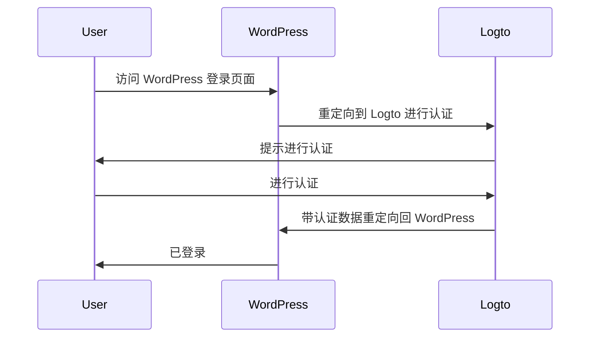
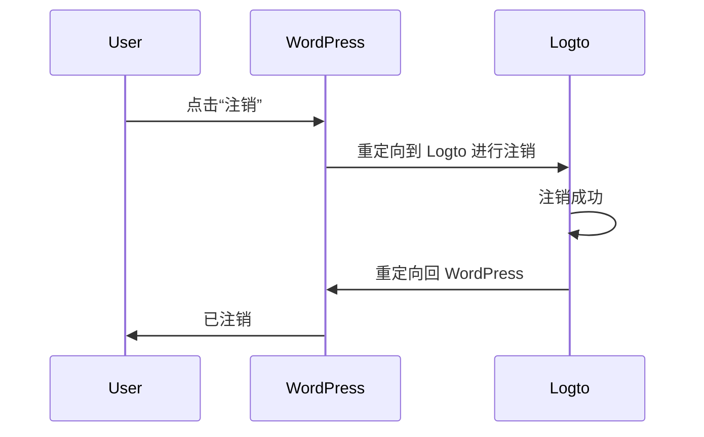

### 安装插件 \{#install-the-plugin}

:::info
目前，我们的插件仍在审核中，尚未在 WordPress 插件目录中提供。一旦可用，我们会更新此页面。
:::

<Tabs>

{/* 当插件在 WordPress 插件目录中可用时，取消注释以下块 */}
{/* <TabItem value="admin-panel" label="从 WordPress 管理面板"> */}

{/* 1. 前往 **插件** > **添加新插件**。 */}
{/* 2. 搜索 "Logto"。 */}
{/* 3. 点击 **立即安装**。 */}
{/* 4. 点击 **激活**。 */}

{/* </TabItem> */}

<TabItem value="upload" label="通过上传">

1. 从以下链接之一下载 Logto WordPress 插件：
   - [最新发布](https://github.com/logto-io/wordpress/releases)：下载文件名格式为 `logto-plugin-<version>.zip` 的文件。
     {/* 当插件在 WordPress 插件目录中可用时，取消注释以下行 */}
     {/* - [WordPress 插件目录](https://wordpress.org/plugins) 并搜索 "Logto"。 */}
2. 下载插件 ZIP 文件。
3. 在你的 WordPress 管理面板中，前往 **插件** > **添加新插件**。
4. 点击 **上传插件**。
5. 选择下载的 ZIP 文件并点击 **立即安装**。
6. 点击 **激活**。

</TabItem>

</Tabs>

### 配置插件 \{#configure-the-plugin}

现在你应该能在 WordPress 管理面板侧边栏中看到 Logto 菜单。点击 **Logto** > **设置** 来配置插件。

:::note
在配置插件之前，你应该在 Logto Console 中创建一个 **传统 Web** 应用。如果你还没有创建，请参考 [将 Logto 集成到你的应用中](/integrate-logto/integrate-logto-into-your-application) 以获取更多信息。
:::

插件的最小配置如下：

- Logto endpoint：你的 Logto 租户的端点。
- App ID：你的 Logto 应用的 App ID。
- App secret：你的 Logto 应用的一个有效 App secret。

所有值都可以在 Logto Console 的应用详情页面找到。

填写完这些值后，点击 **保存更改**（如果找不到按钮，请向下滚动到页面底部）。

### 配置重定向 URI \{#configure-redirect-uri}

重定向 URI 是 Logto 在用户认证后将用户重定向到的 URL；而注销后重定向 URI 是 Logto 在用户注销后将用户重定向到的 URL。

以下是一个非规范的序列图，用于说明登录流程：

以下是注销流程在非规范序列图中的样子：

要了解更多关于为什么需要重定向的信息，请参阅 [登录体验详解](/concepts/sign-in-experience)。

在我们的例子中，我们需要在 Logto Console 中配置两个重定向 URI。要找到重定向 URI，请前往 WordPress 管理面板中的 **Logto** > **设置** 页面。你会看到 **重定向 URI** 和 **注销后重定向 URI** 字段。

1. 复制 **重定向 URI** 和 **注销后重定向 URI** 的值，并将它们粘贴到 Logto Console 中的 **重定向 URI** 和 **注销后重定向 URI** 字段中。
2. 在 Logto Console 中点击 **保存更改**。

### 检查点：测试你的 WordPress 网站 \{#checkpoint-test-your-website}

现在你可以在你的 WordPress 网站中测试 Logto 集成：

1. 如果需要，打开一个隐身浏览器窗口。
2. 访问你的 WordPress 网站并点击 **登录** 链接（如果适用）；或直接访问登录页面（例如，`https://example.com/wp-login.php`）。
3. 页面应重定向到 Logto 登录页面。
4. 完成登录或注册过程。
5. 认证成功后，你应被自动重定向回你的 WordPress 网站并登录。
6. 点击 **注销** 链接以注销你的 WordPress 网站。
7. 你应被重定向到 Logto 注销页面，然后返回到你的 WordPress 网站。
8. 你应已从你的 WordPress 网站注销。
