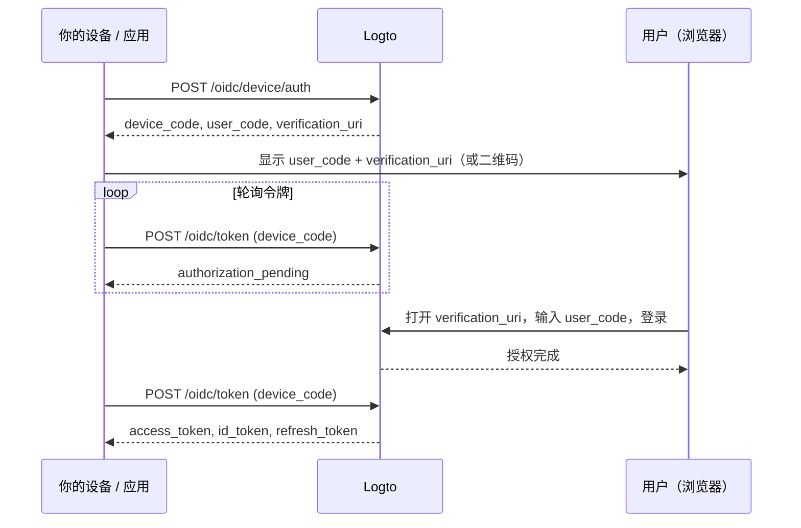

import ApiResourcesDescription from '../../fragments/_api-resources-description.md';
import FurtherReadings from '../../fragments/_further-readings.md';
import ScopeClaimList from '../../fragments/_scope-claim-list.md';
import ScopesAndClaimsIntroduction from '../../fragments/_scopes-claims-introduction.md';

# 设备流：使用 Logto 认证 (Authentication)

:::note
本指南假设你已在 Logto 控制台创建了类型为“原生应用”，并将授权流设置为设备流的应用程序。
:::

## 简介 \{#introduction}

[OAuth 2.0 设备授权许可](https://auth.wiki/device-flow)（设备流）专为输入能力有限的设备设计，例如智能电视、游戏主机、CLI 工具和 IoT 设备。它允许用户在设备上启动登录流程，但在带有浏览器的其他设备（如手机或笔记本电脑）上完成认证 (Authentication)。

由于设备本身无法处理基于浏览器的登录流程，设备会显示一个短码和一个 URL。用户在另一台设备上访问该 URL，输入代码并登录。与此同时，原始设备会轮询 Logto，直到授权完成。



## 获取应用凭据 \{#get-application-credentials}

在 Logto 控制台中，进入你的应用详情页以获取以下凭据：

- **App ID**：你的应用的唯一标识符（也称为 `client_id`）。
- **Logto endpoint**：你的 Logto 授权服务器端点。你可以在 Logto 控制台的“应用详情”中找到。

对于 Logto Cloud，端点为 `https://{your-tenant-id}.logto.app`。

:::note
设备流应用属于公开客户端，因此不需要 App Secret。
:::

## 请求设备码 \{#request-a-device-code}

通过向设备授权端点发送 `POST` 请求来启动设备流：

```bash
curl --request POST 'https://your.logto.endpoint/oidc/device/auth' \
  --header 'Content-Type: application/x-www-form-urlencoded' \
  --data-urlencode 'client_id=your-application-id' \
  --data-urlencode 'scope=openid offline_access profile'
```

响应内容包括：

| 字段                        | 描述                                                                                                         |
| --------------------------- | ------------------------------------------------------------------------------------------------------------ |
| `device_code`               | 你的应用在轮询令牌端点时使用的唯一代码。                                                                     |
| `user_code`                 | 显示给用户，在浏览器中输入的短码。                                                                           |
| `verification_uri`          | 用户输入 `user_code` 的 URL。                                                                                |
| `verification_uri_complete` | 已预填 `user_code` 的 URL。用户可直接访问此 URL 跳过手动输入——你可以将其展示为二维码、可点击链接或其他方式。 |
| `expires_in`                | `device_code` 和 `user_code` 的有效期（秒）。过期后应停止轮询。                                              |

## 向用户展示验证 URL \{#display-verification-url}

在你的设备屏幕上显示 `user_code` 和 `verification_uri`。

或者，你也可以使用已预填代码的 `verification_uri_complete`，用户只需确认即可。你可以选择以二维码、可点击链接等方式展示。

## 轮询令牌 \{#poll-for-tokens}

当用户在浏览器中完成认证 (Authentication) 时，你的设备应轮询令牌端点。你的应用每次轮询请求之间应至少等待 **5 秒**：

```bash
curl --request POST 'https://your.logto.endpoint/oidc/token' \
  --header 'Content-Type: application/x-www-form-urlencoded' \
  --data-urlencode 'client_id=your-application-id' \
  --data-urlencode 'grant_type=urn:ietf:params:oauth:grant-type:device_code' \
  --data-urlencode 'device_code=DEVICE_CODE'
```

将 `DEVICE_CODE` 替换为设备授权响应中的 `device_code`。

**停止轮询** 的时机：

- 收到成功的令牌响应。
- 设备码响应中的 `expires_in` 时间已过。
- 收到不可重试的错误，如 `expired_token` 或 `access_denied`。

### 令牌响应 \{#token-response}

用户批准后，响应内容包括：

| 字段            | 描述                                                                                                      |
| --------------- | --------------------------------------------------------------------------------------------------------- |
| `access_token`  | 访问令牌。默认是一个不透明令牌 (Opaque token)；当请求了 `resource` 时，是一个 JWT，`aud` 为资源 URI。     |
| `id_token`      | 包含用户身份声明 (Claims) 的 ID 令牌。仅在请求了 `openid` 权限 (Scope) 时返回。                           |
| `refresh_token` | 用于在无需重新认证 (Authentication) 的情况下获取新令牌。仅在请求了 `offline_access` 权限 (Scope) 时返回。 |
| `token_type`    | 始终为 `Bearer`。                                                                                         |
| `expires_in`    | 令牌有效期（秒）。                                                                                        |
| `scope`         | 授权服务器授予的权限 (Scopes)。                                                                           |

## 检查点：测试你的设备流 \{#checkpoint}

现在，测试你的设备流集成：

1. 运行你的应用并触发设备流以获取 `device_code` 和 `user_code`。
2. 在浏览器中打开 `verification_uri` 并输入 `user_code`，或直接使用 `verification_uri_complete` 跳过手动输入。
3. 在浏览器中完成登录流程。
4. 验证你的应用在轮询后是否收到令牌。

## 获取用户信息 \{#get-user-information}

### 解码 ID 令牌声明 (Claims) \{#decode-id-token-claims}

令牌响应中的 `id_token` 是标准的 [JSON Web Token (JWT)](https://auth.wiki/jwt)。你可以解码 Base64URL 编码的负载部分（JWT 的第二段，以 `.` 分隔）来访问基本的用户声明 (Claims)，无需额外的网络请求。

解码后的负载包含如 `sub`（用户 ID）、`name`、`email` 等声明 (Claims)，具体取决于请求的权限 (Scopes)。

:::tip
生产环境下，你应在信任声明 (Claims) 前验证 JWT 签名。使用你的 Logto 端点的 JWKS（`https://your.logto.endpoint/oidc/jwks`）来验证令牌。
:::

### 从 userinfo 端点获取 \{#fetch-from-userinfo-endpoint}

ID 令牌包含基于请求权限 (Scopes) 的基本声明 (Claims)。部分扩展声明（如 `custom_data`、`identities`）仅可通过 [OIDC UserInfo 端点](https://openid.net/specs/openid-connect-core-1_0.html#UserInfo) 获取：

```bash
curl --request GET 'https://your.logto.endpoint/oidc/me' \
  --header 'Authorization: Bearer ACCESS_TOKEN'
```

将 `ACCESS_TOKEN` 替换为从令牌响应中获得的不透明访问令牌 (Opaque token)（不是 JWT 资源令牌）。响应为包含用户声明 (Claims) 的 JSON 对象，内容基于授予的权限 (Scopes)。

### 请求额外声明 (Claims) \{#request-additional-claims}

你可能会发现 ID 令牌中缺少某些用户信息。这是因为 OAuth 2.0 和 OpenID Connect (OIDC) 遵循最小权限原则 (PoLP)，而 Logto 构建于这些标准之上。

<ScopesAndClaimsIntroduction />

如需请求更多权限 (Scopes)，可在设备授权请求的 `scope` 参数中添加。例如，若需请求用户的邮箱和手机号：

```bash
curl --request POST 'https://your.logto.endpoint/oidc/device/auth' \
  --header 'Content-Type: application/x-www-form-urlencoded' \
  --data-urlencode 'client_id=your-application-id' \
  --data-urlencode 'scope=openid offline_access profile email phone'
```

### 权限 (Scopes) 与声明 (Claims) \{#scopes-and-claims}

<ScopeClaimList />

## API 资源与组织 (Organizations) \{#api-resources-and-organizations}

<ApiResourcesDescription />

### 请求 API 资源访问权限 \{#request-access-for-api-resources}

如需访问特定 API 资源，在设备授权请求中添加 `resource` 参数：

```bash
curl --request POST 'https://your.logto.endpoint/oidc/device/auth' \
  --header 'Content-Type: application/x-www-form-urlencoded' \
  --data-urlencode 'client_id=your-application-id' \
  --data-urlencode 'scope=openid offline_access' \
  --data-urlencode 'resource=https://your-api-resource-indicator'
```

用户完成授权并获得刷新令牌后，你可以为该 API 资源获取 JWT 访问令牌：

```bash
curl --request POST 'https://your.logto.endpoint/oidc/token' \
  --header 'Content-Type: application/x-www-form-urlencoded' \
  --data-urlencode 'client_id=your-application-id' \
  --data-urlencode 'grant_type=refresh_token' \
  --data-urlencode 'refresh_token=REFRESH_TOKEN' \
  --data-urlencode 'resource=https://your-api-resource-indicator'
```

响应将包含 `aud` 为你的 API 资源指示器的 JWT `access_token`。

:::note
仅在初始设备授权请求中包含 `offline_access` 权限 (Scope) 时才会返回 `refresh_token`。Logto 使用令牌轮换，请始终存储并使用最新的 `refresh_token`。
:::

### 获取组织令牌 (Organization tokens) \{#fetch-organization-tokens}

如果你对 [组织 (Organizations)](/organizations) 不熟悉，请阅读 [🏢 组织 (Organizations)（多租户）](/organizations) 以了解基础。

如需请求组织相关信息，在设备授权请求中添加 `urn:logto:scope:organizations` 权限 (Scope)：

```bash
curl --request POST 'https://your.logto.endpoint/oidc/device/auth' \
  --header 'Content-Type: application/x-www-form-urlencoded' \
  --data-urlencode 'client_id=your-application-id' \
  --data-urlencode 'scope=openid offline_access urn:logto:scope:organizations' \
  --data-urlencode 'resource=urn:logto:resource:organizations'
```

用户登录后，你可以使用刷新令牌获取组织令牌 (Organization token)：

```bash
curl --request POST 'https://your.logto.endpoint/oidc/token' \
  --header 'Content-Type: application/x-www-form-urlencoded' \
  --data-urlencode 'client_id=your-application-id' \
  --data-urlencode 'grant_type=refresh_token' \
  --data-urlencode 'refresh_token=REFRESH_TOKEN' \
  --data-urlencode 'organization_id=your-organization-id'
```

响应将包含限定于指定组织的访问令牌。

#### 组织 API 资源 \{#organization-api-resources}

如需获取组织内 API 资源的访问令牌，请同时包含 `resource` 和 `organization_id` 参数：

```bash
curl --request POST 'https://your.logto.endpoint/oidc/token' \
  --header 'Content-Type: application/x-www-form-urlencoded' \
  --data-urlencode 'client_id=your-application-id' \
  --data-urlencode 'grant_type=refresh_token' \
  --data-urlencode 'refresh_token=REFRESH_TOKEN' \
  --data-urlencode 'organization_id=your-organization-id' \
  --data-urlencode 'resource=https://your-api-resource-indicator'
```

## 延伸阅读 \{#further-readings}

<FurtherReadings />
