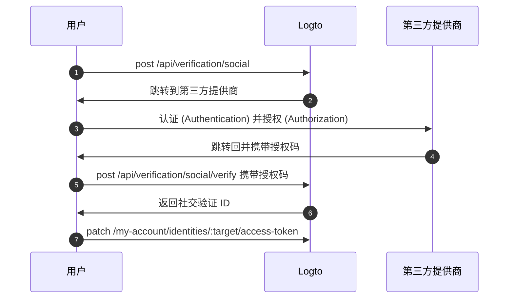

import Availability from '@components/Availability';

<Availability cloud oss={{ major: 1, minor: 31 }} />

联邦令牌集 (Federated token set) 是存储在 Logto Secret Vault 中的一种密钥类型，用于安全管理由联邦第三方身份提供商颁发的访问令牌 (Access token) 和刷新令牌 (Refresh token)。当用户通过社交或企业单点登录 (SSO) 连接器进行认证 (Authentication) 时，Logto 会将颁发的令牌存储在 Vault 中。这些令牌随后可以被检索，用于代表用户访问第三方 API，无需重新认证 (Authentication)。

## 启用联邦令牌存储 \{#enable-federated-token-storage}

### 社交连接器 \{#social-connectors}

:::Info
此功能仅适用于支持令牌存储的连接器。目前支持的连接器包括：[GitHub](/integrations/github)、[Google](/integrations/google)、[Facebook](/integrations/facebook)、[标准 OAuth 2.0](/integrations/oauth2) 和 [标准 OIDC](/integrations/oidc)。更多连接器的支持将逐步推出。
:::

1. 前往 <CloudLink to="/connectors/social">控制台 > 连接器 > 社交连接器</CloudLink>。
2. 选择你想要启用联邦令牌存储的社交连接器。
3. 在“设置”页面，启用 **为持久 API 访问存储令牌** 选项。

### 企业单点登录 (SSO) 连接器 \{#enterprise-sso-connectors}

:::Info
所有 OIDC 企业连接器均支持令牌存储。
:::

1. 前往 <CloudLink to="/enterprise-sso">控制台 > 企业单点登录 (SSO)</CloudLink>。
2. 选择你想要启用联邦令牌存储的企业单点登录 (SSO) 连接器。
3. 在“SSO 体验”标签页，启用 **为持久 API 访问存储令牌** 选项。

请确保保存你的更改。

## 令牌存储 \{#token-storage}

启用联邦令牌存储后，每当用户通过社交或企业单点登录 (SSO) 连接器认证 (Authentication) 时，Logto 会自动存储由联邦身份提供商颁发的访问令牌 (Access token) 和刷新令牌 (Refresh token)。包括以下场景：

- [社交登录与注册](/end-user-flows/sign-up-and-sign-in/social-sign-in)
- [企业单点登录 (SSO) 登录与注册](/end-user-flows/enterprise-sso)
- [通过 Account API 进行社交账号绑定](/end-user-flows/account-settings/by-account-api#link-a-new-social-connection)

存储的令牌会附加到用户的社交或企业单点登录 (SSO) 身份上，使其能够在无需重新认证 (Authentication) 的情况下，后续检索令牌以访问 API。

### 检查令牌存储状态 \{#checking-token-storage-status}

你可以在 Logto 控制台中检查用户的联邦令牌存储状态：

1. 前往 <CloudLink to="/users">控制台 > 用户</CloudLink>。
2. 点击你想要查看的用户，进入用户详情页。
3. 滚动到 **连接** 区域。这里会列出该用户关联的所有社交和企业单点登录 (SSO) 连接。
4. 每个连接条目会显示一个令牌状态标签，指示该连接是否已存储令牌。
5. 点击连接条目可查看更多详情，包括已存储的访问令牌 (Access token) 元数据和刷新令牌 (Refresh token) 可用性（如有）。

你也可以通过 Management API 检查用户第三方身份及令牌存储状态：

- `GET /api/users/{userId}/identities/{target}?includeTokenSecret=true`：通过指定连接器 target（如 `github`、`google` 等）获取用户的社交身份及其令牌存储状态。
- `GET /api/users/{userId}/sso-identities/{ssoConnectorId}?includeTokenSecret=true`：通过指定 SSO 连接器 ID 获取用户的企业单点登录 (SSO) 身份及其令牌存储状态。

### 令牌存储状态 \{#token-storage-status}

- **Active（活跃）**：访问令牌 (Access token) 已存储且处于活跃状态。
- **Expired（已过期）**：访问令牌 (Access token) 已存储但已过期。如果有刷新令牌 (Refresh token)，可用于获取新的访问令牌 (Access token)。
- **Inactive（未激活）**：该连接未存储访问令牌 (Access token)。可能是用户未通过该连接认证 (Authentication) 或令牌存储已被删除。
- **Not applicable（不适用）**：该连接器不支持令牌存储。

### 令牌元数据 \{#token-metadata}

为保证数据完整性和安全性，所有令牌在存储到 Secret Vault 前都会被加密。实际令牌值仅对拥有适当授权的终端用户可见。开发者只能获取令牌集元数据，以了解存储令牌的状态，而不会暴露敏感内容。

- `createdAt`：首次建立连接并将令牌集存储到 Secret Vault 的时间戳。
- `updatedAt`：令牌集最后一次被更新的时间。
  - 如果没有刷新令牌 (Refresh token)，该值与 **createdAt** 相同。
  - 如果有刷新令牌 (Refresh token)，该值反映最近一次访问令牌 (Access token) 被刷新时的时间。
- `hasRefreshToken`：指示是否有刷新令牌 (Refresh token) 可用。
  如果连接器支持离线访问且授权请求配置正确，Logto 会在身份提供商颁发时与访问令牌 (Access token) 一同存储刷新令牌 (Refresh token)。
  当访问令牌 (Access token) 过期且存在有效的刷新令牌 (Refresh token) 时，用户请求访问已连接的提供商时，Logto 会自动尝试使用存储的刷新令牌 (Refresh token) 获取新的访问令牌 (Access token)。
- `expiresAt`：访问令牌 (Access token) 的预计过期时间（单位：秒）。
  该值基于身份提供商的 token endpoint 返回的 `expires_in` 计算得出。（仅当提供商在令牌响应中包含 `expires_in` 字段时可用。）
- `scope`：访问令牌 (Access token) 的权限范围，指示身份提供商授予的权限。
  这有助于了解存储的访问令牌 (Access token) 可执行哪些操作。（仅当提供商在令牌响应中包含 `scope` 字段时可用。）
- `tokenType`：访问令牌 (Access token) 的类型，通常为 "Bearer"。
  （仅当提供商在令牌响应中包含 `token_type` 字段时可用。）

## 令牌检索 \{#token-retrieval}

启用令牌存储并将令牌安全存储在 Logto Secret Vault 后，终端用户可以通过集成 Logto 的 [User Account API](/end-user-flows/account-settings/by-account-api) 从你的客户端应用检索他们的第三方访问令牌 (Access token)。

- `GET /my-account/identities/:target/access-token`：通过指定连接器 target（如 github、google）获取社交身份的访问令牌 (Access token)。

- `GET /my-account/sso-identities/:connectorId/access-token`：通过指定连接器 ID 获取企业单点登录 (SSO) 身份的访问令牌 (Access token)。

:::info
了解如何[启用](/end-user-flows/account-settings/by-account-api#how-to-enable-account-api)和[访问](/end-user-flows/account-settings/by-account-api#access-account-api-using-access-token) Account API，并使用 Logto 颁发的访问令牌 (Access token)。
:::

### 令牌轮换 \{#token-rotation}

令牌检索接口返回：

- `200` OK：成功检索到访问令牌 (Access token) 且仍然有效。
- `404` Not Found：用户没有与指定 target 或连接器 ID 关联的社交或企业单点登录 (SSO) 身份，或未存储访问令牌 (Access token)。
- `401` Unauthorized：访问令牌 (Access token) 已过期。

如果访问令牌 (Access token) 已过期且有刷新令牌 (Refresh token)，Logto 会自动尝试刷新访问令牌 (Access token)，并在响应中返回新的访问令牌 (Access token)。Secret Vault 中的令牌存储也会同步更新为新的访问令牌 (Access token) 及其元数据。

## 令牌存储删除 \{#token-storage-deletion}

联邦令牌存储与每个用户的社交或企业单点登录 (SSO) 连接直接关联。这意味着在以下情况下，存储的令牌集会被自动删除：

- 关联的社交或企业单点登录 (SSO) 身份从用户账户中移除。
- 用户账户从你的租户中被删除。
- 社交或企业单点登录 (SSO) 连接器从你的租户中被删除。

### 撤销令牌 \{#revoking-tokens}

你也可以手动删除用户的第三方令牌集以撤销访问权限：

- 通过控制台：
  前往用户身份详情页，滚动到 **访问令牌 (Access token)** 区域（如有令牌存储），点击该区域末尾的 **删除令牌** 按钮。
- 通过 Management API：
  - `DELETE /api/secret/:id`：通过密钥 ID 删除指定密钥，该 ID 可在用户身份详情中获取。

撤销令牌集会强制用户在再次访问第三方 API 前，需重新通过第三方提供商认证 (Authentication) 以获取新的访问令牌 (Access token)。

## 重新认证 (Reauthentication) 与令牌续期 \{#reauthentication-and-token-renewal}

在存储的访问令牌 (Access token) 已过期或应用需要请求额外 API 权限范围的场景下，终端用户可以通过第三方提供商重新认证 (Authentication) 以获取新的访问令牌 (Access token)——无需再次登录 Logto。
这可以通过 Logto 的 [Social Verification API](https://openapi.logto.io/operation/operation-createverificationbysocial) 实现，允许用户重新发起联邦社交授权 (Authorization) 流程并更新其存储的令牌集。

:::note
重新发起联邦授权 (Authorization) 目前仅限于社交连接器。
对于企业单点登录 (SSO) 连接器，重新认证 (Authentication) 和令牌续期需要用户重新发起完整的 Logto 认证 (Authentication) 流程，因为目前在登录后不支持直接与企业单点登录 (SSO) 提供商重新授权 (Authorization)。
:::



1. 用户通过调用 `POST /api/verification/social` 接口发起社交验证请求。用户可以指定自定义权限范围 (scope) 以请求第三方提供商的额外权限。

   ```sh
   curl -X POST https://<your-logto-domain>/api/verification/social \
     -H "Authorization: Bearer <access_token>" \
     -H "Content-Type: application/json" \
     -d '{
       "state": "<state>",
       "connectorId": "<logto_connectorId>",
       "redirectUri": "<redirect_uri>",
       "scope": "<custom_scope>"
     }'
   ```

   - **authorization header**：Logto 颁发的用户访问令牌 (Access token)。
   - **connectorId**：Logto 中的社交连接器 ID。
   - **redirectUri**：认证 (Authentication) 完成后将用户重定向回你应用的 URI。你需要在提供商的应用设置中注册该 URI。
   - **scope**：（可选）自定义权限范围 (scope)，用于请求第三方提供商的额外权限。如未指定，则使用连接器中配置的默认权限范围 (scope)。

2. Logto 创建新的社交验证记录，并返回社交验证 ID 及授权 (Authorization) URL，用于将用户重定向到第三方提供商进行认证 (Authentication)。

   响应示例：

   ```json
   {
     "verificationRecordId": "<social_verification_id>",
     "authorizationUri": "<authorization_url>",
     "expiresAt": "<expiration_time>"
   }
   ```

3. 将用户重定向到授权 (Authorization) URL。用户在第三方提供商处进行认证 (Authentication) 并授权 (Authorization)。

4. 第三方提供商将用户重定向回你的客户端应用，并携带授权码。

5. 处理授权回调，将授权码转发到 Logto 的验证接口：

   ```sh
   curl -X POST https://<your-logto-domain>/api/verification/social/verify \
     -H "Authorization: Bearer <access_token>" \
     -d '{
       "verificationRecordId": "<social_verification_id>",
       "connectorData": {
         "code": "<authorization_code>",
         "state": "<state>",
         "redirectUri": "<redirect_uri>"
       }
     }'
   ```

   - **authorization header**：Logto 颁发的用户访问令牌 (Access token)。
   - **verificationRecordId**：上一步返回的社交验证 ID。
   - **connectorData**：授权码及第三方提供商在回调时返回的其他数据。

   :::note
   不要忘记校验 `state` 参数，以防止 CSRF 攻击。
   :::

6. Logto 验证授权码，并向第三方提供商换取新的访问令牌 (Access token) 和刷新令牌 (Refresh token)，然后在响应中返回社交验证 ID。

7. 最后，通过调用 `PATCH /my-account/identities/:target/access-token` 接口并携带社交验证 ID，更新用户的令牌存储：

   ```sh
   curl -X PATCH https://<your-logto-domain>/my-account/identities/<target>/access-token \
     -H "Authorization: Bearer <access_token>" \
     -H "Content-Type: application/json" \
     -d '{
       "socialVerificationId": "<social_verification_id>"
     }'
   ```

   - **authorization header**：Logto 颁发的用户访问令牌 (Access token)。
   - **socialVerificationId**：上一步返回的已验证社交验证记录 ID。

   这将用新的访问令牌 (Access token) 和刷新令牌 (Refresh token) 更新 Logto Secret Vault 中的用户令牌集存储，使用户无需再次登录 Logto 即可访问第三方 API。

   更新后的访问令牌 (Access token) 将被返回。
