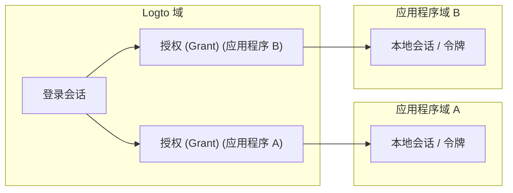
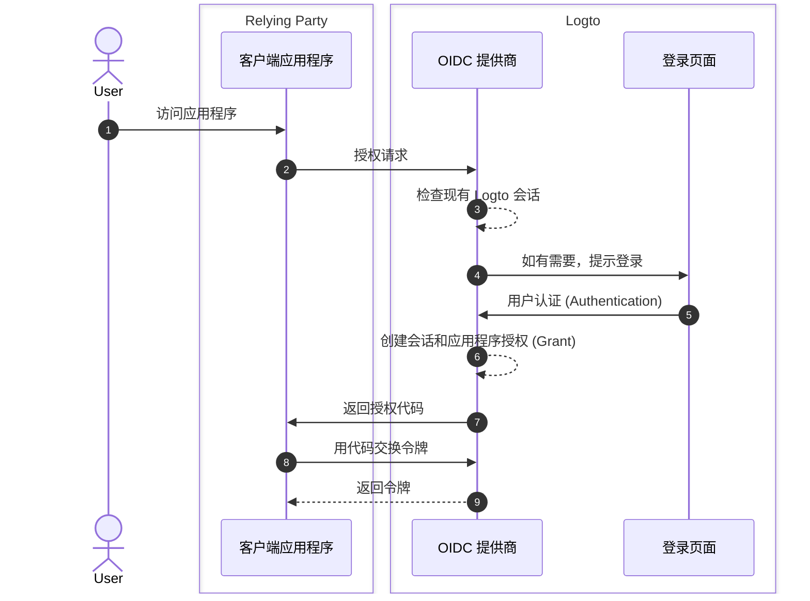
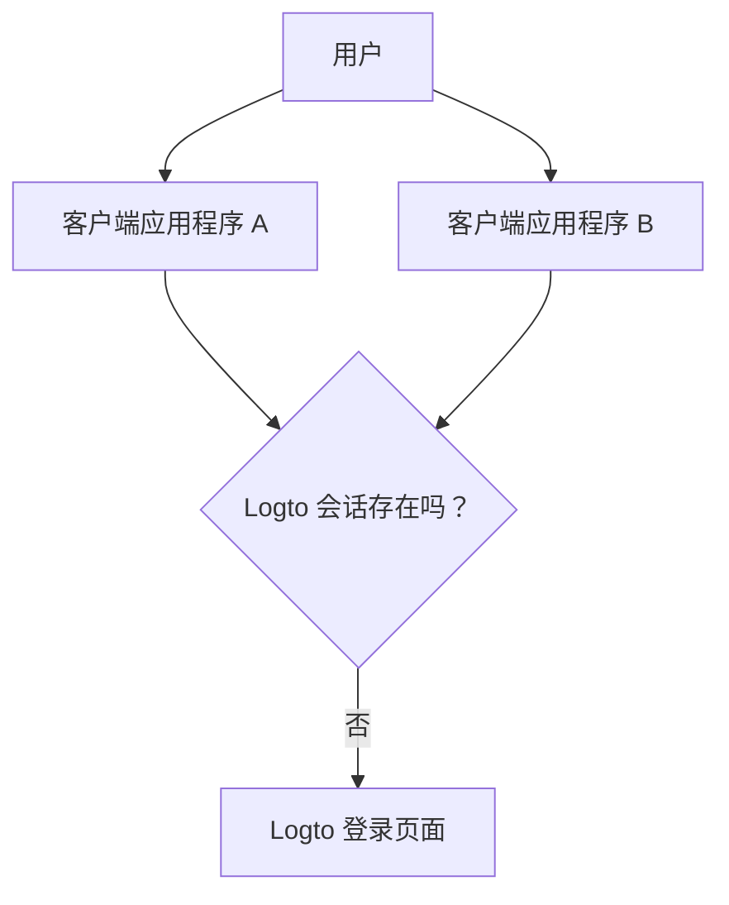

# 会话

在 Logto 中，会话定义了如何在应用程序、浏览器和设备之间创建、共享、刷新和撤销认证 (Authentication) 状态。

实际上，用户体验到的“已登录”是一种状态，但系统状态被分为多个层次。理解这些层次是设计可预测的单点登录 (SSO)、令牌更新和注销行为的关键。

## Logto 中的会话模型 \{#session-model-in-logto}

- **Logto 登录会话**：作为 Logto 域 cookie 存储的集中登录状态。这控制了当前浏览器上下文中的 SSO 可用性。
- **授权 (Grant)**：特定于应用程序的 `用户 + 客户端应用程序` 授权 (Authorization) 状态。授权 (Grants) 是集中登录和应用程序令牌发放之间的桥梁。
- **应用程序本地会话/令牌**：每个应用程序中的本地认证 (Authentication) 状态（ID/访问/刷新令牌、应用程序会话 cookie 等）。

## 核心概念 \{#core-concepts}

### 什么是 Logto 会话？\{#what-is-a-logto-session}

Logto 会话是成功登录后创建的集中认证 (Authentication) 状态。如果它仍然有效，Logto 可以在同一租户中的其他应用程序中静默认证 (Authentication) 用户。如果不存在，用户必须重新登录。

### 什么是授权 (Grants)？\{#what-are-grants}

授权 (Grant) 是与特定用户和客户端应用程序相关联的应用程序级别授权 (Authorization) 状态。

- 一个 Logto 会话可以有多个应用程序的授权 (Grants)。
- 应用程序的令牌是在该应用程序的授权 (Grant) 下发放的。
- 撤销授权 (Grant) 会影响该应用程序继续基于令牌访问的能力。

### 会话、授权 (Grants) 和应用程序认证 (Authentication) 状态之间的关系 \{#how-session-grants-and-app-auth-state-relate}

- **会话**回答：“这个浏览器现在可以与 Logto 进行 SSO 吗？”
- **授权 (Grant)**回答：“这个用户是否被授权 (Authorization) 使用这个客户端应用程序？”
- **应用程序本地会话**回答：“这个应用程序当前是否将用户视为已登录？”

## 登录和会话创建 \{#sign-in-and-session-creation}

## 跨应用程序和设备的会话拓扑 \{#session-topology-across-apps-and-devices}

### 同一浏览器：共享 Logto 会话 \{#same-browser-shared-logto-session}

同一浏览器中的应用程序可以共享集中 Logto 会话状态，因此 SSO 可以在不重复输入凭据的情况下发生。

### 不同浏览器或设备：隔离的 Logto 会话 \{#different-browsers-or-devices-isolated-logto-sessions}

每个浏览器/设备都有单独的 cookie 存储。设备 A 上的有效会话并不意味着设备 B 上也有有效会话。

## 会话生命周期 \{#session-lifecycle}

### 1. 创建 \{#1-create}

用户认证 (Authentication) 后，Logto 创建一个集中会话和一个应用程序特定的授权 (Grant)。

### 2. 重用 (SSO) \{#2-reuse-sso}

只要会话 cookie 在同一浏览器中有效，新授权请求通常可以静默完成。

### 3. 更新令牌 \{#3-renew-tokens}

应用程序访问通常通过令牌刷新流程（如果启用）继续。这是应用程序级别的连续性，与集中 Logto 会话是否仍然存在无关。

### 4. 撤销/过期 \{#4-revokeexpire}

撤销可以在不同层次发生：

- 本地应用程序注销会移除应用程序本地令牌/会话。
- 结束会话会移除集中 Logto 会话。
- 授权 (Grant) 撤销会移除应用程序级别的授权 (Authorization) 连续性。

## 设计建议 \{#design-recommendations}

- 在你的应用程序代码中明确处理应用程序本地会话。
- 将 Logto 会话、授权 (Grants) 和应用程序本地会话视为独立的层次。
- 选择注销是仅限于应用程序本地还是全局。
- 当需要多应用程序一致性时，使用 [后端通道注销](/end-user-flows/sign-out#federated-sign-out-back-channel-logout)。
- 有关注销行为和实现细节，请参见 [注销](/end-user-flows/sign-out)。

## 撤销访问的最佳实践 \{#best-practices-for-revoking-access}

根据你的目标使用不同的撤销策略：

- **撤销对你的第一方应用程序的访问**：
  使用 `revokeGrantsTarget=firstParty` 撤销目标会话。这会使用户在与该会话关联的第一方应用程序中注销，从而创建一致的注销体验。同时，授予 `offline_access` 的第三方应用程序的授权 (Grants) 可以继续用于持续集成。有关会话撤销的详细信息，请参见 [管理用户会话](/sessions/manage-user-sessions)。

- **撤销对第三方应用程序的访问**：
  选择以下之一：

  - 使用 `revokeGrantsTarget=all` 撤销会话，以撤销与该会话关联的所有授权 (Grants)。
  - 通过授权 (Grant) 管理 API 直接撤销特定授权 (Grants)，以移除第三方应用程序授权 (Authorization)，而不强制完全会话注销。
    有关授权 (Grant) 特定撤销策略，请参见 [管理用户授权应用程序 (Grants)](/sessions/grants-management)。

- **使用 Logto 控制台时**：
  在用户详细信息页面，Logto 提供了开箱即用的会话管理和授权第三方应用程序管理。
  - 撤销会话也会撤销第一方应用程序授权 (Grants)，以保持第一方注销行为一致。
  - 撤销第三方应用程序授权 (Authorization) 会撤销该第三方应用程序的授权 (Grants)，同时保持原始会话状态不变。

## 相关资源 \{#related-resources}

<Url href="/sessions/manage-user-sessions">管理用户会话</Url>
<Url href="/sessions/grants-management">管理用户授权应用程序 (Grants)</Url>
<Url href="/sessions/session-configs">会话配置</Url>
<Url href="/end-user-flows/sign-out">注销</Url>
<Url href="/end-user-flows/sign-up-and-sign-in">注册和登录</Url>
<Url href="/integrate-logto/integrate-logto-into-your-application/understand-authentication-flow">
  理解认证 (Authentication) 流程
</Url>
