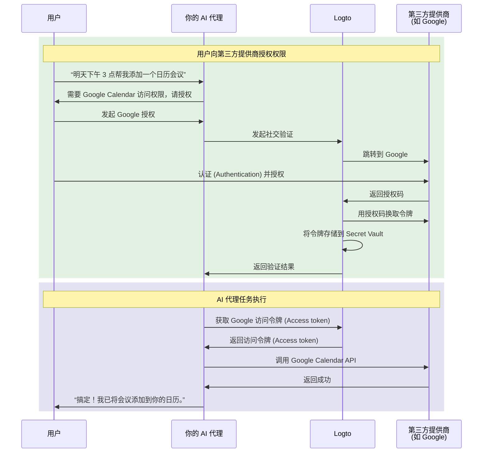

# 连接你的 AI 代理到第三方 API

本指南将带你了解如何让你的 AI 代理代表用户访问第三方 API（如 Google Calendar、GitHub 等）。通过利用 Logto 的社交连接器和 Secret Vault，你可以安全地存储和管理访问令牌 (Access tokens)，让你的代理无需反复要求用户重新认证 (Authentication)，即可自动执行任务。

你将学会如何：

- 配置带有第三方令牌存储的社交连接器。
- 在初次登录时请求最小权限。
- 按需逐步请求更多权限。
- 检索并使用已存储的令牌访问第三方 API。

## 为什么你的 AI 代理需要第三方 API 访问权限 \{#why-your-ai-agent-needs-third-party-api-access}

AI 代理越来越多地被用于自动化需要与外部服务交互的任务。例如：

- **📅 日历管理**：你的 AI 代理可以自动安排会议、添加事件或调整 Google Calendar 上的日程。
- **📧 邮件自动化**：通过 Gmail API 发送跟进邮件、整理收件箱或草拟回复。
- **💻 代码管理**：创建 GitHub 问题、审查拉取请求或管理仓库。
- **📁 文件管理**：在 Google Drive 或 Dropbox 上上传、整理或分享文件。

要执行这些任务，你的 AI 代理需要安全地访问用户授权的第三方 API，这意味着要正确且安全地处理 OAuth 令牌。

## 工作原理 \{#how-it-works}

以下是流程的快速概览：



1. **用户请求任务**：用户让 AI 代理执行需要第三方 API 访问的任务（如添加日历事件）。
2. **授权提示**：代理检测到需要第三方访问权限并提示用户授权。
3. **令牌存储**：用户授权后，Logto 会将访问令牌 (Access token) 和刷新令牌 (Refresh token) 安全地存储在 Secret Vault。
4. **任务执行**：代理检索已存储的令牌并调用第三方 API 完成任务。

一旦授权，用户可以多次执行任务而无需重新授权。Logto 会安全地存储令牌，并在需要时自动刷新，为持续的 AI 代理交互提供无缝体验。

## 前置条件 \{#prerequisites}

在开始之前，请确保你已具备：

- 一个 [Logto Cloud](https://cloud.logto.io)（或自托管 Logto v1.31+）租户
- 一个拥有 API 访问权限的第三方提供商账号（如 [Google Cloud Console](https://console.cloud.google.com)）
- 已集成 Logto SDK 的 AI 代理应用（用户可以登录你的 AI 代理）

## 配置带令牌存储的社交连接器 \{#set-up-social-connector-with-token-storage}

要让你的 AI 代理访问第三方 API，你需要配置一个启用令牌存储的社交连接器。这允许 Logto 在用户与 AI 代理交互时，授权第三方服务后存储和管理访问令牌 (Access tokens)。

以 Google 为例：

1. 进入 <CloudLink to="/connectors/social">控制台 > 连接器 > 社交连接器</CloudLink>。
2. 点击 **添加社交连接器** 并选择 **Google**。
3. 按照 [Google 连接器设置指南](/integrations/google) 配置你的 OAuth 客户端凭据。
4. 在连接器设置中：
   - 启用 **为持久 API 访问存储令牌**，将令牌存储到 Secret Vault。
   - 设置 **Prompts** 包含 `consent`，确保用户看到权限请求。
   - 启用 **离线访问**，以获取长期 API 访问所需的刷新令牌 (Refresh token)。
5. 保存更改。

:::info
你无需将此连接器添加到登录体验中。该连接器将在你的 AI 代理需要访问第三方 API 时按需授权使用，而不是用于用户登录。
:::

## 请求授权并访问第三方 API \{#request-authorization-and-access-third-party-apis}

当你的 AI 代理需要访问第三方 API（如 Google Calendar）时，应首先检查用户是否已授权访问。如果没有，则提示用户授权。

:::info 启用 Account API
在继续之前，请在 <CloudLink to="/sign-in-experience/account-center">控制台 > 登录体验 > 账户中心</CloudLink> 启用 Account API。了解更多关于[启用 Account API](/end-user-flows/account-settings/by-account-api#how-to-enable-account-api)的信息。
:::

### 步骤 1：检查是否已授权 \{#step-1-check-for-existing-authorization}

首先，尝试检索已存储的访问令牌 (Access token)，以判断用户是否已授权：

```tsx
async function getGoogleAccessToken(userAccessToken: string) {
  const response = await fetch(
    'https://[tenant-id].logto.app/my-account/identities/google/access-token',
    {
      headers: {
        Authorization: `Bearer ${userAccessToken}`,
      },
    }
  );

  return response.json();
}
```

### 步骤 2：如有需要，请求授权 \{#step-2-request-authorization-if-needed}

如果没有令牌、令牌已过期，或你需要扩展访问令牌 (Access token) 的权限范围，请使用 Logto 的 [Social Verification API](/secret-vault/federated-token-set#reauthentication-and-token-renewal) 发起授权流程：

```tsx
async function requestGoogleAuthorization(userAccessToken: string, scopes: string) {
  // 生成随机 state 用于 CSRF 防护
  const state = crypto.randomUUID();
  sessionStorage.setItem('oauth_state', state);

  // 发起社交验证
  const response = await fetch('https://[tenant-id].logto.app/api/verification/social', {
    method: 'POST',
    headers: {
      Authorization: `Bearer ${userAccessToken}`,
      'Content-Type': 'application/json',
    },
    body: JSON.stringify({
      connectorId: '<google_connector_id>',
      state,
      redirectUri: 'https://your-ai-agent.com/callback',
      scope: scopes,
    }),
  });

  const { verificationRecordId, authorizationUri } = await response.json();

  // 存储 verificationRecordId 以便后续使用
  sessionStorage.setItem('verificationRecordId', verificationRecordId);

  // 跳转用户到 Google 进行授权
  window.location.href = authorizationUri;
}
```

### 步骤 3：处理授权回调 \{#step-3-handle-the-authorization-callback}

用户授权后，Google 会重定向回你的应用。完成验证并存储令牌：

```tsx
async function handleAuthorizationCallback(
  userAccessToken: string,
  callbackParams: URLSearchParams
) {
  const verificationRecordId = sessionStorage.getItem('verificationRecordId');
  const storedState = sessionStorage.getItem('oauth_state');
  const code = callbackParams.get('code');
  const state = callbackParams.get('state');

  // 校验 state 防止 CSRF 攻击
  if (state !== storedState) {
    throw new Error('Invalid state parameter');
  }

  // 验证授权
  await fetch('https://[tenant-id].logto.app/api/verification/social/verify', {
    method: 'POST',
    headers: {
      Authorization: `Bearer ${userAccessToken}`,
      'Content-Type': 'application/json',
    },
    body: JSON.stringify({
      verificationRecordId,
      connectorData: {
        code,
        state,
        redirectUri: 'https://your-ai-agent.com/callback',
      },
    }),
  });

  // 将令牌存储到 Logto 的 Secret Vault
  await fetch('https://[tenant-id].logto.app/my-account/identities/google/access-token', {
    method: 'PUT',
    headers: {
      Authorization: `Bearer ${userAccessToken}`,
      'Content-Type': 'application/json',
    },
    body: JSON.stringify({
      verificationRecordId,
    }),
  });

  // 清理
  sessionStorage.removeItem('verificationRecordId');
  sessionStorage.removeItem('oauth_state');
}
```

### 步骤 4：调用第三方 API \{#step-4-call-the-third-party-api}

现在你的 AI 代理可以检索令牌并调用 API：

```tsx
async function addCalendarEvent(userAccessToken: string, eventDetails: EventDetails) {
  // 获取已存储的 Google 访问令牌 (Access token)
  const tokenData = await getGoogleAccessToken(userAccessToken);

  if (!tokenData) {
    // 用户尚未授权，请求 calendar 权限
    await requestGoogleAuthorization(
      userAccessToken,
      'https://www.googleapis.com/auth/calendar.events'
    );
    return; // 跳转后继续
  }

  // 调用 Google Calendar API
  const response = await fetch('https://www.googleapis.com/calendar/v3/calendars/primary/events', {
    method: 'POST',
    headers: {
      Authorization: `Bearer ${tokenData.accessToken}`,
      'Content-Type': 'application/json',
    },
    body: JSON.stringify(eventDetails),
  });

  return response.json();
}
```

Logto 会自动处理令牌刷新。如果访问令牌 (Access token) 已过期但存在刷新令牌 (Refresh token)，当你调用检索接口时，Logto 会透明地获取新的访问令牌 (Access token)。

## 请求更多权限 \{#request-additional-permissions}

随着你的 AI 代理承担更多任务，可能需要请求更多权限。例如，用户最初只授权了只读日历访问，但现在希望创建事件，则需要写入权限。

### 为什么要渐进式授权？ \{#why-incremental-authorization}

- **更好的用户体验**：用户在理解上下文需求时更愿意授权。
- **更高的转化率**：前期权限请求越少，阻力越小。
- **建立信任**：只请求所需权限的应用更容易获得用户信任。

### 示例：从只读升级到写入权限 \{#example-upgrading-from-read-to-write-access}

```tsx
async function createCalendarEvent(userAccessToken: string, eventDetails: EventDetails) {
  const tokenData = await getGoogleAccessToken(userAccessToken);

  if (!tokenData) {
    // 尚未授权，直接请求 calendar 写入权限
    await requestGoogleAuthorization(userAccessToken, 'https://www.googleapis.com/auth/calendar');
    return;
  }

  // 尝试创建事件
  const response = await fetch('https://www.googleapis.com/calendar/v3/calendars/primary/events', {
    method: 'POST',
    headers: {
      Authorization: `Bearer ${tokenData.accessToken}`,
      'Content-Type': 'application/json',
    },
    body: JSON.stringify(eventDetails),
  });

  if (response.status === 403) {
    // 权限不足，请求更多 scope
    await requestGoogleAuthorization(
      userAccessToken,
      'https://www.googleapis.com/auth/calendar' // 完整日历访问权限
    );
    return;
  }

  return response.json();
}
```

:::tip
请求更多 scope 时，用户会看到只包含新权限的用户授权页面 (Consent screen)。已有权限会被保留。
:::

## 管理令牌状态 \{#manage-token-status}

Logto 控制台为每个用户提供令牌状态可视化：

1. 进入 <CloudLink to="/users">控制台 > 用户管理</CloudLink>。
2. 点击某个用户查看详情。
3. 滚动到 **连接** 部分，查看所有已关联的社交账号。
4. 每个连接会显示令牌状态：
   - **活跃**：访问令牌 (Access token) 有效且可用。
   - **已过期**：访问令牌 (Access token) 已过期。如果存在刷新令牌 (Refresh token)，下次检索时会自动刷新。
   - **未激活**：该连接未存储任何令牌。

## 安全最佳实践 \{#security-best-practices}

构建访问第三方 API 的 AI 代理时，请牢记以下安全实践：

- **请求最小 scope**：只请求代理实际需要的权限。
- **使用渐进式授权**：按需请求更多权限，而不是一次性全部请求。
- **优雅处理令牌过期**：始终处理令牌可能过期或被撤销的情况。
- **保护用户访问令牌 (Access token)**：用户的 Logto 访问令牌 (Access token) 是检索第三方令牌的钥匙，请妥善保护。
- **审计 API 访问**：记录你的 AI 代理访问第三方 API 的行为，便于排查和合规。

## 相关资源 \{#related-resources}

<Url href="/secret-vault/federated-token-set">第三方令牌存储</Url>
<Url href="/connectors/social-connectors">社交连接器</Url>
<Url href="/end-user-flows/sign-up-and-sign-in/social-sign-in">社交登录</Url>
<Url href="/end-user-flows/account-settings/by-account-api">Account API</Url>
