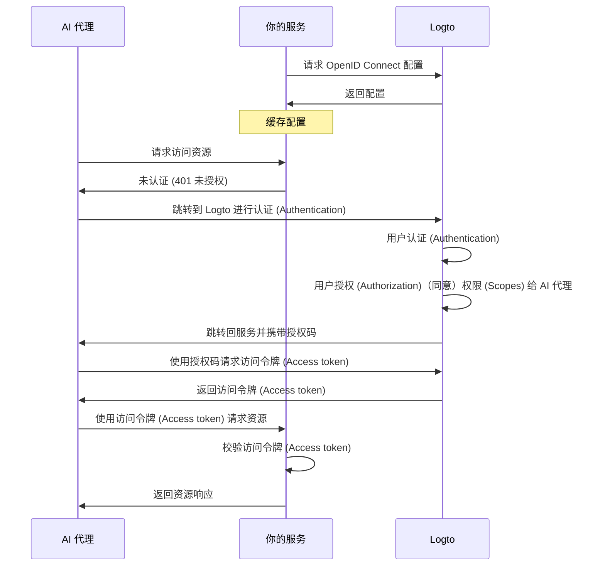

import ConfigureThirdPartyAiAgent from './fragments/_configure-third-party-ai-agent.mdx';

# 启用第三方 AI 代理访问你的应用

本指南将带你完成将 Logto 集成到你的服务中，并允许 AI 代理访问你的服务的流程。

你将学到如何：

- 将 Logto 配置为你的服务的授权 (Authorization) 服务器。
- 获取 AI 代理访问你服务所需的访问令牌 (Access token)。
- 使用 AI 代理测试整个流程。

## 第三方 AI 代理与你自己的 AI 代理（或应用）的区别 \{#difference-between-third-party-ai-agent-and-your-own-ai-agent-or-app}

让我们来看一个例子。假设你是一名开发者，运营着一个提供天气数据的服务。

**官方天气应用（你自己的 AI 代理 / 应用）**

- 你为用户提供了一个官方天气应用，用于查询天气。
- 工作原理：官方天气应用通过 Logto 连接到你的服务，为用户进行认证 (Authentication)。当 Alice 登录时，她会自动获得天气数据的访问权限，无需额外的权限页面，因为这是你信任的应用。

**第三方 AI 代理**

- 你正在围绕你的服务构建一个生态系统，因此另一位开发者创建了“WeatherBot”（一个可以提供天气更新和预报的 AI 助手），并将其作为第三方 AI 代理集成。
- 工作原理：WeatherBot（第三方 AI 代理）希望通过你的服务访问用户的天气数据。当 Alice 使用她的账户登录 WeatherBot 时：
  - 她会看到一个用户授权页面 (Consent screen)，询问是否允许 WeatherBot 访问她的天气数据。
  - Alice 可以允许或拒绝此访问。
  - 只有她同意的数据会被共享给 WeatherBot，WeatherBot 无法在没有明确重新授权的情况下访问任何额外数据。

这种访问（权限）控制确保了用户数据的安全，即使你的服务管理所有数据，像 WeatherBot 这样的第三方 AI 代理也只能访问用户明确允许的数据。他们无法绕过这个流程，因为这是由你在服务中实现的访问控制所强制执行的。

**总结**

| 客户端类型     | 示例             | 是否需要用户授权？ | 谁控制？     |
| -------------- | ---------------- | ------------------ | ------------ |
| 官方天气应用   | 你自己的天气应用 | 否                 | 你（开发者） |
| 第三方 AI 代理 | WeatherBot 助手  | 是                 | 其他开发者   |

:::note
如果你想将你的服务与自己的 AI 代理或应用集成，请参考我们的[快速开始指南](/quick-starts)获取更多信息。
:::

## 前置条件 \{#prerequisites}

- 一个 [Logto Cloud](https://cloud.logto.io)（或自托管）租户
- 一个向 AI 代理开放 API 端点的服务

### 理解流程 \{#understanding-the-flow}

- **服务**：你希望向 AI 代理开放的服务。
- **AI 代理**：将访问你服务的 AI 代理。
- **Logto**：作为 OpenID Connect 提供方（授权 (Authorization) 服务器），管理用户身份。

下面是一个非规范的时序图，展示了整个流程：

## 设置第三方 AI 代理 \{#set-up-third-party-ai-agent}

要设置第三方 AI 代理访问你的服务，你需要按照以下步骤操作：

1. **在 Logto 中注册 AI 代理**：在 Logto 中创建一个应用来代表该 AI 代理。
2. **配置 AI 代理**：确保 AI 代理能够向你的服务发起请求，并能处理 401 未授权响应。
3. **实现授权 (Authorization) 流程**：AI 代理应能处理 OAuth 2.0 授权 (Authorization) 流程，从 Logto 获取访问令牌 (Access token)。
4. **测试集成**：使用 AI 代理访问你的服务，验证其能成功进行认证 (Authentication) 和授权 (Authorization) 请求。

<ConfigureThirdPartyAiAgent />

## 在你的服务中设置授权 (Authorization) \{#set-up-authorization-in-your-service}

要在你的服务中启用访问控制，你需要实现以下内容：

1. **在 Logto 中定义 API 资源**：在 Logto 中创建代表 AI 代理将要访问的端点的 API 资源。
2. **实现访问控制逻辑**：在你的服务中，实现校验从 AI 代理收到的访问令牌 (Access token) 并检查用户是否有权限访问所请求资源的逻辑。
3. **响应 AI 代理**：如果访问令牌 (Access token) 有效且用户有权限，则返回所请求的资源；否则返回 401 未授权响应。

想了解如何在你的服务中实现访问控制，请参考我们的[授权 (Authorization) 指南](/authorization)。

## 测试集成 \{#test-the-integration}

1. 启动你的服务。
2. 启动 AI 代理。
3. 在 AI 代理中调用 API 端点以访问你的服务。
4. AI 代理应能处理 401 未授权响应，并将用户重定向到 Logto 进行认证 (Authentication)。
5. 认证 (Authentication) 成功后，AI 代理应收到访问令牌 (Access token)，并用它向你的服务发起请求。
6. AI 代理应能使用访问令牌 (Access token) 从你的服务获取资源。
