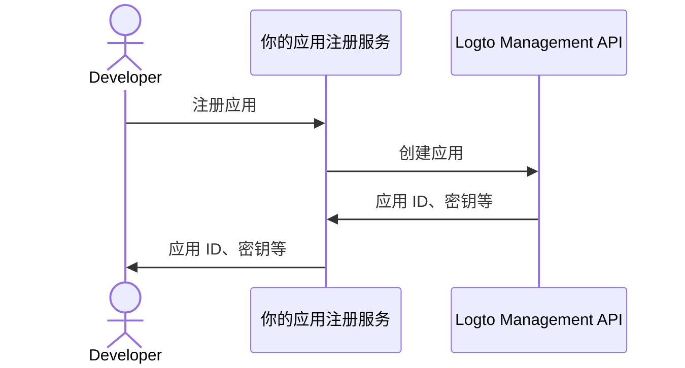

import QuickStartsReference from '../../../quick-starts/third-party/oidc/_quick-starts-reference.md';

## 在 Logto 中配置第三方 AI 代理 \{#configure-third-party-ai-agent-in-logto}

为了让第三方 AI 代理能够访问你的 {props.serviceName ?? '服务'}，你需要在 Logto 中设置一个**第三方应用**。该应用将用于代表 AI 代理并获取认证 (Authentication) 和授权 (Authorization) 所需的凭据。

### 允许开发者在 Logto 中创建第三方应用 \{#allow-developers-to-create-third-party-apps-in-logto}

如果你正在构建一个市场，或希望允许开发者在 Logto 中创建第三方应用，可以利用 [Logto Management API](/integrate-logto/interact-with-management-api) 以编程方式创建第三方应用。这样开发者就可以注册他们的应用并获取认证 (Authentication) 所需的凭据。

你需要托管自己的服务来处理客户端注册流程。该服务将与 Logto Management API 交互，代表开发者创建第三方应用。

另外，你也可以在 Logto 控制台手动创建第三方应用，以熟悉整个流程。

### 在 Logto 中手动创建第三方应用 \{#manually-create-a-third-party-app-in-logto}

你可以在 Logto 控制台手动创建第三方应用，用于测试或临时集成。当你想快速测试集成而无需实现完整的客户端注册流程时，这非常有用。

1. 登录到你的 Logto 控制台。
2. 进入 <CloudLink to="/applications">**应用程序**</CloudLink> → **创建应用程序** → **第三方应用** -> **OIDC**。
3. 填写应用名称及其他必填项，然后点击**创建应用程序**。
4. 点击**权限**标签页，在**用户**部分点击“添加”。
5. 在弹出的对话框中 -> **用户数据** -> 选择 **`profile`**、**`email`** 权限，然后点击**保存**。
6. 在第三方应用中，配置 scopes 以请求 `openid profile email` 权限（scopes）。

   **注意**：`openid` 是 OIDC 必需的，`profile` 和 `email` 是你在上一步添加的权限。

7. 相应地配置你的第三方应用的**重定向 URI**。记得同时在 Logto 中更新重定向 URI。

---

<QuickStartsReference />
