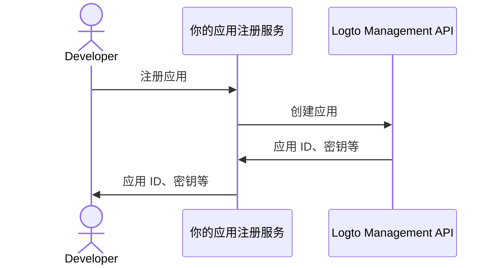
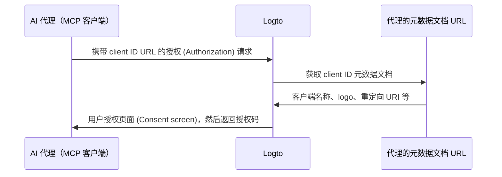

import QuickStartsReference from '../../../quick-starts/third-party/oidc/_quick-starts-reference.md';

## 在 Logto 中配置第三方 AI 代理 \{#configure-third-party-ai-agent-in-logto}

为了让第三方 AI 代理能够访问你的 {props.serviceName ?? '服务'}，你需要在 Logto 中设置一个**第三方应用**。该应用将用于代表 AI 代理，并获取认证 (Authentication) 和授权 (Authorization) 所需的凭证。

:::info[什么是第三方应用？]
**第三方应用**是由外部开发者（非资源所有者）创建的应用程序，需要用户同意才能访问受保护资源。与第一方应用（你自己的应用程序）不同，第三方应用会显示用户授权页面 (Consent screen)，在访问用户数据前请求用户批准特定权限。这确保了用户可以控制与外部服务共享哪些数据。

了解更多，请参阅 [第三方应用](/integrate-logto/third-party-applications)。
:::

接入 AI 代理有三种方式：

- [在控制台手动创建应用](#manually-create-a-third-party-app-in-logto)，适用于测试或少量已知代理。
- [基于 Management API 构建注册服务](#allow-developers-to-create-third-party-apps-in-logto)，如果你希望控制谁能获取凭证。
- [启用动态应用](#let-any-ai-agent-connect-without-pre-registration)，如果任何代理都可能接入且你不希望有注册步骤。

### 允许开发者在 Logto 中创建第三方应用 \{#allow-developers-to-create-third-party-apps-in-logto}

如果你正在构建一个市场或希望允许开发者在 Logto 中创建第三方应用，可以利用 [Logto Management API](/integrate-logto/interact-with-management-api) 以编程方式创建第三方应用。这样开发者可以注册他们的应用并获取认证 (Authentication) 所需的凭证。

你需要托管自己的服务来处理客户端注册流程。该服务将与 Logto Management API 交互，代表开发者创建第三方应用。

```mermaid
sequenceDiagram
  actor Developer
  participant Server as 你的应用注册服务
  participant Logto as Logto Management API
  Developer->>Server: 注册应用
  Server->>Logto: 创建应用
  Logto->>Server: 应用 ID、密钥等
  Server->>Developer: 应用 ID、密钥等
```

另外，你也可以在 Logto 控制台手动创建第三方应用，以熟悉整个流程。

### 允许任何 AI 代理无需预注册即可接入 \{#let-any-ai-agent-connect-without-pre-registration}

在开放的 MCP 生态系统中，你通常无法提前知道所有代理。[动态应用](/integrate-logto/third-party-applications/dynamic-apps) 移除了注册步骤：代理使用一个公开的 HTTPS URL（提供其自身客户端元数据文档）作为其 `client_id`，Logto 在收到授权 (Authorization) 请求时解析它。

```mermaid
sequenceDiagram
  participant Agent as AI 代理（MCP 客户端）
  participant Logto
  participant Metadata as 代理的元数据文档 URL
  Agent->>Logto: 携带 client ID URL 的授权 (Authorization) 请求
  Logto->>Metadata: 获取 client ID 元数据文档
  Metadata->>Logto: 客户端名称、logo、重定向 URI 等
  Logto->>Agent: 用户授权页面 (Consent screen)，然后返回授权码
```

你仍然可以通过授予动态应用的权限来控制代理可请求的内容，并且每次授权 (Authorization) 都会经过用户授权页面 (Consent screen)。

### 在 Logto 中手动创建第三方应用 \{#manually-create-a-third-party-app-in-logto}

你可以在 Logto 控制台手动创建第三方应用，用于测试或临时集成。当你想快速测试集成而无需实现完整的客户端注册流程时，这种方式非常有用。

1. 登录你的 Logto 控制台。
2. 进入 <CloudLink to="/applications">**应用程序**</CloudLink> → **创建应用** → **第三方应用** -> **OIDC**。
3. 填写应用名称及其他必填项，然后点击 **创建应用**。
4. 点击 **权限** 标签页，在 **用户** 部分点击“添加”。
5. 在弹出的对话框中 -> **用户数据** -> 选择 **`profile`**、**`email`** 权限，然后点击 **保存**。
6. 在第三方应用中，配置 scopes 以请求 `openid profile email` 权限（scopes）。

   **注意**：`openid` 是 OIDC 必需的，`profile` 和 `email` 是你在上一步添加的权限。

7. 按需配置你的第三方应用的 **重定向 URI**。记得在 Logto 中同步更新重定向 URI。

---

<QuickStartsReference />
