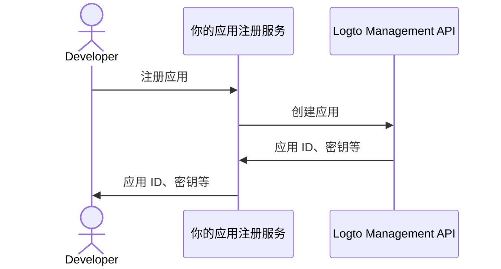

import thirdPartyAppPermissions from '../../../../../../docs/use-cases/ai/assets/third-party-app-permissions.png';
import QuickStartsReference from '../../quick-starts/third-party/oidc/_quick-starts-reference.md';

import Prerequisites from './fragments/_mcp-prerequisites.mdx';
import SampleCode from './fragments/_mcp-sample-code.mdx';
import SetUpServer from './fragments/_mcp-set-up-server.mdx';

# 启用第三方 AI 代理访问你的 MCP 服务器

本指南将带你通过 [mcp-auth](https://mcp-auth.dev) 集成 Logto 与 MCP 服务器，实现使用标准 OpenID Connect 流程对用户进行认证 (Authentication) 并安全获取其身份信息。

你将学会：

- 配置 Logto 作为 MCP 服务器的授权 (Authorization) 服务器。
- 在 MCP 服务器中设置 “whoami” 工具，用于返回当前用户的身份声明 (Claims)。
- 使用第三方 AI 代理（MCP 客户端）测试整个流程。

完成本教程后，你的 MCP 服务器将能够：

- 在你的 Logto 租户中对用户进行认证 (Authentication)。
- 在调用 "whoami" 工具时返回身份声明 (Claims)（如 `sub`、`username`、`name`、`email` 等）。

## 第三方 AI 代理（MCP 客户端）与你自己的 MCP 客户端的区别 \{#difference-between-third-party-ai-agent-mcp-client-and-your-own-mcp-client}

让我们来看一个例子。假设你是一名开发者，运行着一个 MCP 服务器来管理邮件访问和自动化。

**官方邮件应用（你自己的 MCP 客户端）**

- 你为用户提供了一个官方邮件应用，用于阅读和管理他们的邮件。
- 工作方式：官方邮件应用通过 Logto 连接到你的 MCP 服务器进行用户认证 (Authentication)。当 Alice 登录时，她会自动获得邮件访问权限，无需额外的权限页面，因为这是你信任的应用。

**第三方 AI 代理（第三方 MCP 客户端）**

- 你正在围绕 MCP 服务器构建生态系统，另一位开发者创建了 “SmartMail AI”（一个可以自动总结邮件和安排会议的 AI 助手），并将其作为第三方客户端集成。
- 工作方式：SmartMail AI（第三方 MCP 客户端）希望通过你的 MCP 服务器访问用户邮件。当 Alice 使用她的账户登录 SmartMail AI 时：
  - 她会看到一个用户授权页面 (Consent screen)，请求 SmartMail AI 读取她的邮件和日历的权限。
  - Alice 可以允许或拒绝此访问。
  - 只有她同意的数据会被共享给 SmartMail AI，SmartMail AI 无法在未重新获得明确同意的情况下访问其他数据。

这种访问（权限）控制确保了用户数据的安全。即使你的 MCP 服务器管理所有数据，像 SmartMail AI 这样的第三方应用也只能访问用户明确允许的数据。他们无法绕过这一流程，因为这是由你在 MCP 服务器中实现的访问控制所强制执行的。

**总结**

| 客户端类型     | 示例              | 是否需要授权 (Consent) | 谁控制       |
| -------------- | ----------------- | ---------------------- | ------------ |
| 官方邮件应用   | 你自己的邮件应用  | 否                     | 你（开发者） |
| 第三方 AI 代理 | SmartMail AI 助手 | 是                     | 其他开发者   |

:::note
如果你想将 MCP 服务器与自己的 AI 代理或应用集成，请参考 [为你的 MCP 驱动应用启用 Logto 认证 (Authentication)](./mcp-server-add-auth) 指南。
:::

<Prerequisites isThirdParty />

## 设置第三方 AI 代理 \{#set-up-third-party-ai-agent}

要让第三方 AI 代理访问你的 MCP 服务器，你需要完成以下设置：

1. 客户端应能够向 MCP 服务器发起请求，调用 MCP 服务器暴露的工具。
2. 客户端应能够处理 401 Unauthorized 响应。详见 [授权流程步骤 (Authorization Flow Steps)](https://modelcontextprotocol.io/specification/2025-03-26/basic/authorization#2-5-authorization-flow-steps)。
3. 认证 (Authentication) 成功后，客户端应能使用从 Logto 获取的访问令牌 (Access token) 向 MCP 服务器发起请求。

## 在 Logto 中设置 AI 代理 \{#set-up-ai-agent-in-logto}

要让第三方 AI 代理访问你的 MCP 服务器，你需要在 Logto 中设置一个**第三方应用**。该应用将用于代表 AI 代理并获取认证 (Authentication) 和授权 (Authorization) 所需的凭据。

### 允许开发者在 Logto 中创建第三方应用 \{#allow-developers-to-create-third-party-apps-in-logto}

如果你正在构建一个市场或希望允许开发者在 Logto 中创建第三方应用，可以利用 [Logto Management API](/integrate-logto/interact-with-management-api) 以编程方式创建第三方应用。这样开发者可以注册他们的应用并获取认证 (Authentication) 所需的凭据。

你需要托管自己的服务来处理客户端注册流程。该服务将与 Logto Management API 交互，代表开发者创建第三方应用。

你也可以在 Logto 控制台手动创建第三方应用，以熟悉整个流程。

### 在 Logto 中手动创建第三方应用 \{#manually-create-a-third-party-app-in-logto}

你可以在 Logto 控制台手动创建第三方应用，用于测试或临时集成。当你想快速测试集成效果而无需实现完整的客户端注册流程时，这非常有用。

1. 登录你的 Logto 控制台。
2. 进入 <CloudLink to="/applications">**应用程序**</CloudLink> → **创建应用程序** → **第三方应用** -> **OIDC**。
3. 填写应用名称及其他必填项，然后点击 **创建应用程序**。
4. 点击 **权限** 标签页，在 **用户** 部分点击 “添加”。
5. 在弹出的对话框中 -> **用户数据** -> 选择 **`profile`**、**`email`** 权限，然后点击 **保存**。
6. 在第三方应用中，配置 scopes 以请求 `openid profile email` 权限。
7. 按需配置你的第三方应用的 **redirect URI**。记得在 Logto 中同步更新 redirect URI。

---

<QuickStartsReference />

<SetUpServer />

## 测试集成效果 \{#test-the-integration}

1. 启动 MCP 服务器。
2. 启动 AI 代理。
3. 在客户端调用 `whoami` 工具，获取当前用户的身份声明 (Claims)。
4. 客户端应处理 401 Unauthorized 响应，并将用户重定向到 Logto 进行认证 (Authentication)。
5. 认证 (Authentication) 成功后，客户端应收到访问令牌 (Access token)，并使用该令牌向 MCP 服务器发起请求。
6. 客户端应能使用访问令牌 (Access token) 从 MCP 服务器获取身份声明 (Claims)。

<SampleCode />
