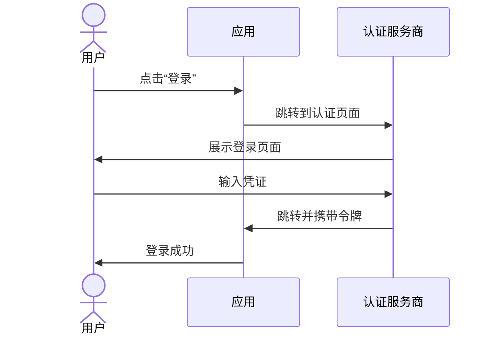
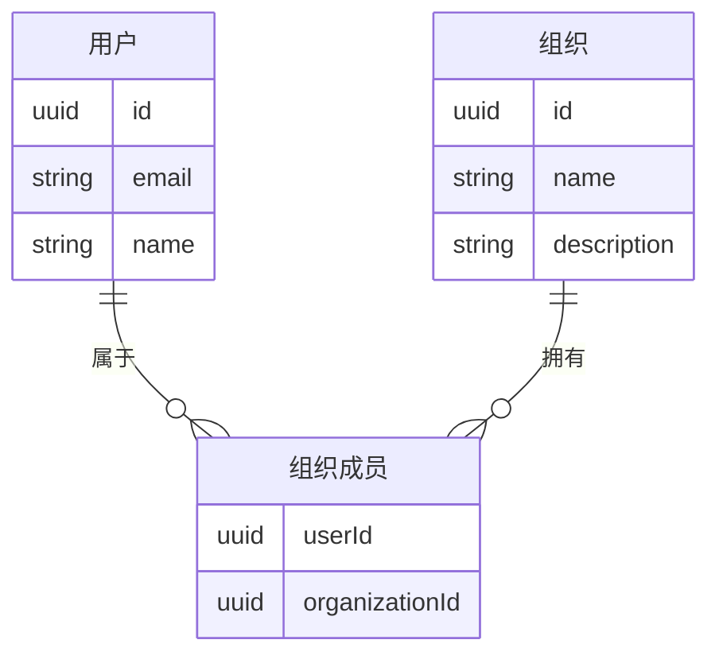
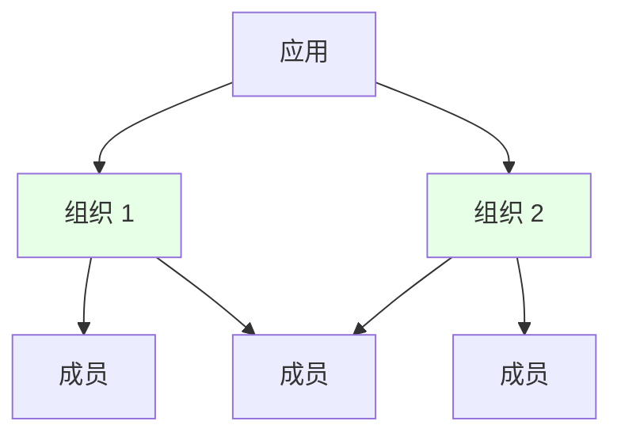
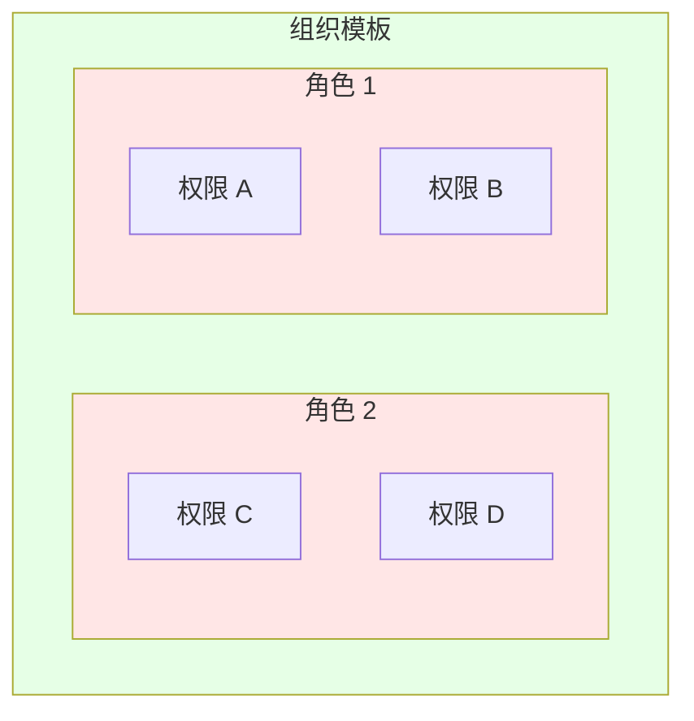
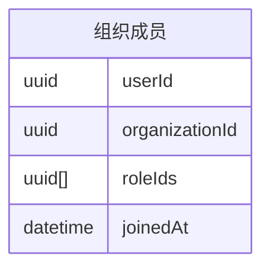
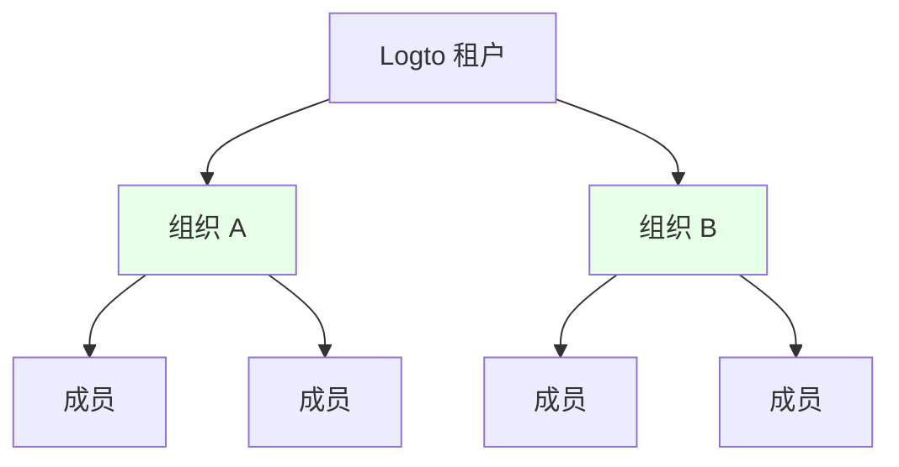
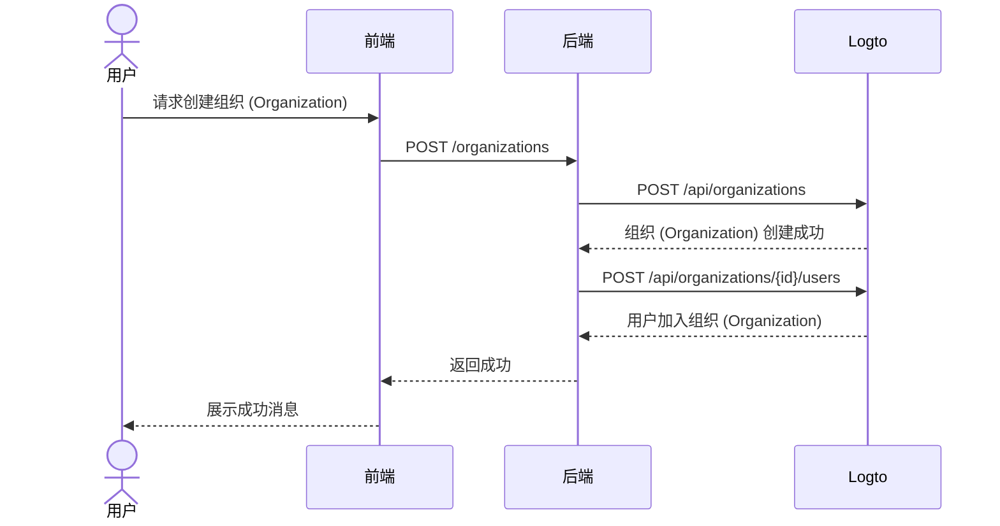

<head>
  <link rel="canonical" href="https://blog.logto.io/build-multi-tenant-saas-application" />
</head>

<style>
  {`
    .twoColumn {
      display: grid;
      grid-template-columns: 1fr 1fr;
      gap: 24px;
    }
    .twoColumn + .twoColumn {
      margin-top: 24px;
    }
  `}
</style>

# 构建多租户 SaaS 应用：从设计到实现的完整指南

像 Notion、Slack 或 Figma 这样的应用是如何构建的？这些多租户 SaaS 应用看起来很易用，但要自己动手做一个？那又是另一回事了。

当我第一次考虑要构建这样一个复杂的系统时，我的脑袋都炸了：

- 用户需要多种登录选项（邮箱、Google、GitHub）
- 每个用户可以创建并属于多个组织 (Organization)
- 每个组织 (Organization) 内有不同的权限 (Permission) 等级
- 企业组织 (Organization) 需要特定邮箱域名自动加入
- 敏感操作需要 MFA
- 还有更多……

“老板，两周后再聊产品设计吧，我现在完全卡住了。”

但当我真正开始动手时，**我发现其实并没有想象中那么难。**

我只用了很少的精力就**搭建了一个拥有所有这些功能的系统！**


<div className="twoColumn">
  
  
</div>

我会一步步展示如何从零设计并实现这样一个系统——你会惊讶于 2025 年用现代工具和正确架构方法其实有多简单。

> **完整源码已在这个 [Github 仓库](https://github.com/logto-io/multi-tenant-saas-sample) 开源。让我们开始吧！**

我们以一个 AI 文档 SaaS 产品 DocuMind 为例。

DocuMind 是一个采用多租户模型设计的 AI 文档 SaaS 产品，支持个人用户、小型企业和大型企业。

该平台为文档管理提供强大的 AI 能力，包括自动摘要生成、关键点提取和组织 (Organization) 内的智能内容推荐。

## SaaS 认证 (Authentication) 与授权 (Authorization) 需要哪些功能？\{#what-features-are-required-for-saas-authentication-and-authorization}

首先，让我们回顾一下必要的需求。你需要哪些功能？

### 多租户架构 \{#multi-tenant-architecture}

要实现多租户架构，你需要一个叫做**组织 (Organization)** 的实体层。想象一下，所有用户都在同一个池子里，可以访问多个工作区。每个组织 (Organization) 代表一个工作区，用户在访问不同工作区（组织 (Organization)）时只需保持一个身份，根据分配的角色 (Role) 访问不同内容。


这是认证 (Authentication) 服务商中广泛使用的特性。身份管理系统中的组织 (Organization) 对应你的 SaaS 应用的工作区、项目或租户。


### 成员关系 \{#membership}

成员是一个临时概念，用于表示某个身份在组织 (Organization) 内的成员状态。

比如，Sarah 用邮箱 **sarah@gmail.com** 注册了你的应用。她可以属于不同的工作区。如果 Sarah 属于 **Workspace A**，但不属于 **Workspace B**，那么她就是 **Workspace A** 的成员，而不是 **Workspace B** 的成员。

### 角色 (Role) 与权限 (Permission) 设计 \{#role-and-permission-design}

在多租户架构中，用户需要拥有特定**角色 (Role)** 和**权限 (Permission)** 才能访问其租户资源。
权限 (Permission) 是细粒度的访问控制，定义了具体操作，比如 `read: order` 或 `write: order`。它们决定了可以对特定资源执行哪些操作。

角色 (Role) 是在多租户环境下分配给成员的一组权限 (Permission)。

你需要定义这些角色 (Role) 和权限 (Permission)，然后将角色 (Role) 分配给用户，有时还包括自动化流程。例如：

1. 加入组织 (Organization) 的用户自动获得 **member** 角色 (Role)。
2. 第一个创建工作区的用户自动分配为 **admin** 角色 (Role)。

### 注册与登录流程 \{#sign-up-and-login-flow}

确保用户注册和认证 (Authentication) 流程既友好又安全，包括基础的登录和注册选项：

1. **邮箱密码登录**：传统的邮箱和密码登录方式。
2. **无密码登录**：通过邮箱验证码实现便捷安全的访问。
3. **账户管理**：用户可以在账户中心更新邮箱、密码等信息。
4. **社交登录**：如 Google、GitHub 等快捷登录方式。
5. **多因素认证 (MFA)**：通过如 Duo 等认证器应用提升安全性。

### 租户创建与邀请 \{#tenant-creation-and-invitation}

在多租户 SaaS 应用中，用户流程的一个关键区别是需要支持租户创建和成员邀请。这个流程需要精心设计和实现，因为它对产品激活和增长起着关键作用。

以下是你需要考虑的典型用户流程：

| 用户类型               | 入口方式                          |
| ---------------------- | --------------------------------- |
| 新账户                 | 从登录 / 注册页面进入，创建新租户 |
| 已有账户               | 在产品内创建另一个租户            |
| 已有账户收到新租户邀请 | 从登录 / 注册页面进入             |
| 已有账户收到新租户邀请 | 从邀请邮件进入                    |
| 新账户收到新租户邀请   | 从登录 / 注册页面进入             |
| 新账户收到新租户邀请   | 从邀请邮件进入                    |

这些是几乎每个 SaaS 应用都会遇到的常见场景。你可以参考这些流程，激发你的产品和设计团队灵感，也可以根据需要自定义自己的流程。

<div className="twoColumn">
  
  
</div>

<div className="twoColumn">
  
  
</div>

<div className="twoColumn">
  
  
</div>

## 技术架构与系统设计 \{#technical-architecture-and-system-design}

了解所有产品需求后，让我们进入实现阶段。

### 定义认证 (Authentication) 策略 \{#define-authentication-strategy}

认证 (Authentication) 看起来很吓人。用户需要：

- 邮箱 & 密码注册 / 登录
- 一键 Google / Github 登录
- 忘记密码时重置
- 企业客户团队统一登录
- ...

仅仅实现这些基础功能就可能需要几周开发时间。

但现在，**我们完全不需要自己造轮子！**

现代认证 (Authentication) 服务商（这次我选择 [Logto](https://logto.io/)）已经帮我们打包好了所有这些功能。认证 (Authentication) 流程非常简单：



**从几周开发到 15 分钟集成**，Logto 帮我们搞定了所有复杂流程！集成步骤我们会在后面实现部分详细介绍。现在可以专注于 DocuMind 的核心功能开发！

### 搭建多租户架构 \{#establish-multi-tenant-architecture}

组织 (Organization) 系统让用户可以创建和加入多个组织 (Organization)。让我们了解核心关系：



在这个系统中，每个用户可以属于多个组织 (Organization)，每个组织 (Organization) 也可以有多个成员。



### 在多租户应用中启用访问控制 \{#enable-access-control-in-multi-tenant-app}

基于角色的访问控制 (RBAC) 对于多租户 SaaS 应用的安全性和可扩展性至关重要。

在多租户应用中，权限 (Permission) 和角色 (Role) 的设计通常是统一的，因为它源自产品设计。例如，在多个工作区中，通常会有管理员和成员两种角色 (Role)。Logto 作为认证 (Authentication) 服务商，提供了如下组织 (Organization) 级别的基于角色的访问控制 (RBAC) 设计：

1. **统一权限 (Permission) 定义**：权限 (Permission) 在系统级别定义，并在所有组织 (Organization) 中保持一致，确保权限 (Permission) 管理的可维护性和一致性
2. **组织 (Organization) 模板**：通过组织 (Organization) 模板预设角色 (Role) 和权限 (Permission) 组合，简化组织 (Organization) 初始化

权限 (Permission) 关系如下所示：



由于每个用户在每个组织 (Organization) 内都需要自己的角色 (Role)，所以角色 (Role) 与组织 (Organization) 的关系必须反映每个用户被分配的角色 (Role)：



我们已经设计好了组织 (Organization) 系统和访问控制系统，现在可以开始构建产品啦！

## 技术栈 \{#tech-stack}

我选择了一个适合初学者、易于移植的技术栈：

1. **前端**：React（也很容易迁移到 Vue / Angular / Svelte）
2. **后端**：Express（简单直观的 API）

为什么要前后端分离？因为架构清晰，易学易切换技术栈。认证 (Authentication) 服务商以 Logto 为例。

对于后续指南，**这里的模式适用于：任何前端、任何后端、任何认证 (Authentication) 系统。**

## 为你的应用添加基础认证 (Authentication) 流程 \{#add-basic-authentication-flow-to-your-app}

这是最简单的一步。我们只需将 Logto 集成到项目中，然后可以在 Logto 控制台根据需求配置用户登录 / 注册方式。

### 安装 Logto 到你的应用 \{#install-logto-to-your-app}

首先，登录 [Logto Cloud](https://cloud.logto.io/)。如果没有账号可以免费注册。创建一个开发租户用于测试。

在租户控制台，点击左侧“应用”按钮，然后选择 React 开始构建我们的应用。

按照页面指引操作，5 分钟即可完成 Logto 集成！

以下是我的集成代码：

```jsx
const config: LogtoConfig = {
  endpoint: "<YOUR_LOGTO_ENDPOINT>",
  appId: "<YOUR_LOGTO_APP_ID>",
};

function App() {
  return (
    <LogtoProvider config={config}>
      <div className="min-h-screen bg-gradient-to-b from-gray-50 to-gray-100">
        <Routes>
          {/* 这个回调处理来自 Logto 的用户登录重定向 */}
          <Route path="/callback" element={<Callback />} />
          <Route path="/*" element={<AppContent />} />
        </Routes>
      </div>
    </LogtoProvider>
  );
}

function AppContent() {
  const { isAuthenticated } = useLogto();

  if (!isAuthenticated) {
    // 未认证 (Authentication) 用户显示落地页
    return <Landing />;
  }

  // 已认证 (Authentication) 用户显示主应用
  return (
    <Routes>
      {/* Dashboard 展示所有可用组织 (Organization) */}
      <Route path="/" element={<Dashboard />} />

      {/* 点击 Dashboard 中的组织 (Organization) 后进入组织页面 */}
      <Route path="/:orgId" element={<Organization />} />
    </Routes>
  );
}
```


这里有个小技巧：我们的登录页面同时有登录和注册按钮。注册按钮会直接跳转到 Logto 的注册页面。这是通过 Logto 的 [first screen](/end-user-flows/authentication-parameters/first-screen) 功能实现的。它决定了用户首次进入认证 (Authentication) 流程时看到哪一步。

如果你的产品预期有大量新用户，可以默认跳转到注册页面。

```jsx
function LandingPage() {
  const { signIn } = useLogto();

  return (
    <div className="landing-container">
      <div className="auth-buttons">
        <button
          className="sign-in-button"
          onClick={() => {
            signIn({
              redirectUri: '<YOUR_APP_CALLBACK_URL>',
            });
          }}
        >
          登录
        </button>

        <button
          className="register-button"
          onClick={() => {
            signIn({
              redirectUri: '<YOUR_APP_CALLBACK_URL>',
              firstScreen: 'register',
            });
          }}
        >
          注册
        </button>
      </div>
    </div>
  );
}
```

点击登录后会跳转到 Logto 登录页面。登录（或注册）成功后，恭喜！你的应用已经有第一个用户（你自己）了！

当你需要退出登录时，调用 `useLogto` hook 的 `signOut` 方法即可。

```jsx
function SignOutButton() {
  const { signOut } = useLogto();

  return <button onClick={() => signOut('<YOUR_POST_LOGOUT_REDIRECT_URL>')}>退出登录</button>;
}
```

### 自定义登录与注册方式 \{#customize-sign-in-and-sign-up-methods}

在 Logto 控制台，点击左侧菜单的“登录体验”，然后切换到“注册与登录”标签页。
在此页面根据指引配置 Logto 的登录 / 注册方式。


登录流程会长这样：


### 启用多因素认证 (MFA) \{#enable-multi-factor-authentication}

在 Logto 中启用 MFA 非常简单。只需在 Logto 控制台点击“多因素认证 (MFA)”按钮，然后在多因素认证 (MFA) 页面启用即可。


MFA 流程如下所示：

<div className="twoColumn">
  
  
</div>

一切都如此简单！我们只用几分钟就搭建好了复杂的用户认证 (Authentication) 系统！

## 增加多租户组织 (Organization) 体验 \{#adding-multi-tenant-organization-experience}

现在我们有了第一个用户！但这个用户还没有属于任何组织 (Organization)，我们也还没创建任何组织 (Organization)。

Logto 内置支持多租户。你可以在 Logto 中创建任意数量的组织 (Organization)。每个组织 (Organization) 可以有多个成员。



每个用户都可以从 Logto 获取自己的组织 (Organization) 信息。这就实现了多租户支持。

### 获取用户的组织 (Organization) 信息 \{#get-a-user-s-organization-information}

要从 Logto 获取用户的组织 (Organization) 信息，需要两步：

在 Logto Config 中声明组织 (Organization) 信息访问权限。这通过设置合适的 `scopes` 和 `resources` 实现。

```jsx
import { UserScope, ReservedResource } from "@logto/react";
const config: LogtoConfig = {
  endpoint: "<YOUR_LOGTO_ENDPOINT>",
  appId: "<YOUR_LOGTO_APP_ID>",
  scopes: [UserScope.Organizations], // 值为 "urn:logto:scope:organizations"
  resources: [ReservedResource.Organization], // 值为 "urn:logto:resource:organizations"
};

```

使用 Logto 的 `fetchUserInfo` 方法获取用户信息，包括组织 (Organization) 数据。

```jsx
function Dashboard() {
  // 获取用户信息
  const { fetchUserInfo } = useLogto();
  const [organizations, setOrganizations] = useState<OrganizationData[]>([]);
  const [loading, setLoading] = useState(false);

  useEffect(() => {
    const loadOrganizations = async () => {
      try {
        setLoading(true);
        // 获取用户信息
        const userInfo = await fetchUserInfo();
        // 获取用户的组织 (Organization) 信息
        const organizationData = userInfo?.organization_data || [];
        setOrganizations(organizationData);
      } catch (error) {
        console.error('Failed to fetch organizations:', error);
      } finally {
        setLoading(false);
      }
    };

    loadOrganizations();
  }, [fetchUserInfo]);

  if (loading) {
    return <div>加载中...</div>;
  }

  if (organizations.length === 0) {
    return <div>你还不是任何组织 (Organization) 的成员</div>;
  }

  return <div>组织 (Organization)：{organizations.map(org => org.name).join(', ')}</div>;
}

```

完成这些步骤后，需要重新登录。这是因为我们修改了请求的 scope 和 resource。

此时你还没有创建任何组织 (Organization)，用户也没有加入任何组织 (Organization)。Dashboard 会显示“你还没有任何组织 (Organization)”。


接下来，我们为用户创建一个组织 (Organization) 并将其加入。

多亏了 Logto，我们无需自己构建复杂的组织 (Organization) 关系。只需在 Logto 中创建组织 (Organization) 并添加用户即可。Logto 会帮我们处理所有复杂逻辑。创建组织 (Organization) 有两种方式：

1. 通过 Logto 控制台手动创建组织 (Organization)
2. 使用 Logto Management API 创建组织 (Organization)，尤其适合让用户在 SaaS 流程中自助创建组织 (Organization)（工作区）

### 在 Logto 控制台创建组织 (Organization) \{#create-organization-in-logto-console}

点击 Logto 控制台左侧的“组织 (Organizations)”菜单按钮，创建一个组织 (Organization)。

现在你有了第一个组织 (Organization)。


接下来，把用户添加到该组织 (Organization)。

进入组织 (Organization) 详情页，切换到成员标签页，点击“+ 添加成员”按钮。从左侧列表选择你的登录用户，点击右下角“添加成员”按钮。现在你已成功将用户添加到该组织 (Organization)。


刷新你的 APP 页面，你会看到用户现在已经属于一个组织 (Organization)！


## 实现自助式组织 (Organization) 创建体验 \{#implement-self-serve-organization-creation-experience}

在控制台创建组织 (Organization) 还不够。你的 SaaS 应用需要让终端用户可以自助创建和管理自己的工作区。要实现这个功能，使用 Logto Management API。

参考 [与 Management API 交互](/integrate-logto/interact-with-management-api) 文档设置与 Logto 的 API 通信。

### 理解组织 (Organization) 认证 (Authentication) 交互流程 \{#understand-organization-auth-interaction-flow}

以组织 (Organization) 创建流程为例。流程如下：



该流程有两个关键认证 (Authentication) 要求：

1. **保护后端服务 API**：
   - 前端访问后端服务 API 需要认证 (Authentication)
   - API 接口通过校验用户的 Logto 访问令牌 (Access token) 保护
   - 确保只有认证 (Authentication) 用户才能访问服务
2. **访问 Logto Management API**：
   - 后端服务需要安全地调用 Logto Management API
   - 参考 [与 Management API 交互](/integrate-logto/interact-with-management-api) 指南进行配置
   - 使用机器对机器 (Machine-to-Machine) 认证 (Authentication) 获取访问凭证

### 保护你的后端 API \{#protect-your-backend-api}

首先，在后端服务中创建一个用于创建组织 (Organization) 的 API 接口。

```jsx
app.post('/organizations', async (req, res) => {
  // 使用 Logto Management API 实现
  // ...
});
```

我们的后端服务 API 只允许认证 (Authentication) 用户访问。需要用 Logto 保护 API，并获取当前用户信息（如用户 ID）。

在 Logto（以及 OAuth 2.0）中，后端服务充当资源服务器。用户通过前端携带 Access token 访问 DocuMind 资源服务器，资源服务器校验该令牌，校验通过后返回资源。

我们需要创建一个 API 资源 (API resource) 来代表后端服务。

进入 Logto 控制台。

1. 点击右侧“API 资源 (API resources)”按钮。
2. 点击“创建 API 资源”，弹窗中选择 Express。
3. 填写 API 名称为“DocuMind API”，API 标识符用 “[https://api.documind.com](https://api.documind.com/)”。
4. 点击创建。

不用担心 API 标识符 URL，这只是 Logto 内部唯一标识你的 API，与实际后端服务 URL 无关。

你会看到一个 API 资源 (API resource) 使用教程，可以跟着教程或按照下方步骤操作。

我们创建一个 requireAuth 中间件来保护 POST /organizations 接口。

```jsx
const { createRemoteJWKSet, jwtVerify } = require('jose');

const getTokenFromHeader = (headers) => {
  const { authorization } = headers;
  const bearerTokenIdentifier = 'Bearer';

  if (!authorization) {
    throw new Error('Authorization header missing');
  }

  if (!authorization.startsWith(bearerTokenIdentifier)) {
    throw new Error('Authorization token type not supported');
  }

  return authorization.slice(bearerTokenIdentifier.length + 1);
};

const requireAuth = (resource) => {
  if (!resource) {
    throw new Error('Resource parameter is required for authentication');
  }

  return async (req, res, next) => {
    try {
      // 提取令牌
      const token = getTokenFromHeader(req.headers);

      const { payload } = await jwtVerify(
        token,
        createRemoteJWKSet(new URL(process.env.LOGTO_JWKS_URL)),
        {
          issuer: process.env.LOGTO_ISSUER,
          audience: resource,
        }
      );

      // 添加用户信息到请求
      req.user = {
        id: payload.sub,
      };

      next();
    } catch (error) {
      console.error('Auth error:', error);
      res.status(401).json({ error: 'Unauthorized' });
    }
  };
};

module.exports = {
  requireAuth,
};
```

使用该中间件需要如下环境变量：

- LOGTO_JWKS_URL
- LOGTO_ISSUER

在你的 Logto 租户 OpenID 配置端点获取这些变量。访问 `https://<your-tenant-id>.logto.app/oidc/.well-known/openid-configuration`，返回的 JSON 中包含所需信息：

```json
{
  "jwks_uri": "<https://tenant-id.logto.app/oidc/jwks>",
  "issuer": "<https://tenant-id.logto.app/oidc>"
}
```

现在在 POST /organizations 接口中使用 requireAuth 中间件。

```jsx
app.post('/organizations', requireAuth('<https://api.documind.com>'), async (req, res) => {
  // 处理组织 (Organization) 创建逻辑
  // ...
});
```

这样就保护了 POST /organizations 接口，只有携带有效 Logto 访问令牌 (Access token) 的用户才能访问。

我们现在可以在前端从 Logto 获取令牌，用户通过该令牌访问后端服务 API 创建组织 (Organization)。中间件也会给我们用户 ID，便于添加用户到组织 (Organization)。

在前端代码中，在 Logto config 的 resources 数组中声明该 API 资源 (API resource) 标识符。

```jsx
const config: LogtoConfig = {
  endpoint: "<YOUR_LOGTO_ENDPOINT>",
  appId: "<YOUR_LOGTO_APP_ID>",
  scopes: [UserScope.Organizations],
  resources: [ReservedResource.Organization, "<https://api.documind.com>"], // 新创建的 API 资源 (API resource) 标识符
};

```

如前所述，更新 Logto config 后用户需重新登录。

在 Dashboard 中，创建组织 (Organization) 时获取 Logto 访问令牌 (Access token)，用该令牌访问后端服务 API。

```jsx
// 获取 "DocuMind API" 的访问令牌 (Access token)
const token = await getAccessToken('<https://api.documind.com>');

// 用令牌访问后端服务 API
const response = await fetch('<http://localhost:3000/organizations>', {
  method: 'POST',
  headers: {
    'Content-Type': 'application/json',
    Authorization: `Bearer ${token}`,
  },
  body: JSON.stringify({
    name: 'Organization A',
    description: 'Organization A description',
  }),
});
```

现在我们可以正常访问 DocuMind 后端服务 API 了。

### 调用 Logto Management API \{#calling-logto-management-api}

让我们用 Logto Management API 实现组织 (Organization) 创建。

和前端请求后端服务一样，后端服务请求 Logto 也需要 Access token。

在 Logto 中，我们用机器对机器 (Machine-to-Machine) 认证 (Authentication) 获取 Access token。参考 [与 Management API 交互](/integrate-logto/interact-with-management-api)。

进入 Logto 控制台的应用页面，创建一个机器对机器 (Machine-to-Machine) 应用，分配“Logto Management API 访问”角色。复制 Token endpoint、App ID 和 App Secret，后续获取 Access token 用。


现在我们可以通过该 M2M 应用获取 Logto Management API 的 Access token。

```jsx
async function fetchLogtoManagementApiAccessToken() {
  const response = await fetch(process.env.LOGTO_MANAGEMENT_API_TOKEN_ENDPOINT, {
    method: 'POST',
    headers: {
      'Content-Type': 'application/x-www-form-urlencoded',
      Authorization: `Basic ${Buffer.from(
        `${process.env.LOGTO_MANAGEMENT_API_APPLICATION_ID}:${process.env.LOGTO_MANAGEMENT_API_APPLICATION_SECRET}`
      ).toString('base64')}`,
    },
    body: new URLSearchParams({
      grant_type: 'client_credentials',
      resource: process.env.LOGTO_MANAGEMENT_API_RESOURCE,
      scope: 'all',
    }).toString(),
  });
  const data = await response.json();
  return data.access_token;
}
```

用该 Access token 调用 Logto Management API。

我们会用到这些 Management API：

- `POST /api/organizations`：创建组织 (Organization)（参考：[Create organization API reference](https://openapi.logto.io/operation/operation-createorganization)）
- `POST /api/organizations/{id}/users`：添加用户到组织 (Organization)（参考：[Add users to organization API reference](https://openapi.logto.io/operation/operation-addusers)）

```jsx
app.post('/organizations', requireAuth('<https://api.documind.com>'), async (req, res) => {
  const accessToken = await fetchLogtoManagementApiAccessToken();
  // 在 Logto 创建组织 (Organization) 并添加用户
  const response = await fetch(`${process.env.LOGTO_ENDPOINT}/api/organizations`, {
    method: 'POST',
    headers: {
      'Content-Type': 'application/json',
      Authorization: `Bearer ${accessToken}`,
    },
    body: JSON.stringify({
      name: req.body.name,
      description: req.body.description,
    }),
  });

  const createdOrganization = await response.json();

  await fetch(`${process.env.LOGTO_ENDPOINT}/api/organizations/${createdOrganization.id}/users`, {
    method: 'POST',
    headers: {
      'Content-Type': 'application/json',
      Authorization: `Bearer ${accessToken}`,
    },
    body: JSON.stringify({
      userIds: [req.user.id],
    }),
  });

  res.json({ data: createdOrganization });
});
```

现在我们已经通过 Logto Management API 实现了组织 (Organization) 创建和用户加入。

让我们在 Dashboard 测试这个功能。


点击“创建组织 (Organization)”


创建成功！

下一步是邀请用户加入组织 (Organization)。本教程暂不实现该功能。你已经学会如何使用 Management API。可以参考 [**租户创建与邀请**](#tenant-creation-and-invitation) 作为产品设计参考，并通过这篇博客轻松实现：[How we implement user collaboration within a multi-tenant app](https://blog.logto.io/implement-user-collaboration-in-your-app)。

## 为多租户应用实现访问控制 \{#implement-access-control-to-your-multi-tenant-app}

现在让我们进入组织 (Organization) 访问控制。

我们希望实现：

- 用户只能访问属于自己组织 (Organization) 的资源：可通过 Logto 的 `组织令牌 (Organization token)` 实现
- 用户在组织 (Organization) 内有特定角色 (Role)（包含不同权限 (Permission)），以执行授权操作：可通过 Logto 的组织 (Organization) 模板功能实现

下面看看如何实现这些功能。

### 使用 Logto 组织令牌 (Organization token) \{#using-logto-organization-token}

类似前面提到的 Logto 访问令牌 (Access token)，Logto 会针对特定资源颁发访问令牌 (Access token)，用户用该令牌访问后端服务受保护资源。对应地，Logto 会针对特定组织 (Organization) 颁发组织令牌 (Organization token)，用户用该令牌访问后端服务受保护的组织 (Organization) 资源。

在前端应用中，可以用 Logto 的 `getOrganizationToken` 方法获取访问特定组织 (Organization) 的令牌。

```jsx
const { getOrganizationToken } = useLogto();
const organizationToken = await getOrganizationToken(organizationId);
```

这里的 `organizationId` 是用户所属组织 (Organization) 的 id。

在使用 `getOrganization` 或任何组织 (Organization) 功能前，需要确保 Logto config 中包含 `urn:logto:scope:organizations` scope 和 `urn:logto:resource:organization` resource。我们前面已经声明过，这里不再赘述。

在组织 (Organization) 页面，我们用组织令牌 (Organization token) 获取组织 (Organization) 内的文档。

```jsx
function OrganizationPage() {
  const { organizationId } = useParams();
  const navigate = useNavigate();
  const { signOut, getOrganizationToken } = useLogto();
  const [error, setError] = useState<Error | null>(null);
  const [documents, setDocuments] = useState([]);

  const fetchDocuments = useCallback(async () => {
    if (!organizationId) return;

    try {
      const organizationToken = await getOrganizationToken(organizationId);
      const response = await fetch(`http://localhost:3000/documents`, {
          headers: {
          'Content-Type': 'application/json',
          Authorization: `Bearer ${organizationToken}`,
        },
      });
      const documents = await response.json();
      setDocuments(documents);
    } catch (error: unknown) {
      if (error instanceof Error) {
        setError(error);
      } else {
        setError(new Error(String(error)));
      }
    }
  },[getOrganizationToken, organizationId]);

  useEffect(() => {
    void fetchDocuments();
  }, [fetchDocuments]);

  if (error) {
    return <div>错误：{error.message}</div>;
  }

  return <div>
    <h1>组织 (Organization) 文档</h1>
    <ul>
      {documents.map((document) => (
        <li key={document.id}>{document.name}</li>
      ))}
    </ul>
  </div>
}

```

这里有两个关键点：

1. 如果传给 `getOrganizationToken` 的 `organizationId` 不是当前用户所属组织 (Organization) 的 id，则无法获取令牌，从而保证用户只能访问自己的组织 (Organization)。
2. 请求组织 (Organization) 资源时用的是组织令牌 (Organization token) 而不是访问令牌 (Access token)，因为对于组织 (Organization) 资源，我们希望用组织 (Organization) 权限 (Permission) 控制而不是用户权限 (Permission) 控制（后面实现 `GET /documents` API 时你会更明白）。

接下来我们在后端服务创建 `GET /documents` API。类似用 API 资源 (API resource) 保护 `POST /organizations`，我们用组织 (Organization) 专属资源指示器保护 `GET /documents`。

首先创建 `requireOrganizationAccess` 中间件保护组织 (Organization) 资源。

```jsx
const getTokenFromHeader = (headers) => {
  const { authorization } = headers;
  const bearerTokenIdentifier = 'Bearer';

  if (!authorization) {
    throw new Error('Authorization header missing');
  }

  if (!authorization.startsWith(bearerTokenIdentifier)) {
    throw new Error('Authorization token type not supported');
  }

  return authorization.slice(bearerTokenIdentifier.length + 1);
};

const extractOrganizationId = (aud) => {
  if (!aud || typeof aud !== 'string' || !aud.startsWith('urn:logto:organization:')) {
    throw new Error('Invalid organization token');
  }
  return aud.replace('urn:logto:organization:', '');
};

const decodeJwtPayload = (token) => {
  try {
    const [, payloadBase64] = token.split('.');
    if (!payloadBase64) {
      throw new Error('Invalid token format');
    }
    const payloadJson = Buffer.from(payloadBase64, 'base64').toString('utf-8');
    return JSON.parse(payloadJson);
  } catch (error) {
    throw new Error('Failed to decode token payload');
  }
};

const requireOrganizationAccess = () => {
  return async (req, res, next) => {
    try {
      // 提取令牌
      const token = getTokenFromHeader(req.headers);

      // 动态获取 token 中的 audience
      const { aud } = decodeJwtPayload(token);
      if (!aud) {
        throw new Error('Missing audience in token');
      }

      // 校验令牌
      const { payload } = await jwtVerify(
        token,
        createRemoteJWKSet(new URL(process.env.LOGTO_JWKS_URL)),
        {
          issuer: process.env.LOGTO_ISSUER,
          audience: aud,
        }
      );

      // 从 audience claim 提取组织 (Organization) ID
      const organizationId = extractOrganizationId(payload.aud);

      // 添加组织 (Organization) 信息到请求
      req.user = {
        id: payload.sub,
        organizationId,
      };

      next();
    } catch (error) {
      console.error('Organization auth error:', error);
      res.status(401).json({ error: 'Unauthorized - Invalid organization access' });
    }
  };
};
```

然后用 `requireOrganizationAccess` 中间件保护 `GET /documents` API。

```jsx
app.get('/documents', requireOrganizationAccess(), async (req, res) => {
  // 你可以通过 req.user 获取当前用户 id 和 organizationId
  console.log('userId', req.user.id);
  console.log('organizationId', req.user.organizationId);

  // 根据 organizationId 从数据库获取文档
  // ....
  const documents = await getDocumentsByOrganizationId(req.user.organizationId);

  res.json(documents);
});
```

这样就实现了用组织令牌 (Organization token) 访问组织 (Organization) 资源。在后端服务中，你可以根据组织 (Organization) id 从数据库获取对应资源。

有些软件要求组织 (Organization) 之间数据隔离。更多讨论和实现可参考：[Multi-tenancy implementation with PostgreSQL: Learn through a simple real-world example](https://blog.logto.io/implement-multi-tenancy)。

### 实现组织 (Organization) 级别基于角色的访问控制 (RBAC) 设计 \{#implement-organization-level-role-based-access-control-design}

我们已经实现了用组织令牌 (Organization token) 访问组织 (Organization) 资源。接下来用 RBAC 实现组织 (Organization) 内用户权限 (Permission) 控制。

假设 DocuMind 有两个角色 (Role)：Admin 和 Collaborator。

Admin 可以创建和访问文档，Collaborator 只能访问文档。

因此我们的组织 (Organization) 需要有这两个角色 (Role)：Admin 和 Collaborator。

Admin 拥有 `read:documents` 和 `create:documents` 权限 (Permission)，Collaborator 只有 `read:documents` 权限 (Permission)。

- Admin
  - `read:documents`
  - `create:documents`
- Collaborator
  - `read:documents`

这时就用到了 Logto 的组织 (Organization) 模板功能。

组织 (Organization) 模板是每个组织 (Organization) 访问控制模型的蓝图：它定义了适用于所有组织 (Organization) 的角色 (Role) 和权限 (Permission)。

> 为什么要用组织 (Organization) 模板？
>
> 因为可扩展性是 SaaS 产品最重要的需求之一。换句话说，对一个客户有效的模型应该对所有客户都有效。

进入 Logto 控制台 > 组织 (Organization) 模板 > 组织 (Organization) 权限 (Permission)，创建两个权限 (Permission)：`read:documents` 和 `create:documents`。


然后进入组织 (Organization) 角色 (Role) 标签页，创建两个用户角色 (Role)：Admin 和 Collaborator，并为其分配相应权限 (Permission)。


这样我们就为每个组织 (Organization) 创建了 RBAC 权限 (Permission) 模型。

接下来进入组织 (Organization) 详情页，为成员分配合适的角色 (Role)。


现在我们的组织 (Organization) 用户有了角色 (Role)！
你也可以通过 Logto Management API 实现这些步骤：

```jsx
// 给组织 (Organization) 创建者分配 'Admin' 角色 (Role)
app.post('/organizations', requireAuth('https://api.documind.com'), async (req, res) => {
  const accessToken = await fetchLogtoManagementApiAccessToken();
  // 在 Logto 创建组织 (Organization)
  // 省略已有代码...

  // 在 Logto 添加用户到组织 (Organization)
  await fetch(`${process.env.LOGTO_ENDPOINT}/api/organizations/${createdOrganization.id}/users`, {
    method: 'POST',
    headers: {
      'Content-Type': 'application/json',
      Authorization: `Bearer ${accessToken}`,
    },
    body: JSON.stringify({
      userIds: [req.user.id],
    }),
  });

  // 给第一个用户分配 `Admin` 角色 (Role)
  const rolesResponse = await fetch(`${process.env.LOGTO_ENDPOINT}/api/organization-roles`, {
    method: 'GET',
    headers: {
      'Content-Type': 'application/json',
      Authorization: `Bearer ${accessToken}`,
    },
  });

  const roles = await rolesResponse.json();

  // 找到 `Admin` 角色 (Role)
  const adminRole = roles.find((role) => role.name === 'Admin');

  // 给第一个用户分配 `Admin` 角色 (Role)
  await fetch(
    `${process.env.LOGTO_ENDPOINT}/api/organizations/${createdOrganization.id}/users/${req.user.id}/roles`,
    {
      method: 'POST',
      headers: {
        'Content-Type': 'application/json',
        Authorization: `Bearer ${accessToken}`,
      },
      body: JSON.stringify({
        organizationRoleIds: [adminRole.id],
      }),
    }
  );

  // 省略已有代码...
});
```

现在我们可以通过校验用户权限 (Permission) 实现用户权限 (Permission) 控制。

在代码中，需要让用户的组织令牌 (Organization token) 携带权限 (Permission) 信息，并在后端校验这些权限 (Permission)。

在前端代码的 Logto config 中，需要声明用户在组织 (Organization) 内需要请求的权限 (Permission)。我们把 `read:documents` 和 `create:documents` 权限 (Permission) 加到 `scopes`。

```jsx
const config: LogtoConfig = {
  endpoint: "<YOUR_LOGTO_ENDPOINT>",
  appId: "<YOUR_LOGTO_APP_ID>",
  scopes: [UserScope.Organizations, "read:documents", "create:documents"],
  resources: [ReservedResource.Organization, "<https://api.documind.com>"], // 新创建的 API 资源 (API resource) 标识符
};

```

和往常一样，用户需要重新登录以使配置生效。

然后在后端的 `requireOrganizationAccess` 中间件中，增加用户权限 (Permission) 校验。

```jsx
const hasRequiredScopes = (tokenScopes, requiredScopes) => {
  if (!requiredScopes || requiredScopes.length === 0) {
    return true;
  }
  const scopeSet = new Set(tokenScopes);
  return requiredScopes.every((scope) => scopeSet.has(scope));
};

const requireOrganizationAccess = ({ requiredScopes = [] } = {}) => {
  return async (req, res, next) => {
    try {
      //...

      // 校验令牌
      const { payload } = await jwtVerify(
        token,
        createRemoteJWKSet(new URL(process.env.LOGTO_JWKS_URL)),
        {
          issuer: process.env.LOGTO_ISSUER,
          audience: aud,
        }
      );

      //...

      // 从 token 获取 scopes
      const scopes = payload.scope?.split(' ') || [];

      // 校验所需 scopes
      if (!hasRequiredScopes(scopes, requiredScopes)) {
        throw new Error('Insufficient permissions');
      }

      //...

      next();
    } catch (error) {
      //...
    }
  };
};
```

然后创建 POST /documents API，并用 `requireOrganizationAccess` 中间件和 requiredScopes 配置保护该 API 及前面的 `GET /documents` API。

```jsx
// 创建文档的 API
app.post(
  '/documents',
  requireOrganizationAccess({ requiredScopes: ['create:documents'] }),
  async (req, res) => {
    //...
  }
);

// 获取文档的 API
app.get(
  '/documents',
  requireOrganizationAccess({ requiredScopes: ['read:documents'] }),
  async (req, res) => {
    //...
  }
);
```

这样我们就通过校验用户权限 (Permission) 实现了用户权限 (Permission) 控制。

在前端，可以通过解码组织令牌 (Organization token) 或调用 Logto 的 `getOrganizationTokenClaims` 方法获取用户权限 (Permission) 信息。

```jsx
const [scopes, setScopes] = useState([]);
const { getOrganizationTokenClaims } = useLogto();

const loadScopes = async () => {
  const claims = await getOrganizationTokenClaims(organizationId);
  setScopes(claims.scope.split(' '));
};

// ...
```

根据 claims 中的 scopes 控制页面元素的显示。

## 增加更多多租户应用特性 \{#add-more-multi-tenant-app-features}

到目前为止，我们已经实现了多租户 SaaS 系统的基础用户和组织 (Organization) 功能！但还有一些特性没有涉及，比如为每个组织 (Organization) 定制登录页品牌、自动将特定域名邮箱用户加入指定组织 (Organization)、集成企业级 SSO 等。

这些都是开箱即用的功能，你可以在 Logto 文档中了解更多：

- [企业单点登录 (SSO) 集成](/end-user-flows/enterprise-sso)
- [即时 (JIT) 供应](/organizations/just-in-time-provisioning)
- [组织 (Organization) 级别品牌定制](/customization/match-your-brand#organization-specific-branding)
- [组织 (Organization) 级别多因素认证 (MFA)](/organizations/organization-management#require-mfa-for-organization-members)
- [组织 (Organization) 级别管理](/end-user-flows/organization-experience/organization-management)

## 总结 \{#summary}

还记得一开始的压力吗？用户、组织 (Organization)、权限 (Permission)、企业特性……仿佛一座无尽高山。

但看看我们已经完成了什么：

- 一个支持多种登录方式和 MFA 的完整认证 (Authentication) 系统
- 一个支持多重成员关系的灵活组织 (Organization) 系统
- 组织 (Organization) 内基于角色的访问控制 (RBAC)

最棒的是？我们没有重复造轮子。借助 Logto 这样的现代工具，把原本需要几个月开发的内容变成了几分钟集成。

本教程完整源码见：[Multi-tenant SaaS Sample](https://github.com/logto-io/multi-tenant-saas-sample)。

这就是 2025 年现代开发的力量——我们可以专注于打造独特的产品功能，而不是与基础设施死磕。现在轮到你去创造属于你的精彩了！

探索 Logto 的全部功能，从 Logto Cloud 到 Logto OSS，访问 [Logto 官网](https://logto.io/) 或立即注册 [Logto cloud](https://cloud.logto.io/?sign_up)。
