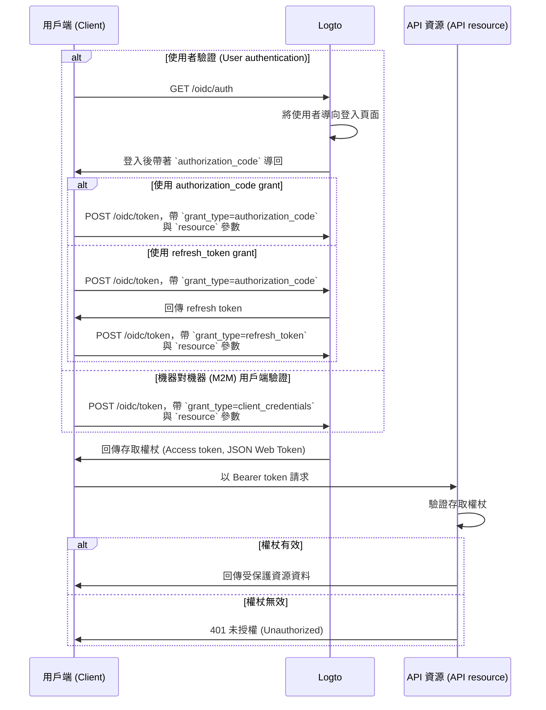

import TabItem from '@theme/TabItem';
import Tabs from '@theme/Tabs';

import illustration from '@site/docs/authorization/assets/rbac-global-api-resources.png';
import AuthorizationRequestExample from '@site/docs/authorization/fragments/AuthorizationRequestExample';
import ClientCredentialsRequestExample from '@site/docs/authorization/fragments/ClientCredentialsRequestExample';
import TokenRequestExample from '@site/docs/authorization/fragments/TokenRequestExample';

保護全域 API 資源 (API resources)

export const resource = 'https://api.your-app.com';

在 Logto 中使用角色型存取控制 (RBAC, Role-based Access Control) 來保護產品層級的 API。指派全域角色 (Roles) 與權限 (Permissions)，以控管所有使用者與用戶端在你的應用程式中的存取權限。

## 什麼是全域 API 資源 (API resources)? \{#what-are-global-api-resources}

全域 API 資源是指在你的應用程式中，所有使用者皆可存取的端點或服務，無論其所屬組織或租戶。這些通常是對外公開的 API、核心產品服務，或任何未限定於特定組織的端點。

**常見使用情境包括**

- 供所有使用者共享的公開 API 或端點。
- 不屬於多租戶架構的微服務。
- 所有客戶都會使用的核心應用程式 API（如 `/api/users`、`/api/products`）。

Logto 允許你結合 OAuth 2.1 與彈性的角色型存取控制來保護這些 API。

## 在 Logto 中的運作方式 \{#how-it-works-in-logto}

- **API 資源 (API resources) 與權限 (Permissions) 為全域註冊：** 每個你想保護的 API 都需以唯一的資源標示符 (Resource indicator, URI) 註冊，並設定一組控制存取的權限範圍 (Scopes)。
- **存取權由全域角色 (Roles) 控制：** 你可以將權限指派給角色，再將角色指派給使用者或用戶端。
- **與組織層級權限分離：** 全域 API 資源不具組織上下文。但如有需要，可與組織角色 (Organization roles) 搭配使用，提供額外的上下文。若要保護組織層級 API，請參閱 [保護組織層級 API 資源](/authorization/organization-level-api-resources)。

### 實作概覽 \{#implementation-overview}

1. **註冊你的 API 資源 (API resource)**，並在 Logto 中定義其權限。
2. **定義角色 (Roles)**，並賦予存取 API 所需的權限。
3. **指派角色 (Roles)** 給使用者或用戶端。
4. **使用 OAuth 2.0 授權流程** 取得 API 的存取權杖 (Access token)（resource 參數必須與註冊的 API 標識符一致）。
5. **在你的 API 中驗證存取權杖**，以強制執行權限。

### 認識資源標示符 (Resource indicators) \{#understanding-resource-indicators}

Logto 依據 [RFC 8707: Resource Indicators for OAuth 2.0](https://www.rfc-editor.org/rfc/rfc8707.html) 建模 API 資源。**資源標示符 (Resource indicator)** 是唯一識別目標 API 或服務的 URI。

**重點說明**

- 資源標示符必須是絕對 URI（如 `https://api.example.com`）
- 不可包含 fragment 元件；盡量避免使用查詢字串。
- 資源標示符可實現受眾限制權杖 (Audience-restricted tokens) 與多 API 架構支援。

**範例**

- Management API：`https://my-tenant.logto.app/api`
- 自訂全域 API：`https://api.yourapp.com`

### 授權流程：驗證 (Authentication) 並保護你的 API \{#authorization-flow-authenticating-and-securing-your-api}

下列流程適用於互動式使用者驗證（瀏覽器 / 應用程式）與後端機器對機器 (M2M) 情境。

請注意，流程未詳列所有必要參數或標頭，僅聚焦於主要步驟。繼續閱讀可了解實際運作方式。

_使用者驗證 = 瀏覽器 / 應用程式。M2M = 使用 client credentials 的後端服務或腳本。_

:::note
`resource` 參數必須與你在 Logto 註冊的 API 標識符（資源標示符）完全一致。
:::

## 實作步驟 \{#implementation-steps}

### 註冊你的 API 資源 (API resources) \{#register-your-api-resources}

1. 前往 <CloudLink to="/api-resources">Console → API resources</CloudLink>。
2. 建立新的 API 資源（如 `https://api.yourapp.com/org`），並定義其權限（scopes）。

完整設定步驟請參閱 [定義帶權限的 API 資源](/authorization/role-based-access-control#define-api-resources-with-permissions)。

### 設定全域角色 (Roles) \{#set-up-global-roles}

1. 前往 <CloudLink to="/roles">Console → Roles</CloudLink>。
2. 建立對應 API 權限的角色（如 `read:products`、`write:products`）。
3. 將這些角色指派給需要存取 API 的使用者或用戶端。

完整設定步驟請參閱 [使用全域角色](/authorization/role-based-access-control#configure-global-roles)。

### 取得全域 API 資源的存取權杖 (Access tokens) \{#obtain-access-tokens-for-global-api-resources}

在存取全域 API 資源前，你的用戶端必須先取得存取權杖。Logto 會針對全域 API 資源簽發 [JSON Web Token (JWT)](https://auth.wiki/jwt) 作為存取權杖。這通常透過 [OAuth 2.0 授權碼流程](https://auth.wiki/authorization-code-flow)、[重新整理權杖流程 (refresh token flow)](https://auth.wiki/refresh-token) 或 [client credentials 流程](https://auth.wiki/client-credentials-flow) 完成。

#### 授權碼或重新整理權杖流程 \{#authorization-code-or-refresh-token-flow}

所有 Logto 官方 SDK 均原生支援使用重新整理權杖流程取得全域 API 資源的存取權杖。你也可使用標準 OAuth 2.0 / OIDC 用戶端函式庫實作此流程。

<Tabs groupId="user-client">
<TabItem value="logto-sdk" label="Logto SDK">

初始化 Logto client 時，將資源標示符加入 `resources` 參數（陣列），再將所需權限（scopes）加入 `scopes` 參數。

使用者驗證後，請在請求存取權杖時（如呼叫 `getAccessToken()`）傳入資源標示符於 `resource` 參數或同名參數。

各 SDK 詳細用法請參閱 [快速入門](/quick-starts)。

</TabItem>
<TabItem value="oauth-client" label="OAuth 2.0 / OIDC client library">

設定 OAuth 2.0 用戶端或初始化授權碼流程時，請確保在授權請求中包含 `resource` 參數與所需 scopes。

部分函式庫可能未原生支援 `resource` 參數，但通常允許你在授權請求中傳遞額外參數。請查閱你的函式庫文件。

以下為帶有 `resource` 與 `scope` 參數的授權請求非正式範例：

<AuthorizationRequestExample resource={resource} scope="read:products write:products" />

使用者驗證後，你會收到授權碼。請將此授權碼透過 POST 請求交換存取權杖，請求 Logto 的 `/oidc/token` 端點，並在請求主體中包含 `resource` 參數。

以下為使用授權碼 grant type 的權杖請求非正式範例：

<TokenRequestExample grantType="authorization_code" resource={resource} />

你也可以使用 `refresh_token` grant type，在請求中包含 `resource` 參數，即可無需使用者互動取得新存取權杖。

以下為使用重新整理權杖 grant type 的權杖請求非正式範例：

<TokenRequestExample grantType="refresh_token" resource={resource} />

</TabItem>
</Tabs>

#### Client credentials 流程 \{#client-credentials-flow}

針對機器對機器 (M2M) 情境，你可以使用 client credentials 流程取得全域 API 資源的存取權杖。只需對 Logto 的 `/oidc/token` 端點發送 POST 請求，並使用你的 client ID 與 secret。

請在請求中包含兩個關鍵參數：

- `resource`：你要存取的 API 資源標示符 URI（如 `https://api.yourapp.com`）。
- `scope`：你要請求的 API 權限（如 `read:products write:products`）。

以下為使用 client credentials grant type 的權杖請求非正式範例：

<ClientCredentialsRequestExample
  resource="https://api.yourapp.com"
  scope="read:products write:products"
/>

### 在你的 API 中驗證 JWT 存取權杖 \{#validating-jwt-access-tokens-in-your-api}

Logto 簽發的 JWT 內含宣告 (Claims)，你的 API 可據此執行授權 (Authorization)。

當你的 API 收到帶有 Logto 簽發存取權杖的請求時，應：

- 驗證權杖簽章（使用 Logto 的 JWKs）。
- 確認權杖未過期（`exp` 宣告）。
- 檢查 `iss`（簽發者）是否符合你的 Logto 端點。
- 確認 `aud`（受眾）是否符合你註冊的 API 資源標示符（如 `https://api.yourapp.com`）。
- 拆解 `scope` 宣告（以空格分隔），檢查是否具備所需權限。

各語言詳細教學請參閱 [如何驗證存取權杖](/authorization/validate-access-tokens)。

### 選用：處理使用者權限變更 \{#optional-handle-user-permission-change}

:::info
👷 功能開發中 🚧
:::

## 最佳實踐與安全建議 \{#best-practices-and-security-tips}

- **權限設計以業務為導向：** 使用能對應實際操作的清楚名稱。
- **縮短權杖有效期：** 若權杖外洩可降低風險。
- **限制授予的權限範圍 (Scopes)：** 僅給予權杖實際所需權限。
- **使用受眾限制：** 一定要驗證 `aud` 宣告，避免權杖被濫用。

## 常見問題 \{#faqs}

### 如果我的用戶端不支援 resource 參數怎麼辦？ \{#what-if-my-client-doesn-t-support-the-resource-parameter}

請在 Logto Console 設定預設 API 資源。當權杖請求未指定 resource 參數時，權杖將預設指向此受眾 (Audience)。

### 為什麼我的 API 回傳 401 Unauthorized？ \{#why-do-i-get-401-unauthorized-from-my-api}

請檢查以下常見問題：

- **權杖簽章：** 確認你的後端有正確取得 Logto 的 JWKs
- **權杖過期：** 確認權杖未過期（`exp` 宣告）
- **受眾 (Audience)：** 確認 `aud` 宣告與你註冊的 API 資源標示符一致
- **所需權限範圍 (Scopes)：** 確認權杖的 `scope` 宣告包含必要權限

### 沒有完整用戶端要怎麼測試？ \{#how-do-i-test-without-a-full-client}

可使用 [個人存取權杖 (Personal access token)](/user-management/personal-access-token) 模擬驗證呼叫。這讓你能在未實作完整 OAuth 流程的情況下測試 API 端點。

## 延伸閱讀 \{#further-reading}

<Url href="/authorization/validate-access-tokens">如何驗證存取權杖 (Access tokens)</Url>
<Url href="/use-cases/authorization/rbac-in-practice">
  RBAC 實務：為你的應用程式實作安全授權 (Authorization)
</Url>
<Url href="/developers/custom-token-claims">自訂權杖宣告 (Token claims)</Url>
<Url href="https://www.rfc-editor.org/rfc/rfc8707.html">RFC 8707：資源標示符 (Resource Indicators)</Url>
