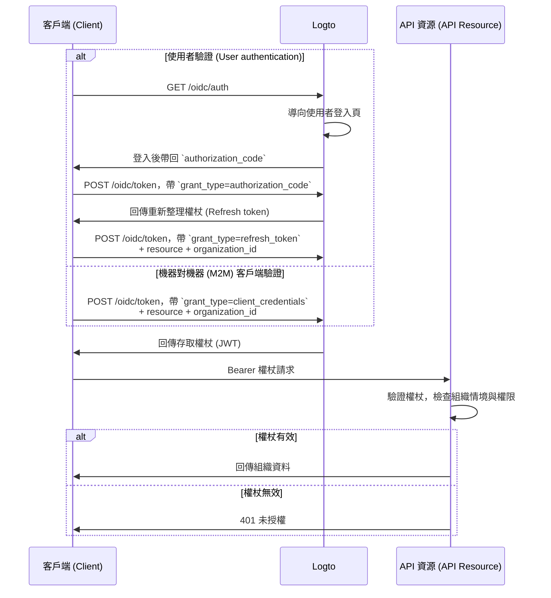

import illustration from '@site/docs/authorization/assets/rbac-organization-level-api-resources.png';
import AuthorizationRequestExample from '@site/docs/authorization/fragments/AuthorizationRequestExample';
import ClientCredentialsRequestExample from '@site/docs/authorization/fragments/ClientCredentialsRequestExample';
import TokenRequestExample from '@site/docs/authorization/fragments/TokenRequestExample';
import TabItem from '@theme/TabItem';
import Tabs from '@theme/Tabs';

import InspectOrganizationClaim from './fragments/_inspect-organization-claim.md';
import OrganizationTokenWarning from './fragments/_organization-token-warning.md';

# 保護組織層級 API 資源 (Organization-level API resources)

export const resource = 'https://api.your-app.com/organizations';

結合 API 資源 (API resources) 與組織範本 (organization template)，可限制每個組織內的 API 與資料存取，確保你的 SaaS 具備租戶層級隔離。

## 什麼是組織層級 API 資源 (Organization-level API resources)? \{#what-are-organization-level-api-resources}

組織層級 API 資源 (Organization-level API resources) 是指應用程式中**限定於特定組織範圍**的端點或服務。這些 API 會根據組織情境強制執行授權 (Authorization) 與存取控制，確保使用者或客戶端僅能存取與其組織相關的資料與操作。

**常見應用情境包括**

- 管理組織成員、角色或設定的 API（如 `/organizations/{organizationId}/members`）
- 組織專屬的儀表板、分析或報表
- 綁定組織的帳單、訂閱或稽核端點
- 任何需依租戶隔離操作與資料的 API

Logto 允許你透過 OAuth 2.1 與 RBAC（角色型存取控制 (Role-based access control)）保護這些組織 API，同時支援多租戶 SaaS 架構。

這些權限透過 [組織範本 (organization template)](/authorization/organization-template) 中定義的**組織角色 (organization roles)** 管理。每個組織都使用相同範本，確保所有組織的權限模型一致。

## Logto 的運作方式 \{#how-it-works-in-logto}

- **API 資源與權限全域註冊：** 每個 API 資源會在 Logto 以唯一資源標示符（URI）與一組權限（scopes）註冊。
- **組織層級角色：** 組織角色在組織範本中定義。API 資源權限（scopes）指派給組織角色，再由組織內的使用者或客戶端繼承。
- **情境感知授權 (Context-aware authorization)：** 當客戶端請求同時帶有 API 資源與 `organization_id` 的存取權杖 (Access token) 時，Logto 會簽發同時包含組織情境與 API 受眾 (Audience) 的權杖。權杖的權限（scopes）由該使用者於指定組織的組織角色決定。
- **與全域資源分離：** API 資源可帶或不帶組織情境存取。僅當請求中包含 `organization_id` 時才套用組織 RBAC。若為所有使用者共用的 API，請參閱[保護全域 API 資源](/authorization/global-api-resources)。

### 實作流程總覽 \{#implementation-overview}

1. **註冊你的 API 資源**，並在 Logto 定義其權限（scopes）。
2. **在組織範本中定義組織角色**，並指派相關 API 權限。
3. **將角色指派給每個組織內的使用者或客戶端。**
4. **請求帶有 `organization_id` 的 API 存取權杖**，以納入組織情境。
5. **在 API 驗證存取權杖**，同時檢查組織情境與權限。

### Logto 如何套用組織 RBAC \{#how-logto-applies-organization-rbac}

- 若請求存取權杖**未帶 `organization_id`**，僅會考慮全域角色／權限。
- 若請求存取權杖**帶有 `organization_id`**，Logto 會評估該使用者於該組織的組織角色及其對應權限。
- 最終產生的 JWT 會同時包含 API 受眾（`aud` 宣告 (Claim)）與組織情境（`organization_id` 宣告 (Claim)），且權限（scopes）僅限於該使用者於該組織角色所授權的範圍。

### 授權流程：以組織情境驗證並保護 API \{#authorization-flow-authenticating-and-securing-apis-with-organization-context}

下列流程展示客戶端（Web、行動或後端）如何取得並使用組織權杖 (Organization token) 存取組織層級 API 資源。

請注意，流程未詳列所有必要參數或標頭，僅聚焦於主要步驟。繼續閱讀可瞭解實際運作方式。

_使用者驗證 = 瀏覽器／App。M2M = 使用 client credentials + 組織情境的後端服務或腳本。_

## 實作步驟 \{#implementation-steps}

### 註冊你的 API 資源 \{#register-your-api-resource}

1. 前往 <CloudLink to="/api-resources">Console → API 資源 (API resources)</CloudLink>。
2. 建立新 API 資源（如 `https://api.yourapp.com/org`），並定義其權限（scopes）。

完整設定步驟請參閱[定義帶權限的 API 資源](/authorization/role-based-access-control#define-api-resources-with-permissions)。

### 設定組織角色 \{#set-up-organization-roles}

1. 前往 <CloudLink to="/organization-template/organization-roles">Console → 組織範本 (Organization template) → 組織角色 (Organization roles)</CloudLink>。
2. 建立組織角色（如 `admin`、`member`），並指派 API 權限給每個角色。
3. 將角色指派給每個組織內的使用者或客戶端。若尚未成員，請先邀請或加入。

完整設定步驟請參閱[使用組織角色](/authorization/role-based-access-control#configure-organization-roles)。

### 取得 API 資源的組織權杖 \{#obtain-organization-tokens-for-api-resources}

你的客戶端／應用程式應同時帶上 `resource` 與 `organization_id` 參數來請求組織層級 API 權杖。Logto 會以 [JSON Web Token (JWT)](https://auth.wiki/jwt) 形式簽發組織權杖。你可透過 [重新整理權杖流程 (refresh token flow)](https://auth.wiki/refresh-token) 或 [client credentials flow](https://auth.wiki/client-credentials-flow) 取得。

#### 重新整理權杖流程 (Refresh token flow) \{#refresh-token-flow}

幾乎所有 Logto 官方 SDK 都原生支援以重新整理權杖流程取得組織權杖。你也可用標準 OAuth 2.0 / OIDC 客戶端函式庫實作此流程。

<Tabs groupId="user-client">
<TabItem value="logto-sdk" label="Logto SDK">

初始化 Logto SDK 時，請將 `urn:logto:scope:organizations` 及所需組織權限（scopes）加入 `scopes` 參數。

部分 Logto SDK 已預設組織權限範圍，如 JavaScript SDK 的 `UserScope.Organizations`。

<InspectOrganizationClaim />

呼叫 `getAccessToken()` 時，請同時指定 API 資源（`resource`）與組織 ID（`organizationId`），即可取得組織權杖。

各 SDK 詳細用法請參閱[快速入門](/quick-starts)。

</TabItem>
<TabItem value="oauth-client" label="OAuth 2.0 / OIDC client library">

設定 OAuth 2.0 客戶端或初始化授權碼流程時，請確保包含下列參數：

- `resource`：設為 Logto 註冊的 API 資源識別（如 `https://api.your-app.com/organizations`）。
- `scope`：包含預設組織範圍（`urn:logto:scope:organizations`）、`offline_access`（取得重新整理權杖），以及所需 API 權限（如 `manage:members view:analytics`）。

部分函式庫可能不原生支援 `resource` 參數，但通常可在授權請求中傳遞額外參數。請查閱你的函式庫文件。

以下為非正式授權請求範例：

<AuthorizationRequestExample
  resource={resource}
  scope="urn:logto:scope:organizations invite:member manage:billing"
/>

使用者驗證後，你會收到授權碼。請用此碼對 Logto `/oidc/token` 端點發送 POST 請求。

以下為非正式權杖請求範例：

<TokenRequestExample grantType="authorization_code" />

<OrganizationTokenWarning />

你會收到可用於取得組織權杖的重新整理權杖。

<InspectOrganizationClaim />

最後，使用重新整理權杖對 Logto `/oidc/token` 端點發送 POST 請求取得組織權杖。請記得包含：

- `resource` 參數，設為 API 資源識別（如 `https://api.yourapp.com/org`）。
- `organization_id` 參數，設為目標組織 ID。
- （選填）`scope` 參數，進一步縮限所需權限（如 `manage:members view:reports`）。

以下為非正式權杖請求範例：

<TokenRequestExample
  grantType="refresh_token"
  resource={resource}
  organizationId="your-organization-id"
/>

</TabItem>
</Tabs>

#### Client credentials flow \{#client-credentials-flow}

針對機器對機器 (M2M) 情境，可用 client credentials flow 取得組織層級 API 權限的存取權杖。對 Logto `/oidc/token` 端點發送帶有組織參數的 POST 請求，即可用 client ID 與 secret 取得組織權杖。

請在請求中包含下列關鍵參數：

- `resource`：API 資源識別（如 `https://api.yourapp.com/org`）。
- `organization_id`：欲取得權杖的組織 ID。
- `scope`：欲請求的組織層級 API 權限（如 `invite:member`、`manage:billing`）。

以下為 client credentials grant type 的非正式權杖請求範例：

<ClientCredentialsRequestExample
  resource="https://api.yourapp.com/org"
  organizationId="your-organization-id"
  scope="invite:member manage:billing"
/>

### 驗證組織權杖 \{#validate-organization-tokens}

Logto 簽發的組織權杖（JWT）包含可供 API 強制執行組織層級存取控制的宣告 (Claims)。

當你的應用程式收到組織權杖時，應：

- 驗證權杖簽章（使用 Logto 的 JWKs）。
- 確認權杖未過期（`exp` 宣告）。
- 檢查 `iss`（簽發者 (Issuer)）是否為你的 Logto 端點。
- 確認 `aud`（受眾 (Audience)）是否為你註冊的 API 資源識別（如 `https://api.yourapp.com/org`）。
- 驗證 `organization_id` 宣告，確保權杖限定於正確組織。
- 拆解 `scope` 宣告（以空格分隔），檢查所需權限。
- 若 API 路徑包含組織 ID（如 `/organizations/{organizationId}/members`），請確保 `organization_id` 宣告與路徑參數一致。

逐步與語言專屬教學請參閱[如何驗證存取權杖](/authorization/validate-access-tokens)。

## 最佳實踐與安全建議 \{#best-practices-and-security-tips}

- **務必驗證組織情境：** 不要只信任權杖，對每個組織範圍 API 呼叫都要檢查 `organization_id` 宣告。
- **使用受眾限制：** 務必檢查 `aud` 宣告，確保權杖僅用於預期組織。
- **權限設計以業務為導向：** 權限命名清楚對應實際操作，每個組織角色僅授權所需權限。
- **盡量區分 API 與非 API 權限**（但兩者可同屬一角色）。
- **縮短權杖存活時間：** 若權杖外洩可降低風險。
- **定期檢視組織範本：** 隨產品演進更新角色與權限。

## 常見問題 \{#faqs}

### 若權杖請求未帶 `organization_id` 會怎樣？ \{#what-if-i-don-t-include-organization-id-in-my-token-request}

僅會評估全域角色／權限，不會套用組織 RBAC。

### 可以在同一角色混用組織與非組織權限嗎？ \{#can-i-mix-organization-and-non-organization-permissions-in-a-single-role}

不行，組織權限（包含組織層級 API 權限）由組織範本定義，不能與全域 API 權限混用。但你可以建立同時包含組織權限與組織層級 API 權限的角色。

## 延伸閱讀 \{#further-reading}

<Url href="/authorization/validate-access-tokens">如何驗證存取權杖 (Access tokens)</Url>
<Url href="/developers/custom-token-claims">自訂權杖宣告 (Claims)</Url>
<Url href="/use-cases/multi-tenancy/build-multi-tenant-saas-application">
  使用情境：打造多租戶 SaaS 應用程式
</Url>
<Url href="https://www.rfc-editor.org/rfc/rfc8707.html">RFC 8707：資源標示符 (Resource Indicators)</Url>
