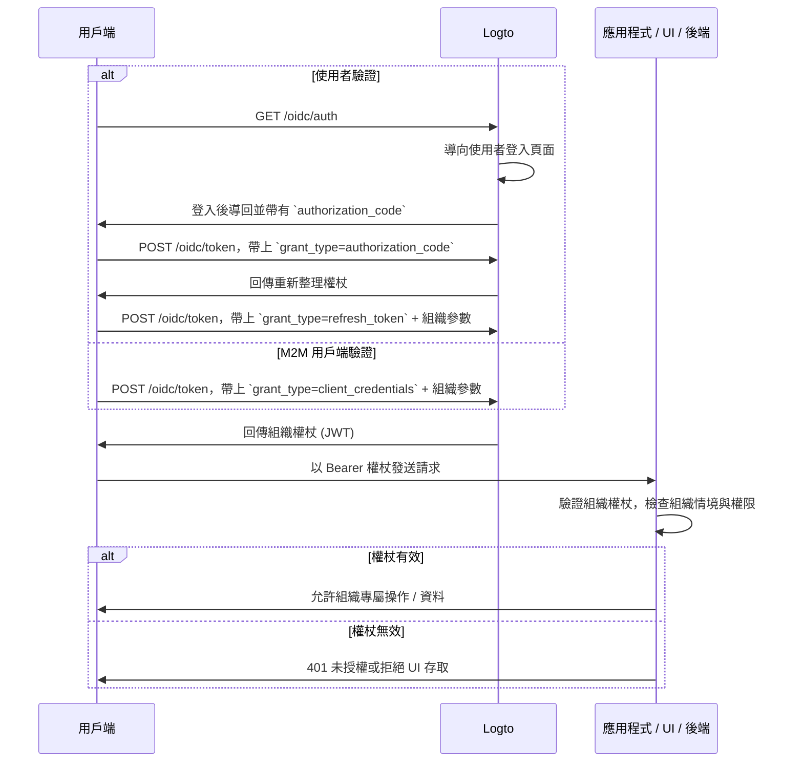

import TabItem from '@theme/TabItem';
import Tabs from '@theme/Tabs';

import illustration from '@site/docs/authorization/assets/rbac-organization-permissions.png';
import AuthorizationRequestExample from '@site/docs/authorization/fragments/AuthorizationRequestExample';
import ClientCredentialsRequestExample from '@site/docs/authorization/fragments/ClientCredentialsRequestExample';
import TokenRequestExample from '@site/docs/authorization/fragments/TokenRequestExample';
import InspectOrganizationClaim from './fragments/_inspect-organization-claim.md';
import OrganizationTokenWarning from './fragments/_organization-token-warning.md';

# 保護組織（非 API）權限

使用組織範本來管理並強制執行 Logto 中的組織層級角色與權限，控制在組織情境下對應用程式內功能與工作流程的存取。

## 什麼是組織（非 API）權限？ \{#what-are-organization-non-api-permissions}

組織權限（非 API）控制使用者在**組織情境**下可以執行哪些操作，但**不會在 API 層級強制執行**。這些權限主要用於管理應用程式功能、UI 元素、工作流程或商業行為，而非後端 API。

**常見使用情境包括**

- 邀請或管理組織成員
- 指派或變更組織角色
- 管理組織的帳單、設定或管理功能
- 存取沒有 API 端點的儀表板、分析或內部工具

Logto 允許你透過 OAuth 2.1 與角色型存取控制 (RBAC, Role-based Access Control) 來保護這些組織權限，同時支援多租戶 SaaS 架構。

這些權限透過 [組織範本](/authorization/organization-template) 中定義的**組織角色**來管理。每個組織都使用相同的範本，確保所有組織擁有一致的權限模型。

## 在 Logto 中的運作方式 \{#how-it-works-in-logto}

- **組織層級 RBAC (Role-based Access Control)：** 角色與權限在組織範本中定義。當使用者加入組織時，會被指派一個或多個角色，進而獲得特定權限。
- **非 API 強制執行：** 權限會在你的應用程式 UI、工作流程或後端邏輯中檢查與強制執行，不一定由 API gateway 處理。
- **與 API 保護分離：** 組織（非 API）權限與 API 資源權限是分開的。你可以在進階情境下同時結合兩者。

  

### 實作概覽 \{#implementation-overview}

1. 在 Logto 的組織範本中**定義組織權限**。
2. **建立組織角色**，將所需權限打包給組織專屬操作。
3. 在每個組織內**指派角色**給使用者或用戶端。
4. 透過重新整理權杖 (refresh token) 或用戶端憑證流程 (client credentials flow) **取得當前組織的組織權杖 (JWT)**。
5. 在應用程式 UI 或後端**驗證存取權杖**，以強制執行組織權限。

### 授權流程：驗證與保護組織權限 \{#authorization-flow-authenticating-and-securing-organization-permissions}

下方流程展示用戶端（網頁、行動裝置或後端）如何取得並使用組織權杖來強制執行非 API 權限。

請注意，此流程未詳列所有必要參數或標頭，僅聚焦於主要步驟。繼續閱讀可了解實際運作方式。

_使用者驗證 = 瀏覽器 / 應用程式。M2M = 使用用戶端憑證 + 組織情境的後端服務或腳本。_

## 實作步驟 \{#implementation-steps}

### 註冊組織權限 \{#register-organization-permissions}

1. 前往 <CloudLink to="/organization-template/organization-permissions">控制台 → 組織範本 → 組織權限</CloudLink>。
2. 定義你需要的組織權限（例如：`invite:member`、`manage:billing`、`view:analytics`）。

完整設定步驟請參閱 [定義組織權限](/authorization/role-based-access-control#define-organization-permissions)。

### 設定組織角色 \{#set-up-organization-roles}

1. 前往 <CloudLink to="/organization-template/organization-roles">控制台 → 組織範本 → 組織角色</CloudLink>。
2. 建立包含前述組織權限的角色（例如：`admin`、`member`、`billing`）。
3. 在每個組織內將這些角色指派給使用者或用戶端。

完整設定步驟請參閱 [使用組織角色](/authorization/role-based-access-control#configure-organization-roles)。

### 取得組織權杖（非 API） \{#obtain-organization-tokens-non-api}

你的用戶端 / 應用程式應取得組織權杖（非 API）以存取組織權限。Logto 發行的組織權杖為 [JSON Web Tokens (JWTs)](https://auth.wiki/jwt)。你可以透過 [重新整理權杖流程 (refresh token flow)](https://auth.wiki/refresh-token) 或 [用戶端憑證流程 (client credentials flow)](https://auth.wiki/client-credentials-flow) 取得。

#### 重新整理權杖流程 \{#refresh-token-flow}

幾乎所有 Logto 官方 SDK 都原生支援透過重新整理權杖流程取得組織權杖。你也可以使用標準 OAuth 2.0 / OIDC 用戶端函式庫實作此流程。

<Tabs groupId="user-client">
<TabItem value="logto-sdk" label="Logto SDK">

初始化 Logto SDK 時，請將 `urn:logto:scope:organizations` 及所需組織權限（scopes）加入 `scopes` 參數。

部分 Logto SDK 已預設提供組織專用 scope，例如 JavaScript SDK 的 `UserScope.Organizations`。

<InspectOrganizationClaim />

使用 `getOrganizationToken` 或類似方法（如帶組織 ID 的 `getAccessToken`）來請求特定組織的組織權杖。

各 SDK 詳細用法請參閱 [快速入門](/quick-starts)。

</TabItem>
<TabItem value="oauth-client" label="OAuth 2.0 / OIDC client library">

設定 OAuth 2.0 用戶端或初始化授權碼流程時，請確保包含下列參數：

- `resource`：設為 `urn:logto:resource:organizations`，表示你要取得組織權杖。
- `scope`：包含預設組織 scope（`urn:logto:scope:organizations`）、`offline_access`（取得重新整理權杖），以及你需要的特定組織權限（如 `invite:member`、`manage:billing`）。

部分函式庫可能不原生支援 `resource` 參數，但通常允許你在授權請求中傳遞額外參數。請查閱你的函式庫文件。

以下為授權請求的非正式範例：

<AuthorizationRequestExample
  scope="urn:logto:scope:organizations invite:member manage:billing"
  resource="urn:logto:resource:organizations"
/>

使用者驗證後，你會收到授權碼。請用此授權碼對 Logto 的 `/oidc/token` 端點發送 POST 請求。

以下為權杖請求的非正式範例：

<TokenRequestExample grantType="authorization_code" />

<OrganizationTokenWarning />

你會收到可用於取得組織權杖的重新整理權杖。

<InspectOrganizationClaim />

最後，使用重新整理權杖對 Logto 的 `/oidc/token` 端點發送 POST 請求以取得組織權杖。請記得包含：

- `organization_id` 參數，設為目標組織 ID。
- （可選）`scope` 參數，進一步縮限所需權限（如 `manage:members view:reports`）。

以下為權杖請求的非正式範例：

<TokenRequestExample grantType="refresh_token" organizationId="your-organization-id" />

</TabItem>
</Tabs>

#### 用戶端憑證流程 \{#client-credentials-flow}

針對機器對機器（M2M）情境，你可以使用用戶端憑證流程取得組織權限的存取權杖。只需對 Logto 的 `/oidc/token` 端點發送 POST 請求並帶上組織參數，即可使用用戶端 ID 與密鑰請求組織權杖。

請在請求中包含以下主要參數：

- `organization_id`：你要取得權杖的組織 ID。
- `scope`：你要請求的組織權限（如 `invite:member`、`manage:billing`）。

以下為使用用戶端憑證授權型態的權杖請求非正式範例：

<ClientCredentialsRequestExample
  organizationId="your-organization-id"
  scope="invite:member manage:billing"
/>

### 驗證組織權杖 \{#validate-organization-tokens}

Logto 發行的組織權杖（JWT）包含宣告（claims），你的應用程式 / UI / 後端可用來強制執行組織層級存取控制。

當你的應用程式收到組織權杖時，應：

- 驗證權杖簽章（使用 Logto 的 JWKs）。
- 確認權杖未過期（`exp` 宣告）。
- 檢查 `iss`（簽發者）是否符合你的 Logto 端點。
- 確認 `aud`（受眾）是否符合格式化的組織識別碼（如 `urn:logto:organization:{organization_id}`）。
- 拆解 `scope` 宣告（以空格分隔），檢查所需權限。

逐步與語言專屬教學請參閱 [如何驗證存取權杖](/authorization/validate-access-tokens)。

## 最佳實踐與安全建議 \{#best-practices-and-security-tips}

- **切勿僅依賴 UI 強制執行：** 關鍵操作務必在後端驗證權限。
- **使用受眾限制：** 一定要檢查 `aud` 宣告，確保權杖屬於目標組織。
- **權限設計以業務為導向：** 使用清楚對應實際操作的名稱，每個組織角色僅授予必要權限。
- **盡可能區分 API 與非 API 權限**（但兩者可同時存在於單一角色）。
- **隨產品演進定期檢視組織範本。**

## 常見問題 \{#faqs}

### 我可以在單一角色中混用組織與非組織權限嗎？ \{#can-i-mix-organization-and-non-organization-permissions-in-a-single-role}

不行，組織權限（包含組織層級 API 權限）由組織範本定義，無法與全域 API 權限混用。不過，你可以建立同時包含組織權限與組織層級 API 權限的角色。

### 我應該在哪裡強制執行非 API 權限？ \{#where-should-i-enforce-non-api-permissions}

請同時在 UI（功能開關）與伺服器端邏輯（敏感操作）檢查非 API 權限。

## 延伸閱讀 \{#further-reading}

<Url href="/authorization/validate-access-tokens">如何驗證存取權杖</Url>
<Url href="/developers/custom-token-claims">自訂權杖宣告</Url>
<Url href="/use-cases/multi-tenancy/build-multi-tenant-saas-application">
  使用情境：打造多租戶 SaaS 應用程式
</Url>
