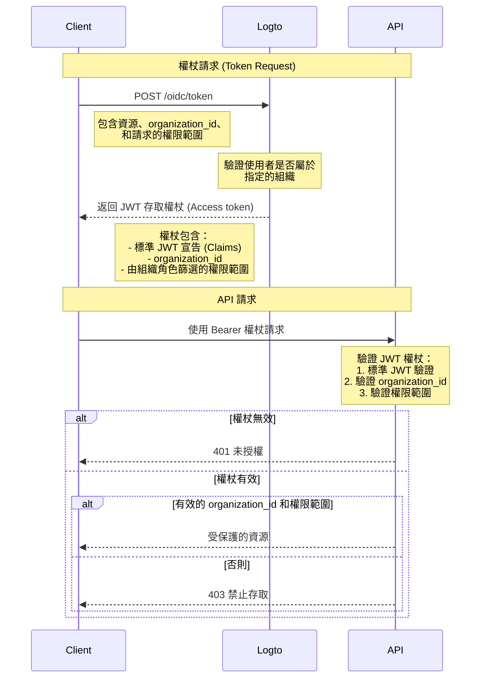

# 使用組織範本保護 API 資源

除了 [保護你的 API](/authorization/api-resources/protect-your-api) 透過確保有效的 JWT 來保護資源外，還可以應用組織 **角色 (Roles)** 來篩選 **權限範圍 (Scopes)**。本文將重點介紹組織角色如何影響驗證流程中的權限範圍委派和驗證。



## 額外的 `organization_id` 參數 \{#the-additional-organization_id-parameter}

除了正常的存取權杖請求外，在圖中我們添加了一個額外的 `organization_id` 參數，這告訴 Logto 將權限範圍縮小到特定組織的角色。

## 客戶端設置 \{#client-setup}

如果你使用 Logto 的 SDK，可以在 `getAccessToken` 方法的第二個參數中添加 `organization_id`。

```tsx
const accessToken = await logto.getAccessToken('https://my-resource.com/api', 'org_1');

// 或直接獲取宣告 (Claims)
const accessTokenClaims = await logto.getAccessTokenClaims('https://my-resource.com/api', 'org_1');
console.log(accessTokenClaims.organization_id); // 'org_1'
console.log(accessTokenClaims.aud); // 'https://my-resource.com/api'
```

然後，只有從該組織的角色繼承的權限範圍會包含在存取權杖中，並且會有一個額外的宣告 `organization_id`。

## API 伺服器驗證 \{#api-server-validation}

除了正常的 JWT 存取權杖驗證外，你還需要增加一個層次來檢查 `organization_id` 是否存在且有效。
