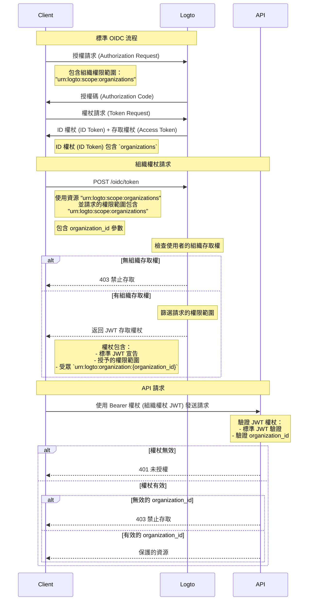

import TabItem from '@theme/TabItem';
import Tabs from '@theme/Tabs';

# 保護組織資源

除了將 API 作為資源的 [保護你的 API](/authorization/api-resources/protect-your-api) 外，組織也可以作為資源，並以相同方式保護你的組織資源。在本文中，我們將專注於如何以類似方式保護你的組織資源。



## 步驟 1：從 OIDC 流程獲取組織 ID \{#step-1-get-organization-ids-from-oidc-flow}

Logto 擴展了標準的 [OpenID Connect](https://openid.net/specs/openid-connect-core-1_0.html) 協議，允許你的應用程式從使用者獲取組織資訊。有兩種方法可以做到這一點：

- 如果你使用支援組織的 Logto SDK，可以將 `urn:logto:scope:organizations` 權限範圍新增到配置物件的 `scopes` 參數中。通常 SDK 會有一個枚舉來表示這個權限範圍，例如 [Logto JS SDKs](https://github.com/logto-io/js) 中的 `UserScope.Organizations`。

<Tabs groupId="sdk">

  <TabItem value="js" label="JavaScript">

```ts
import { LogtoClient, UserScope } from '@logto/browser'; // 或 @logto/node, @logto/client

const logto = new LogtoClient({
  // ...
  scopes: [UserScope.Organizations],
});
```

  </TabItem>
  <TabItem value="react" label="React">

```tsx
import { LogtoProvider, UserScope } from '@logto/react';

const App = () => (
  <LogtoProvider
    config={{
      // ...
      scopes: [UserScope.Organizations],
    }}
  >
    {/* ... */}
  </LogtoProvider>
);
```

  </TabItem>
  <TabItem value="python" label="Python">

```python
from logto import UserInfoScope

client = LogtoClient(
    LogtoConfig(
        # ...
        scopes=[UserInfoScope.organizations],
    )
)
```

  </TabItem>
  <TabItem value="php" label="PHP">

```php
use Logto\Sdk\Constants\UserScope;

$client = new LogtoClient(
  new LogtoConfig(
    // ...
    scopes: [UserScope::organizations],
  )
);
```

  </TabItem>
  <TabItem value="swift" label="Swift">

```swift
import Logto
import LogtoClient

let config = try? LogtoConfig(
    // ...
    scopes: [
        UserScope.organizations.rawValue,
    ],
    // ...
)
let client = LogtoClient(useConfig: config)
```

  </TabItem>
  <TabItem value="others" label="其他">

```ts
const config = {
  // ...
  scope: 'openid offline_access urn:logto:scope:organizations',
};
```

  </TabItem>

</Tabs>
    
- 對於其他情況，你需要將 `urn:logto:scope:organizations` 權限範圍新增到 SDK 配置（或驗證請求）的 `scope` 參數中。

一旦使用者完成驗證流程，你可以從 `idToken` 獲取組織資訊：

```tsx
// 使用 JavaScript 作為範例
const idToken = await logto.getIdTokenClaims();

console.log(idToken.organizations); // 組織 ID 的字串陣列
```

`organizations` 欄位（宣告）也會包含在 [UserInfo 端點](https://openid.net/specs/openid-connect-core-1_0.html#UserInfo) 的回應中。

### 可選：獲取組織角色 \{#optional-get-organization-roles}

如果你尚未設定組織角色，請參閱[此部分](/authorization/organization-template/configure-organization-template/#create-organization-role)。

要獲取當前使用者的所有組織角色：

- 如果你使用支援組織的 Logto SDK，可以將 `urn:logto:scope:organization_roles` 權限範圍新增到配置物件的 `scopes` 參數中。通常 SDK 會有一個枚舉來表示這個權限範圍，例如 [Logto JS SDKs](https://github.com/logto-io/js) 中的 `UserScope.OrganizationRoles`。
- 對於其他情況，你需要將 `urn:logto:scope:organization_roles` 權限範圍新增到 SDK 配置（或驗證請求）的 `scope` 參數中。

然後你可以從 `idToken` 獲取組織角色：

```tsx
// 使用 JavaScript 作為範例
const idToken = await logto.getIdTokenClaims();

console.log(idToken.organization_roles); // 組織角色的字串陣列
```

陣列中的每個字串格式為 `organization_id:role_id`，例如 `org_123:admin` 表示使用者在 ID 為 `org_123` 的組織中擁有 `admin` 角色。

`organization_roles` 欄位（宣告）也會包含在 [UserInfo 端點](https://openid.net/specs/openid-connect-core-1_0.html#UserInfo) 的回應中。

## 步驟 2：獲取組織權杖 \{#step-2-fetch-organization-token}

要在組織的上下文中執行操作，使用者需要獲得該組織的存取權杖（組織權杖）。組織權杖是一個包含組織 ID 和使用者在組織中權限（權限範圍）的 JWT 權杖。

### 新增參數到驗證請求 \{#add-parameters-to-the-authentication-request}

- 如果你使用支援組織的 Logto SDK，可以將 `urn:logto:scope:organizations` 權限範圍新增到配置物件的 `scopes` 參數中，與 [獲取當前使用者的組織 ID](/authorization/organization-template/protect-organization-resources/#step-1-get-organization-ids-from-oidc-flow) 相同。
  - 支援組織的 Logto SDK 會自動處理其餘的配置。
- 對於其他情況，你需要將 `offline_access` 和 `urn:logto:scope:organizations` 權限範圍新增到 `scope` 參數中，並將 `urn:logto:resource:organizations` 資源新增到 SDK 配置（或驗證請求）的 `resource` 參數中。
  - 注意：`offline_access` 是獲取可用於獲取組織權杖的 `refresh_token` 所需的。

```tsx
// 僅適用於其他情況。對於 Logto SDK，請參見上文。
const config = {
  // ...
  scope: 'openid offline_access urn:logto:scope:organizations',
  resource: 'urn:logto:resource:organizations',
};
```

:::note

`urn:logto:resource:organizations` 資源是一個特殊資源，代表組織模板。

:::

### 獲取組織權杖 \{#fetch-the-organization-token}

Logto 擴展了標準的 `refresh_token` 授權類型，允許你的應用程式獲取組織權杖。

- 如果你使用支援組織的 Logto SDK，可以調用 SDK 的 `getOrganizationToken()` 方法（或 `getOrganizationTokenClaims()` 方法）。
- 對於其他情況，你需要使用以下參數調用權杖端點：
  - `grant_type`: `refresh_token`。
  - `client_id`: 使用者用於驗證的應用程式 ID。
  - `refresh_token`: 你從驗證流程中獲得的 `refresh_token`。
  - `organization_id`: 你想要獲取權杖的組織 ID。
  - `scope`（可選）：你想要授予使用者在組織中的權限範圍。如果未指定，授權伺服器將嘗試授予與驗證流程相同的權限範圍。

<Tabs groupId="sdk">

  <TabItem value="js" label="JavaScript">

```ts
const token = await logto.getOrganizationToken('<organization-id>');
```

  </TabItem>
  <TabItem value="react" label="React">

```tsx
const App = () => {
  const { getOrganizationToken } = useLogto();

  const getToken = async () => {
    const token = await getOrganizationToken('<organization-id>');
  };

  return <button onClick={getToken}>獲取組織權杖</button>;
};
```

  </TabItem>
  <TabItem value="python" label="Python">

```python
token = await client.getOrganizationToken("<organization-id>")
# 或
claims = await client.getOrganizationTokenClaims("<organization-id>")
```

  </TabItem>
  <TabItem value="php" label="PHP">

```php
$token = $client->getOrganizationToken('<organization-id>');
// 或
$claims = $client->getOrganizationTokenClaims('<organization-id>');
```

  </TabItem>
  <TabItem value="swift" label="Swift">

```swift
let token = try await client.getOrganizationToken(forId: "<organization-id>")
```

  </TabItem>
  <TabItem value="others" label="其他">

```ts
// 使用 JavaScript 作為範例

const params = new URLSearchParams();

params.append('grant_type', 'refresh_token');
params.append('client_id', 'YOUR_CLIENT_ID');
params.append('refresh_token', 'REFRESH_TOKEN');
params.append('organization_id', 'org_123');

const response = await fetch('https://YOUR_LOGTO_ENDPOINT/oidc/token', {
  method: 'POST',
  headers: {
    'Content-Type': 'application/x-www-form-urlencoded',
  },
  body: params,
});
```

  </TabItem>

</Tabs>

回應將與 [標準權杖端點](https://openid.net/specs/openid-connect-core-1_0.html#TokenEndpoint) 的格式相同，`access_token` 是 JWT 格式的組織權杖。

除了存取權杖的常規宣告外，組織權杖還包含以下宣告：

- `aud`: 組織權杖的受眾是 `urn:logto:organization:{organization_id}`。
- `scope`: 使用者在組織中授予的權限範圍，以空格作為分隔符。

### 範例 \{#example}

一個好的範例勝過千言萬語。假設我們的組織模板有以下設置：

- 權限：`read:logs`、`write:logs`、`read:users`、`write:users`。
- 角色：`admin`、`member`。
  - `admin` 角色擁有所有權限。
  - `member` 角色擁有 `read:logs` 和 `read:users` 權限。

使用者有以下設置：

- 組織 ID：`org_1`、`org_2`。
- 組織角色：`org_1:admin`、`org_2:member`。

在 Logto SDK 配置（或驗證請求）中，我們正確設置了其他項目，並新增了以下權限範圍：

- `urn:logto:scope:organizations`
- `openid`
- `offline_access`
- `read:logs`
- `write:logs`

現在，當使用者完成驗證流程時，我們可以從 `idToken` 獲取組織 ID：

```tsx
// 使用 JavaScript 作為範例
const idToken = await logto.getIdTokenClaims();

console.log(idToken.organizations); // ['org_1', 'org_2']
```

如果我們想要獲取組織權杖：

```tsx
// 使用 JavaScript 作為範例
const org1Token = await logto.getOrganizationTokenClaims('org_1');
const org2Token = await logto.getOrganizationTokenClaims('org_2');

console.log(org1Token.aud); // 'urn:logto:organization:org_1'
console.log(org1Token.scope); // 'read:logs write:logs'
console.log(org2Token.aud); // 'urn:logto:organization:org_2'
console.log(org2Token.scope); // 'read:logs'

const org3Token = await logto.getOrganizationTokenClaims('org_3'); // 錯誤：使用者不是該組織的成員
```

說明：

- 對於 `org_1`，使用者擁有 `admin` 角色，因此組織權杖應具有所有可用的權限（權限範圍）。
- 對於 `org_2`，使用者擁有 `member` 角色，因此組織權杖應具有 `read:logs` 和 `read:users` 權限（權限範圍）。

由於我們在驗證流程中僅請求了 `read:logs` 和 `write:logs` 權限範圍，因此組織權杖已相應地「縮小範圍」，導致請求的權限範圍與可用權限範圍的交集。

### 為機器對機器應用程式獲取組織權杖 \{#fetch-organization-token-for-a-machine-to-machine-application}

類似於為使用者獲取組織權杖，你也可以為機器對機器應用程式獲取組織權杖。唯一的區別是你需要使用 `client_credentials` 授權類型，而不是 `refresh_token` 授權類型。

要了解更多關於機器對機器應用程式的資訊，請參閱 [機器對機器：使用 Logto 進行驗證](/quick-starts/m2m/)。

## 步驟 3：驗證組織權杖 \{#step-3-verify-organization-tokens}

一旦應用程式獲得組織權杖，它可以像常規存取權杖一樣使用該權杖，例如在 `Authorization` 標頭中以 `Bearer {token}` 格式調用 API。

在你的 API 中，驗證組織權杖的方式與 [保護你的 API](/authorization/api-resources/protect-your-api/#validate-authorization-tokens-for-api-requests) 相似。主要區別：

- 與 API 資源的存取權杖不同，如果使用者不是組織的成員，則無法獲得組織權杖。
- 組織權杖的受眾是 `urn:logto:organization:{organization_id}`。
- 對於某些權限（權限範圍），你需要通過以空格作為分隔符來檢查組織權杖的 `scope` 宣告。
