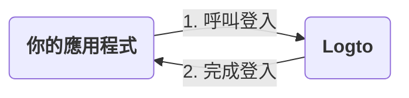
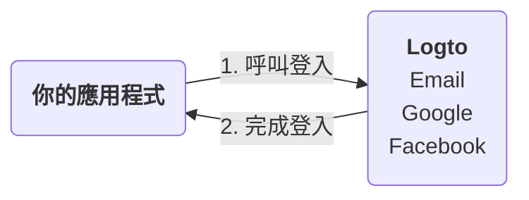
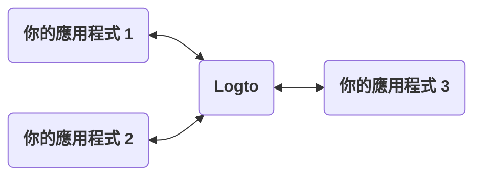
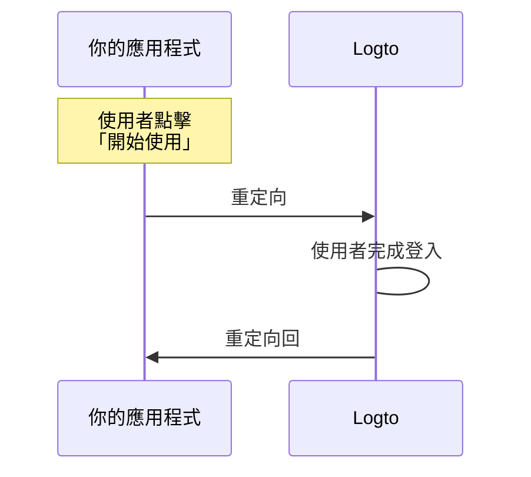
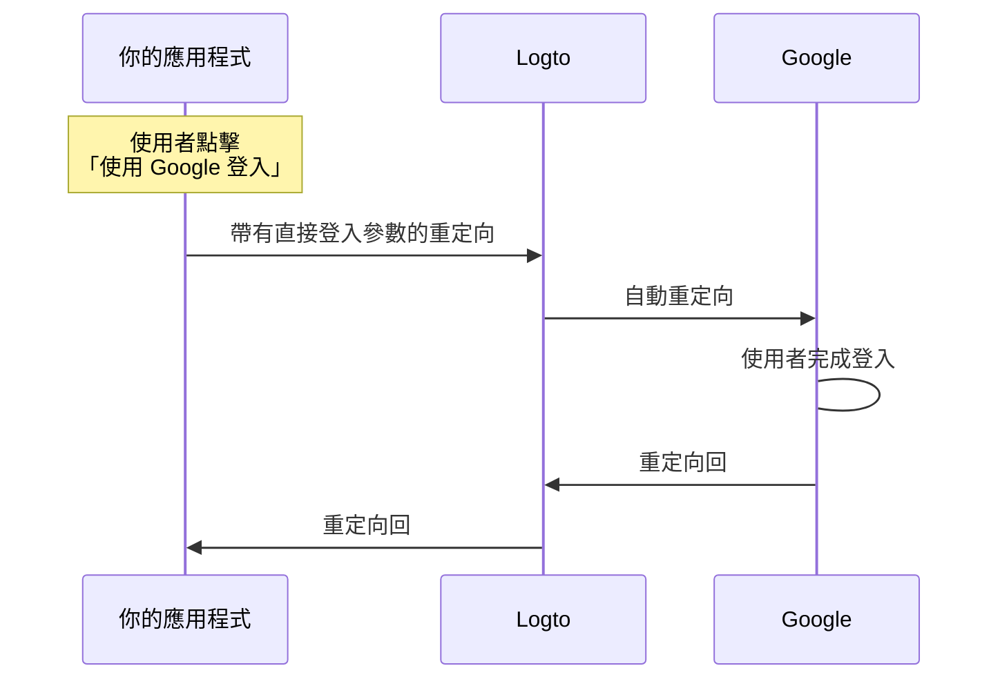

# 登入體驗解析

本頁將解釋 Logto 的登入體驗及其設計原因。

## 介紹 \{#introduction}

登入體驗是 Logto 中的使用者驗證 (Authentication) 流程。該流程可簡化如下：



1. 你的應用程式呼叫登入方法。
2. 使用者被重定向至 Logto 登入頁面。對於原生應用程式，系統瀏覽器會被開啟。
3. 使用者登入後被重定向回你的應用程式（在 Logto 中配置為「Redirect URI」）。

雖然流程簡單，但重定向部分有時看起來可能過於繁瑣。然而，這在多方面是有益且安全的。我們將在以下部分解釋原因。

## 為什麼要重定向？ \{#why-redirect}

### 彈性 \{#flexibility}

重定向允許你將驗證 (Authentication) 流程與應用程式解耦。隨著業務增長，你可以在不更改應用程式的情況下保持相同的驗證 (Authentication) 流程。例如，你可以新增多重要素驗證 (MFA) 或更改登入方法，而不需修改應用程式。



### 多應用程式支援 \{#multi-app-support}

如果你有多個應用程式，使用者可以一次登入後存取所有應用程式，而無需再次登入。這對於 SaaS 業務或擁有多個服務的公司特別有用。



### 原生應用程式 \{#native-apps}

對於原生應用程式，重定向至系統瀏覽器是一種安全的驗證 (Authentication) 方式，並且在 iOS 和 Android 上都有內建支援。

- **iOS**：Apple 提供 [ASWebAuthenticationSession](https://developer.apple.com/documentation/authenticationservices/aswebauthenticationsession) 以進行安全驗證。
- **Android**：Google 提供 [Custom Tabs](https://developer.chrome.com/docs/android/custom-tabs) 以提供無縫體驗。

### 安全性 \{#security}

在底層，Logto 是一個 [OpenID Connect (OIDC)](https://openid.net/specs/openid-connect-core-1_0.html) 提供者。OIDC 是一個廣泛採用的使用者驗證 (Authentication) 標準。

Logto 強制執行嚴格的安全措施，例如 [PKCE](https://tools.ietf.org/html/rfc7636)，並禁用不安全的流程如隱式流程。重定向是一種安全的驗證 (Authentication) 方式，可以防止許多常見攻擊。

## 如果我需要在應用程式中顯示一些登入元件怎麼辦？ \{#what-if-i-need-to-show-some-sign-in-components-in-my-app}

有時你的團隊可能希望在應用程式中顯示一些登入元件，例如「使用 Google 登入」按鈕。這可以透過 Logto 的「直接登入」功能實現。

### 它如何運作？ \{#how-does-it-work}

假設你的應用程式中有兩個行動呼籲按鈕：「開始使用」和「使用 Google 登入」。這些按鈕的設計如下：

- 「開始使用」：重定向至一般登入頁面。
- 「使用 Google 登入」：重定向至 Google 登入頁面。

這兩個操作都需要完成登入流程並重定向回你的應用程式。

---

#### 點擊「開始使用」的流程 \{#process-of-clicking-get-started}

在此情況下，登入體驗與預設相同。使用者被重定向至 Logto 登入頁面，然後返回你的應用程式。



:::note
如果你在 Logto 中配置了社交登入方法（例如 Google、Facebook），使用者可能會被重定向至相應的登入頁面。為簡化說明，我們僅展示一般流程。
:::

---

#### 點擊「使用 Google 登入」的流程 \{#process-of-clicking-sign-in-with-google}

在此情況下，使用者會自動被重定向至 Google 登入頁面，而不需與 Logto 登入頁面互動。此自動重定向的速度幾乎是瞬間的，使用者可能不會注意到重定向。



---

總之，直接登入功能是一種在不改變安全級別的情況下自動化登入體驗中某些互動的方式。

### 在應用程式中使用直接登入 \{#use-direct-sign-in-in-your-app}

要使用直接登入，你需要在呼叫登入方法時傳遞 `direct_sign_in` 參數。該值應由 Logto 認可的特定格式組成。例如，要使用 Google 登入，該值應為 `social:google`。

在一些 Logto 官方 SDK 中，有專門的選項用於直接登入。以下是使用 `@logto/client` JavaScript SDK 進行直接登入的範例：

```ts
client.signIn({
  redirectUri: 'https://some-redirect-uri',
  directSignIn: { method: 'social', target: 'google' },
});
```

更多詳細資訊，請參閱 [直接登入](/end-user-flows/authentication-parameters/direct-sign-in)。

:::info
我們正在逐步在所有 Logto 官方 SDK 中推出此功能。如果你在 SDK 中未看到此功能，請隨時聯繫我們。
:::

## 我需要使用者在我的應用程式中填寫憑證 \{#i-need-my-users-to-fill-in-their-credentials-in-my-app}

如果你需要使用者直接在應用程式中填寫憑證（例如電子郵件和密碼），而不是重定向至 Logto，目前我們無法協助。歷史上曾有「資源擁有者密碼憑證」授權，但現在被認為不安全，並已在 [OAuth 2.1 中正式棄用](https://datatracker.ietf.org/doc/html/draft-ietf-oauth-security-topics#name-resource-owner-password-cre)。

要了解有關 ROPC 授權類型的安全風險，請查看我們的部落格文章 [為什麼你應該棄用 ROPC 授權類型](https://blog.logto.io/deprecated-ropc-grant-type/)。

## 相關資源 \{#related-resources}

<Url href="https://blog.logto.io/oauth-2-1/">OAuth 2.1 已經來臨：你需要知道的事</Url>
<Url href="https://blog.logto.io/how-pkce-protects-the-authorization-code-flow-for-native-apps">
  什麼是 PKCE：從基本概念到深入理解
</Url>
