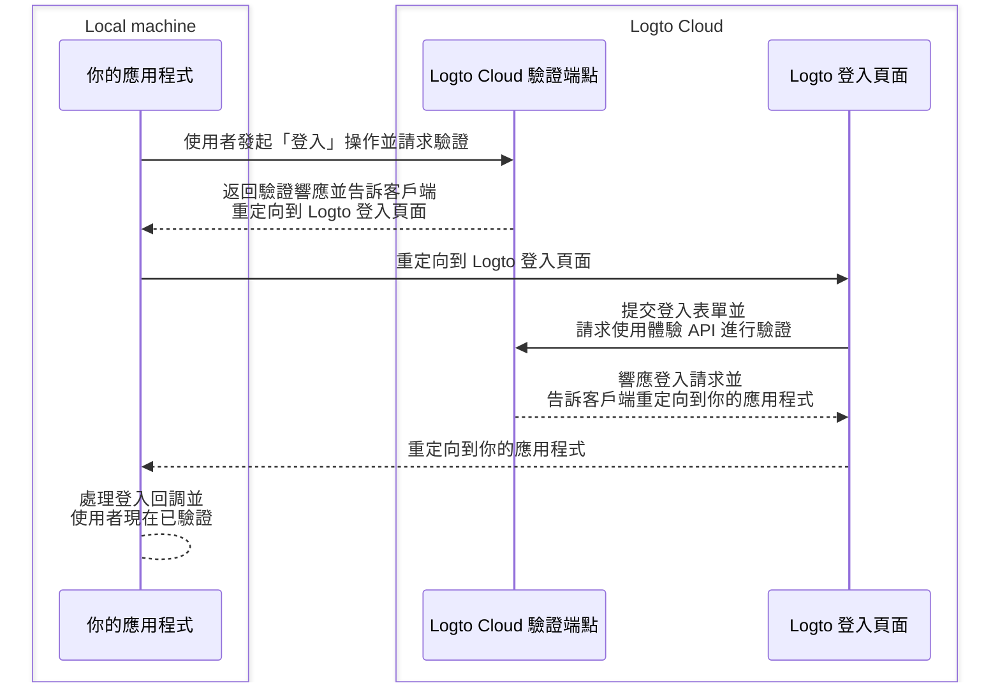
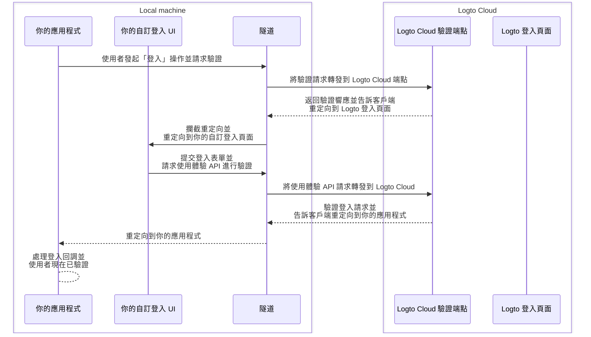

import TabItem from '@theme/TabItem';
import Tabs from '@theme/Tabs';

# 在本地調試和測試你的自訂 UI

對於 Logto Cloud 使用者，我們讓你可以輕鬆地將「自帶 UI」引入 Logto。Cloud 使用者現在可以在 <CloudLink to="/sign-in-experience/branding">Console > Sign-in experience > Branding > Bring your UI</CloudLink> 上傳包含自訂 UI 資產的 zip 文件（詳情請查看 [Bring your UI](/customization/bring-your-ui) 頁面）。

然而，在開發這些自訂 UI 頁面時，使用者希望在上傳到 Logto Cloud 之前，能夠在本地測試和調試代碼。此 CLI 命令幫助你設置本地隧道，並將以下三個實體連接在一起：你的 Logto Cloud 驗證端點、你的應用程式和你的自訂登入 UI。

## 為什麼我需要這個？ \{#why-do-i-need-this}

默認情況下，當你在應用程式中點擊「登入」按鈕時，你將被導航到 Logto 端點配置的登入頁面。成功的登入流程可以如下圖所示：



但現在由於你正在開發自己的自訂登入 UI，你需要一種方式導航到在本地機器上運行的自訂登入 UI 頁面。
這需要一個本地隧道服務來攔截來自應用程式的外發請求並將其重定向到你的自訂登入 UI 頁面。

此外，你需要與 [Logto 的使用體驗 API](https://openapi.logto.io/group/endpoint-experience) 交互以驗證使用者並管理會話。
此服務還將幫助轉發這些使用體驗 API 請求到 Logto Cloud 以避免 CORS 問題。

下方的序列圖展示了在你的自訂 UI 和隧道服務到位的情況下，成功的「登入」流程如何運作：



有了隧道服務，你現在可以在本地開發和測試你的自訂登入 UI，而不需要每次更改時都將資產上傳到 Logto Cloud。

## 指導說明 \{#instructions}

### 步驟 1：執行命令 \{#step-1-execute-the-command}

假設你的 Cloud 租戶 ID 是 `foobar`，並且你有一個自訂登入頁面在本地開發伺服器上運行，地址為 `http://localhost:4000`，那麼你可以這樣執行命令：

<Tabs groupId="cmd">

  <TabItem value="cli" label="CLI">

```bash
logto-tunnel -p 9000 --experience-uri http://localhost:4000/ --endpoint https://foobar.logto.app/
```

  </TabItem>
  <TabItem value="npx" label="npx">

```bash
npx @logto/tunnel -p 9000 --experience-uri http://localhost:4000/ --endpoint https://foobar.logto.app/
```

  </TabItem>

</Tabs>

如果你在 Logto 中配置了自訂域名，也可以這樣運行：

<Tabs groupId="cmd">

  <TabItem value="cli" label="CLI">

```bash
logto-tunnel -p 9000 --experience-uri http://localhost:4000/ --endpoint https://your.custom.domain/
```

  </TabItem>
  <TabItem value="npx" label="npx">

```bash
npx @logto/tunnel -p 9000 --experience-uri http://localhost:4000/ --endpoint https://your.custom.domain/
```

  </TabItem>

</Tabs>

或者，該命令也支持靜態 html 資產，而不需要先在開發伺服器上運行。只需確保在你指定的路徑中有一個 `index.html`。

<Tabs groupId="cmd">

  <TabItem value="cli" label="CLI">

```bash
logto-tunnel -p 9000 --experience-path /path/to/your/static/files --endpoint https://foobar.logto.app/
```

  </TabItem>
  <TabItem value="npx" label="npx">

```bash
npx @logto/tunnel -p 9000 --experience-path /path/to/your/static/files --endpoint https://foobar.logto.app/
```

  </TabItem>

</Tabs>

### 步驟 2：更新應用程式中的端點 URI \{#step-2-update-endpoint-uri-in-your-application}

最後，運行你的應用程式並將其 Logto 端點設置為隧道服務地址 `http://localhost:9000/`。

以 React 應用程式為例：

```tsx title=App.tsx
import { LogtoProvider, LogtoConfig } from '@logto/react';

const config: LogtoConfig = {
  // endpoint: 'https://foobar.logto.app/', // 原始 Logto Cloud 端點
  endpoint: 'http://localhost:9000/', // 隧道服務地址
  appId: '<your-application-id>',
};

const App = () => (
  <LogtoProvider config={config}>
    <YourAppContent />
  </LogtoProvider>
);
```

如果你使用社交登入，你還需要在社交提供者設置中將重定向 URI 更新為隧道服務地址。

```
http://localhost:9000/callback/<connector-id>
```

如果一切設置正確，當你在應用程式中點擊「登入」按鈕時，你應該會被導航到你的自訂登入頁面，而不是 Logto 的內建 UI，並且擁有有效的會話（cookies），允許你進一步與 Logto 使用體驗 API 交互。

祝你編碼愉快！

## 相關資源 \{#related-resources}

<Url href="https://blog.logto.io/automate-custom-sign-in-ui-deployment-with-github-actions">
  使用 GitHub Actions 工作流程自動化你的自訂登入 UI 部署
</Url>
