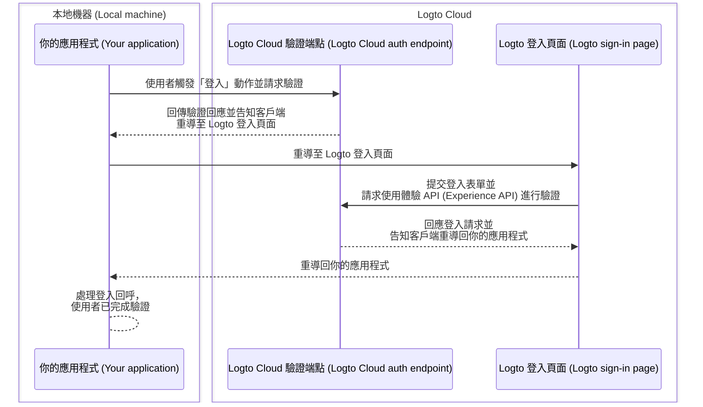
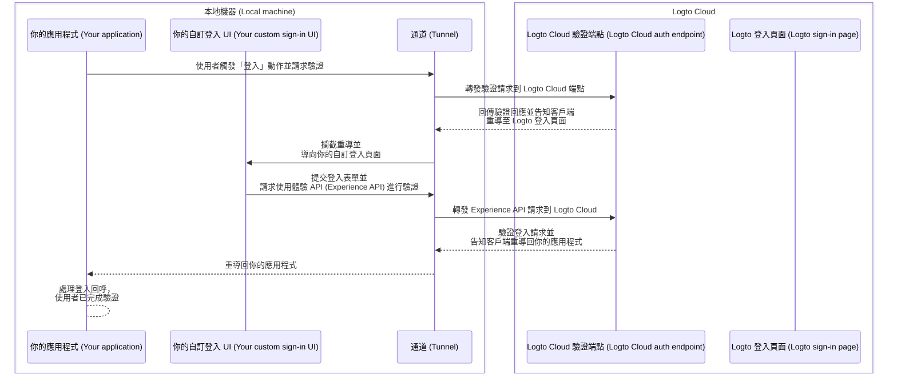

import TabItem from '@theme/TabItem';
import Tabs from '@theme/Tabs';

# 在本地除錯與測試你的自訂 UI

對於 Logto Cloud 使用者，我們讓你可以輕鬆「自帶 UI」到 Logto。Cloud 使用者現在可以在 <CloudLink to="/sign-in-experience/branding">Console > 登入與帳號 > 品牌設定 > 自帶 UI</CloudLink> 上傳包含自訂 UI 資產的 zip 檔案（詳情請參閱 [自帶 UI](/customization/bring-your-ui) 頁面）。

然而，在開發這些自訂 UI 頁面時，使用者通常希望在上傳到 Logto Cloud 前，能先在本地測試與除錯程式碼。這個 CLI 指令可以協助你建立本地通道，並將以下三個實體串接起來：
你的 Logto Cloud 驗證端點、你的應用程式，以及你的自訂登入 UI。

## 為什麼需要這個？ \{#why-do-i-need-this}

預設情況下，當你在應用程式中點擊「登入」按鈕時，會被導向在 Logto 端點設定的登入頁面。一次成功的登入流程如下圖所示：


```mermaid
sequenceDiagram
    box 本地機器 (Local machine)
    participant A as 你的應用程式 (Your application)
    end
    box Logto Cloud
    participant B as Logto Cloud 驗證端點 (Logto Cloud auth endpoint)
    participant C as Logto 登入頁面 (Logto sign-in page)
    end
    A ->> B: 使用者觸發「登入」動作並請求驗證
    B -->> A: 回傳驗證回應並告知客戶端<br/>重導至 Logto 登入頁面
    A ->> C: 重導至 Logto 登入頁面
    C ->> B: 提交登入表單並<br/>請求使用體驗 API (Experience API) 進行驗證
    B -->> C: 回應登入請求並<br/>告知客戶端重導回你的應用程式
    C -->> A: 重導回你的應用程式
    A --> A: 處理登入回呼，<br/>使用者已完成驗證
```

但現在你正在開發自己的自訂登入 UI，你需要一種方式將導向指到本地運行的自訂登入 UI 頁面。
這就需要一個本地通道服務來攔截來自應用程式的外部請求，並將其重導至你的自訂登入 UI 頁面。

此外，你還需要與 [Logto 的使用體驗 API (Experience API)](https://openapi.logto.io/group/endpoint-experience) 互動，以驗證使用者並管理會話。
這個服務也會協助你將這些 Experience API 請求轉發到 Logto Cloud，以避免 CORS 問題。

下方時序圖說明了當你有自訂 UI 與通道服務時，一次成功的「登入」流程如何運作：


```mermaid
sequenceDiagram
    box 本地機器 (Local machine)
    participant A as 你的應用程式 (Your application)
    participant B as 你的自訂登入 UI (Your custom sign-in UI)
    participant C as 通道 (Tunnel)
    end
    box Logto Cloud
    participant D as Logto Cloud 驗證端點 (Logto Cloud auth endpoint)
    participant E as Logto 登入頁面 (Logto sign-in page)
    end
    A ->> C: 使用者觸發「登入」動作並請求驗證
    C ->> D: 轉發驗證請求到 Logto Cloud 端點
    D -->> C: 回傳驗證回應並告知客戶端<br/>重導至 Logto 登入頁面
    C ->> B: 攔截重導並<br/>導向你的自訂登入頁面
    B ->> C: 提交登入表單並<br/>請求使用體驗 API (Experience API) 進行驗證
    C ->> D: 轉發 Experience API 請求到 Logto Cloud
    D -->> C: 驗證登入請求並<br/>告知客戶端重導回你的應用程式
    C -->> A: 重導回你的應用程式
    A --> A: 處理登入回呼，<br/>使用者已完成驗證
```

有了通道服務，你就可以在本地開發與測試自訂登入 UI，而不必每次修改都上傳資產到 Logto Cloud。

## 操作說明 \{#instructions}

### 步驟 1：執行指令 \{#step-1-execute-the-command}

假設你的 Cloud tenant ID 為 `foobar`，且你的自訂登入頁面運行在本地開發伺服器 `http://localhost:4000`，你可以這樣執行指令：

<Tabs groupId="cmd">

  <TabItem value="cli" label="CLI">

```bash
logto-tunnel -p 9000 --experience-uri http://localhost:4000/ --endpoint https://foobar.logto.app/
```

  </TabItem>
  <TabItem value="npx" label="npx">

```bash
npx @logto/tunnel -p 9000 --experience-uri http://localhost:4000/ --endpoint https://foobar.logto.app/
```

  </TabItem>

</Tabs>

如果你在 Logto 設定了自訂網域，也同樣適用：

<Tabs groupId="cmd">

  <TabItem value="cli" label="CLI">

```bash
logto-tunnel -p 9000 --experience-uri http://localhost:4000/ --endpoint https://your.custom.domain/
```

  </TabItem>
  <TabItem value="npx" label="npx">

```bash
npx @logto/tunnel -p 9000 --experience-uri http://localhost:4000/ --endpoint https://your.custom.domain/
```

  </TabItem>

</Tabs>

另外，這個指令也支援靜態 html 資產，不需要先在開發伺服器上運行。只要你指定的路徑下有 `index.html` 即可。

<Tabs groupId="cmd">

  <TabItem value="cli" label="CLI">

```bash
logto-tunnel -p 9000 --experience-path /path/to/your/static/files --endpoint https://foobar.logto.app/
```

  </TabItem>
  <TabItem value="npx" label="npx">

```bash
npx @logto/tunnel -p 9000 --experience-path /path/to/your/static/files --endpoint https://foobar.logto.app/
```

  </TabItem>

</Tabs>

### 步驟 2：更新應用程式中的 endpoint URI \{#step-2-update-endpoint-uri-in-your-application}

最後，啟動你的應用程式，並將 Logto endpoint 設為通道服務位址 `http://localhost:9000/`。

以 React 應用程式為例：

```tsx title=App.tsx
import { LogtoProvider, LogtoConfig } from '@logto/react';

const config: LogtoConfig = {
  // endpoint: 'https://foobar.logto.app/', // 原本的 Logto Cloud endpoint
  endpoint: 'http://localhost:9000/', // 通道服務位址
  appId: '<your-application-id>',
};

const App = () => (
  <LogtoProvider config={config}>
    <YourAppContent />
  </LogtoProvider>
);
```

如果你有使用社交登入，也需要將社交提供者設定中的 redirect URI 更新為通道服務位址。

```
http://localhost:9000/callback/<connector-id>
```

如果一切設定正確，當你在應用程式中點擊「登入」按鈕時，應該會被導向你的自訂登入頁面，而不是 Logto 內建 UI，並且會有有效的會話（cookies），讓你可以進一步與 Logto Experience API 互動。

祝你開發順利！

## 相關資源 \{#related-resources}

<Url href="https://blog.logto.io/automate-custom-sign-in-ui-deployment-with-github-actions">
  使用 GitHub Actions 工作流程自動化你的自訂登入 UI 部署
</Url>
