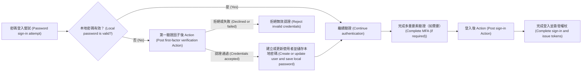

# Actions

Logto Actions 讓你能在驗證 (Authentication) 流程的特定階段執行受信任的 JavaScript。Action 會同步執行：驗證請求 (Authentication request) 會等待腳本執行完成，腳本結果可以更新使用者或決定流程是否繼續。

當決策必須發生在驗證流程內時，Actions 特別有用。常見應用場景包括：

- 使用者首次登入時，從舊有身分系統遷移使用者與密碼。
- 在 Logto 完成登入前，刷新使用者個人資料或應用程式專屬資料。
- 呼叫外部服務並將其結果套用至 Logto 使用者。

:::note
Actions 僅適用於 Logto Cloud Enterprise 方案。
:::

:::warning
Action 腳本可能影響驗證 (Authentication) 並修改使用者資料。僅應允許受信任的管理員檢視、建立、編輯、測試、啟用或刪除這些腳本。

在自我託管部署中，Action 腳本會在 Logto 伺服器程序內以其權限執行。授予腳本編輯或測試權限等同於授予 Logto 主機的程式碼執行權，因此管理主控台 (Admin Console) 不應與不受信任的使用者共用。請將腳本視為受信任的伺服器端程式碼；執行環境會限制腳本的執行時間與記憶體，但這並非不受信任程式碼的安全邊界。
:::

## Actions 在登入流程中的角色 \{#how-actions-fit-into-sign-in}

Logto 目前提供兩種 Action 類型：



| Action type                                                          | 執行時機                                                                            | 可執行動作                                                                                  |
| -------------------------------------------------------------------- | ----------------------------------------------------------------------------------- | ------------------------------------------------------------------------------------------- |
| [第一驗證因子後](/developers/actions/post-first-factor-verification) | 密碼登入時，僅在 Logto 的本地密碼驗證失敗後執行。本地密碼有效時不會執行。           | 針對舊有系統驗證提交的認證資訊，然後建立新的 Logto 使用者或更新現有使用者並遷移提交的密碼。 |
| [登入後](/developers/actions/post-sign-in)                           | 使用者完成所有驗證因子（包含需要時的 MFA）後，且在 Logto 完成登入並簽發權杖前執行。 | 使用最終登入情境更新並豐富現有 Logto 使用者。                                               |

這兩種 Action 僅會在 Experience API 的 `SignIn` 互動中執行。第一驗證因子後僅適用於密碼登入；登入後則與驗證方式無關。

## 腳本模型 \{#script-model}

每種 Action 類型都有一份設定與一個名為 `runAction` 的 JavaScript 入口函式：

```js
const runAction = async ({ event, environmentVariables = {} }) => {
  // 檢查 event，可選擇性抓取外部資料，並回傳此 Action 類型支援的結果。
};
```

傳入內容包含：

- `event`：實際驗證事件，其結構依 Action 類型而異。
- `environmentVariables`：為此 Action 設定的字串值。這些值會透過函式參數傳遞，不會出現在 `process.env`。

編輯器會提供型別資訊，但儲存後的腳本會以 JavaScript 執行。腳本可為非同步，且在 Logto Cloud 與自我託管 Logto 中皆可使用以下標準 Web API：

- `fetch`、`Request`、`Response`、`Headers`
- Web Crypto：`crypto` 與 `crypto.subtle`
- `TextEncoder`、`TextDecoder`
- `URL`、`URLSearchParams`

腳本無法匯入套件。請避免使用 Node.js 專屬全域變數與模組，因為這些在自我託管 Logto 與 Logto Cloud 間不可移植，且不屬於支援的腳本合約。

每種 Action 類型支援的回傳結果不同；啟用 Action 前請參閱對應的參考頁面。

## Actions 與 Webhook 的差異 \{#actions-and-webhooks}

Actions 與 [Webhook](/developers/webhooks) 目的不同：

|                      | Actions                        | Webhook                                 |
| -------------------- | ------------------------------ | --------------------------------------- |
| 執行方式             | 與驗證同步、內嵌執行           | 非同步、於驗證請求之外執行              |
| 可否影響當前驗證流程 | 可以                           | 不行                                    |
| 可否直接修改使用者   | 可以，透過支援的使用者 patch   | 不行；但接收端可另行呼叫 Management API |
| 事件涵蓋範圍         | 特定驗證節點                   | 廣泛的互動與資料變更事件                |
| 典型用途             | 認證遷移、權杖前個人資料豐富化 | 通知、下游同步、分析                    |

需進行非同步工作的情境請使用 Webhook。僅當 Logto 需要在驗證繼續前取得結果時才使用 Action。

## 下一步 \{#next-steps}

- [設定與測試 Actions](/developers/actions/configure-and-test-actions)
- [密碼登入時遷移使用者](/developers/actions/post-first-factor-verification)
- [登入後豐富使用者資料](/developers/actions/post-sign-in)
