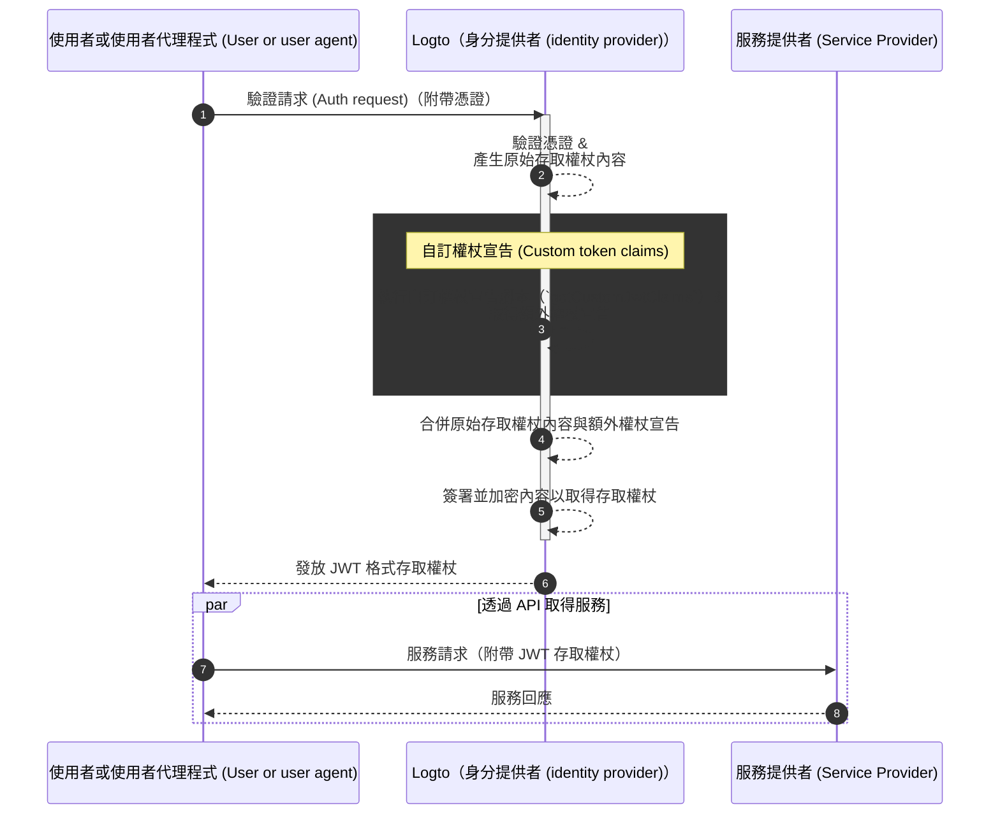

# 自訂權杖宣告 (Custom token claims)

Logto 提供在存取權杖 (存取權杖 (Access token)：JWT / 不透明權杖 (Opaque token)) 中新增自訂宣告 (Claims) 的彈性。透過此功能，你可以將額外的業務資訊安全地包含於權杖中，並在使用不透明權杖時透過 introspection 端點檢索這些資訊。

## 介紹 \{#introduction}

[存取權杖 (Access tokens)](https://auth.wiki/access-token) 在驗證 (Authentication) 與授權 (Authorization) 流程中扮演關鍵角色，攜帶主體的身分資訊與權限，並於 [Logto 伺服器](/concepts/core-service)（作為驗證伺服器或身分提供者 (IdP)）、你的 Web 服務伺服器（資源提供者）以及用戶端應用程式（客戶端）之間傳遞。

[權杖宣告 (Token claims)](https://auth.wiki/claim) 是提供有關實體或權杖本身資訊的鍵值對。宣告可能包含使用者資訊、權杖過期時間、權限以及其他與驗證 (Authentication) 和授權 (Authorization) 流程相關的中繼資料。

Logto 中有兩種類型的存取權杖：

- **JSON Web Token：** [JSON Web Token (JWT)](https://auth.wiki/jwt) 是一種流行的格式，以安全且可由客戶端讀取的方式編碼宣告。常見宣告如 `sub`、`iss`、`aud` 等，皆符合 OAuth 2.0 協議（詳見 [此連結](https://datatracker.ietf.org/doc/html/rfc7519#section-4)）。JWT 允許消費者直接存取宣告，無需額外驗證步驟。在 Logto 中，當客戶端針對特定資源或組織發起授權請求時，預設會以 JWT 格式發放存取權杖。
- **不透明權杖 (Opaque token)：** [不透明權杖 (Opaque token)](http://localhost:3000/concepts/opaque-token) 並非自我描述，總是需要透過 [權杖內省 (token introspection)](https://auth.wiki/token-introspection) 端點進行額外驗證。儘管格式不透明，不透明權杖仍可安全傳遞並取得宣告。權杖宣告會安全地儲存在 Logto 伺服器，並由客戶端應用程式透過權杖內省端點存取。當授權請求未包含特定資源或組織時，存取權杖會以不透明格式發放。這些權杖主要用於存取 OIDC `userinfo` 端點及其他一般用途。

在許多情境下，標準宣告無法滿足你的應用程式需求，無論你使用的是 JWT 或不透明權杖。為此，Logto 提供在存取權杖中新增自訂宣告的彈性。透過此功能，你可以將額外的業務資訊安全地包含於權杖中，並在使用不透明權杖時透過 introspection 端點檢索這些資訊。

## 自訂權杖宣告如何運作？\{#how-do-custom-token-claims-work}

Logto 允許你透過回呼函式 `getCustomJwtClaims` 將自訂宣告插入 `存取權杖 (access token)`。你可以實作自己的 `getCustomJwtClaims` 函式，回傳自訂宣告物件。回傳值會與原始權杖內容合併並簽署，產生最終的存取權杖。

:::warning
Logto 內建權杖宣告不可被覆蓋或修改。自訂宣告會以額外宣告的形式加入權杖中。若自訂宣告與內建宣告衝突，該自訂宣告將被忽略。
:::

## 相關資源 \{#related-resources}

<Url href="https://blog.logto.io/glance-on-custom-jwt-access-token-claims">
  使用 Logto 為 JWT 存取權杖新增自訂宣告，提升你的授權 (Authorization)
</Url>
