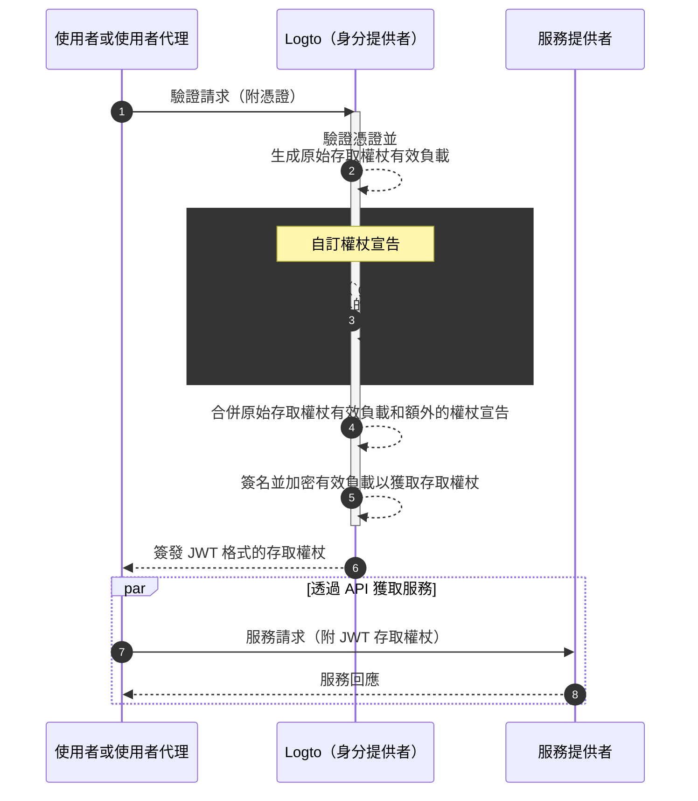

# 自訂權杖宣告 (Claims)

Logto 提供靈活性，允許在存取權杖（JWT / 不透明權杖）中新增自訂宣告 (Claims)。透過此功能，你可以在權杖中安全地傳輸額外的業務邏輯資訊，並在不透明權杖的情況下透過內省檢索這些資訊。

## 介紹 \{#introduction}

[存取權杖 (Access tokens)](https://auth.wiki/access-token) 在驗證 (Authentication) 和授權 (Authorization) 過程中扮演關鍵角色，攜帶主體的身分資訊和權限，並在 [Logto 伺服器](/concepts/core-service)（作為驗證伺服器或身分提供者 (IdP)）、你的網路服務伺服器（資源提供者）和客戶端應用程式（客戶端）之間傳遞。

[權杖宣告 (Token claims)](https://auth.wiki/claim) 是提供關於實體或權杖本身資訊的鍵值對。宣告可能包括使用者資訊、權杖到期時間、權限和其他與驗證 (Authentication) 和授權 (Authorization) 過程相關的元數據。

Logto 中有兩種類型的存取權杖：

- **JSON Web Token：** [JSON Web Token (JWT)](https://auth.wiki/jwt) 是一種流行的格式，以安全且可由客戶端讀取的方式編碼宣告。常見的宣告如 `sub`、`iss`、`aud` 等，符合 OAuth 2.0 協議（詳情請參閱[此連結](https://datatracker.ietf.org/doc/html/rfc7519#section-4)）。JWT 權杖允許消費者直接存取宣告而無需額外的驗證步驟。在 Logto 中，當客戶端初始化特定資源或組織的授權請求時，存取權杖預設以 JWT 格式簽發。
- **不透明權杖：** [不透明權杖 (Opaque token)](http://localhost:3000/concepts/opaque-token) 不是自包含的，始終需要透過 [權杖內省 (Token introspection)](https://auth.wiki/token-introspection) 端點進行額外的驗證步驟。儘管其格式不透明，不透明權杖可以幫助獲取宣告並在各方之間安全傳輸。權杖宣告安全地存儲在 Logto 伺服器中，並透過權杖內省端點由客戶端應用程式存取。當授權請求中未包含特定資源或組織時，存取權杖以不透明格式簽發。這些權杖主要用於存取 OIDC `userinfo` 端點和其他一般用途。

在許多情況下，標準宣告不足以滿足應用程式的特定需求，無論你使用的是 JWT 還是不透明權杖。為了解決這個問題，Logto 提供靈活性，允許在存取權杖中新增自訂宣告。透過此功能，你可以在權杖中安全地傳輸額外的業務邏輯資訊，並在不透明權杖的情況下透過內省檢索這些資訊。

## 自訂權杖宣告如何運作？ \{#how-do-custom-token-claims-work}

Logto 允許你透過回呼函數 `getCustomJwtClaims` 將自訂宣告插入 `存取權杖` 中。你可以提供 `getCustomJwtClaims` 函數的實作來返回自訂宣告的物件。返回值將與原始權杖有效負載合併並簽名以生成最終的存取權杖。

:::warning
Logto 內建的權杖宣告不能被覆蓋或修改。自訂宣告將作為額外宣告添加到權杖中。如果任何自訂宣告與內建宣告衝突，這些自訂宣告將被忽略。
:::

## 相關資源 \{#related-resources}

<Url href="https://blog.logto.io/glance-on-custom-jwt-access-token-claims">
  使用 Logto 為 JWT 存取權杖新增自訂宣告以提升授權
</Url>