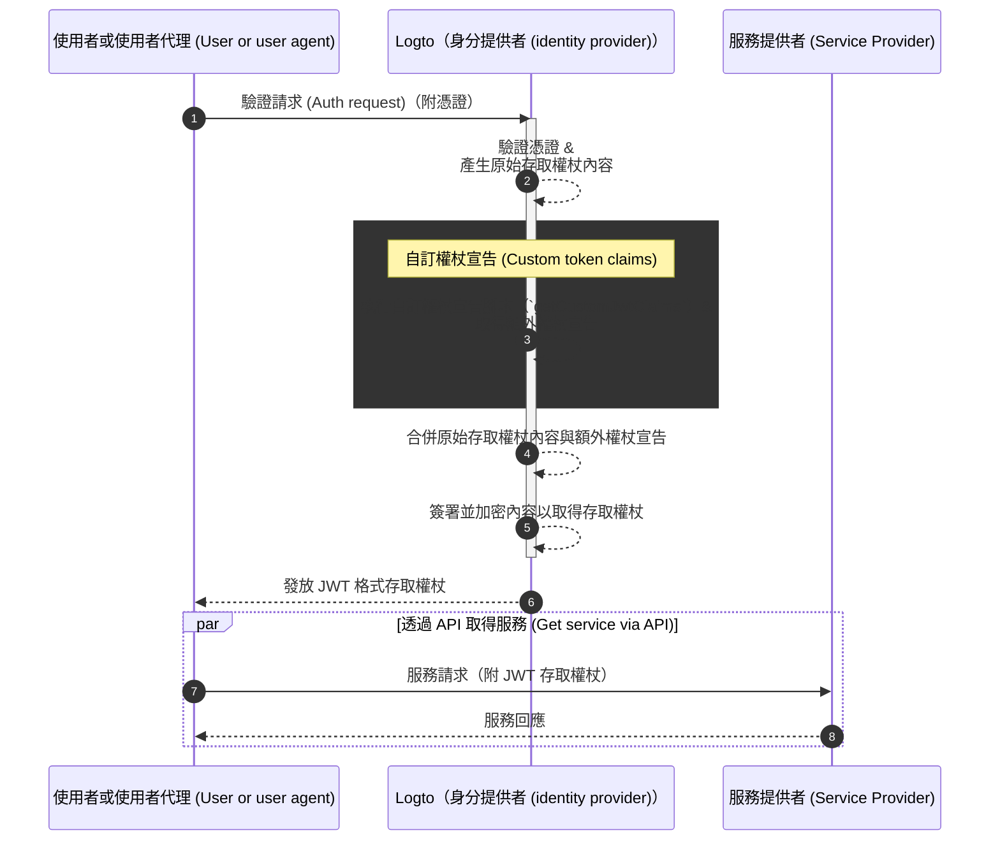

# 自訂存取權杖 (Custom access token)

Logto 提供在存取權杖（JWT / 不透明權杖 (Opaque token)）中新增自訂宣告 (Claim) 的彈性。透過此功能，你可以在權杖中安全地傳遞業務邏輯所需的額外資訊，若為不透明權杖 (Opaque token) 則可透過內省 (introspection) 取得。

## 簡介 \{#introduction}

[存取權杖 (Access tokens)](https://auth.wiki/access-token) 在驗證 (Authentication) 與授權 (Authorization) 流程中扮演關鍵角色，攜帶主體 (Subject) 的身分資訊與權限，並在 [Logto 伺服器](/concepts/core-service)（作為驗證伺服器或身分提供者 (IdP)）、你的 Web 服務伺服器（資源提供者）、以及用戶端應用程式（Client）之間傳遞。

[權杖宣告 (Token claims)](https://auth.wiki/claim) 是提供關於實體或權杖本身資訊的鍵值對。宣告可能包含使用者資訊、權杖到期時間、權限以及其他與驗證 (Authentication) 和授權 (Authorization) 流程相關的中繼資料。

Logto 中有兩種類型的存取權杖：

- **JSON Web Token：** [JSON Web Token (JWT)](https://auth.wiki/jwt) 是一種流行的格式，能以安全且可由用戶端讀取的方式編碼宣告。常見宣告如 `sub`、`iss`、`aud` 等，皆符合 OAuth 2.0 協議（詳見 [此連結](https://datatracker.ietf.org/doc/html/rfc7519#section-4)）。JWT 允許消費者直接存取宣告，無需額外驗證步驟。在 Logto 中，當 Client 發起特定資源或組織的授權請求時，預設會發放 JWT 格式的存取權杖。
- **不透明權杖 (Opaque token)：** [不透明權杖 (Opaque token)](http://localhost:3000/concepts/opaque-token) 並非自我描述，必須透過 [權杖內省 (token introspection)](https://auth.wiki/token-introspection) 端點進行額外驗證。雖然格式不透明，但不透明權杖 (Opaque token) 仍可安全傳遞並取得宣告。權杖宣告會安全儲存在 Logto 伺服器，並由用戶端應用程式透過權杖內省端點存取。當授權請求未包含特定資源或組織時，會發放不透明格式的存取權杖。這類權杖主要用於存取 OIDC `userinfo` 端點及其他一般用途。

許多情境下，標準宣告無法滿足應用程式的特定需求，無論你使用的是 JWT 或不透明權杖 (Opaque token)。為此，Logto 提供在存取權杖中自訂宣告的彈性。透過此功能，你可以在權杖中安全地傳遞業務邏輯所需的額外資訊，若為不透明權杖 (Opaque token) 則可透過內省取得。

## 自訂權杖宣告如何運作？\{#how-do-custom-token-claims-work}

Logto 允許你透過回呼函式 `getCustomJwtClaims` 將自訂宣告插入 `存取權杖 (access token)`。你可以實作 `getCustomJwtClaims` 函式，回傳自訂宣告物件。回傳值會與原始權杖內容合併並簽署，產生最終的存取權杖。

```mermaid
sequenceDiagram
  participant U as 使用者或使用者代理 (User or user agent)
  participant IdP as Logto（身分提供者 (identity provider)）
  participant SP as 服務提供者 (Service Provider)

  autonumber
  U ->> IdP: 驗證請求 (Auth request)（附憑證）
  activate IdP
  IdP-->>IdP: 驗證憑證 &<br/>產生原始存取權杖內容
  rect var(--mermaid-rect-fill)
  note over IdP: 自訂權杖宣告 (Custom token claims)
  IdP->>IdP: 執行自訂權杖宣告腳本（`getCustomJwtClaims`）&<br/>取得額外權杖宣告
  end
  IdP-->>IdP: 合併原始存取權杖內容與額外權杖宣告
  IdP-->>IdP: 簽署並加密內容以取得存取權杖
  deactivate IdP
  IdP-->>U: 發放 JWT 格式存取權杖
  par 透過 API 取得服務 (Get service via API)
  U->>SP: 服務請求（附 JWT 存取權杖）
  SP-->>U: 服務回應
  end
```

:::info
Logto 內建權杖宣告不可被覆蓋或修改。自訂宣告會以額外宣告形式加入權杖。若自訂宣告與內建宣告衝突，該自訂宣告將被忽略。
:::

:::warning
安全提醒：在自架部署中，自訂 JWT 腳本會以與 Logto 伺服器程序相同的權限執行，因此授予腳本編輯或測試權限等同於授予 Logto 主機的程式碼執行權限。此功能僅供受信任的管理員使用：請勿允許不受信任或低權限使用者建立、修改或測試這些腳本，也不要與他們共用管理主控台 (Admin Console)。
:::

## 相關資源 \{#related-resources}

<Url href="https://blog.logto.io/glance-on-custom-jwt-access-token-claims">
  使用 Logto 為 JWT 存取權杖新增自訂宣告，提升你的授權 (Authorization)
</Url>
