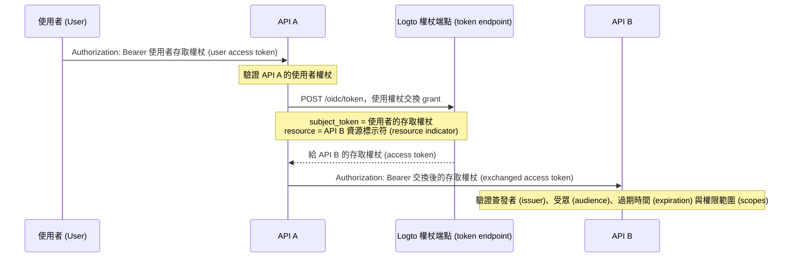

import TokenExchangePrerequisites from './fragments/_token-exchange-prerequisites.mdx';

# 服務對服務委派 (Service-to-service delegation)

在某些 API 架構中，後端服務會接收到已登入使用者的請求，並需要在保留使用者身分的情況下呼叫另一個後端服務。

例如：

```text
使用者 (User) -> API A -> API B
```

API B 需要知道兩件事：

1. 呼叫方是受信任的服務，例如 API A。
2. 這個操作是為原始使用者執行的。

使用 Logto 的權杖交換 (token exchange) grant，可以將使用者的存取權杖 (access token) 交換成以下游 API 資源為受眾 (audience) 的新存取權杖。這符合 OAuth 2.0 權杖交換模式，並避免將原始使用者權杖直接轉發給下游服務。

## 何時使用此流程 \{#when-to-use-this-flow}

當符合以下情境時，請使用服務對服務委派：

- API A 是可以安全驗證至 Logto 權杖端點的後端服務。
- API A 收到 Logto 發出的使用者存取權杖 (access token)。
- API A 需要以同一使用者的身分呼叫 API B。
- API B 應驗證一個以自身 API 資源為受眾 (audience) 的存取權杖 (access token)。

不要在純機器對機器（無使用者）存取時使用此流程。此時請改用 [client credentials flow](/quick-starts/m2m)。若為支援、管理員或代理人等場景，需讓一位使用者暫時以另一位使用者身分操作，請參考 [使用者模擬 (User impersonation)](/developers/user-impersonation)。

## 運作方式 \{#how-it-works}



交換後的存取權杖 (access token) 代表原始使用者（`sub`），並綁定於下游 API 資源（`aud`）。下游 API 也可檢查 `client_id` 宣告 (claim) 以識別發起交換的應用程式。

## 先決條件 \{#prerequisites}

1. 為相關服務建立 API 資源。請參閱 [保護全域 API 資源](/authorization/global-api-resources)。
2. 設定 API B 的權限，並透過角色或組織角色指派給使用者。
3. API A 請使用伺服器端應用程式（如機器對機器應用程式或傳統 Web 應用程式），以便能安全地使用應用程式密鑰進行驗證。
4. 為 API A 的應用程式啟用權杖交換 (token exchange)。

<TokenExchangePrerequisites />

## 為下游 API 請求存取權杖 \{#request-an-access-token-for-the-downstream-api}

當 API A 需要呼叫 API B 時，請向 Logto 的 [token endpoint](/integrate-logto/application-data-structure#token-endpoint) 發起權杖交換請求。

對於傳統 Web 應用程式或具備應用程式密鑰的機器對機器應用程式，請在 `Authorization` 標頭中帶入憑證：

```bash
POST /oidc/token HTTP/1.1
Host: tenant.logto.app
Content-Type: application/x-www-form-urlencoded
# highlight-next-line
Authorization: Basic <base64(api-a-app-id:api-a-app-secret)>

grant_type=urn:ietf:params:oauth:grant-type:token-exchange
&subject_token=<user_access_token_received_by_api_a>
&subject_token_type=urn:ietf:params:oauth:token-type:access_token
&resource=https://api-b.example.com
&scope=read:orders
```

參數說明：

1. `grant_type`：請使用 `urn:ietf:params:oauth:grant-type:token-exchange`。
2. `subject_token`：API A 收到的原始 Logto 發行的使用者存取權杖 (access token)。
3. `subject_token_type`：請使用 `urn:ietf:params:oauth:token-type:access_token`。
4. `resource`：API B 的資源標示符 (resource indicator)。
5. `scope`：API A 這次委派呼叫所需的下游權限範圍 (scopes)。Logto 僅會根據 RBAC 設定，發行原始使用者對該資源可用的請求權限範圍。

Logto 會回傳給 API B 的存取權杖 (access token)：

```json
{
  "access_token": "eyJhbGci...<truncated>",
  "token_type": "Bearer",
  "expires_in": 3600,
  "scope": "read:orders"
}
```

解碼後的存取權杖內容類似：

```json
{
  "sub": "user_id",
  "client_id": "api_a_app_id",
  "iss": "https://tenant.logto.app/oidc",
  "aud": "https://api-b.example.com",
  "scope": "read:orders",
  "exp": 1760000000
}
```

接著，API A 使用交換後的權杖呼叫 API B：

```bash
GET /orders HTTP/1.1
Host: api-b.example.com
Authorization: Bearer <exchanged_access_token>
```

## 在 API B 驗證權杖 \{#validate-the-token-in-api-b}

API B 應像驗證任何 Logto 發行的 API 資源存取權杖 (access token) 一樣驗證交換後的權杖：

1. 使用 Logto 的 JWKs 驗證簽章。
2. 檢查簽發者 (`iss`)。
3. 檢查受眾 (`aud`) 是否與 API B 的資源標示符相符。
4. 檢查過期時間 (`exp`)。
5. 檢查所需權限範圍 (scopes)。
6. 使用 `sub` 作為原始使用者 ID。
7. 若僅允許特定上游服務進行委派呼叫，可選擇性檢查 `client_id`。

實作指引請參閱 [在 API 中驗證存取權杖](/authorization/validate-access-tokens)。

## 相關資源 \{#related-resources}

<Url href="/authorization/global-api-resources">保護全域 API 資源</Url>

<Url href="/authorization/validate-access-tokens">在 API 中驗證存取權杖</Url>

<Url href="/developers/user-impersonation">使用者模擬 (User impersonation)</Url>
