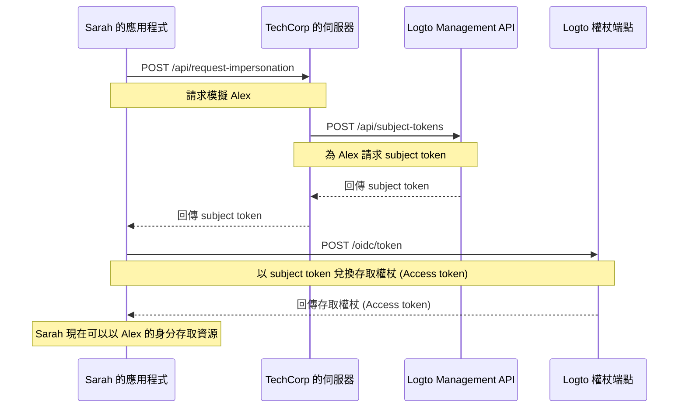

# 使用者模擬 (User impersonation)

想像一下，Sarah 是 TechCorp 的支援工程師，她收到來自客戶 Alex 的緊急工單，Alex 無法存取關鍵資源。為了有效診斷並解決問題，Sarah 需要看到系統中 Alex 所見的內容。這時，Logto 的使用者模擬功能就派上用場了。

使用者模擬允許經授權的使用者（如 Sarah）在系統內暫時以其他使用者（如 Alex）的身分行動。這個強大的功能對於疑難排解、提供客戶支援以及執行管理任務非常有價值。

## 運作方式？\{#how-it-works}



模擬流程包含三個主要步驟：

1. Sarah 透過 TechCorp 的後端伺服器請求模擬
2. TechCorp 的伺服器向 Logto 的 Management API 取得 subject token
3. Sarah 的應用程式用這個 subject token 兌換存取權杖 (Access token)

以下說明 Sarah 如何利用這個功能協助 Alex。

### 步驟 1：請求模擬 \{#step-1-requesting-impersonation}

首先，Sarah 的支援應用程式需向 TechCorp 的後端伺服器提出模擬請求。

**請求（Sarah 的應用程式 → TechCorp 伺服器）**

```bash
POST /api/request-impersonation HTTP/1.1
Host: api.techcorp.com
Authorization: Bearer <Sarah's_access_token>
Content-Type: application/json

{
  "userId": "alex123",
  "reason": "Investigating resource access issue",
  "ticketId": "TECH-1234"
}
```

在這個 API 中，後端應進行適當的授權 (Authorization) 檢查，確保 Sarah 具備模擬 Alex 的必要權限。

### 步驟 2：取得 subject token \{#step-2-obtaining-a-subject-token}

TechCorp 的伺服器在驗證 Sarah 的請求後，會呼叫 Logto 的 [Management API](/integrate-logto/interact-with-management-api) 以取得 subject token。

**請求（TechCorp 伺服器 → Logto Management API）**

```bash
POST /api/subject-tokens HTTP/1.1
Host: techcorp.logto.app
Authorization: Bearer <TechCorp_m2m_access_token>
Content-Type: application/json

{
  "userId": "alex123",
  "context": {
    "ticketId": "TECH-1234",
    "reason": "Resource access issue",
    "supportEngineerId": "sarah789"
  }
}
```

**回應（Logto → TechCorp 伺服器）**

```json
{
  "subjectToken": "sub_7h32jf8sK3j2",
  "expiresIn": 600
}
```

TechCorp 的伺服器接著將這個 subject token 回傳給 Sarah 的應用程式。

**回應（TechCorp 伺服器 → Sarah 的應用程式）**

```json
{
  "subjectToken": "sub_7h32jf8sK3j2",
  "expiresIn": 600
}
```

### 步驟 3：以 subject token 兌換存取權杖 (Access token) \{#step-3-exchanging-the-subject-token-for-an-access-token}

現在，Sarah 的應用程式會用這個 subject token 兌換代表 Alex 的存取權杖 (Access token)，並指定權杖將用於的資源。

**請求（Sarah 的應用程式 → Logto 權杖端點）**

```bash
POST /oidc/token HTTP/1.1
Host: techcorp.logto.app
Content-Type: application/x-www-form-urlencoded

grant_type=urn:ietf:params:oauth:grant-type:token-exchange
&client_id=techcorp_support_app
&scope=resource:read
&subject_token=alx_7h32jf8sK3j2
&subject_token_type=urn:ietf:params:oauth:token-type:access_token
&resource=https://api.techcorp.com/customer-data
```

**回應（Logto → Sarah 的應用程式）**

```json
{
  "access_token": "eyJhbG...<truncated>",
  "issued_token_type": "urn:ietf:params:oauth:token-type:access_token",
  "token_type": "Bearer",
  "expires_in": 3600,
  "scope": "resource:read"
}
```

回傳的 `access_token` 會綁定於指定資源，確保僅能用於 TechCorp 的客戶資料 API。

**注意**：對於傳統網頁應用程式，請在權杖請求的 header 中包含 `client_id` 與 `client_secret`，以避免 401 invalid_client 錯誤。

Node.js 範例如下：

```json
Authorization: `Basic ${Buffer.from(`${client_id}:${client_secret}`, 'utf8').toString('base64')}`
```

## 使用範例 \{#example-usage}

以下是 Sarah 在 Node.js 支援應用程式中的使用範例：

```jsx
interface ImpersonationResponse {
  subjectToken: string;
  expiresIn: number;
}

interface TokenExchangeResponse {
  access_token: string;
  issued_token_type: string;
  token_type: string;
  expires_in: number;
  scope: string;
}

async function impersonateUser(
  userId: string,
  clientId: string,
  ticketId: string,
  resource: string
): Promise<string> {
  try {
    // 步驟 1 & 2：請求模擬並取得 subject token
    const impersonationResponse = await fetch(
      'https://api.techcorp.com/api/request-impersonation',
      {
        method: 'POST',
        headers: {
          Authorization: "Bearer <Sarah's_access_token>",
          'Content-Type': 'application/json',
        },
        body: JSON.stringify({
          userId,
          reason: 'Investigating resource access issue',
          ticketId,
        }),
      }
    );

    if (!impersonationResponse.ok) {
      throw new Error(`HTTP error occurred. Status: ${impersonationResponse.status}`);
    }

    const { subjectToken } = (await impersonationResponse.json()) as ImpersonationResponse;

    // 步驟 3：以 subject token 兌換存取權杖 (Access token)
    const tokenExchangeBody = new URLSearchParams({
      grant_type: 'urn:ietf:params:oauth:grant-type:token-exchange',
      client_id: clientId,
      scope: 'openid profile resource.read',
      subject_token: subjectToken,
      subject_token_type: 'urn:ietf:params:oauth:token-type:access_token',
      resource: resource,
    });

    const tokenExchangeResponse = await fetch('https://techcorp.logto.app/oidc/token', {
      method: 'POST',
      headers: { 'Content-Type': 'application/x-www-form-urlencoded' },
      body: tokenExchangeBody,
    });

    if (!tokenExchangeResponse.ok) {
      throw new Error(`HTTP error! status: ${tokenExchangeResponse.status}`);
    }

    const tokenData = (await tokenExchangeResponse.json()) as TokenExchangeResponse;
    return tokenData.access_token;
  } catch (error) {
    console.error('Impersonation failed:', error);
    throw error;
  }
}

// Sarah 使用這個函式來模擬 Alex
async function performImpersonation(): Promise<void> {
  try {
    const accessToken = await impersonateUser(
      'alex123',
      'techcorp_support_app',
      'TECH-1234',
      'https://api.techcorp.com/customer-data'
    );
    console.log('Impersonation access token for Alex:', accessToken);
  } catch (error) {
    console.error('Failed to perform impersonation:', error);
  }
}

// 執行模擬
void performImpersonation()
```

:::note

1. subject token 為短效且僅限一次使用。
2. 模擬存取權杖 (Access token) 不會附帶 [重新整理權杖 (Refresh token)](https://auth.wiki/refresh-token)。若權杖在 Sarah 解決 Alex 問題前過期，需重新執行此流程。
3. TechCorp 的後端伺服器必須實作適當的授權 (Authorization) 檢查，確保僅有經授權的支援人員（如 Sarah）能請求模擬。

:::

## `act` 宣告 (Claim) \{#act-claim}

當使用權杖交換流程進行模擬時，簽發的存取權杖 (Access token) 可包含額外的 `act`（actor）宣告 (Claim)。此宣告代表「行動方」的身分——在本例中即執行模擬的 Sarah。

若要包含 `act` 宣告，Sarah 的應用程式需在權杖交換請求中提供 `actor_token`，此權杖應為具備 `openid` 權限範圍 (Scope) 的有效存取權杖 (Access token)。請求範例如下：

```bash
POST /oidc/token HTTP/1.1
Host: techcorp.logto.app
Content-Type: application/x-www-form-urlencoded

grant_type=urn:ietf:params:oauth:grant-type:token-exchange
&client_id=techcorp_support_app
&scope=resource:read
&subject_token=alx_7h32jf8sK3j2
&subject_token_type=urn:ietf:params:oauth:token-type:access_token
&actor_token=sarah_access_token
&actor_token_type=urn:ietf:params:oauth:token-type:access_token
&resource=https://api.techcorp.com/customer-data
```

若有提供 `actor_token`，產生的存取權杖 (Access token) 會包含如下的 `act` 宣告：

```json
{
  "aud": "https://api.techcorp.com",
  "iss": "https://techcorp.logto.app",
  "exp": 1443904177,
  "sub": "alex123",
  "act": {
    "sub": "sarah789"
  }
}
```

這個 `act` 宣告明確指出 Sarah（sarah789）正以 Alex（alex123）的身分行動。`act` 宣告對於稽核與追蹤模擬操作非常有用。

## 自訂權杖宣告 (Claims) \{#customizing-token-claims}

Logto 允許你[自訂模擬權杖的宣告 (Claims)](/developers/custom-token-claims)。這對於在模擬流程中加入額外的上下文或中繼資料（如模擬原因或相關支援工單）非常有幫助。

當 TechCorp 的伺服器向 Logto Management API 請求 subject token 時，可以包含 `context` 物件：

```json
{
  "userId": "alex123",
  "context": {
    "ticketId": "TECH-1234",
    "reason": "Resource access issue",
    "supportEngineerId": "sarah789"
  }
}
```

這個 [context](/developers/custom-token-claims/create-script#context-only-available-for-user-access-token) 可在 `getCustomJwtClaims()` 函式中用來為最終存取權杖 (Access token) 加入特定宣告。範例如下：

```tsx
const getCustomJwtClaims = async ({ token, context, environmentVariables }) => {
  if (context.grant?.type === 'urn:ietf:params:oauth:grant-type:token-exchange') {
    const { ticketId, reason, supportEngineerId } = context.grant.subjectTokenContext;
    return {
      impersonation_context: {
        ticket_id: ticketId,
        reason: reason,
        support_engineer: supportEngineerId,
      },
    };
  }
  return {};
};
```

Sarah 最終取得的存取權杖 (Access token) 可能如下：

```json
{
  "sub": "alex123",
  "aud": "https://api.techcorp.com/customer-data",
  "impersonation_context": {
    "ticket_id": "TECH-1234",
    "reason": "Resource access issue",
    "support_engineer": "sarah789"
  }
  // ... 其他標準宣告 (Claims)
}
```

透過這種方式自訂存取權杖 (Access token) 宣告，TechCorp 可在權杖中包含有關模擬上下文的重要資訊，讓稽核與理解系統內的模擬行為更加容易。

:::note
在為權杖新增自訂宣告 (Claims) 時請謹慎，避免包含敏感資訊，以免權杖遭攔截或外洩時造成安全風險。JWT 雖經簽章但未加密，任何取得權杖的人都能看到宣告內容。
:::

## 相關資源 \{#related-resources}

<Url href="https://blog.logto.io/impersonation">
  什麼是資安與身分管理中的模擬 (Impersonation)？AI agent 如何運用？
</Url>
