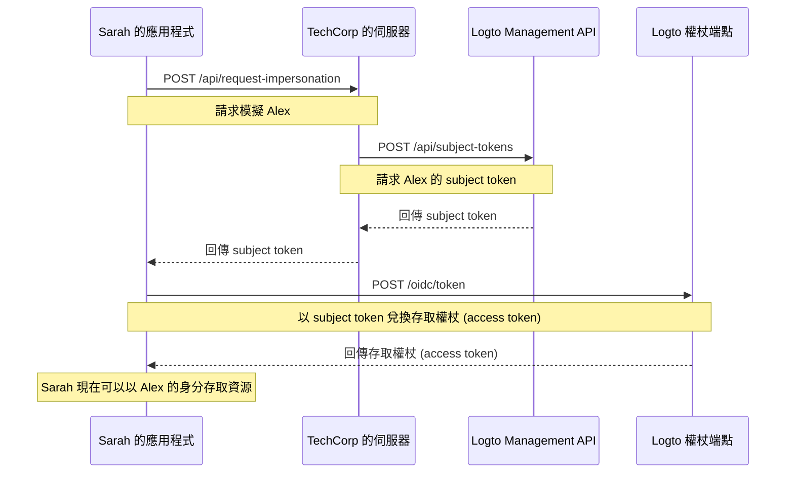

import TokenExchangePrerequisites from './fragments/_token-exchange-prerequisites.mdx';

# 使用者模擬 (User impersonation)

想像一下，TechCorp 的支援工程師 Sarah 收到來自客戶 Alex 的緊急工單，Alex 無法存取關鍵資源。為了有效診斷並解決問題，Sarah 需要看到與 Alex 在系統中完全相同的畫面。這時，Logto 的使用者模擬功能就派上用場了。

使用者模擬允許像 Sarah 這樣的授權使用者，能在系統內暫時以其他使用者（如 Alex）的身分行動。這項強大功能對於疑難排解、客戶支援與執行管理任務極為有用。

## 運作方式？\{#how-it-works}


```mermaid
sequenceDiagram
    participant Sarah as Sarah 的應用程式
    participant TechCorp as TechCorp 的伺服器
    participant Logto as Logto Management API
    participant LogtoToken as Logto 權杖端點

    Sarah->>TechCorp: POST /api/request-impersonation
    Note over Sarah,TechCorp: 請求模擬 Alex

    TechCorp->>Logto: POST /api/subject-tokens
    Note over TechCorp,Logto: 請求 Alex 的 subject token

    Logto-->>TechCorp: 回傳 subject token
    TechCorp-->>Sarah: 回傳 subject token

    Sarah->>LogtoToken: POST /oidc/token
    Note over Sarah,LogtoToken: 以 subject token 兌換存取權杖 (access token)

    LogtoToken-->>Sarah: 回傳存取權杖 (access token)
    Note over Sarah: Sarah 現在可以以 Alex 的身分存取資源
```

模擬流程包含三個主要步驟：

1. Sarah 透過 TechCorp 的後端伺服器請求模擬
2. TechCorp 的伺服器向 Logto 的 Management API 取得 subject token
3. Sarah 的應用程式將此 subject token 兌換為存取權杖 (access token)

以下說明 Sarah 如何利用此功能協助 Alex。

### 步驟 1：請求模擬 \{#step-1-requesting-impersonation}

首先，Sarah 的支援應用程式需向 TechCorp 的後端伺服器提出模擬請求。

**請求（Sarah 的應用程式 → TechCorp 伺服器）**

```bash
POST /api/request-impersonation HTTP/1.1
Host: api.techcorp.com
Authorization: Bearer <Sarah's_access_token>
Content-Type: application/json

{
  "userId": "alex123",
  "reason": "Investigating resource access issue",
  "ticketId": "TECH-1234"
}
```

在此 API 中，後端應進行適當的授權檢查，確保 Sarah 具備模擬 Alex 的必要權限。

### 步驟 2：取得 subject token \{#step-2-obtaining-a-subject-token}

TechCorp 的伺服器在驗證 Sarah 的請求後，會呼叫 Logto 的 [Management API](/integrate-logto/interact-with-management-api) 以取得 subject token。

**請求（TechCorp 伺服器 → Logto Management API）**

```bash
POST /api/subject-tokens HTTP/1.1
Host: techcorp.logto.app
Authorization: Bearer <TechCorp_m2m_access_token>
Content-Type: application/json

{
  "userId": "alex123",
  "context": {
    "ticketId": "TECH-1234",
    "reason": "Resource access issue",
    "supportEngineerId": "sarah789"
  }
}
```

**回應（Logto → TechCorp 伺服器）**

```json
{
  "subjectToken": "sub_7h32jf8sK3j2",
  "expiresIn": 600
}
```

TechCorp 的伺服器接著將此 subject token 回傳給 Sarah 的應用程式。

**回應（TechCorp 伺服器 → Sarah 的應用程式）**

```json
{
  "subjectToken": "sub_7h32jf8sK3j2",
  "expiresIn": 600
}
```

### 步驟 3：以 subject token 兌換存取權杖 (access token) \{#step-3-exchanging-the-subject-token-for-an-access-token}

<TokenExchangePrerequisites />

現在，Sarah 的應用程式會將此 subject token 兌換為代表 Alex 的存取權杖 (access token)，並指定權杖將用於的資源。

**請求（Sarah 的應用程式 → Logto 權杖端點）**

對於傳統網頁應用程式或帶有 app secret 的機器對機器應用程式，請在 `Authorization` 標頭中包含憑證：

```bash
POST /oidc/token HTTP/1.1
Host: techcorp.logto.app
Content-Type: application/x-www-form-urlencoded
# highlight-next-line
Authorization: Basic <base64(client_id:client_secret)>

grant_type=urn:ietf:params:oauth:grant-type:token-exchange
&scope=resource:read
&subject_token=alx_7h32jf8sK3j2
&subject_token_type=urn:ietf:params:oauth:token-type:access_token
&resource=https://api.techcorp.com/customer-data
```

對於單頁應用程式（SPA）或無 app secret 的原生應用程式，請在請求主體中包含 `client_id`：

```bash
POST /oidc/token HTTP/1.1
Host: techcorp.logto.app
Content-Type: application/x-www-form-urlencoded

grant_type=urn:ietf:params:oauth:grant-type:token-exchange
# highlight-next-line
&client_id=techcorp_support_app
&scope=resource:read
&subject_token=alx_7h32jf8sK3j2
&subject_token_type=urn:ietf:params:oauth:token-type:access_token
&resource=https://api.techcorp.com/customer-data
```

**回應（Logto → Sarah 的應用程式）**

```json
{
  "access_token": "eyJhbG...<truncated>",
  "issued_token_type": "urn:ietf:params:oauth:token-type:access_token",
  "token_type": "Bearer",
  "expires_in": 3600,
  "scope": "resource:read"
}
```

回傳的 `access_token` 會綁定於指定資源，確保僅能用於 TechCorp 的 customer data API。

## 範例用法 \{#example-usage}

以下展示 Sarah 如何在 Node.js 支援應用程式中使用此功能：

```tsx
interface ImpersonationResponse {
  subjectToken: string;
  expiresIn: number;
}

interface TokenExchangeResponse {
  access_token: string;
  issued_token_type: string;
  token_type: string;
  expires_in: number;
  scope: string;
}

async function impersonateUser(
  userId: string,
  clientId: string,
  ticketId: string,
  resource: string,
  // highlight-next-line
  clientSecret?: string // 傳統網頁或機器對機器應用程式需填寫
): Promise<string> {
  try {
    // 步驟 1 & 2：請求模擬並取得 subject token
    const impersonationResponse = await fetch(
      'https://api.techcorp.com/api/request-impersonation',
      {
        method: 'POST',
        headers: {
          Authorization: "Bearer <Sarah's_access_token>",
          'Content-Type': 'application/json',
        },
        body: JSON.stringify({
          userId,
          reason: 'Investigating resource access issue',
          ticketId,
        }),
      }
    );

    if (!impersonationResponse.ok) {
      throw new Error(`HTTP error occurred. Status: ${impersonationResponse.status}`);
    }

    const { subjectToken } = (await impersonationResponse.json()) as ImpersonationResponse;

    // 步驟 3：以 subject token 兌換存取權杖 (access token)
    // highlight-start
    // 傳統網頁或 M2M 應用程式請用 Basic auth 並帶入 client secret
    // SPA 或原生應用程式請在主體帶入 client_id
    const headers: Record<string, string> = {
      'Content-Type': 'application/x-www-form-urlencoded',
    };

    const tokenExchangeBody = new URLSearchParams({
      grant_type: 'urn:ietf:params:oauth:grant-type:token-exchange',
      scope: 'openid profile resource.read',
      subject_token: subjectToken,
      subject_token_type: 'urn:ietf:params:oauth:token-type:access_token',
      resource: resource,
    });

    if (clientSecret) {
      // 機密型 client：使用 Basic auth
      headers['Authorization'] =
        `Basic ${Buffer.from(`${clientId}:${clientSecret}`).toString('base64')}`;
    } else {
      // 公開型 client：主體帶入 client_id
      tokenExchangeBody.append('client_id', clientId);
    }
    // highlight-end

    const tokenExchangeResponse = await fetch('https://techcorp.logto.app/oidc/token', {
      method: 'POST',
      headers,
      body: tokenExchangeBody,
    });

    if (!tokenExchangeResponse.ok) {
      throw new Error(`HTTP error! status: ${tokenExchangeResponse.status}`);
    }

    const tokenData = (await tokenExchangeResponse.json()) as TokenExchangeResponse;
    return tokenData.access_token;
  } catch (error) {
    console.error('Impersonation failed:', error);
    throw error;
  }
}

// Sarah 使用此函式模擬 Alex
async function performImpersonation(): Promise<void> {
  try {
    // highlight-start
    // 傳統網頁或 M2M 應用程式需傳入 client secret
    const accessToken = await impersonateUser(
      'alex123',
      'techcorp_support_app',
      'TECH-1234',
      'https://api.techcorp.com/customer-data',
      'your-client-secret' // SPA 或原生應用程式可省略
    );
    // highlight-end
    console.log('Alex 的模擬存取權杖 (access token)：', accessToken);
  } catch (error) {
    console.error('執行模擬失敗：', error);
  }
}

// 執行模擬
void performImpersonation();
```

:::note

1. subject token 為短效且僅能使用一次。
2. 模擬存取權杖 (access token) 不會附帶 [重新整理權杖 (refresh token)](https://auth.wiki/refresh-token)。若權杖過期，Sarah 需重複此流程以協助 Alex。
3. TechCorp 的後端伺服器必須實作適當的授權檢查，確保僅有授權的支援人員（如 Sarah）能請求模擬。

:::

## `act` 宣告 (claim) \{#act-claim}

當使用權杖交換流程進行模擬時，發出的存取權杖 (access token) 可包含額外的 `act`（actor）宣告 (claim)。此宣告代表「執行方」的身分——在本例中即執行模擬的 Sarah。

若要包含 `act` 宣告，Sarah 的應用程式需在權杖交換請求中提供 `actor_token`，此權杖應為帶有 `openid` 權限範圍 (scope) 的有效存取權杖 (access token)。以下為請求範例：

傳統網頁或機器對機器應用程式：

```bash
POST /oidc/token HTTP/1.1
Host: techcorp.logto.app
Content-Type: application/x-www-form-urlencoded
# highlight-next-line
Authorization: Basic <base64(client_id:client_secret)>

grant_type=urn:ietf:params:oauth:grant-type:token-exchange
&scope=resource:read
&subject_token=alx_7h32jf8sK3j2
&subject_token_type=urn:ietf:params:oauth:token-type:access_token
&actor_token=sarah_access_token
&actor_token_type=urn:ietf:params:oauth:token-type:access_token
&resource=https://api.techcorp.com/customer-data
```

SPA 或原生應用程式則在主體帶入 `client_id`：

```bash
POST /oidc/token HTTP/1.1
Host: techcorp.logto.app
Content-Type: application/x-www-form-urlencoded

grant_type=urn:ietf:params:oauth:grant-type:token-exchange
# highlight-next-line
&client_id=techcorp_support_app
&scope=resource:read
&subject_token=alx_7h32jf8sK3j2
&subject_token_type=urn:ietf:params:oauth:token-type:access_token
&actor_token=sarah_access_token
&actor_token_type=urn:ietf:params:oauth:token-type:access_token
&resource=https://api.techcorp.com/customer-data
```

若有提供 `actor_token`，產生的存取權杖 (access token) 會包含如下的 `act` 宣告 (claim)：

```json
{
  "aud": "https://api.techcorp.com",
  "iss": "https://techcorp.logto.app",
  "exp": 1443904177,
  "sub": "alex123",
  "act": {
    "sub": "sarah789"
  }
}
```

此 `act` 宣告明確指出 Sarah（sarah789）正以 Alex（alex123）的身分行動。`act` 宣告有助於稽核與追蹤模擬操作。

## 自訂權杖宣告 (Customizing token claims) \{#customizing-token-claims}

Logto 允許你[自訂模擬權杖的宣告 (claims)](/developers/custom-token-claims)。這對於在模擬流程中加入額外情境或中繼資料（如模擬原因或支援工單）非常有用。

當 TechCorp 的伺服器向 Logto Management API 請求 subject token 時，可包含 `context` 物件：

```json
{
  "userId": "alex123",
  "context": {
    "ticketId": "TECH-1234",
    "reason": "Resource access issue",
    "supportEngineerId": "sarah789"
  }
}
```

此 [context](/developers/custom-token-claims/create-script#context-only-available-for-user-access-token) 可於 `getCustomJwtClaims()` 函式中使用，將特定宣告加入最終存取權杖 (access token)。範例如下：

```tsx
const getCustomJwtClaims = async ({ token, context, environmentVariables }) => {
  if (context.grant?.type === 'urn:ietf:params:oauth:grant-type:token-exchange') {
    const { ticketId, reason, supportEngineerId } = context.grant.subjectTokenContext;
    return {
      impersonation_context: {
        ticket_id: ticketId,
        reason: reason,
        support_engineer: supportEngineerId,
      },
    };
  }
  return {};
};
```

Sarah 取得的最終存取權杖 (access token) 可能如下：

```json
{
  "sub": "alex123",
  "aud": "https://api.techcorp.com/customer-data",
  "impersonation_context": {
    "ticket_id": "TECH-1234",
    "reason": "Resource access issue",
    "support_engineer": "sarah789"
  }
  // ... 其他標準宣告 (claims)
}
```

透過這種方式自訂存取權杖 (access token) 宣告，TechCorp 可在系統中輕鬆稽核與理解模擬操作的情境資訊。

:::note
為權杖新增自訂宣告 (claims) 時請謹慎，避免包含敏感資訊，以免權杖遭攔截或洩漏時造成安全風險。JWT 雖經簽章但未加密，任何取得權杖者皆可檢視內容。
:::

## 相關資源 \{#related-resources}

<Url href="https://blog.logto.io/impersonation">
  什麼是資安與身分管理中的模擬 (impersonation)？AI agent 如何運用？
</Url>
