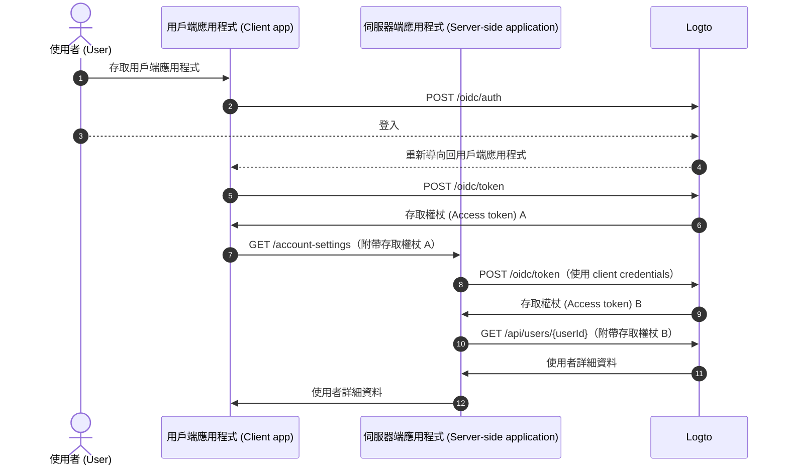
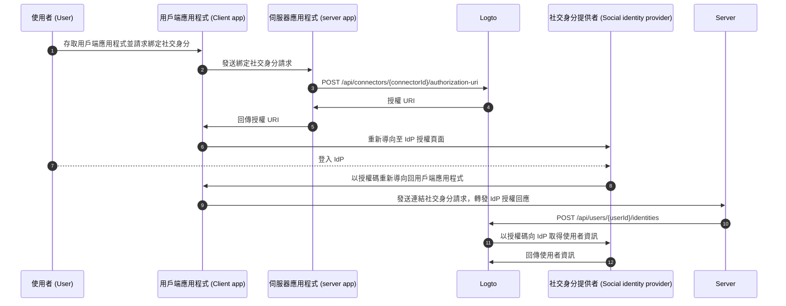

# 透過 Management API 管理帳號設定

## 整合方式 \{#integrations}

Logto 提供多種 Management API 來管理使用者帳號。你可以利用這些 API 為終端使用者打造自助帳號設定頁面。

### 架構說明 \{#architecture}

```mermaid
  graph TB
    A[使用者 (User)] --> B[用戶端應用程式 (Client application)]
    B -->|自架帳號設定 API 呼叫 (Self-hosted account settings API call)|C[伺服器端應用程式 (Server-side application)]
    C -->|Management API 呼叫 (Management API call)| D[Logto]
```

1. **使用者 (User)**：已驗證且需要存取與管理帳號設定的終端使用者。
2. **用戶端應用程式 (Client application)**：提供帳號設定頁面的應用程式。
3. **伺服器端應用程式 (Server-side application)**：為用戶端提供帳號設定 API 的伺服器端應用程式，並與 Logto Management API 互動。
4. **Logto**：作為驗證 (Authentication) 與授權 (Authorization) 服務，提供 Management API 以管理使用者帳號。

### 流程圖 \{#sequence-diagram}



1. 使用者存取用戶端應用程式。
2. 用戶端應用程式向 Logto 發送驗證請求，並將使用者導向 Logto 登入頁面。
3. 使用者登入 Logto。
4. 驗證後的使用者被重新導向回用戶端應用程式，並帶有授權碼。
5. 用戶端應用程式向 Logto 請求存取權杖 (Access token)，以存取自架帳號設定 API。
6. Logto 發放存取權杖給用戶端應用程式。
7. 用戶端應用程式攜帶使用者存取權杖向伺服器端應用程式發送帳號設定請求。
8. 伺服器端應用程式從使用者存取權杖驗證請求者身分與權限，並向 Logto 請求 Management API 存取權杖。
9. Logto 發放 Management API 存取權杖給伺服器端應用程式。
10. 伺服器端應用程式使用 Management API 存取權杖向 Logto 請求使用者資料。
11. Logto 驗證伺服器身分與 Management API 權限後回傳使用者資料。
12. 伺服器端應用程式根據請求者權限處理使用者資料，並回傳帳號詳細資料給用戶端應用程式。

### 在伺服器端應用程式整合 Management API \{#integrate-management-api-to-server-side-application}

請參閱 [Management API](/integrate-logto/interact-with-management-api/) 章節，瞭解如何將 Management API 整合至伺服器端應用程式。

## 使用者管理 API \{#user-management-apis}

### 使用者資料結構 \{#user-data-schema}

請參閱 [使用者資料與自訂資料](/user-management/user-data/) 章節，深入瞭解 Logto 中的使用者資料結構。

### 使用者個人資料與識別資訊管理 API \{#user-profile-and-identifiers-management-apis}

使用者的個人資料與識別資訊是使用者管理的核心。你可以透過下列 API 管理使用者個人資料與識別資訊。

| method | path                                                                                                     | description                      |
| ------ | -------------------------------------------------------------------------------------------------------- | -------------------------------- |
| GET    | [/api/users/\{userId\}](https://openapi.logto.io/operation/operation-getuser)                            | 依使用者 ID 取得使用者詳細資料。 |
| PATCH  | [/api/users/\{userId\}](https://openapi.logto.io/operation/operation-updateuser)                         | 更新使用者詳細資料。             |
| PATCH  | [/api/users/\{userId\}/profile](https://openapi.logto.io/operation/operation-updateuserprofile)          | 依使用者 ID 更新個人資料欄位。   |
| GET    | [/api/users/\{userId\}/custom-data](https://openapi.logto.io/operation/operation-listusercustomdata)     | 依使用者 ID 取得自訂資料。       |
| PATCH  | [/api/users/\{userId\}/custom-data](https://openapi.logto.io/operation/operation-updateusercustomdata)   | 依使用者 ID 更新自訂資料。       |
| PATCH  | [/api/users/\{userId\}/is-suspended](https://openapi.logto.io/operation/operation-updateuserissuspended) | 依使用者 ID 更新停權狀態。       |

### 電子郵件與手機號碼驗證 \{#email-and-phone-number-verification}

在 Logto 系統中，電子郵件地址與手機號碼皆可作為使用者識別資訊，因此驗證這些資訊非常重要。為此，我們提供一組驗證碼 API，協助驗證所提供的電子郵件或手機號碼。

:::note
請務必在更新使用者個人資料中的新電子郵件或手機號碼前，先完成驗證。
:::

| method | path                                                                                                                             | description                        |
| ------ | -------------------------------------------------------------------------------------------------------------------------------- | ---------------------------------- |
| POST   | [/api/verifications/verification-code](https://openapi.logto.io/operation/operation-createverificationbyverificationcode)        | 發送電子郵件或手機號碼驗證碼。     |
| POST   | [/api/verifications/verification-code/verify](https://openapi.logto.io/operation/operation-verifyverificationbyverificationcode) | 透過驗證碼驗證電子郵件或手機號碼。 |

### 使用者密碼管理 \{#user-password-management}

| method | path                                                                                                     | description                    |
| ------ | -------------------------------------------------------------------------------------------------------- | ------------------------------ |
| POST   | [/api/users/\{userId\}/password/verify](https://openapi.logto.io/operation/operation-verifyuserpassword) | 依使用者 ID 驗證目前密碼。     |
| PATCH  | [/api/users/\{userId\}/password](https://openapi.logto.io/operation/operation-updateuserpassword)        | 依使用者 ID 更新密碼。         |
| GET    | [/api/users/\{userId\}/has-password](https://openapi.logto.io/operation/operation-getuserhaspassword)    | 依使用者 ID 檢查是否設有密碼。 |

:::note
請務必在更新使用者密碼前，先驗證目前密碼。
:::

### 使用者社交身分管理 \{#user-social-identities-management}

| method | path                                                                                                                              | description                                                      |
| ------ | --------------------------------------------------------------------------------------------------------------------------------- | ---------------------------------------------------------------- |
| GET    | [/api/users/\{userId\}](https://openapi.logto.io/operation/operation-getuser)                                                     | 依使用者 ID 取得詳細資料，社交身分可於 `identities` 欄位中查詢。 |
| POST   | [/api/users/\{userId\}/identities](https://openapi.logto.io/operation/operation-createuseridentity)                               | 依使用者 ID 綁定已驗證的社交身分。                               |
| DELETE | [/api/users/\{userId\}/identities](https://openapi.logto.io/operation/operation-deleteuseridentity)                               | 依使用者 ID 解除綁定社交身分。                                   |
| PUT    | [/api/users/\{userId\}/identities](https://openapi.logto.io/operation/operation-replaceuseridentity)                              | 依使用者 ID 直接更新已綁定的社交身分。                           |
| POST   | [/api/connectors/\{connectorId\}/authorization-uri](https://openapi.logto.io/operation/operation-createconnectorauthorizationuri) | 取得社交身分提供者的授權 URI，使用此 URI 發起新的社交身分連結。  |



1. 使用者存取用戶端應用程式並請求綁定社交身分。
2. 用戶端應用程式向伺服器發送綁定社交身分請求。
3. 伺服器向 Logto 請求取得社交身分提供者的授權 URI。你需在請求中提供自訂 `state` 參數與 `redirect_uri`，並確保已在社交身分提供者註冊該 `redirect_uri`。
4. Logto 回傳授權 URI 給伺服器。
5. 伺服器將授權 URI 回傳給用戶端應用程式。
6. 用戶端應用程式將使用者重新導向至 IdP 授權 URI。
7. 使用者登入 IdP。
8. IdP 以 `redirect_uri` 及授權碼將使用者重新導向回用戶端應用程式。
9. 用戶端應用程式驗證 `state`，並將 IdP 授權回應轉發給伺服器。
10. 伺服器向 Logto 發送請求，將社交身分連結至使用者。
11. Logto 以授權碼向 IdP 取得使用者資訊。
12. IdP 回傳使用者資訊給 Logto，Logto 將社交身分連結至使用者。

:::note
透過 Management API 綁定新社交身分時，需注意以下限制：

- Management API 無任何 session 上下文，任何需要有效 session 以安全維持社交驗證狀態的社交連接器皆無法透過 Management API 綁定。不支援的連接器包含 apple、標準 OIDC 及標準 OAuth 2.0 連接器。
- 同理，Logto 無法驗證授權回應中的 `state` 參數。請務必在用戶端應用程式儲存 `state` 參數，並於收到授權回應時驗證。
- 你需事先將 `redirect_uri` 註冊至社交身分提供者，否則社交 IdP 不會將使用者導回你的用戶端應用程式。你的社交 IdP 必須允許多個 callback `redirect_uri`，一個用於使用者登入，一個用於個人資料綁定頁面。

:::

### 使用者企業身分管理 \{#user-enterprise-identities-management}

| method | path                                                                                                    | description                                                                                                                   |
| ------ | ------------------------------------------------------------------------------------------------------- | ----------------------------------------------------------------------------------------------------------------------------- |
| GET    | [/api/users/\{userId\}?includeSsoIdentities=true](https://openapi.logto.io/operation/operation-getuser) | 依使用者 ID 取得詳細資料，企業身分可於 `ssoIdentities` 欄位中查詢。於查詢 API 加入 `includeSsoIdentities=true` 參數即可取得。 |

目前 Management API 尚不支援將企業身分連結或解除連結至使用者。你僅能顯示已連結的企業身分。

### 個人存取權杖 (Personal access token) \{#personal-access-token}

| method | path                                                                                                                                 | description                    |
| ------ | ------------------------------------------------------------------------------------------------------------------------------------ | ------------------------------ |
| GET    | [/api/users/\{userId\}/personal-access-tokens](https://openapi.logto.io/operation/operation-listuserpersonalaccesstokens)            | 取得使用者所有個人存取權杖。   |
| POST   | [/api/users/\{userId\}/personal-access-tokens](https://openapi.logto.io/operation/operation-createuserpersonalaccesstoken)           | 新增一組個人存取權杖給使用者。 |
| DELETE | [/api/users/\{userId\}/personal-access-tokens/\{name\}](https://openapi.logto.io/operation/operation-deleteuserpersonalaccesstoken)  | 依名稱刪除使用者的權杖。       |
| PATCH  | [/api/users/\{userId\s}/personal-access-tokens/\{name\}](https://openapi.logto.io/operation/operation-updateuserpersonalaccesstoken) | 依名稱更新使用者的權杖。       |

個人存取權杖為使用者提供一種安全方式，可在不使用帳號密碼與互動式登入的情況下授予 [存取權杖 (Access token)](https://auth.wiki/access-token)。詳見 [個人存取權杖使用方式](/user-management/personal-access-token)。

### 使用者多重要素驗證 (MFA) 設定管理 \{#user-mfa-settings-management}

| method | path                                                                                                                                 | description                 |
| ------ | ------------------------------------------------------------------------------------------------------------------------------------ | --------------------------- |
| GET    | [/api/users/\{userId\}/mfa-verifications](https://openapi.logto.io/operation/operation-listusermfaverifications)                     | 依使用者 ID 取得 MFA 設定。 |
| POST   | [/api/users/\{userId\}/mfa-verifications](https://openapi.logto.io/operation/operation-createusermfaverification)                    | 依使用者 ID 設定 MFA 驗證。 |
| DELETE | [/api/users/\{userId\}/mfa-verifications/\{verificationId\}](https://openapi.logto.io/operation/operation-deleteusermfaverification) | 依驗證 ID 刪除 MFA 驗證。   |

### 使用者帳號刪除 \{#user-account-deletion}

| method | path                                                                             | description            |
| ------ | -------------------------------------------------------------------------------- | ---------------------- |
| DELETE | [/api/users/\{userId\}](https://openapi.logto.io/operation/operation-deleteuser) | 依使用者 ID 刪除帳號。 |
