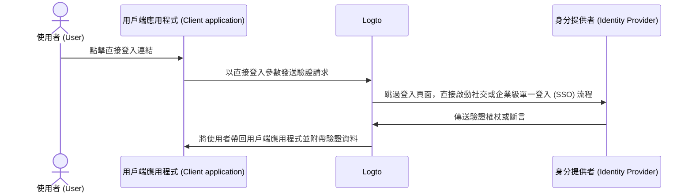

# 直接登入 (Direct sign-in)

直接登入 (Direct sign-in) 是 Logto 特有的 [驗證參數 (authentication parameter)](/end-user-flows/authentication-parameters)，可讓你直接啟動社交登入或企業級單一登入 (Enterprise SSO)，跳過預設的 Logto 通用登入頁面。

此功能特別適合你在網站上嵌入自訂登入頁面或身分提供者 (IdP, Identity Provider) 登入入口時使用（參見使用情境）。透過直接登入，你可以將使用者直接導向 IdP 的登入頁面。



## 社交登入 (Social sign-in) \{#social-sign-in}

傳遞 `direct_sign_in` 參數，值為 `social:<idp-name>`，即可直接啟動社交登入流程。

### 如何取得連接器 IdP 名稱 \{#where-to-find-the-connector-idp-name}

1. 前往 <CloudLink to="/connectors/social">控制台 > 連接器 > 社交連接器</CloudLink>
2. 點擊你要使用的 [社交連接器](/connectors/social-connectors)。
3. 在連接器設定頁頂部找到身分提供者名稱。


### 範例 \{#example}

使用 `direct_sign_in` 參數自行組裝驗證請求 URL：

```sh
curl --location \
  --request GET 'https://[tenant-id].logto.app/oidc/auth?client_id=1234567890&...&direct_sign_in=social:google'
```

在支援的 Logto SDK 中，呼叫 `signIn` 方法時可設定 `directSignIn` 參數：

```javascript
const authResult = await logto.signIn({
  redirectUri: 'https://your-app.com/callback',
  directSignIn: 'social:google',
});
```

## 企業級單一登入 (Enterprise SSO) \{#enterprise-sso}

傳遞 `direct_sign_in` 參數，值為 `sso:<connector-id>`，即可直接啟動企業級單一登入 (SSO) 流程。

### 如何取得企業級單一登入連接器 ID \{#where-to-find-the-enterprise-sso-connector-id}

1. 前往 <CloudLink to="/enterprise-sso">控制台 > 企業級單一登入 (Enterprise SSO)</CloudLink>
2. 點擊你要使用的 [企業連接器](/connectors/enterprise-connectors)。
3. 在連接器設定頁頂部找到連接器 ID。


### 範例 \{#example-1}

使用 `direct_sign_in` 參數自行組裝驗證請求 URL：

```sh
curl --location \
  --request GET 'https://[tenant-id].logto.app/oidc/auth?client_id=1234567890&...&direct_sign_in=sso:1234567890'
```

在支援的 Logto SDK 中，呼叫 `signIn` 方法時可設定 `directSignIn` 參數：

```javascript
logtoClient.signIn({
  redirectUri: 'https://your-app.com/callback',
  directSignIn: 'sso:1234567890',
});
```

## 回退至登入頁面 \{#fallback-to-the-sign-in-page}

若直接登入流程失敗（例如找不到或未啟用連接器），使用者將被導向標準登入頁面。

:::note
我們正逐步為所有 Logto SDK 加入 direct_sign_in 參數支援。若你的 SDK 尚未支援，請提交 issue 或聯絡我們。
:::

## 常見問題 \{#faqs}

<details>
  <summary>

### 直接登入和 API 驗證 (Authentication) 一樣嗎？\{#is-direct-sign-in-the-same-as-api-authentication}

</summary>

不一樣，直接登入是一種用戶流程參數，讓你跳過預設的 Logto 登入頁面，直接將使用者導向社交或企業級單一登入 (SSO) 提供者的登入頁面。與 API 驗證 (Authentication) 不同，使用者仍需先被導向 Logto 驗證端點以啟動登入流程。

</details>
