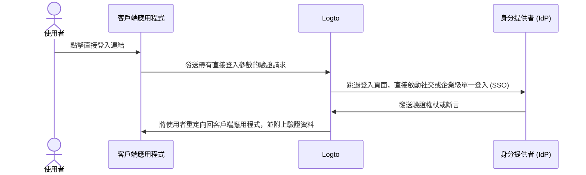

# 直接登入

直接登入是 Logto 特定的 [驗證 (Authentication) 參數](/end-user-flows/authentication-parameters)，允許你直接啟動社交登入或企業級單一登入 (SSO)，繞過預設的 Logto 通用登入頁面。

如果你在網站上嵌入了自訂登入頁面或 IdP 登入入口點，這個功能特別有用（查看使用案例）。透過直接登入，你可以將使用者直接重定向到 IdP 的登入頁面。



## 社交登入 \{#social-sign-in}

傳遞 `direct_sign_in` 參數，值為 `social:<idp-name>`，以直接啟動社交登入流程。

### 在哪裡找到連接器 IdP 名稱 \{#where-to-find-the-connector-idp-name}

1. 前往 <CloudLink to="/connectors/social">控制台 > 連接器 > 社交連接器</CloudLink>
2. 點擊你想使用的 [社交連接器](/connectors/social-connectors)。
3. 在連接器設定頁面的頂部找到身分提供者名稱。


### 範例 \{#example}

使用 `direct_sign_in` 參數構建你自己的驗證請求 URL：

```sh
curl --location \
  --request GET 'https://[tenant-id].logto.app/oidc/auth?client_id=1234567890&...&direct_sign_in=social:google'
```

在支援的 Logto SDK 中，你可以在呼叫 `signIn` 方法時設置 `directSignIn` 參數：

```javascript
const authResult = await logto.signIn({
  redirectUri: 'https://your-app.com/callback',
  directSignIn: 'social:google',
});
```

## 企業級單一登入 (SSO) \{#enterprise-sso}

傳遞 `direct_sign_in` 參數，值為 `sso:<connector-id>`，以直接啟動企業級單一登入 (SSO) 流程。

### 在哪裡找到企業級單一登入 (SSO) 連接器 ID \{#where-to-find-the-enterprise-sso-connector-id}

1. 前往 <CloudLink to="/enterprise-sso">控制台 > 企業級單一登入 (SSO)</CloudLink>
2. 點擊你想使用的 [企業連接器](/connectors/enterprise-connectors)。
3. 在連接器設定頁面的頂部找到連接器 ID。


### 範例 \{#example-1}

使用 `direct_sign_in` 參數構建你自己的驗證請求 URL：

```sh
curl --location \
  --request GET 'https://[tenant-id].logto.app/oidc/auth?client_id=1234567890&...&direct_sign_in=sso:1234567890'
```

在支援的 Logto SDK 中，你可以在呼叫 `signIn` 方法時設置 `directSignIn` 參數：

```javascript
logtoClient.signIn({
  redirectUri: 'https://your-app.com/callback',
  directSignIn: 'sso:1234567890',
});
```

## 回退到登入頁面 \{#fallback-to-the-sign-in-page}

如果直接登入流程失敗，例如找不到或未啟用連接器，使用者將被重定向到標準登入頁面。

:::note
我們正在逐步為所有 Logto SDK 添加對 `direct_sign_in` 參數的支援。如果在你的 SDK 中未看到此功能，請開啟問題或聯繫我們。
:::

## 常見問題 \{#faqs}

<details>
  <summary>

### 直接登入與 API 驗證 (Authentication) 相同嗎？ \{#is-direct-sign-in-the-same-as-api-authentication}

</summary>

不，直接登入是一個使用者流程參數，允許你跳過預設的 Logto 登入頁面，直接將使用者重定向到社交或企業級單一登入 (SSO) 提供者的登入頁面。與基於 API 的驗證不同，使用者仍需首先被重定向到 Logto 驗證端點以啟動登入流程。

</details>
