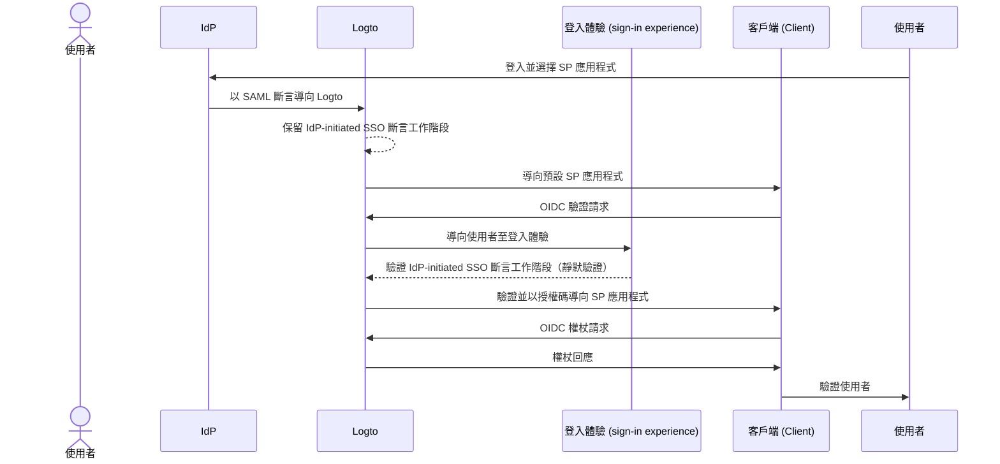
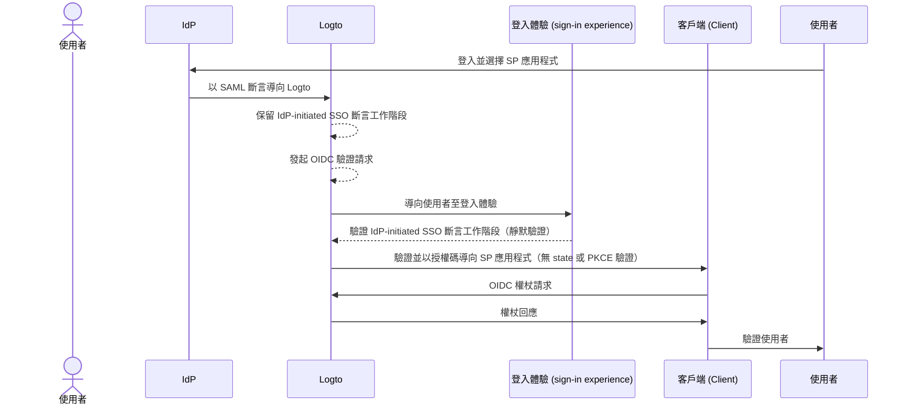

import Availability from '@components/Availability';

<Availability cloud="comingSoon" oss={false} />

# IdP-initiated SSO（僅限 SAML）

IdP-initiated SSO 是一種由身分提供者 (IdP, Identity Provider) 主導驗證流程的單一登入 (SSO, Single Sign-On) 機制。此流程從使用者登入 IdP 平台（如公司入口網站或集中式身分儀表板）開始。驗證通過後，IdP 會產生 SAML 斷言並將使用者導向服務提供者 (SP, Service Provider) 以存取應用程式或服務。


## 風險與注意事項 \{#risks-and-considerations}

IdP-initiated SSO 可能帶來多項安全風險，組織應特別留意。由於驗證流程由 IdP 發起，且非由使用者直接請求，因此容易受到各種攻擊，包括 [跨站請求偽造 (CSRF, Cross-Site Request Forgery)](https://blog.logto.io/csrf)。

缺乏使用者主動發起的驗證，若未妥善防護，可能導致未經授權的存取。此外，過度依賴單一驗證點也提高了安全漏洞風險，一旦 IdP 遭入侵，所有連接的應用程式都可能暴露。

因此，強烈建議優先採用 SP-initiated SSO，該方式能提供更安全且可控的驗證流程，確保使用者明確請求存取服務。

## 將 IdP-initiated SSO 連接至 Logto OIDC 應用程式 \{#connect-idp-initiated-sso-with-logto-oidc-applications}

Logto 作為 OpenID Connect (OIDC) 提供者，不支援 IdP-initiated SSO。然而，你可以將 Logto 配置為 SP，透過 SAML 與企業 IdP 整合以支援 IdP-initiated SSO。這樣可同時利用 Logto 的驗證能力，並維持 IdP 對驗證流程的主控權。

:::note
預設情況下，Logto 並未啟用此功能。如需為你的租戶啟用 IdP-initiated SSO，請聯繫我們的 [支援團隊](https://logto.io/contact?src=docs.sso)。
:::

### 先決條件 \{#prerequisites}

在設定 IdP-initiated SSO 前，需先建立 SAML 連接器。請前往 <CloudLink to="/enterprise-sso">Console > Enterprise SSO</CloudLink>，依照逐步指引與你的 IdP 建立 [SAML](/integrations/saml-sso/) 連接器。

SAML 連接器建立完成後，可於 <CloudLink to="/sign-in-experience/sign-up-and-sign-in">Sign-in & account > Sign-up and sign-in</CloudLink> 區段啟用 SSO 登入方式，並測試 SP-initiated SSO 流程以確保設定正確。請務必確認 SP-initiated SSO 運作正常後再進行 IdP-initiated SSO 設定。

### 啟用 IdP-initiated SSO \{#enable-idp-initiated-sso}

當你的租戶啟用 IdP-initiated SSO 功能後，會在 SAML 連接器設定頁看到一個名為 **IdP-initiated SSO** 的額外分頁。開啟 **IdP-initiated SSO** 開關，即可為該連接器啟用此功能。

### 選擇 SP 應用程式 \{#select-the-sp-application}

與 SP-initiated SSO（由 SP 發起驗證流程）不同，IdP-initiated SSO 需要一個客戶端 SP 應用程式，在驗證流程結束後將使用者重新導向。你可以在 **Default application** 下拉選單中，從已註冊的應用程式列表選擇 SP 應用程式。

IdP-initiated SSO 僅支援 **傳統網頁應用程式 (Traditional Web App)** 與 **單頁應用程式 (Single Page App)**。請根據你的使用情境選擇合適的應用程式類型。

:::note
在 IdP 端，請將 `RelayState` 參數設為 **空白**，以確保 IdP-initiated SSO 流程正確運作。Logto 會根據所選預設 SP 應用程式自動處理導向。
:::

## 設定 IdP-initiated 驗證流程 \{#configure-idp-initiated-authentication-flow}

為了將 IdP-initiated SAML SSO 與 OIDC 連接，Logto 提供兩種配置選項來處理驗證請求。

### 選項 A：導向預設 SP 應用程式（推薦） \{#option-a-redirect-to-the-default-sp-application-recommended}

當 IdP 發起 SSO 流程並將 SAML 斷言傳送至 Logto 時，會建立一個 IdP-initiated SSO 斷言工作階段。Logto 會將使用者導向預設 SP 應用程式，於客戶端啟動標準 OIDC 驗證請求。


```mermaid
sequenceDiagram
    actor User as 使用者
    participant IdP as IdP
    participant Logto as Logto
    participant Experience as 登入體驗 (sign-in experience)
    participant SP as 客戶端 (Client)

    使用者->>IdP: 登入並選擇 SP 應用程式
    IdP->>Logto: 以 SAML 斷言導向 Logto
    Logto-->>Logto: 保留 IdP-initiated SSO 斷言工作階段
    Logto->>SP: 導向預設 SP 應用程式
    SP->>Logto: OIDC 驗證請求
    Logto->>Experience: 導向使用者至登入體驗
    Experience-->>Logto: 驗證 IdP-initiated SSO 斷言工作階段（靜默驗證）
    Logto->>SP: 驗證並以授權碼導向 SP 應用程式
    SP->>Logto: OIDC 權杖請求
    Logto->>SP: 權杖回應
    SP->>使用者: 驗證使用者
```

要設定此選項，請於 SAML 連接器設定頁的 **IdP-initiated SSO** 分頁選擇 **導向客戶端進行 SP-initiated 驗證** 卡片。


1. 提供 **Client redirect URL**，於 IdP-initiated SSO 流程後將使用者導向預設 SP 應用程式。Logto 會將使用者導向此 URL，並附加 `?ssoConnectorId={connectorId}` 查詢參數。客戶端應用程式需處理此導向並啟動 OIDC 驗證請求。（建議於客戶端應用程式設置專用路由或頁面處理 IdP-initiated SSO 驗證請求。）

2. 客戶端應用程式於本地端使用 `ssoConnectorId` 查詢參數識別發起 IdP-initiated SSO 驗證流程的 SAML 連接器，並處理 OIDC 驗證請求。

3. 在登入請求中傳遞 [direct sign-in](/end-user-flows/authentication-parameters/direct-sign-in/) 驗證參數至 Logto，以完成 SSO 驗證流程。

```typescript
// React 範例
import { Prompt, useLogto } from '@logto/react';
import { useEffect } from 'react';
import { useNavigate, useSearchParams } from 'react-router-dom';

const SsoDirectSignIn = () => {
  const { signIn } = useLogto();
  const [searchParams] = useSearchParams();

  useEffect(() => {
    const ssoConnectorId = searchParams.get('ssoConnectorId');
    if (ssoConnectorId) {
      void signIn({
        redirectUri,
        prompt: Prompt.Login,
        directSignIn: {
          method: 'sso',
          target: ssoConnectorId,
        },
      });
    }
  }, [searchParams, signIn]);
};
```

- `redirectUri`：OIDC 驗證流程完成後導向使用者的 `redirect_uri`。
- `prompt=login`：強制使用者以 IdP-initiated SSO 身分登入。
- `directSignIn=sso:{connectorId}`：指定直接登入方式為 `sso`，並設定目標 SAML 連接器 ID。此參數將直接觸發 SSO 驗證流程，不顯示登入頁面。若連接器 ID 符合且工作階段有效，使用者將自動以保留的 IdP-initiated SSO 斷言工作階段驗證。

此方法確保驗證流程安全且遵循標準 OIDC 協議，同時維持 IdP 對驗證流程的主控權。客戶端應用程式可利用 IdP-initiated SSO 斷言工作階段自動驗證使用者，無需額外登入步驟，同時保持驗證流程安全可控。客戶端仍可驗證 `state` 與 `PKCE` 參數以確保驗證請求安全。

:::note
此方法適用於 **傳統網頁應用程式 (Traditional Web App)** 與 **單頁應用程式 (Single Page App)**，並建議所有情境皆採用此方式。
:::

### 選項 B：直接以 IdP-initiated SSO 驗證使用者 \{#option-b-directly-authenticate-the-user-with-idp-initiated-sso}

在某些情境下，SP 可能無法處理 IdP-initiated SSO 回呼並啟動 OIDC 驗證請求。此時，Logto 提供另一選項，允許直接以 IdP-initiated SSO 斷言工作階段驗證使用者。

此選項安全性較低，不建議使用。驗證流程會繞過標準 OIDC 協議。由於驗證請求由 IdP 發起，客戶端應用程式可能無法安全驗證驗證請求，例如無法驗證 `state` 與 `PKCE` 參數以確保請求安全。

:::warning
此方法不適用於 **單頁應用程式 (Single Page App)**，因為 SPA 必須透過 `PKCE` 參數安全處理驗證請求。若需為 SPA 實作 IdP-initiated SSO，請改用上述選項。
:::


```mermaid
  sequenceDiagram

  actor User as 使用者
  participant IdP as IdP
  participant Logto as Logto
  participant Experience as 登入體驗 (sign-in experience)
  participant SP as 客戶端 (Client)

  使用者->>IdP: 登入並選擇 SP 應用程式
  IdP->>Logto: 以 SAML 斷言導向 Logto
  Logto-->>Logto: 保留 IdP-initiated SSO 斷言工作階段
  Logto-->>Logto: 發起 OIDC 驗證請求
  Logto->>Experience: 導向使用者至登入體驗
  Experience-->>Logto: 驗證 IdP-initiated SSO 斷言工作階段（靜默驗證）
  Logto->>SP: 驗證並以授權碼導向 SP 應用程式（無 state 或 PKCE 驗證）
  SP->>Logto: OIDC 權杖請求
  Logto->>SP: 權杖回應
  SP->>使用者: 驗證使用者
```

要設定此選項，請於 SAML 連接器設定頁的 **IdP-initiated SSO** 分頁選擇 **直接以 IdP-initiated SSO 登入** 選項。


1. 選擇 **Post sign-in redirect URI**，於驗證成功後將使用者導回客戶端應用程式。此 URL 將作為 OIDC 驗證請求的 `redirect_uri`，且必須為客戶端應用程式已註冊的允許導向 URI 之一。

   :::note
   強烈建議為 IdP-initiated SSO 使用專用 **redirect URI**。由於驗證請求為非預期發起，客戶端應用程式應獨立管理回應，與標準 SP-initiated 驗證流程分開。
   :::

2. 如有需要，可透過 **Additional authentication parameters** JSON 編輯器（型別為 `Map<string,string>`）自訂授權請求參數。

   例如，Logto 預設僅請求 `openid` 與 `profile` 權限範圍 (scopes)。你可以新增額外權限範圍或參數至驗證請求。

   ```json
   {
     "scope": "email offline_access"
   }
   ```

   - 新增額外的 `email` 權限範圍以請求使用者電子郵件地址。
   - 新增 `offline_access` 權限範圍以請求重新整理權杖 (refresh token)。

   也建議你提供自訂的 `state` 參數，以安全驗證驗證回應。

   ```json
   {
     "state": "custom-state-value"
   }
   ```

   客戶端應用程式應於授權碼回應中驗證 `state` 參數，以確保驗證請求有效。
