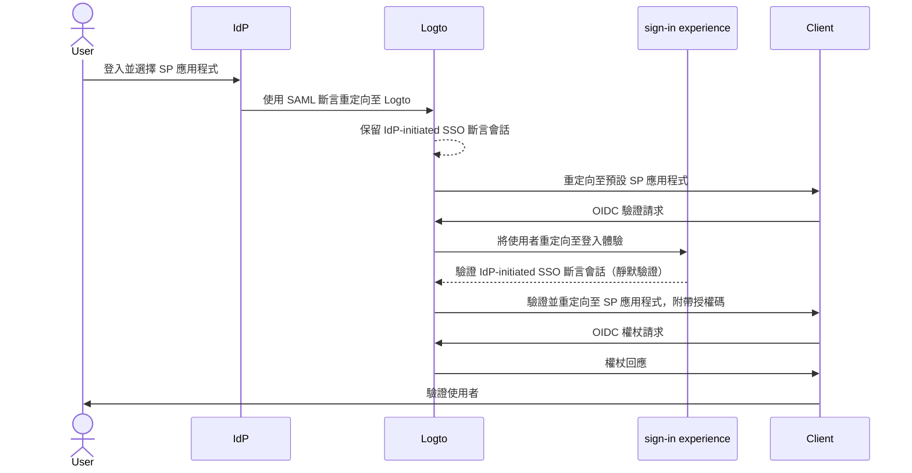
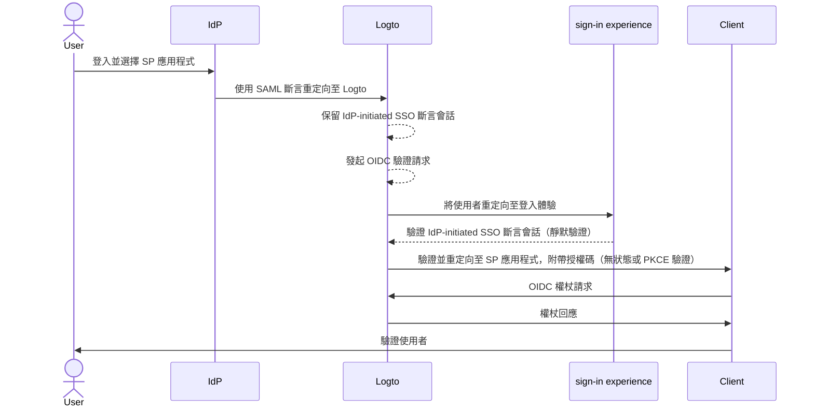

import Availability from '@components/Availability';

<Availability cloud="comingSoon" oss={false} />

# IdP-initiated SSO (僅限 SAML)

IdP-initiated SSO 是一種單一登入 (SSO) 流程，其中身分提供者 (IdP) 主要控制驗證流程。此流程始於使用者登入 IdP 的平台，例如公司入口網站或集中式身分儀表板。一旦驗證成功，IdP 會生成 SAML 斷言並將使用者導向服務提供者 (SP) 以存取應用程式或服務。


## 風險與考量 \{#risks-and-considerations}

IdP-initiated SSO 可能引入多種安全漏洞，組織應加以注意。由於驗證流程由 IdP 發起而非使用者直接請求，可能會受到各種攻擊，包括 [跨站請求偽造 (CSRF, Cross-Site Request Forgery)](https://blog.logto.io/csrf)。

這種缺乏使用者發起的驗證可能導致未經授權的存取，若未設置適當的防護措施。此外，依賴單一驗證點增加了安全漏洞的風險，因為一旦 IdP 被攻破，所有連接的應用程式都可能暴露。

因此，強烈建議使用 SP-initiated SSO，這提供了更安全且受控的驗證流程，確保使用者明確請求存取服務。

## 將 IdP-initiated SSO 與 Logto OIDC 應用程式連接 \{#connect-idp-initiated-sso-with-logto-oidc-applications}

作為 OpenID Connect (OIDC) 提供者的 Logto 不支援 IdP-initiated SSO。然而，你可以將 Logto 配置為 SP，以使用 SAML 支援與企業 IdP 的 IdP-initiated SSO。此設置允許你利用 Logto 的驗證功能，同時保持 IdP 對驗證流程的控制。

:::note
預設情況下，此功能在 Logto 中未啟用。如果你需要為租戶啟用 IdP-initiated SSO，請聯繫我們的 [支援團隊](https://logto.io/contact?src=docs.sso)。
:::

### 先決條件 \{#prerequisites}

在配置 IdP-initiated SSO 之前，你需要先建立一個 SAML 連接器。導航至 <CloudLink to="/enterprise-sso">Console > Enterprise SSO</CloudLink> 並按照分步指南設置與 IdP 的 [SAML](/integrations/saml-sso/) 連接器。

一旦 SAML 連接器設置完成，你可以在 <CloudLink to="/sign-in-experience">Sign-in experience</CloudLink> 部分啟用 SSO 登入方法，並測試 SP-initiated SSO 流程以確保配置正確。在進行 IdP-initiated SSO 之前，確保 SP-initiated SSO 正常運作。

### 啟用 IdP-initiated SSO \{#enable-idp-initiated-sso}

一旦為你的租戶啟用了 IdP-initiated SSO 功能，你應該會在 SAML 連接器的設定頁面看到一個名為 **IdP-initiated SSO** 的額外標籤。啟用 **IdP-initiated SSO** 切換開關以激活連接器的此功能。

### 選擇 SP 應用程式 \{#select-the-sp-application}

與 SP-initiated SSO 不同，IdP-initiated SSO 需要一個客戶端 SP 應用程式在驗證流程後重定向使用者。你可以從已註冊的應用程式列表中選擇 SP 應用程式作為 **Default application** 下拉選單中的選項。

IdP-initiated SSO 僅支援 **傳統 Web 應用程式 (Traditional Web App)** 和 **單頁應用程式 (Single Page App)**。請根據你的使用案例選擇適當的應用程式類型。

:::note
在你的 IdP 端，將 `RelayState` 參數留空以確保 IdP-initiated SSO 流程正常運作。Logto 將根據選定的預設 SP 應用程式處理重定向。
:::

## 配置 IdP-initiated 驗證流程 \{#configure-idp-initiated-authentication-flow}

為了將 IdP-initiated SAML SSO 與 OIDC 連接，Logto 提供了兩種配置選項來處理驗證請求。

### 選項 A：重定向至預設 SP 應用程式（推薦） \{#option-a-redirect-to-the-default-sp-application-recommended}

當 IdP 發起 SSO 流程並將 SAML 斷言發送至 Logto 時，將創建一個 IdP-initiated SSO 斷言會話。Logto 將使用者重定向至預設 SP 應用程式，以在客戶端發起標準 OIDC 驗證請求。



要設置此選項，請在 SAML 連接器設置的 **IdP-initiated SSO** 標籤中選擇 **Redirect to client for SP-initiated authentication** 卡片。


1. 提供一個 **Client redirect URL**，以便在 IdP-initiated SSO 流程後將使用者重定向至預設 SP 應用程式。Logto 將使用 `?ssoConnectorId={connectorId}` 查詢參數附加到 URL 進行重定向。客戶端應用程式應處理重定向並發起 OIDC 驗證請求。（我們建議在客戶端應用程式中使用專用路由或頁面來處理 IdP-initiated SSO 驗證請求。）

2. 使用 `ssoConnectorId` 查詢參數在客戶端處理 OIDC 驗證請求，以識別發起 IdP-initiated SSO 驗證流程的 SAML 連接器。

3. 在登入請求中傳遞 [直接登入](/end-user-flows/authentication-parameters/direct-sign-in/) 驗證參數至 Logto，以完成 SSO 驗證流程。

```typescript
// React 範例
import { Prompt, useLogto } from '@logto/react';
import { useEffect } from 'react';
import { useNavigate, useSearchParams } from 'react-router-dom';

const SsoDirectSignIn = () => {
  const { signIn } = useLogto();
  const [searchParams] = useSearchParams();

  useEffect(() => {
    const ssoConnectorId = searchParams.get('ssoConnectorId');
    if (ssoConnectorId) {
      void signIn({
        redirectUri,
        prompt: Prompt.Login,
        directSignIn: {
          method: 'sso',
          target: ssoConnectorId,
        },
      });
    }
  }, [searchParams, signIn]);
};
```

- `redirectUri`：在 OIDC 驗證流程完成後重定向使用者的 `redirect_uri`。
- `prompt=login`：強制使用者使用 IdP-initiated SSO 身分登入。
- `directSignIn=sso:{connectorId}`：指定直接登入方法為 `sso` 並設定目標 SAML 連接器 ID。此參數將直接觸發 SSO 驗證流程而不顯示登入頁面。如果連接器 ID 匹配且會話有效，使用者將自動通過保留的 IdP-initiated SSO 斷言會話進行驗證。

此方法確保驗證流程安全並遵循標準 OIDC 協議，同時保持 IdP 對驗證流程的控制。客戶端應用程式可以利用 IdP-initiated SSO 斷言會話來驗證使用者而無需額外的登入步驟，同時保持驗證流程的安全和控制。客戶端應用程式仍然可以驗證 `state` 和 `PKCE` 參數以確保驗證請求的安全性。

:::note
此方法適用於 **傳統 Web 應用程式 (Traditional Web App)** 和 **單頁應用程式 (Single Page App)**，並建議用於所有使用案例。
:::

### 選項 B：直接使用 IdP-initiated SSO 驗證使用者 \{#option-b-directly-authenticate-the-user-with-idp-initiated-sso}

在某些情況下，SP 可能無法處理 IdP-initiated SSO 回調並發起 OIDC 驗證請求。在這種情況下，Logto 提供了一個替代選項，直接使用 IdP-initiated SSO 斷言會話驗證使用者。

此選項被認為不太安全，不建議使用。驗證流程繞過了標準 OIDC 協議。由於驗證請求由 IdP 發起，客戶端應用程式可能無法安全地驗證驗證請求。例如，客戶端應用程式無法驗證 `state` 和 `PKCE` 參數以確保驗證請求的安全性。

:::warning
此方法不適用於 **單頁應用程式 (Single Page App)**，因為它需要客戶端應用程式使用 `PKCE` 參數安全地處理驗證請求。如果你需要為 SPA 應用程式實現 IdP-initiated SSO，請使用上述選項。
:::



要配置此選項，請在 SAML 連接器設置的 **IdP-initiated SSO** 標籤中選擇 **Directly sign-in using IdP-initiated SSO** 選項。


1. 選擇 **Post sign-in redirect URI**，以便在成功驗證後將使用者重定向回客戶端應用程式。此 URL 將用作 OIDC 驗證請求中的 `redirect_uri`。該 URI 必須是客戶端應用程式中註冊的允許重定向 URI 之一。

   :::note
   強烈建議為 IdP-initiated SSO 使用專用的 **redirect URI**。由於驗證請求是未經請求的，客戶端應用程式應獨立管理響應，與標準 SP-initiated 驗證流程分開。
   :::

2. 如有需要，使用 **Additional authentication parameters** JSON 編輯器自訂授權請求參數（遵循類型 `Map<string,string>`）。

   例如，預設情況下 Logto 僅請求 `openid` 和 `profile` 權限範圍。你可以在驗證請求中添加其他權限範圍或參數。

   ```json
   {
     "scope": "email offline_access"
   }
   ```

   - 添加額外的 `email` 權限範圍以請求使用者的電子郵件地址。
   - 添加 `offline_access` 權限範圍以請求重新整理權杖。

   我們還建議你提供自訂的 `state` 參數以安全地驗證驗證響應。

   ```json
   {
     "state": "custom-state-value"
   }
   ```

   客戶端應用程式應在授權碼響應中驗證 `state` 參數，以確保驗證請求有效。
