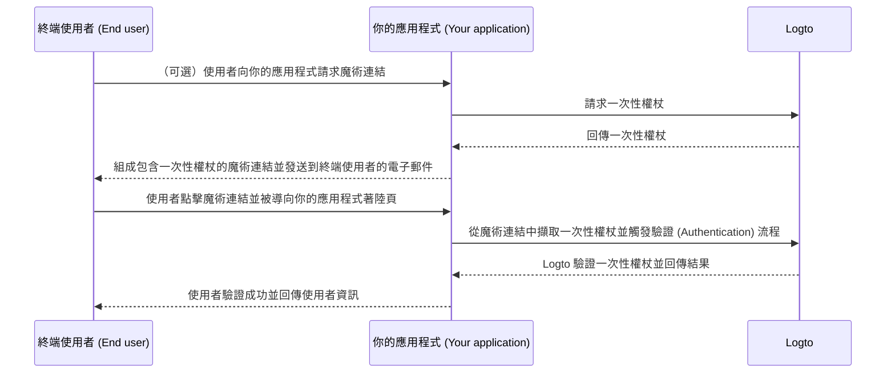

# 魔術連結（一次性權杖 / One-time token）

import Availability from '@components/Availability';

<Availability cloud oss={{ major: 1, minor: 27 }} />

類似一次性密碼（OTP），一次性權杖（one-time token）是另一種無密碼驗證 (Authentication) 方法，可用於驗證使用者身分。
該權杖僅在有限時間內有效，並與終端使用者的電子郵件地址綁定。

有時你可能希望邀請新使用者加入你的應用程式 / 組織 (Organization)，而不需他們先建立帳號。
或者你忘記密碼，想透過電子郵件快速驗證身分來登入 / 重設密碼。
這時，應用程式可以將「魔術連結」發送到你的電子郵件。當你點擊該連結時，將立即完成驗證 (Authentication)。

應用程式開發者可以利用一次性權杖組成魔術連結，並將其發送到終端使用者的電子郵件地址。

## 一次性權杖流程 \{#one-time-token-flow}

以下是使用一次性權杖進行驗證 (Authentication) 流程的時序圖：



## 實作指南 \{#implementation-guide}

Logto 提供一組 Management API 與 Experience API，協助你輕鬆實作魔術連結。

開始前，請確保你已有 Logto 實例，並已在應用程式伺服器與 Logto 端點間建立機器對機器 (M2M) 連線（Management API 需要）。詳見 [Logto Management API](/integrate-logto/interact-with-management-api)。

### 步驟 1：請求一次性權杖 \{#step-1-request-one-time-token}

使用 Logto Management API 建立一次性權杖。

```bash
POST /api/one-time-tokens
```

範例請求內容：

```json
{
  "email": "user@example.com",
  // 可選。預設為 600（10 分鐘）。
  "expiresIn": 3600,
  // 可選。驗證成功後，使用者將被佈建到指定組織 (Organizations)。
  "context": {
    "jitOrganizationIds": ["abcdefgh1234"]
  }
}
```

### 步驟 2：組成你的魔術連結 \{#step-2-compose-your-magic-link}

取得一次性權杖後，你可以組成魔術連結並發送到終端使用者的電子郵件。
魔術連結至少應包含權杖與使用者電子郵件作為參數，並導向你應用程式的著陸頁，例如 `https://yourapp.com/landing-page`。

以下為魔術連結範例：

```
https://yourapp.com/landing-page?token=YHwbXSXxQfL02IoxFqr1hGvkB13uTqcd&email=user@example.com
```

:::note

魔術連結中的參數名稱可完全自訂。
你可根據應用程式需求新增額外資訊，並對所有 URL 參數進行編碼。

:::

### 步驟 3：透過 Logto SDK 觸發驗證 (Authentication) 流程 \{#step-3-trigger-the-authentication-flow-via-logto-sdk}

終端使用者點擊魔術連結並進入你的應用程式後，你可以從 URL 擷取 `token` 與 `email` 參數，然後呼叫 Logto SDK 的 `signIn()` 函式觸發驗證流程。

```typescript title="TokenLandingPage.tsx"
// React 範例
import { useLogto } from '@logto/react';
import { useEffect } from 'react';
import { useSearchParams } from 'react-router-dom';

const TokenLandingPage = () => {
  const { signIn } = useLogto();
  const [searchParams] = useSearchParams();

  useEffect(() => {
    // 從魔術連結擷取權杖與電子郵件
    const oneTimeToken = searchParams.get('token');
    const email = searchParams.get('email');

    // 假設這是你的登入導向 URI
    const redirectUri = 'https://yourapp.com/callback';

    if (oneTimeToken && email) {
      signIn({
        redirectUri,
        clearTokens: false, // 可選。見下方警告說明
        extraParams: {
          'one_time_token': oneTimeToken,
          'login_hint': email,
        },
      });
    }
  }, [searchParams, signIn]);

  return <>請稍候...</>;
};
```

:::warning

若使用者已登入，從 SDK 呼叫 `signIn()` 函式會自動清除所有快取權杖（ID 權杖、存取權杖、重新整理權杖），
導致目前使用者的驗證狀態遺失。

因此，建議額外指定 `clearTokens: false` 參數，以避免清除現有權杖。
若指定此參數，你也需在登入回呼頁面手動清除權杖。

若你的魔術連結並非設計給已驗證 (Authentication) 使用者，則可忽略此設定。

:::

### 步驟 4：（可選）在登入回呼頁面清除快取權杖 \{#step-4-clear-cached-tokens-in-sign-in-callback-page}

若你在登入函式中指定 `clearTokens: false`，則需在登入回呼頁面手動清除權杖。

```typescript title="Callback.tsx"
// React 範例
import { useHandleSignInCallback, useLogto } from '@logto/react';
import { useEffect } from 'react';

const Callback = () => {
  const { clearAllTokens } = useLogto();

  useEffect(() => {
    void clearAllTokens();
  }, [clearAllTokens]);

  useHandleSignInCallback(() => {
    // 導向你的首頁
  });

  return <>請稍候...</>;
};
```

## 常見問題 \{#faqs}

<details>

<summary>

### 我可以用魔術連結邀請新使用者加入我的組織 (Organizations) 嗎？ \{#can-i-use-the-magic-link-to-invite-new-users-to-my-organizations}

</summary>

可以，你可以用魔術連結邀請新使用者加入你的應用程式或組織 (Organizations)。
若要邀請新使用者加入組織，只需在請求內容中指定 `jitOrganizationIds`。

使用者驗證成功後將自動加入組織，並分配預設組織角色。
請參閱組織詳細頁的「即時佈建 (Just-in-time provisioning)」區段，並設定組織的預設角色。

</details>

<details>

<summary>

### 一次性權杖會過期嗎？ \{#does-the-one-time-token-expire}

</summary>

會，一次性權杖會在指定的 `expiresIn` 時間（秒）後過期。預設過期時間為 10 分鐘。

</details>

<details>

<summary>

### 如果我在「登入體驗 (Sign-in Experience)」中停用使用者註冊，還能用魔術連結邀請使用者嗎？ \{#if-i-disable-user-registration-in-sign-in-experience-can-i-still-use-magic-link-to-invite-users}

</summary>

可以，即使你在「登入體驗 (Sign-in Experience)」中停用使用者註冊，仍可用魔術連結邀請使用者。

</details>

<details>

<summary>

### 如果使用者已登入，然後又點擊另一個魔術連結會發生什麼？ \{#what-will-happen-if-a-user-already-signed-in-and-then-click-another-magic-link}

</summary>

可能有以下幾種情境：

1. 使用者已登入，然後點擊與目前帳號關聯的魔術連結。此時，Logto 仍會驗證一次性權杖，並視需要將使用者佈建到指定組織。
2. 使用者已登入，然後點擊與不同帳號關聯的魔術連結。此時，Logto 會提示使用者切換為新帳號，或以目前帳號返回應用程式。
   1. 若使用者選擇切換為新帳號，Logto 會在權杖驗證成功後切換帳號。
   2. 若使用者選擇維持目前帳號，Logto 不會驗證權杖，並以目前帳號返回應用程式。
3. 若你的登入提示設為 "login" 或包含 "login"，Logto 會自動以一次性權杖關聯的帳號登入，且不提示切換。

</details>
