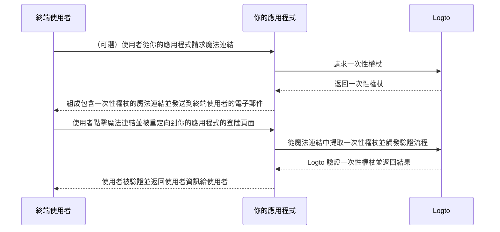

# 魔法連結（一次性權杖）

import Availability from '@components/Availability';

<Availability cloud oss="comingSoon" />

類似一次性密碼（OTP），一次性權杖是另一種無密碼驗證方法，可用於驗證使用者的身分。該權杖在有限時間內有效，並與終端使用者的電子郵件地址相關聯。

有時你可能希望邀請新使用者加入你的應用程式 / 組織，而不需要他們先創建帳戶。或者你可能忘記密碼，並希望透過電子郵件快速驗證身分來登入 / 重設密碼。在這些情況下，應用程式可以將「魔法連結」發送到你的電子郵件。當你點擊該連結時，你將立即被驗證。

應用程式開發者可以使用一次性權杖來組成魔法連結，並將其發送到終端使用者的電子郵件地址。

## 一次性權杖流程 \{#one-time-token-flow}

以下是使用一次性權杖進行驗證流程的序列圖：



## 實作指南 \{#implementation-guide}

Logto 提供了一套 Management API 和 Experience API 來簡化你的魔法連結實作。

在開始之前，確保你已準備好 Logto 實例，並已在你的應用程式伺服器與 Logto 端點之間建立機器對機器連接（Management API 所需）。了解更多關於 [Logto Management API](/integrate-logto/interact-with-management-api)。

### 步驟 1：請求一次性權杖 \{#step-1-request-one-time-token}

使用 Logto Management API 來創建一次性權杖。

```bash
POST /api/one-time-tokens
```

範例請求主體內容：

```json
{
  "email": "user@example.com",
  // 可選。預設為 600（10 分鐘）。
  "expiresIn": 3600,
  // 可選。使用者在成功驗證後將被配置到指定的組織。
  "context": {
    "jitOrganizationIds": ["abcdefgh1234"]
  }
}
```

### 步驟 2：組成你的魔法連結 \{#step-2-compose-your-magic-link}

獲得一次性權杖後，你可以組成魔法連結並將其發送到終端使用者的電子郵件地址。魔法連結至少應包含權杖和使用者電子郵件作為參數，並應導航到你自己應用程式中的登陸頁面。例如 `https://yourapp.com/landing-page`。

以下是一個簡單的魔法連結範例：

```
https://yourapp.com/landing-page?token=YHwbXSXxQfL02IoxFqr1hGvkB13uTqcd&email=user@example.com
```

:::note

魔法連結中的參數名稱可以完全自訂。你可以根據應用程式的需求，將額外資訊添加到魔法連結中，並對所有 URL 參數進行編碼。

:::

### 步驟 3：透過 Logto SDK 觸發驗證流程 \{#step-3-trigger-the-authentication-flow-via-logto-sdk}

終端使用者點擊魔法連結並導航到你的應用程式後，你可以從 URL 中提取 `token` 和 `email` 參數，然後調用 Logto SDK 的 `signIn()` 函數來觸發驗證流程。

```typescript title="TokenLandingPage.tsx"
// React 範例
import { useLogto } from '@logto/react';
import { useEffect } from 'react';
import { useSearchParams } from 'react-router-dom';

const TokenLandingPage = () => {
  const { signIn } = useLogto();
  const [searchParams] = useSearchParams();

  useEffect(() => {
    // 從魔法連結中提取權杖和電子郵件
    const oneTimeToken = searchParams.get('token');
    const email = searchParams.get('email');

    // 假設這是你的登入重定向 URI
    const redirectUri = 'https://yourapp.com/callback';

    if (oneTimeToken && email) {
      signIn({
        redirectUri,
        clearTokens: false, // 可選。請參閱下方警告訊息
        extraParams: {
          'one_time_token': oneTimeToken,
          'login_hint': email,
        },
      });
    }
  }, [searchParams, signIn]);

  return <>請稍候...</>;
};
```

:::warning

如果使用者已經登入，從 SDK 調用 `signIn()` 函數將自動清除客戶端存儲中的所有快取權杖（ID 權杖、存取權杖和重新整理權杖），這將導致當前使用者的驗證狀態丟失。

因此，你應該指定額外的登入參數 `clearTokens: false` 以避免清除現有權杖。如果指定了此參數，你還需要在登入回調頁面中手動清除權杖。

如果你的魔法連結不是為已驗證使用者設計的，則忽略此項。

:::

### 步驟 4：（可選）在登入回調頁面中清除快取權杖 \{#step-4-clear-cached-tokens-in-sign-in-callback-page}

如果你在登入函數中指定了 `clearTokens: false`，則需要在登入回調頁面中手動清除權杖。

```typescript title="Callback.tsx"
// React 範例
import { useHandleSignInCallback, useLogto } from '@logto/react';
import { useEffect } from 'react';

const Callback = () => {
  const { clearAllTokens } = useLogto();

  useEffect(() => {
    void clearAllTokens();
  }, [clearAllTokens]);

  useHandleSignInCallback(() => {
    // 導航到你的主頁
  });

  return <>請稍候...</>;
};
```

## 常見問題 \{#faqs}

<details>

<summary>

### 我可以使用魔法連結邀請新使用者加入我的組織嗎？ \{#can-i-use-the-magic-link-to-invite-new-users-to-my-organizations}

</summary>

是的，你可以使用魔法連結邀請新使用者加入你的應用程式以及組織。如果你想邀請新使用者加入你的組織，只需在請求主體中指定 `jitOrganizationIds`。

使用者在成功驗證後將自動加入組織，並分配預設的組織角色。查看組織詳細資訊頁面中的「即時佈建」部分，並配置組織的預設角色。

</details>

<details>

<summary>

### 一次性權杖會過期嗎？ \{#does-the-one-time-token-expire}

</summary>

是的，一次性權杖將在指定的 `expiresIn` 時間（以秒為單位）後過期。預設過期時間為 10 分鐘。

</details>

<details>

<summary>

### 如果我在「登入體驗」中禁用使用者註冊，仍然可以使用魔法連結邀請使用者嗎？ \{#if-i-disable-user-registration-in-sign-in-experience-can-i-still-use-magic-link-to-invite-users}

</summary>

是的，即使你在「登入體驗」中禁用了使用者註冊，你仍然可以使用魔法連結邀請使用者。

</details>

<details>

<summary>

### 如果使用者已經登入，然後點擊另一個魔法連結會發生什麼？ \{#what-will-happen-if-a-user-already-signed-in-and-then-click-another-magic-link}

</summary>

可能會有多種情況：

1. 使用者已經登入，然後點擊與當前使用者帳戶相關聯的魔法連結。在這種情況下，Logto 仍將驗證一次性權杖，並在需要時將使用者配置到指定的組織。
2. 使用者已經登入，然後點擊與不同帳戶相關聯的魔法連結。在這種情況下，Logto 將提示使用者繼續作為新帳戶，或返回應用程式並保持當前帳戶。
   1. 如果使用者選擇繼續作為新帳戶，Logto 將在權杖驗證成功後切換到新帳戶。
   2. 如果使用者選擇保持當前帳戶，Logto 將不會驗證權杖並返回應用程式並保持當前帳戶。
3. 如果你的登入提示設置為「login」或包含「login」，Logto 將自動登入與一次性權杖相關聯的帳戶，而不提示切換。

</details>
