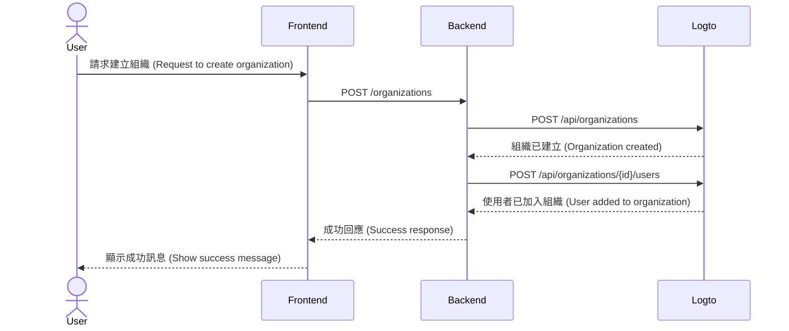

import GearIcon from '@site/src/assets/gear.svg';
import OrganizationIcon from '@site/src/assets/organization.svg';

# 組織使用體驗 (Organization experience)

[組織 (Organization)](/organizations) 使用體驗是指你的企業客戶及其員工在 [多租戶應用程式 (multi-tenant applications)](https://auth.wiki/multi-tenancy) 中所使用的一系列 UI 與流程。本指南將說明如何透過 Logto Management API 將其整合進你的應用程式。

本節協助你設計終端使用者的 **組織使用體驗 (organization experience)**，例如：

1. 管理員可以自行建立組織。
2. 管理員可以管理組織成員。
3. 管理員可以邀請成員加入組織。
4. 以及更多功能。

  

## 瞭解驗證流程 (authentication flow) \{#understand-the-authentication-flow}

要整合 Logto Management API，首先需瞭解基本的驗證流程 (authentication flow)。其有兩個關鍵要求：

### 保護你的後端 API \{#protect-your-backend-api}

- 前端呼叫你的後端 API 時需要驗證 (authentication)。
- 透過驗證使用者的 Logto 存取權杖 (access token) 來保護 API 端點。
- 確保只有已驗證的使用者能存取你的服務。

### 存取 Logto Management API \{#access-the-logto-management-api}

- 你的後端服務需安全地呼叫 Logto Management API。
- 請依照 [串接 Management API 指南 (Interact with Management API)](/integrate-logto/interact-with-management-api) 進行設置。
- 使用機器對機器驗證 (machine-to-machine authentication) 取得存取憑證。

接下來幾章將說明如何設置 Logto Management API，並逐步介紹打造組織使用體驗的常見情境。

## 組織使用體驗功能 \{#features-for-organization-experience}

<DocCardList
  items={[
    {
      type: 'link',
      label: '建立組織 (Create organization)',
      href: '/end-user-flows/organization-experience/create-organization',
      description: '使用 Logto Management API 讓終端使用者能在產品中自行建立組織。',
      customProps: {
        icon: <OrganizationIcon />,
      },
    },
    {
      type: 'link',
      label: '邀請成員加入組織 (Invite members to organization)',
      href: '/end-user-flows/organization-experience/invite-organization-members',
      description: '使用 Logto Management API 讓組織管理員邀請成員加入其組織。',
      customProps: {
        icon: <OrganizationIcon />,
      },
    },
    {
      type: 'link',
      label: '組織管理 (Organization management)',
      href: '/end-user-flows/organization-experience/organization-management',
      description: '使用 Logto Management API 讓組織管理員管理組織內的成員。',
      customProps: {
        icon: <GearIcon />,
      },
    },
  ]}
/>

如需組織定義、成員概念與組織範本的詳細說明，請參閱 [瞭解組織運作方式 (Understand how organizations work)](/organizations/understand-how-organizations-work)。

## 相關資源 \{#related-resources}

<Url href="https://blog.logto.io/build-multi-tenant-saas-application">
  打造多租戶 SaaS 應用程式：從設計到實作的完整指南
</Url>
