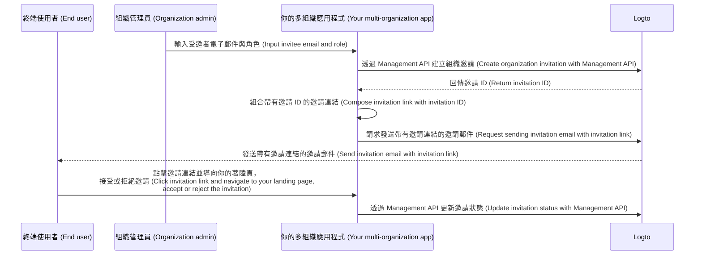

# 邀請組織成員

在多組織應用程式中，常見需求之一是邀請成員加入組織。本指南將帶你了解實作此功能的步驟與技術細節。

## 流程總覽 \{#flow-overview}

整體流程如下圖所示：



## 建立組織角色 \{#create-organization-roles}

在邀請成員之前，請先建立組織角色。詳情請參閱 [組織範本 (organization template)](/authorization/organization-template) 以瞭解角色與權限。

本指南將建立兩個典型的組織角色：`admin` 和 `member`。

`admin` 角色擁有組織內所有資源的完整存取權限，而 `member` 角色則有較有限的權限。例如：

- `admin` 角色：
  - `read:data` - 讀取所有組織資料資源的權限。
  - `write:data` - 寫入所有組織資料資源的權限。
  - `delete:data` - 刪除所有組織資料資源的權限。
  - `invite:member` - 邀請成員加入組織。
  - `manage:member` - 管理組織內成員。
  - `delete:member` - 移除組織成員。
- `member` 角色：
  - `read:data` - 讀取所有組織資料資源的權限。
  - `write:data` - 寫入所有組織資料資源的權限。
  - `invite:member` - 邀請成員加入組織。

你可以在 [Logto Console](https://cloud.logto.io/) 輕鬆完成這些設定，也可以透過 [Logto Management API](https://openapi.logto.io/operation/operation-createorganizationrole) 程式化建立組織角色。

## 設定你的電子郵件連接器 \{#configure-your-email-connector}

由於邀請是透過電子郵件發送，請確保你的 [電子郵件連接器 (email connector)](/connectors/email-connectors) 已正確設定。若要發送邀請，請設定一個 `OrganizationInvitation` 用途類型的 [電子郵件範本 (email template)](/connectors/email-connectors/email-templates#email-template-types)。你可以在內容中加入組織（如名稱、Logo）與邀請人（如電子郵件、名稱）[變數 (variables)](/connectors/email-connectors/email-templates#email-template-variables)，並根據需求自訂 [在地化範本 (localized templates)](/connectors/email-connectors/email-templates#email-template-localization)。

以下為 `OrganizationInvitation` 用途類型的電子郵件範本範例：

```json
{
  "subject": "歡迎加入我的組織 (Welcome to my organization)",
  "content": "<p>透過此 <a href=\"{{link}}\" target=\"_blank\">連結</a> 加入 {{organization.name}}。</p>",
  "usageType": "OrganizationInvitation",
  "type": "text/html"
}
```

電子郵件內容中的 `{{link}}` 佔位符會在郵件發送時自動替換為實際邀請連結。

:::note

Logto Cloud 內建的「Logto email service」目前尚不支援 `OrganizationInvitation` 用途類型。請改用你自己的電子郵件連接器（如 SendGrid），並設定 `OrganizationInvitation` 範本。

:::

## 透過 Logto Management API 處理邀請 \{#handle-invitations-with-logto-management-api}

:::note

如果你尚未設定 Logto Management API，請參閱 [與 Management API 互動 (Interact with Management API)](/integrate-logto/interact-with-management-api) 以取得詳細說明。

:::

### 使用 Logto Management API 建立組織邀請 \{#create-an-organization-invitation-with-logto-management-api}

在組織功能中有一組與邀請相關的 Management API。你可以透過這些 API：

- `POST /api/organization-invitations`：建立帶有指定組織角色的組織邀請。
- `POST /api/one-time-tokens`：為受邀者建立一次性權杖，供其接受邀請時驗證身分。[進一步瞭解](/end-user-flows/one-time-token)
- `POST /api/organization-invitations/{id}/message`：透過電子郵件將組織邀請發送給受邀者。
  注意：請求內容支援 `link` 屬性，你可以根據邀請 ID 組合自己的邀請連結。例如：

  ```json
  {
    "link": "https://your-app.com/invitation/join?id=your-invitation-id&token=your-one-time-token&email=invitee-email"
  }
  ```
