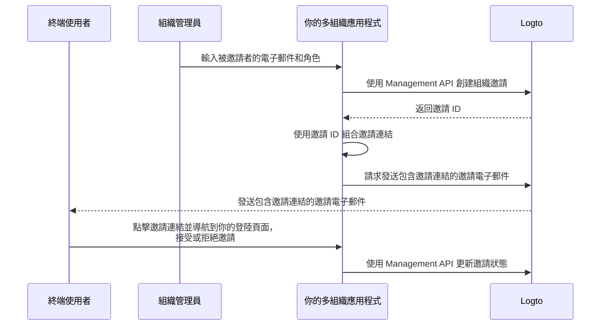

# 邀請組織成員

作為一個多組織應用程式，常見的需求之一是邀請成員加入你的組織。在本指南中，我們將引導你完成在應用程式中實現此功能的步驟和技術細節。

## 流程概述 \{#flow-overview}

整體流程如下圖所示：



## 創建組織角色 \{#create-organization-roles}

在邀請成員加入組織之前，你需要創建組織角色。查看 [配置組織模板](/authorization/organization-template/configure-organization-template)指南以獲取詳細說明。

在本指南中，我們將創建兩個典型的組織角色：`admin` 和 `member`。

`admin` 角色擁有對組織中所有資源的完全存取權，而 `member` 角色則有有限的存取權。例如，每個角色可以擁有以下權限集：

- `admin` 角色：
  - `read:data` - 讀取所有組織數據資源的存取權。
  - `write:data` - 寫入所有組織數據資源的存取權。
  - `delete:data` - 刪除所有組織數據資源的存取權。
  - `invite:member` - 邀請成員加入組織。
  - `manage:member` - 管理組織中的成員。
  - `delete:member` - 移除組織中的成員。
- `member` 角色：
  - `read:data` - 讀取所有組織數據資源的存取權。
  - `write:data` - 寫入所有組織數據資源的存取權。
  - `invite:member` - 邀請成員加入組織。

這可以在 [Logto Console](https://cloud.logto.io/) 中輕鬆完成。你也可以使用 [Logto Management API](https://openapi.logto.io/operation/operation-createorganizationrole) 以程式化方式創建組織角色。

## 配置你的電子郵件連接器 \{#configure-your-email-connector}

由於邀請是通過電子郵件發送的，請確保你的 [電子郵件連接器](/connectors/email-connectors)已正確配置。要發送邀請，你需要配置一個 [電子郵件模板](/connectors/email-connectors/email-templates#email-template-types) 使用類型 - `OrganizationInvitation`。你還可以在內容中包含組織（例如，組織名稱、標誌）和邀請者（例如，邀請者電子郵件、姓名）[變數](/connectors/email-connectors/email-templates#email-template-variables)，或根據需要自訂 [多語言模板](/connectors/email-connectors/email-templates#email-template-localization)。

以下是 `OrganizationInvitation` 使用類型的範例電子郵件模板：

```json
{
  "subject": "歡迎加入我的組織",
  "content": "<p>透過此 <a href=\"{{link}}\" target=\"_blank\">連結</a> 加入 {{organization.name}}。</p>",
  "usageType": "OrganizationInvitation",
  "type": "text/html"
}
```

電子郵件內容中的 `{{link}}` 佔位符在發送電子郵件時將被實際的邀請連結替換。在本指南中，假設它會是 `https://your-app.com/invitation/accept/{your-invitation-id}`。

:::note

Logto Cloud 的內建「Logto 電子郵件服務」目前不支援 `OrganizationInvitation` 使用類型。相反，你需要配置你的電子郵件連接器（例如 Sendgrid）並設置 `OrganizationInvitation` 模板。

:::

## 使用 Logto Management API 處理邀請 \{#handle-invitations-with-logto-management-api}

:::note

如果你尚未設置 Logto Management API，請查看 [與 Management API 互動](/integrate-logto/interact-with-management-api) 以獲取詳細資訊。

:::

我們在組織功能中提供了一組與邀請相關的 Management API。使用這些 API，你可以：

- `POST /api/organization-invitations` 創建具有指定組織角色的組織邀請。
- `POST /api/organization-invitations/{id}/message` 通過電子郵件將組織邀請發送給被邀請者。
  注意：此 API 載荷支持 `link` 屬性，你可以根據邀請 ID 組合你的邀請連結。例如：

  ```json
  {
    "link": "https://your-app.com/invitation/accept/{your-invitation-id}"
  }
  ```

  相應地，你需要實現一個登陸頁面，當被邀請者通過邀請連結導航到你的應用程式時。

- `GET /api/organization-invitations` 和 `GET /api/organization-invitations/{id}` 獲取所有邀請或通過 ID 獲取特定邀請。
  在你的登陸頁面上，使用這些 API 列出使用者收到的所有邀請或邀請的詳細資訊。
- `PUT /api/organization-invitations/{id}/status` 通過更新邀請狀態來接受或拒絕邀請。
  使用此 API 處理使用者對邀請的回應。

請注意，以上列出的所有 API 都需要有效的「組織權杖」。[查看此指南](/authorization/organization-template/protect-organization-resources#step-2-fetch-organization-token) 以了解如何獲取組織權杖。

## 使用組織角色型存取控制 (RBAC) 管理使用者權限 \{#use-organization-role-based-access-control-rbac-to-manage-user-permissions}

通過上述設置，你現在可以通過電子郵件發送邀請，被邀請者可以以分配的角色加入組織。

具有不同組織角色的使用者將在其組織權杖中擁有不同的權限範圍。因此，你的客戶端應用程式和後端服務都應檢查這些權限範圍以確定可見功能和允許的操作。

## 處理組織權杖中的權限範圍更新 \{#handle-scope-updates-in-organization-tokens}

:::note

確保你已將組織整合到你的應用程式中。查看 [整合指南](/authorization/organization-template/protect-organization-resources) 以獲取更多詳細資訊。

:::

管理組織權杖中的權限範圍更新涉及：

### 撤銷現有權限範圍 \{#revoking-existing-scopes}

例如，將管理員降級為非管理員成員應從使用者中移除權限範圍。在這種情況下，你可以簡單地清除快取的組織權杖並使用重新整理權杖獲取新的權杖。縮減的權限範圍將立即反映在新簽發的組織權杖中。

### 授予新權限範圍 \{#granting-new-scopes}

這可以進一步分為兩種情況：

#### 授予已在你的驗證系統中定義的新權限範圍 \{#grant-new-scopes-that-already-defined-in-your-auth-system}

類似於撤銷權限範圍，如果新授予的權限範圍已在驗證伺服器中註冊，你可以簡單地簽發一個新的組織權杖，新權限範圍將立即反映。

#### 授予在你的驗證系統中新引入的權限範圍 \{#grant-new-scopes-that-are-newly-introduced-your-auth-system}

在這種情況下，你需要觸發重新登入或重新授權過程以更新使用者的組織權杖。例如，調用 Logto SDK 中的 `signIn` 方法。

了解更多關於 [簽發組織權杖](/authorization/organization-template/protect-organization-resources/#fetch-the-organization-token) 的資訊。

### 實現即時權限檢查並更新組織權杖 \{#implement-real-time-permission-check-and-update-organization-token}

Logto 提供 Management API 以獲取組織中使用者的即時權限。

- `GET /api/organizations/{id}/users/{userId}/scopes` ([API 參考](https://openapi.logto.io/operation/operation-listorganizationuserscopes))

然後你可以將使用者的組織權杖中的權限範圍與即時權限進行比較，以確定使用者是否已被升級或降級。

- 如果被降級，你可以簡單地清除快取的組織權杖，SDK 將自動簽發一個具有更新權限範圍的新權杖。

  ```ts
  const { clearAccessToken } = useLogto();

  ...
  // 如果獲取的即時權限範圍少於組織權杖中的權限範圍
  await clearAccessToken();
  ```

  這不需要重新登入或重新授權過程。新的組織權杖將由 Logto SDK 自動簽發。

- 如果新的權限範圍被引入到你的驗證系統中，觸發重新登入或重新授權過程以更新使用者的組織權杖。以 React SDK 為例：

  ```ts
  const { clearAllTokens, signIn } = useLogto();

  ...
  // 如果獲取的即時權限範圍比組織權杖中的權限範圍有新分配的權限範圍
  await clearAllTokens();
  signIn({
    redirectUri: '<your-sign-in-redirect-uri>',
    prompt: 'consent',
  });
  ```

  上述代碼將觸發頁面導航到使用者授權頁面，並自動重定向回你的應用程式，使用者的組織權杖中將包含更新的權限範圍。

## 相關資源 \{#related-resources}

<Url href="https://blog.logto.io/implement-user-collaboration-in-your-app">
  我們如何在多租戶應用程式中實現使用者協作
</Url>
