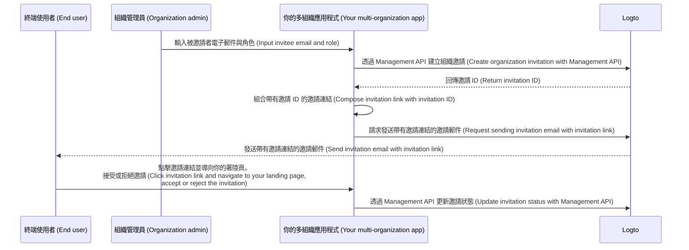

# 邀請組織 (Organization) 成員

作為多組織 (multi-organization) 應用程式，一個常見需求是邀請成員加入你的組織 (Organization)。本指南將帶你瞭解在應用程式中實作此功能的步驟與技術細節。

## 流程概覽 \{#flow-overview}

整體流程如下圖所示：



## 建立組織角色 \{#create-organization-roles}

在邀請成員加入組織 (Organization) 前，你需要先建立組織角色。請參閱 [組織範本 (Organization template)](/authorization/organization-template) 以瞭解更多關於組織角色與權限的資訊。

本指南將建立兩個典型的組織角色：`admin` 與 `member`。

`admin` 角色擁有組織內所有資源的完整存取權限，而 `member` 角色則有較有限的權限。例如，每個角色可擁有如下權限：

- `admin` 角色：
  - `read:data` - 讀取所有組織資料資源的權限。
  - `write:data` - 寫入所有組織資料資源的權限。
  - `delete:data` - 刪除所有組織資料資源的權限。
  - `invite:member` - 邀請成員加入組織的權限。
  - `manage:member` - 管理組織成員的權限。
  - `delete:member` - 移除組織成員的權限。
- `member` 角色：
  - `read:data` - 讀取所有組織資料資源的權限。
  - `write:data` - 寫入所有組織資料資源的權限。
  - `invite:member` - 邀請成員加入組織的權限。

你可以在 [Logto Console](https://cloud.logto.io/) 輕鬆完成這些設定，也可以透過 [Logto Management API](https://openapi.logto.io/operation/operation-createorganizationrole) 以程式方式建立組織角色。

## 設定你的電子郵件連接器 (Connector) \{#configure-your-email-connector}

由於邀請是透過電子郵件發送，請確保你的 [電子郵件連接器 (email connector)](/connectors/email-connectors) 已正確設定。要發送邀請，你需要設定一個 [電子郵件範本 (email template)](/connectors/email-connectors/email-templates#email-template-types) 使用類型 - `OrganizationInvitation`。你也可以在內容中加入組織（如組織名稱、Logo）與邀請者（如邀請者電子郵件、名稱）[變數 (variables)](/connectors/email-connectors/email-templates#email-template-variables)，或依需求自訂 [多語言範本 (multi-language templates)](/connectors/email-connectors/email-templates#email-template-localization)。

以下為 `OrganizationInvitation` 使用類型的電子郵件範本範例：

```json
{
  "subject": "歡迎加入我的組織 (Welcome to my organization)",
  "content": "<p>透過此 <a href=\"{{link}}\" target=\"_blank\">連結</a> 加入 {{organization.name}}。</p>",
  "usageType": "OrganizationInvitation",
  "type": "text/html"
}
```

電子郵件內容中的 `{{link}}` 佔位符會在發送郵件時替換為實際的邀請連結。本指南假設該連結為 `https://your-app.com/invitation/accept/{your-invitation-id}`。

:::note

Logto Cloud 內建的「Logto email service」目前尚不支援 `OrganizationInvitation` 使用類型。你需要自行設定電子郵件連接器（如 Sendgrid）並設置 `OrganizationInvitation` 範本。

:::

## 透過 Logto Management API 處理邀請 \{#handle-invitations-with-logto-management-api}

:::note

如果你尚未設定 Logto Management API，請參閱 [與 Management API 互動](/integrate-logto/interact-with-management-api) 以瞭解詳情。

:::

我們在組織 (Organization) 功能中提供了一組與邀請相關的 Management API。你可以透過這些 API：

- `POST /api/organization-invitations` 建立帶有指定組織角色的組織邀請。
- `POST /api/organization-invitations/{id}/message` 透過電子郵件將組織邀請發送給被邀請者。
  注意：此 API 載荷支援 `link` 屬性，你可以根據邀請 ID 組合你的邀請連結。例如：

  ```json
  {
    "link": "https://your-app.com/invitation/accept/{your-invitation-id}"
  }
  ```

  相對應地，你需要實作一個著陸頁，讓被邀請者點擊邀請連結後導向你的應用程式。

- `GET /api/organization-invitations` 及 `GET /api/organization-invitations/{id}` 取得所有邀請或依 ID 取得特定邀請。
  在你的著陸頁上，可使用這些 API 列出所有邀請或顯示使用者收到的邀請詳情。
- `PUT /api/organization-invitations/{id}/status` 透過更新邀請狀態來接受或拒絕邀請。
  使用此 API 處理使用者對邀請的回應。

## 使用組織角色型存取控制 (RBAC) 管理使用者權限 \{#use-organization-role-based-access-control-rbac-to-manage-user-permissions}

完成上述設定後，你即可透過電子郵件發送邀請，被邀請者可依指定角色加入組織 (Organization)。

擁有不同組織角色的使用者，其組織權杖 (Organization token) 中會有不同的權限範圍 (Scopes)。因此，你的前端應用程式與後端服務都應檢查這些權限範圍，以決定可見功能與允許操作。

## 處理組織權杖 (Organization token) 權限範圍 (Scope) 更新 \{#handle-scope-updates-in-organization-tokens}

:::note
本節涉及組織範本 (Organization template) 與授權 (Authorization) 進階議題。若你尚未熟悉這些概念，請先閱讀 [授權 (Authorization)](/authorization) 與 [組織範本 (Organization template)](/authorization/organization-template)。
:::

管理組織權杖 (Organization token) 權限範圍 (Scope) 更新包含：

### 撤銷現有權限範圍 \{#revoking-existing-scopes}

例如，將 admin 降級為非 admin 成員時，應移除其權限範圍。此時，你只需清除快取的組織權杖，並使用重新整理權杖 (Refresh token) 取得新權杖。縮減後的權限範圍會立即反映於新簽發的組織權杖中。

### 賦予新權限範圍 \{#granting-new-scopes}

此情境可再細分為兩種：

#### 賦予已在驗證系統中定義的新權限範圍 \{#grant-new-scopes-that-already-defined-in-your-auth-system}

與撤銷權限範圍類似，若新賦予的權限範圍已在驗證伺服器註冊，只需簽發新組織權杖即可，新的權限範圍會立即反映。

#### 賦予驗證系統中新引入的權限範圍 \{#grant-new-scopes-that-are-newly-introduced-your-auth-system}

此時，你需要觸發重新登入或重新授權流程，以更新使用者的組織權杖。例如，呼叫 Logto SDK 的 `signIn` 方法。

### 實作即時權限檢查並更新組織權杖 \{#implement-real-time-permission-check-and-update-organization-token}

Logto 提供 Management API 以查詢組織中使用者的即時權限：

- `GET /api/organizations/{id}/users/{userId}/scopes` ([API 參考文件](https://openapi.logto.io/operation/operation-listorganizationuserscopes))

你可以將使用者組織權杖中的權限範圍與即時權限進行比對，以判斷使用者是否被升級或降級。

- 若被降級，只需清除快取的組織權杖，SDK 會自動簽發帶有更新權限範圍的新權杖。

  ```ts
  const { clearAccessToken } = useLogto();

  ...
  // 若即時查詢的權限範圍少於組織權杖中的權限範圍
  await clearAccessToken();
  ```

  此操作不需重新登入或重新授權。Logto SDK 會自動簽發新組織權杖。

- 若驗證系統中引入新權限範圍，則需觸發重新登入或重新授權流程以更新使用者的組織權杖。以 React SDK 為例：

  ```ts
  const { clearAllTokens, signIn } = useLogto();

  ...
  // 若即時查詢的權限範圍多於組織權杖中的權限範圍
  await clearAllTokens();
  signIn({
    redirectUri: '<your-sign-in-redirect-uri>',
    prompt: 'consent',
  });
  ```

  上述程式碼會觸發頁面導向使用者授權頁面 (Consent screen)，並自動導回你的應用程式，且使用者的組織權杖已帶有更新後的權限範圍。

## 相關資源 \{#related-resources}

<Url href="https://blog.logto.io/implement-user-collaboration-in-your-app">
  我們如何在多租戶應用中實作使用者協作 (How we implement user collaboration within a multi-tenant app)
</Url>
