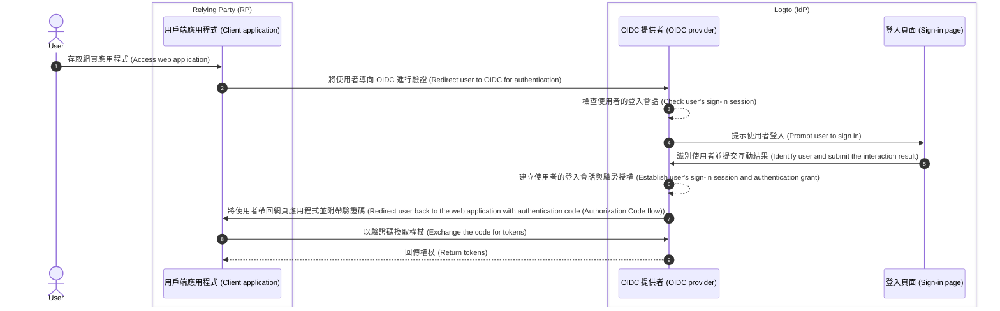

# 登出 (Sign-out)

在 Logto（作為基於 OIDC 的身分提供者）中，登出流程是一個多面向的概念，因為同時涉及由 Logto 管理的集中式登入會話，以及由用戶端應用程式管理的分散式驗證狀態。

## 登入會話 \{#sign-in-session}

為了更好地理解登出流程，首先需要了解 Logto 如何管理使用者的登入會話與其驗證狀態。



1. 使用者存取網頁應用程式（RP）。
2. 用戶端應用程式將使用者導向 Logto（IdP）進行[驗證 (Authentication)](https://auth.wiki/authentication)。
3. OIDC 提供者檢查使用者的登入會話狀態。如果沒有會話或會話已過期，則提示使用者登入。
4. 使用者與登入頁面互動以完成驗證。
5. 驗證成功後，Logto 為使用者建立新會話並帶著授權碼導回用戶端應用程式。
6. OIDC 提供者為使用者建立新的登入會話與驗證授權。
7. OIDC 提供者將使用者帶回用戶端並附帶驗證碼（[授權碼流程 (Authorization Code flow)](https://auth.wiki/authorization-code-flow)）。
8. 用戶端收到驗證碼並換取權杖以存取使用者資訊。
9. 將權杖授予用戶端應用程式。

## 組成元件 \{#components}

### 由 Logto 管理的集中式登入會話 \{#centralized-sign-in-session-managed-by-logto}

在上述流程中，集中式登入會話由 Logto 管理。當使用者成功登入時會建立會話，登出時會銷毀會話。當使用者會話過期時也會銷毀。

Logto 登入會話是透過會話 cookie 管理。使用者登入時會設置會話 cookie，所有驗證請求都會根據此 cookie 驗證。如果會話 cookie 存在且有效，使用者將自動驗證並直接導回用戶端應用程式並附帶授權碼。否則，會提示使用者登入。

1. 共享 Logto 會話 cookie  
   若使用者從同一用戶代理（如瀏覽器）登入多個用戶端應用程式，則會在 Logto 網域下擁有共享的會話 cookie。這代表只需登入一次，其他用戶端應用程式也會自動驗證。

   ```mermaid
    flowchart TD
    subgraph User [用戶代理 A (User agent A)]
      U[使用者 (User)]

      subgraph Layer1 [用戶端網域 A (Client domain A)]
        A[用戶端應用程式 A (Client Application A)]
      end

      subgraph Layer1 [用戶端網域 B (Client domain B)]
        B[用戶端應用程式 B (Client Application B)]
      end

      subgraph Layer2 [Logto 網域 (Logto domain)]
          C{{Logto 登入會話？ (Logto sign-in session?)}}
          D[登入頁面 (sign-in page)]
      end
    end

    U --> |登入 (Sign-in)| A
    A --> |導向 Logto (Redirect to Logto)| C
    U --> |登入 (Sign-in)| B
    B --> |導向 Logto (Redirect to Logto)| C
    C --> |否 (No)| D
    D --> |建立會話 (Create session)| C
   ```

2. 隔離 Logto 會話 cookie  
   若使用者從不同裝置或瀏覽器登入不同用戶端應用程式，則會在 Logto 網域下擁有隔離的會話 cookie。這代表每個用戶端應用程式都需分別登入。

   ```mermaid
    flowchart TD
    U[使用者 (User)]

    subgraph DeviceA [用戶代理 A (User agent A)]
      subgraph Layer1 [用戶端網域 A (Client domain A)]
        A[用戶端應用程式 A (Client Application A)]
      end

      subgraph Layer2 [Logto 網域 (Logto domain)]
          C{{Logto 登入會話？ (Logto sign-in session?)}}
          D[登入頁面 (sign-in page)]
      end
    end

    subgraph DeviceB [用戶代理 B (User agent B)]
      subgraph Layer3 [用戶端網域 B (Client domain B)]
        B[用戶端應用程式 B (Client Application B)]
      end

      subgraph Layer4 [Logto 網域 (Logto domain)]
          E{{Logto 登入會話？ (Logto sign-in session?)}}
          F[登入頁面 (sign-in page)]
      end
    end

    U --> |登入 (Sign-in)| A
    A --> |導向 Logto (Redirect to Logto)| C
    U --> |登入 (Sign-in)| B
    B --> |導向 Logto (Redirect to Logto)| E
    C --> |否 (No)| D
    E --> |否 (No)| F
    D --> |建立會話 (Create session)| C
    F --> |建立會話 (Create session)| E
   ```

## 由用戶端應用程式管理的分散式驗證狀態 \{#distributed-authentication-status-managed-by-the-client-applications}

每個用戶端應用程式都會維護自己的驗證狀態。無論是 Native、SPA 或 Web 應用程式，都有各自管理使用者驗證狀態的方式。

登入成功後，用戶端應用程式可能會收到 [ID 權杖 (ID token)](https://auth.wiki/id-token) 與 [存取權杖 (Access token)](https://auth.wiki/access-token)。用戶端應用程式可用 ID 權杖判斷使用者身分，並用存取權杖存取使用者資源。使用者的驗證狀態由存取權杖的過期時間表示。

- Native 與 SPA 應用程式：  
  用戶端應用程式需安全儲存並管理這些權杖以維持使用者驗證狀態。例如將權杖存於 local storage 或 session storage，使用者登出時清除權杖。
- Web 應用程式：  
  例如使用 Next.js 等框架建構的 Web 應用程式，通常會在 Logto 發行的權杖之外，額外管理自己的登入會話。使用者登入並收到 Logto 權杖後，可以像 SPA 一樣將權杖儲存在前端，或儲存在伺服器端並以 cookie 或其他機制管理會話。

## 登出機制 \{#sign-out-mechanisms}

### 清除用戶端本地權杖與會話 \{#clear-tokens-and-local-session-at-the-client-side}

在用戶端，簡單的登出就是清除本地會話並移除 local storage 或 session storage 中的權杖（ID 權杖、存取權杖、重新整理權杖）。這僅會造成用戶端本地登出，集中式會話仍然存在。以此方式登出的使用者，仍可能在同一授權伺服器會話下存取其他應用程式，直到集中式會話過期或被主動銷毀。

### 清除 Logto 的登入會話 \{#clear-sign-in-session-at-logto}

若要明確登出使用者並清除 Logto 的會話，用戶端應用程式需將使用者導向 Logto 的 **end session endpoint**。

例如：`https://{your-logto-domain}/oidc/session/end`

**end session endpoint** 是標準 OIDC 端點，允許用戶端應用程式通知授權伺服器使用者已登出。此端點會清除 Logto 的集中式登入會話。

會話清除後，任何後續授權請求都需使用者重新登入。

若有提供 **post-logout redirect URI**，會話清除後會將使用者導向指定 URI。否則，會導向 Logto 預設的登出後頁面。

## 聯邦登出：後端通道登出 (Back-channel logout) \{#federated-sign-out-back-channel-logout}

為了更一致的登出管理，Logto 支援 [後端通道登出 (back-channel logout)](https://openid.net/specs/openid-connect-backchannel-1_0-final.html)。這是一種機制，讓 Logto 能在使用者登出時通知同一登入會話下的所有用戶端應用程式。

這在使用者從某一用戶端應用程式登出時，期望同時從所有其他用戶端應用程式登出時特別有用。

若要為你的用戶端應用程式啟用後端通道登出，請至 Logto 控制台的應用程式詳細頁註冊 back-channel logout URI。當使用者從任一用戶端應用程式發起登出請求時，Logto 會向所有已註冊的 URI 發送登出權杖。

若你的用戶端應用程式需要在登出權杖中包含登入會話，請在 back-channel logout 設定中開啟 `Is session required`。此時登出權杖會包含 `sid` 宣告 (claim) 以識別 Logto 的使用者登入會話。

1. 使用者從某一用戶端應用程式發起登出請求。
2. Logto 收到 end session 請求，產生登出權杖並發送至所有已註冊的 back-channel logout URI。
3. 各用戶端應用程式收到登出權杖並執行登出動作。

各用戶端應用程式收到登出權杖時的登出動作：

- 驗證登出權杖。
- 清除本地會話並移除 local storage 或 session storage 中的權杖。

## Logto SDK 的登出方法 \{#sign-out-methods-in-logto-sdks}

若你透過 Logto SDK 整合用戶端應用程式：

- SPA 與 Web 應用程式：`client.signOut()` 方法會清除本地權杖儲存並將使用者導向 Logto 的 end session endpoint。你可以指定 **post-logout redirect URI**，會話清除後將使用者導向該 URI。
- 原生應用程式（包含 **React Native**、**Flutter** 等混合應用）：僅會清除本地權杖儲存。因為原生應用程式登入流程採用無會話 webview，原生瀏覽器不會儲存會話 cookie，因此無需清除 Logto 的登入會話。每次驗證請求都是獨立請求，不會帶有任何會話 cookie。

:::note
若原生應用程式不支援無會話 webview，或不識別 `emphasized` 設定（如 Android app 使用 **React Native** 或 **Flutter** SDK），你可以在授權請求中帶上 `prompt=login` 參數，強制使用者再次登入。
:::

## 強制每次存取都重新驗證 \{#enforce-re-authentication-on-every-access}

在高安全性場景（如執行敏感操作前需再次驗證身分），你可能希望每次存取都要求使用者重新驗證。只需在驗證請求中帶上 `prompt=login` 即可。

設定 `prompt=login` 會強制 Logto 每次都顯示登入頁面，不論使用者是否已有有效會話或剛登入過。這會繞過單一登入 (SSO) 行為，確保每次都要求使用者輸入憑證。

若你的應用程式請求 offline_access 權限範圍（以取得重新整理權杖），根據 OpenID Connect 規範，也必須帶上 `prompt=consent`。
大多數情況下，若要同時強制重新驗證並確保發放重新整理權杖，請設定：

```
prompt=login consent
```

這可保證使用者重新驗證並明確同意離線存取。

## 常見問題 \{#faqs}

<details>
  <summary>

### 我沒有收到後端通道登出通知 \{#im-not-receiving-the-back-channel-logout-notifications}

</summary>

- 請確認已在 Logto 控制台正確註冊 back-channel logout URI。
- 請確認你的用戶端應用程式有有效且與發起登出請求相同的登入會話。

</details>

## 相關資源 \{#related-resources}

<Url href="https://blog.logto.io/oidc-back-channel-logout/">
  了解 OIDC 後端通道登出 (Understanding OIDC back-channel logout)。
</Url>
