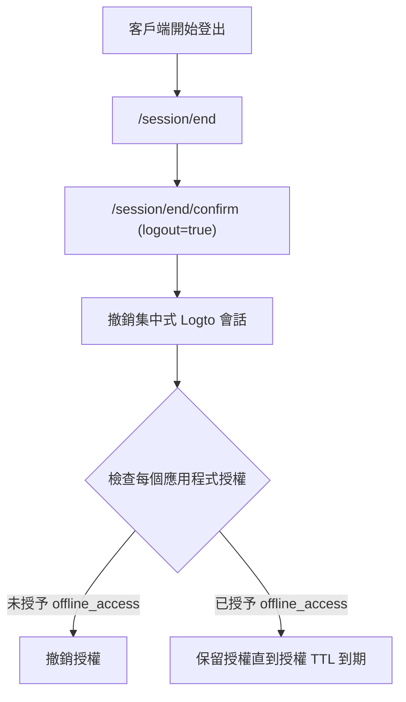

# 登出

在 Logto 中，登出涉及兩個層面：

- **Logto 會話登出**：結束在 Logto 網域下的集中登入會話。
- **應用程式登出**：清除客戶端應用程式中的本地會話狀態和權杖。

若要更好地理解 Logto 中的會話運作方式，請參閱 [Sessions](/sessions)。

## 登出機制 \{#sign-out-mechanisms}

### 1) 僅客戶端登出 \{#1-client-side-only-sign-out}

客戶端應用程式清除其本地會話和權杖（ID 權杖 / 存取權杖 / 重新整理權杖）。這僅登出該應用程式的本地狀態。

- Logto 會話可能仍然有效。
- 其他在相同 Logto 會話下的應用程式可能仍可單一登入 (SSO)。

### 2) 在 Logto 結束會話（目前 Logto 實作中的全域登出） \{#2-end-session-at-logto-global-sign-out-in-current-logto-implementation}

要清除集中式 Logto 會話，應用程式將使用者重定向到結束會話端點，例如：

`https://{your-logto-domain}/oidc/session/end`

在目前 Logto SDK 的行為中：

1. `signOut()` 會重定向到 `/session/end`。
2. 然後進入 `/session/end/confirm`。
3. 預設確認表單自動提交 `logout=true`。

因此，目前的 SDK 登出被視為 **全域登出**。

:::note

- **全域登出**：撤銷集中式 Logto 會話。

:::

### 全域登出期間發生的情況 \{#what-happens-during-global-sign-out}


```mermaid
flowchart TD
  A["客戶端開始登出"] --> B["/session/end"]
  B --> C["/session/end/confirm (logout=true)"]
  C --> D["撤銷集中式 Logto 會話"]
  D --> E{"檢查每個應用程式授權"}
  E -->|"未授予 offline_access"| F["撤銷授權"]
  E -->|"已授予 offline_access"| G["保留授權直到授權 TTL 到期"]
```

在全域登出期間：

- 集中式 Logto 會話被撤銷。
- 相關應用程式授權根據每個應用程式的授權狀態處理：
  - 若 **未** 授予 `offline_access`，相關授權被撤銷。
  - 若 **已** 授予 `offline_access`，結束會話不會撤銷授權。
- 對於 `offline_access` 的情況，重新整理權杖和授權在授權到期前仍然有效。

## 授權有效期與 `offline_access` 影響 \{#grant-lifetime-and-offline-access-impact}

- 預設 Logto 授權 TTL 為 **180 天**。
- 若授予 `offline_access`，結束會話預設不會撤銷該應用程式授權。
- 與該授權相關的重新整理權杖鏈可持續運行，直到授權到期（或被明確撤銷）。

## 聯邦登出：後端通道登出 \{#federated-sign-out-back-channel-logout}

為了跨應用程式的一致性，Logto 支援 [後端通道登出](https://openid.net/specs/openid-connect-backchannel-1_0-final.html)。

當使用者從一個應用程式登出時，Logto 可以透過向每個應用程式註冊的後端通道登出 URI 發送登出權杖，通知參與相同會話的所有應用程式。

如果在應用程式的後端通道設定中啟用了 `Is session required`，則登出權杖會包含 `sid` 以識別 Logto 會話。

典型流程：

1. 使用者從一個應用程式啟動登出。
2. Logto 處理結束會話並向註冊的後端通道登出 URI 發送登出權杖。
3. 每個應用程式驗證登出權杖並清除其本地會話 / 權杖。

## Logto SDK 中的登出方法 \{#sign-out-methods-in-logto-sdks}

- **SPA 和網頁**：`client.signOut()` 清除本地權杖存儲並重定向到 Logto 結束會話端點。你可以提供登出後重定向 URI。
- **原生應用程式（包括 React Native / Flutter）**：通常僅清除本地權杖存儲。無會話的 webview 意味著沒有持久的 Logto 瀏覽器 cookie 需要清除。

:::note
對於不支援無會話 webview 或不識別 `emphasized` 設定的原生應用程式（使用 **React Native** 或 **Flutter** SDK 的 Android 應用程式），你可以在授權請求中傳遞 `prompt=login` 參數來強制使用者再次登入。
:::

## 強制每次存取重新驗證 \{#enforce-re-authentication-on-every-access}

對於高安全性操作，在驗證請求中包含 `prompt=login` 以繞過 SSO 並每次強制輸入憑證。

如果請求 `offline_access`（以接收重新整理權杖），也包含 `consent`，`prompt=login consent`。

典型的組合設定：

```txt
prompt=login consent
```

## 常見問題 \{#faqs}

<details>
  <summary>

### 我沒有收到後端通道登出通知。 \{#im-not-receiving-the-back-channel-logout-notifications}

</summary>

- 確保後端通道登出 URI 已正確註冊在 Logto 控制台。
- 確保你的應用程式對相同使用者 / 會話上下文有活動的登入狀態。

</details>

## 相關資源 \{#related-resources}

<Url href="https://blog.logto.io/oidc-back-channel-logout/">理解 OIDC 後端通道登出。</Url>
