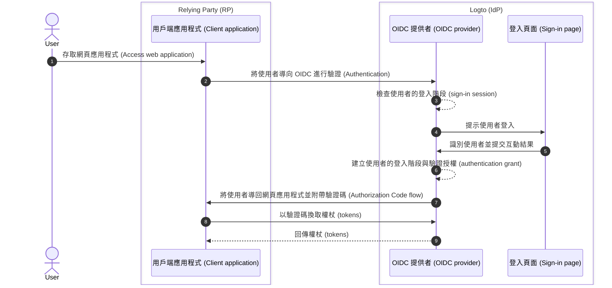

# 登出 (Sign-out)

在 Logto（作為基於 OIDC 的身分提供者）中，登出流程是一個多面向的概念，因為同時涉及 Logto 所管理的集中式登入階段，以及由用戶端應用程式管理的分散式驗證 (Authentication) 狀態。

## 登入階段 \{#sign-in-session}

為了更好地理解登出流程，首先需要了解 Logto 如何管理使用者的登入階段與其驗證 (Authentication) 狀態。


```mermaid
  sequenceDiagram
    autonumber
    actor User

    box Relying Party (RP)
      participant Client as 用戶端應用程式 (Client application)
    end

    box Logto (IdP)
      participant OIDC as OIDC 提供者 (OIDC provider)
      participant SignIn as 登入頁面 (Sign-in page)
    end

    User ->> Client: 存取網頁應用程式 (Access web application)
    Client ->> OIDC: 將使用者導向 OIDC 進行驗證 (Authentication)
    OIDC -->> OIDC: 檢查使用者的登入階段 (sign-in session)
    OIDC ->> SignIn: 提示使用者登入
    SignIn ->> OIDC: 識別使用者並提交互動結果
    OIDC -->> OIDC: 建立使用者的登入階段與驗證授權 (authentication grant)
    OIDC ->> Client: 將使用者導回網頁應用程式並附帶驗證碼 (Authorization Code flow)
    Client ->> OIDC: 以驗證碼換取權杖 (tokens)
    OIDC -->> Client: 回傳權杖 (tokens)
```

1. 使用者存取網頁應用程式（RP）。
2. 用戶端應用程式將使用者導向 Logto（IdP）進行[驗證 (Authentication)](https://auth.wiki/authentication)。
3. OIDC 提供者檢查使用者的登入階段狀態。若無階段或階段已過期，則提示使用者登入。
4. 使用者與登入頁面互動以完成驗證。
5. 登入成功後，Logto 為使用者建立新階段並導回用戶端應用程式並附帶授權碼。
6. OIDC 提供者為使用者建立新的登入階段與驗證授權。
7. OIDC 提供者將使用者導回用戶端並附帶驗證碼（[授權碼流程 (Authorization Code flow)](https://auth.wiki/authorization-code-flow)）。
8. 用戶端收到驗證碼並換取權杖以存取使用者資訊。
9. 將權杖授予用戶端應用程式。

## 組成元件 \{#components}

### 由 Logto 管理的集中式登入階段 \{#centralized-sign-in-session-managed-by-logto}

在上述流程中，集中式登入階段由 Logto 管理。當使用者成功登入時會建立階段，登出時則銷毀階段。若使用者階段過期也會自動銷毀。

Logto 的登入階段是透過階段 cookie 管理。使用者登入時會設置階段 cookie，所有驗證請求都會根據該 cookie 驗證。若 cookie 存在且有效，使用者將自動驗證並直接導回用戶端應用程式並附帶授權碼。否則，將提示使用者登入。

1. 共享 Logto 階段 cookie  
   若使用者從同一個使用者代理（如瀏覽器）登入多個用戶端應用程式，則會在 Logto 網域下擁有共享的階段 cookie。這代表只需登入一次，即可自動驗證其他用戶端應用程式。

   ```mermaid
    flowchart TD
    subgraph User [使用者代理 A (User agent A)]
      U[使用者 (User)]

      subgraph Layer1 [用戶端網域 A (Client domain A)]
        A[用戶端應用程式 A (Client Application A)]
      end

      subgraph Layer1 [用戶端網域 B (Client domain B)]
        B[用戶端應用程式 B (Client Application B)]
      end

      subgraph Layer2 [Logto 網域 (Logto domain)]
          C{{Logto 登入階段？ (Logto sign-in session?)}}
          D[登入頁面 (sign-in page)]
      end
    end

    U --> |登入 (Sign-in)| A
    A --> |導向 Logto (Redirect to Logto)| C
    U --> |登入 (Sign-in)| B
    B --> |導向 Logto (Redirect to Logto)| C
    C --> |否 (No)| D
    D --> |建立階段 (Create session)| C
   ```

2. 隔離 Logto 階段 cookie  
   若使用者從不同裝置或瀏覽器登入不同用戶端應用程式，則會在 Logto 網域下擁有隔離的階段 cookie。這代表每個用戶端應用程式都需分別登入。

   ```mermaid
    flowchart TD
    U[使用者 (User)]

    subgraph DeviceA [使用者代理 A (User agent A)]
      subgraph Layer1 [用戶端網域 A (Client domain A)]
        A[用戶端應用程式 A (Client Application A)]
      end

      subgraph Layer2 [Logto 網域 (Logto domain)]
          C{{Logto 登入階段？ (Logto sign-in session?)}}
          D[登入頁面 (sign-in page)]
      end
    end

    subgraph DeviceB [使用者代理 B (User agent B)]
      subgraph Layer3 [用戶端網域 B (Client domain B)]
        B[用戶端應用程式 B (Client Application B)]
      end

      subgraph Layer4 [Logto 網域 (Logto domain)]
          E{{Logto 登入階段？ (Logto sign-in session?)}}
          F[登入頁面 (sign-in page)]
      end
    end

    U --> |登入 (Sign-in)| A
    A --> |導向 Logto (Redirect to Logto)| C
    U --> |登入 (Sign-in)| B
    B --> |導向 Logto (Redirect to Logto)| E
    C --> |否 (No)| D
    E --> |否 (No)| F
    D --> |建立階段 (Create session)| C
    F --> |建立階段 (Create session)| E
   ```

## 由用戶端應用程式管理的分散式驗證 (Authentication) 狀態 \{#distributed-authentication-status-managed-by-the-client-applications}

每個用戶端應用程式都會維護自己的驗證 (Authentication) 狀態。無論是 Native、SPA 或 Web 應用程式，都有各自管理使用者驗證 (Authentication) 狀態的方法。

登入成功後，用戶端應用程式可能會收到 [ID 權杖 (ID token)](https://auth.wiki/id-token) 與 [存取權杖 (Access token)](https://auth.wiki/access-token)。用戶端應用程式可利用 ID 權杖判斷使用者身分，並用存取權杖存取使用者資源。使用者的驗證 (Authentication) 狀態由存取權杖的過期時間表示。

- Native 與 SPA 應用程式：  
  用戶端應用程式需安全地儲存並管理這些權杖，以維持使用者驗證 (Authentication) 狀態。例如將權杖存於 local storage 或 session storage，並於登出時清除。
- Web 應用程式：  
  例如使用 Next.js 等框架建構的 Web 應用程式，通常會在用戶端權杖之外，額外管理自己的登入階段。當使用者登入並收到 Logto 發出的權杖後，可以像 SPA 一樣將權杖儲存在用戶端，或儲存在伺服器端並以 cookie 或其他機制管理階段。

## 登出機制 \{#sign-out-mechanisms}

### 清除用戶端本地權杖與階段 \{#clear-tokens-and-local-session-at-the-client-side}

在用戶端，簡單的登出僅需清除本地階段並移除權杖（ID 權杖、存取權杖、重新整理權杖）於 local storage 或 session storage。這僅會造成用戶端本地登出，集中式階段仍然存在。以此方式登出的使用者，仍可能在集中式階段有效期間內存取其他應用程式，直到集中式階段過期或被主動銷毀。

### 清除 Logto 登入階段 \{#clear-sign-in-session-at-logto}

若要明確登出使用者並清除 Logto 階段，用戶端應用程式需將使用者導向 Logto 的 **end session endpoint**。

例如：`https://{your-logto-domain}/oidc/session/end`

**end session endpoint** 是標準 OIDC 端點，允許用戶端應用程式通知授權伺服器使用者已登出。該端點會清除 Logto 的集中式登入階段。

階段清除後，任何後續授權請求都需使用者重新登入。

若有提供 **post-logout redirect URI**，階段清除後會將使用者導向指定 URI。否則，將導向 Logto 預設的登出後頁面。

## 聯邦登出：後端通道登出 (Back-channel logout) \{#federated-sign-out-back-channel-logout}

為了更一致地管理登出，Logto 支援 [後端通道登出 (back-channel logout)](https://openid.net/specs/openid-connect-backchannel-1_0-final.html)。這是一種機制，讓 Logto 能在使用者登出時，通知所有同一登入階段下的用戶端應用程式。

這在使用者從某一用戶端應用程式登出時，希望同時登出所有其他用戶端應用程式時特別有用。

若要啟用後端通道登出，請至 Logto 控制台的應用程式詳細頁面，註冊 back-channel logout URI。當使用者從任一用戶端應用程式發起登出請求時，Logto 會將登出權杖發送至所有已註冊的 URI。

若你的用戶端應用程式需要在登出權杖中包含登入階段，請在 back-channel logout 設定中開啟 `Is session required`。此時登出權杖會包含 `sid` 宣告 (claim)，以識別 Logto 的使用者登入階段。

1. 使用者從某一用戶端應用程式發起登出請求。
2. Logto 收到 end session 請求，產生登出權杖，並發送至所有已註冊的 back-channel logout URI。
3. 各用戶端應用程式收到登出權杖並執行登出動作。

各用戶端應用程式收到登出權杖後的登出動作：

- 驗證登出權杖。
- 清除本地階段並移除 local storage 或 session storage 中的權杖。

## Logto SDK 的登出方法 \{#sign-out-methods-in-logto-sdks}

若你透過 Logto SDK 整合用戶端應用程式：

- SPA 與 Web 應用程式可使用 `client.signOut()` 方法，該方法會清除本地權杖儲存並將使用者導向 Logto 的 end session endpoint。你可指定 **post-logout redirect URI**，於階段清除後導向使用者。
- Native 應用程式（包含 **React Native**、**Flutter** 等混合應用程式）僅會清除本地權杖儲存。這是因為 Native 應用程式使用無階段 (sessionless) webview 處理登入流程，並不會在原生瀏覽器中儲存階段 cookie，因此無需清除 Logto 的登入階段。每次驗證請求都是獨立請求，不會帶有階段 cookie。

:::note
若 Native 應用程式不支援無階段 webview，或不識別 `emphasized` 設定（如 Android app 使用 **React Native** 或 **Flutter** SDK），可在授權請求中帶上 `prompt=login` 參數，強制提示使用者重新登入。
:::

## 強制每次存取都重新驗證 (Authentication) \{#enforce-re-authentication-on-every-access}

在高安全性場景（如執行敏感操作前需再次驗證使用者身分），你可能希望每次存取都要求使用者重新驗證 (Authentication)。可在驗證請求中加入 `prompt=login` 參數以強制此行為。

設定 `prompt=login` 會強制 Logto 每次都顯示登入頁面，不論使用者是否已有有效階段或剛登入過。這會繞過單一登入 (SSO, Single Sign-On) 行為，確保每次都提示使用者輸入憑證。

若你的應用程式請求 offline_access 權限範圍（以取得重新整理權杖），根據 OpenID Connect 規範，還需同時帶上 `prompt=consent`。
大多數情況下，若要同時強制重新驗證並確保發放重新整理權杖，請設定：

```
prompt=login consent
```

這可保證使用者重新驗證並明確同意離線存取。

## 常見問題 \{#faqs}

<details>
  <summary>

### 我沒有收到後端通道登出通知 \{#im-not-receiving-the-back-channel-logout-notifications}

</summary>

- 請確認已在 Logto 控制台正確註冊 back-channel logout URI。
- 請確認你的用戶端應用程式有有效且與發起登出請求相同的登入階段。

</details>

## 相關資源 \{#related-resources}

<Url href="https://blog.logto.io/oidc-back-channel-logout/">
  了解 OIDC 後端通道登出 (back-channel logout)。
</Url>
