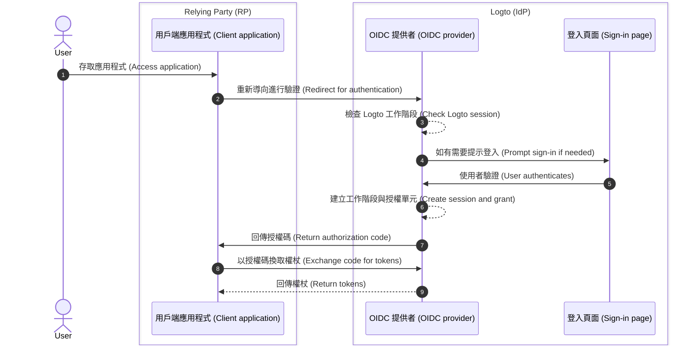
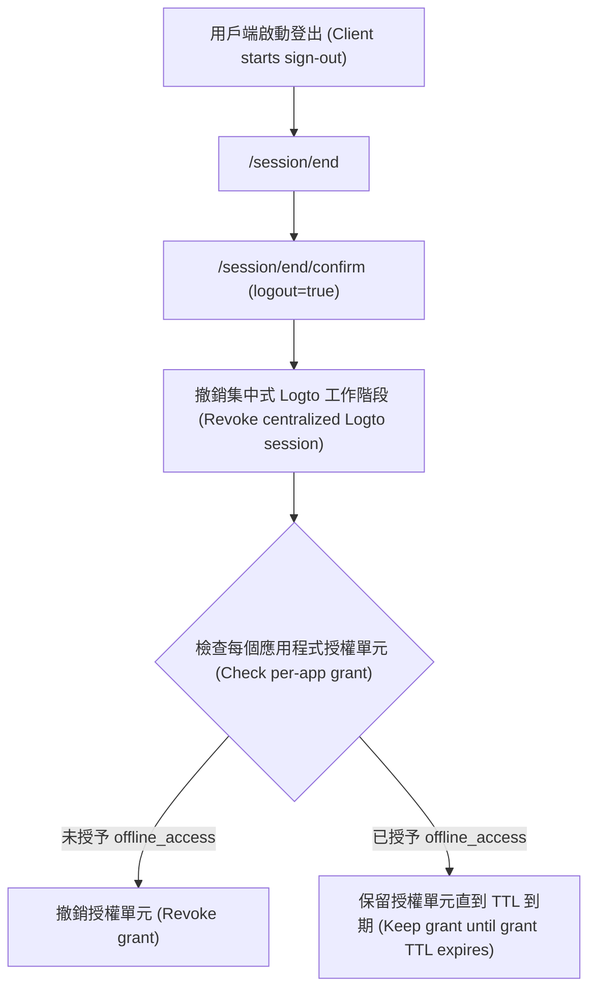

# 登出 (Sign-out)

在 Logto（作為 OIDC 身分提供者）中，登出涉及：

- **集中式 Logto 工作階段**（Logto 網域下的瀏覽器 cookie），以及
- **分散式用戶端驗證狀態**（每個應用程式中的權杖和本地應用程式工作階段）。

為了理解登出行為，建議將這兩層分開，並了解 **授權單元 (grants)** 如何連結它們。

## 核心概念 \{#core-concepts}

### 什麼是 Logto 工作階段？ \{#what-is-a-logto-session}

Logto 工作階段是由 Logto 管理的集中式登入狀態。它在驗證成功後建立，並以 Logto 網域下的 cookie 表示。

如果工作階段 cookie 有效，使用者可以在多個信任同一 Logto 租戶的應用程式間靜默驗證（單一登入，SSO）。

若不存在有效的工作階段，Logto 會顯示登入頁面。

### 什麼是授權單元 (grants)？ \{#what-are-grants}

**授權單元 (grant)** 代表特定使用者 + 用戶端應用程式組合的授權狀態。

- 一個 Logto 工作階段可以擁有多個用戶端應用程式的授權單元。
- 授權單元是已發行權杖所關聯的對象。
- 在本文件集中，**授權單元 (grant)** 作為跨應用程式的授權單位。

### 工作階段、授權單元與用戶端驗證狀態的關係 \{#how-session-grants-and-client-auth-status-relate}

```mermaid
flowchart LR
  subgraph Logto [Logto 網域]
    S[Logto 工作階段 (Logto session)]
    G1[App A 的授權單元 (Grant for App A)]
    G2[App B 的授權單元 (Grant for App B)]
  end

  subgraph AppA [用戶端網域 A]
    A[本地工作階段 / 權杖 (Local session / tokens)]
  end

  subgraph AppB [用戶端網域 B]
    B[本地工作階段 / 權杖 (Local session / tokens)]
  end

  S --> G1
  S --> G2
  G1 --> A
  G2 --> B
```

- **Logto 工作階段** 控制集中式單一登入 (SSO) 體驗。
- **用戶端本地工作階段 / 權杖** 控制每個應用程式是否將使用者視為已登入。
- **授權單元 (grants)** 透過代表應用程式專屬授權狀態，連結這兩個世界。

## 登入回顧（為什麼登出是多層次的） \{#sign-in-recap-why-sign-out-is-multi-layered}


```mermaid
sequenceDiagram
  autonumber
  actor User

  box Relying Party (RP)
    participant Client as 用戶端應用程式 (Client application)
  end

  box Logto (IdP)
    participant OIDC as OIDC 提供者 (OIDC provider)
    participant SignIn as 登入頁面 (Sign-in page)
  end

  User ->> Client: 存取應用程式 (Access application)
  Client ->> OIDC: 重新導向進行驗證 (Redirect for authentication)
  OIDC -->> OIDC: 檢查 Logto 工作階段 (Check Logto session)
  OIDC ->> SignIn: 如有需要提示登入 (Prompt sign-in if needed)
  SignIn ->> OIDC: 使用者驗證 (User authenticates)
  OIDC -->> OIDC: 建立工作階段與授權單元 (Create session and grant)
  OIDC ->> Client: 回傳授權碼 (Return authorization code)
  Client ->> OIDC: 以授權碼換取權杖 (Exchange code for tokens)
  OIDC -->> Client: 回傳權杖 (Return tokens)
```

## 跨應用程式 / 裝置的工作階段拓撲 \{#session-topology-across-apps-devices}

### 共用工作階段 cookie（同一瀏覽器 / 使用者代理） \{#shared-session-cookie-same-browser-user-agent}

若使用者從同一瀏覽器登入多個應用程式，這些應用程式可重用同一 Logto 工作階段 cookie，並享有單一登入 (SSO) 行為。

```mermaid
flowchart TD
  U[使用者 (User)]
  A["用戶端應用程式 A (Client domain A)"]
  B["用戶端應用程式 B (Client domain B)"]
  C{"Logto 工作階段存在？ (Logto domain)"}
  D["登入頁面 (Logto domain)"]

  subgraph UA["使用者代理 A (同一瀏覽器)"]
    U
    A
    B
    C
    D
  end

  U -->|登入| A
  A -->|重新導向至 Logto| C
  U -->|開啟應用程式| B
  B -->|重新導向至 Logto| C
  C -->|否| D
  D -->|建立工作階段| C
```

### 隔離的工作階段 cookie（不同裝置 / 瀏覽器） \{#isolated-session-cookies-different-devices-browsers}

不同瀏覽器 / 裝置持有不同的 Logto cookie，因此登入工作階段彼此隔離。

```mermaid
flowchart TD
  U[使用者 (User)]
  A["用戶端應用程式 A (Client domain A)"]
  C{"Logto 工作階段存在？ (Device A, Logto domain)"}
  D["登入頁面 (Device A, Logto domain)"]

  subgraph DeviceA["使用者代理 A"]
    A
    C
    D
  end

  B["用戶端應用程式 B (Client domain B)"]
  E{"Logto 工作階段存在？ (Device B, Logto domain)"}
  F["登入頁面 (Device B, Logto domain)"]

  subgraph DeviceB["使用者代理 B"]
    B
    E
    F
  end

  U -->|登入| A
  A -->|重新導向至 Logto| C
  U -->|登入| B
  B -->|重新導向至 Logto| E
  C -->|否| D
  E -->|否| F
  D -->|建立工作階段| C
  F -->|建立工作階段| E
```

## 登出機制 \{#sign-out-mechanisms}

### 1) 僅用戶端登出 \{#1-client-side-only-sign-out}

用戶端應用程式清除自身本地工作階段與權杖（ID / 存取 / 重新整理權杖）。這僅將使用者從該應用程式的本地狀態登出。

- Logto 工作階段可能仍然有效。
- 其他同一 Logto 工作階段下的應用程式仍可單一登入 (SSO)。

### 2) Logto 端結束工作階段（目前 Logto 實作下的全域登出） \{#2-end-session-at-logto-global-sign-out-in-current-logto-implementation}

若要清除集中式 Logto 工作階段，應用程式會將使用者重新導向至結束工作階段端點，例如：

`https://{your-logto-domain}/oidc/session/end`

目前 Logto SDK 行為如下：

1. `signOut()` 會重新導向至 `/session/end`。
2. 接著進入 `/session/end/confirm`。
3. 預設確認表單會自動提交 `logout=true`。

因此，目前 SDK 的登出被視為 **全域登出**。

### 全域登出時會發生什麼事 \{#what-happens-during-global-sign-out}


```mermaid
flowchart TD
  A["用戶端啟動登出 (Client starts sign-out)"] --> B["/session/end"]
  B --> C["/session/end/confirm (logout=true)"]
  C --> D["撤銷集中式 Logto 工作階段 (Revoke centralized Logto session)"]
  D --> E{"檢查每個應用程式授權單元 (Check per-app grant)"}
  E -->|"未授予 offline_access"| F["撤銷授權單元 (Revoke grant)"]
  E -->|"已授予 offline_access"| G["保留授權單元直到 TTL 到期 (Keep grant until grant TTL expires)"]
```

全域登出期間：

- 集中式 Logto 工作階段會被撤銷。
- 相關應用程式授權單元依應用程式授權狀態處理：
  - 若 **未**授予 `offline_access`，相關授權單元會被撤銷。
  - 若 **已**授予 `offline_access`，結束工作階段不會撤銷該授權單元。
- 對於 `offline_access` 情境，重新整理權杖與授權單元會持續有效，直到授權單元到期。

## 授權單元存續時間與 `offline_access` 影響 \{#grant-lifetime-and-offline-access-impact}

- Logto 預設授權單元 TTL 為 **180 天**。
- 若授予 `offline_access`，結束工作階段預設不會撤銷該應用程式授權單元。
- 與該授權單元關聯的重新整理權杖可持續使用，直到授權單元到期（或被明確撤銷）。

## 聯合登出：後端通道登出 (back-channel logout) \{#federated-sign-out-back-channel-logout}

為了跨應用程式一致性，Logto 支援 [後端通道登出 (back-channel logout)](https://openid.net/specs/openid-connect-backchannel-1_0-final.html)。

當使用者從某個應用程式登出時，Logto 會向所有參與同一工作階段的應用程式發送登出權杖至其註冊的後端通道登出 URI。

若應用程式後端通道設定中啟用 `Is session required`，登出權杖會包含 `sid` 以識別 Logto 工作階段。

典型流程：

1. 使用者從某個應用程式啟動登出。
2. Logto 處理結束工作階段，並向註冊的後端通道登出 URI 發送登出權杖。
3. 各應用程式驗證登出權杖並清除自身本地工作階段 / 權杖。

## Logto SDK 的登出方法 \{#sign-out-methods-in-logto-sdks}

- **SPA 與網頁**：`client.signOut()` 會清除本地權杖儲存並重新導向至 Logto 結束工作階段端點。你可以提供登出後重新導向 URI。
- **原生（包含 React Native / Flutter）**：通常僅清除本地權杖儲存。無持久 Logto 瀏覽器 cookie 可清除（sessionless webview）。

:::note
對於不支援 sessionless webview 或未識別 `emphasized` 設定的原生應用程式（如 **React Native** 或 **Flutter** SDK 的 Android 應用程式），你可以在驗證請求中傳遞 `prompt=login` 參數，強制使用者再次登入。
:::

## 強制每次存取都重新驗證 \{#enforce-re-authentication-on-every-access}

對於高安全性操作，在驗證請求中加入 `prompt=login`，可繞過 SSO 並每次強制輸入憑證。

若請求 `offline_access`（以取得重新整理權杖），也請加入 `consent`，即 `prompt=login consent`。

典型組合設定：

```txt
prompt=login consent
```

## 常見問題 \{#faqs}

<details>
  <summary>

### 我沒有收到後端通道登出通知。 \{#im-not-receiving-the-back-channel-logout-notifications}

</summary>

- 請確認後端通道登出 URI 已正確註冊於 Logto 控制台。
- 請確認你的應用程式對同一使用者 / 工作階段上下文有有效登入狀態。

</details>

## 相關資源 \{#related-resources}

<Url href="https://blog.logto.io/oidc-back-channel-logout/">
  理解 OIDC 後端通道登出 (Understanding OIDC back-channel logout)。
</Url>
